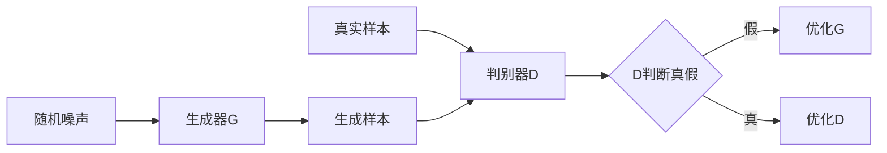

# 基于生成对抗网络的三维建模纹理风格化迁移技术

## 1. 背景介绍
### 1.1 三维建模纹理风格化迁移的重要性
在计算机图形学和计算机视觉领域,三维模型的纹理风格化迁移一直是一个具有挑战性和实用价值的研究课题。随着虚拟现实、增强现实、游戏、电影等领域的快速发展,对高质量、风格多样化的三维模型的需求日益增长。传统的三维模型纹理绘制方法需要大量的人工和时间成本,难以满足快速变化的市场需求。因此,如何利用人工智能技术,实现高效、高质量的三维模型纹理风格化迁移,成为了一个亟待解决的问题。

### 1.2 生成对抗网络在风格迁移中的优势
生成对抗网络(Generative Adversarial Networks, GANs)自2014年被提出以来,已经在图像生成、风格迁移、超分辨率等多个领域取得了显著成果。与传统的风格迁移方法相比,基于GAN的方法具有以下优势:

1. 端到端的训练方式,避免了复杂的人工特征设计;
2. 生成的图像质量高,细节丰富,视觉效果逼真;
3. 通过调节输入的噪声向量,可以灵活控制生成图像的风格;
4. 训练好的模型可以快速应用于新的输入,实现实时的风格迁移。

因此,将GAN引入三维模型纹理风格化迁移任务,有望突破传统方法的瓶颈,实现高质量、多样化、高效率的三维模型纹理生成。

### 1.3 本文的研究内容和贡献
本文针对三维模型纹理风格化迁移这一问题,提出了一种基于生成对抗网络的新颖方法。主要研究内容和贡献如下:

1. 设计了一种适用于三维模型纹理的生成对抗网络架构,通过引入三维空间信息,提高了生成纹理的空间一致性;
2. 提出了一种基于局部纹理块的判别器结构,加强了生成纹理的细节表现力;
3. 引入了一种新的损失函数,同时考虑像素级别的重建损失和特征级别的风格损失,提高了生成纹理的质量和风格迁移效果;
4. 在多个公开数据集上进行了实验,并与多种SOTA方法进行了比较,验证了本文方法的有效性和优越性。

## 2. 核心概念与联系
### 2.1 三维模型纹理映射
三维模型纹理映射是指将二维图像映射到三维模型表面,使其呈现出真实的材质和细节的过程。常见的纹理映射类型有:

1. UV映射:通过展开三维模型表面到二维平面,建立三维顶点坐标和二维纹理坐标的映射关系;
2. 立方体映射:将纹理映射到一个包围三维模型的立方体盒子上,通过立方体坐标实现纹理映射;
3. 程序化纹理:通过数学函数或算法生成纹理,可以表现出复杂的材质效果。

### 2.2 风格迁移
风格迁移是指将一幅图像的风格特征迁移到另一幅图像,使其在保持内容不变的情况下,呈现出特定的艺术风格。早期的风格迁移方法主要基于纹理合成和优化,如Gatys等人提出的基于神经网络特征的迭代优化方法。随着深度学习的发展,出现了大量基于卷积神经网络的风格迁移方法,如快速风格迁移、可控风格迁移等。

### 2.3 生成对抗网络
生成对抗网络由生成器和判别器两部分组成,通过两个网络的对抗学习,使生成器能够生成接近真实数据分布的样本。其基本原理可用下图表示:

生成对抗网络常用的损失函数包括:
- 原始GAN损失:
$$ \min_G \max_D V(D,G) = \mathbb{E}_{x \sim p_{data}(x)}[\log D(x)] + \mathbb{E}_{z \sim p_z(z)}[\log (1 - D(G(z)))] $$

- WGAN损失:
$$ \min_G \max_{D \in \mathcal{D}} \mathbb{E}_{x \sim p_{data}(x)}[D(x)] - \mathbb{E}_{z \sim p_z(z)}[D(G(z))]$$

其中,$p_{data}$和$p_z$分别表示真实数据分布和随机噪声分布,$\mathcal{D}$表示判别器函数的集合。

### 2.4 三维建模纹理风格化迁移
三维建模纹理风格化迁移是指将二维风格图像的风格特征迁移到三维模型的纹理贴图上,使三维模型呈现出特定的艺术风格。与二维图像风格迁移相比,三维纹理风格迁移需要考虑以下问题:

1. 空间一致性:生成的纹理需要在三维模型表面上保持空间连续性和一致性,避免出现断裂、扭曲等问题;
2. 形变敏感性:三维模型在渲染过程中可能发生形变,如旋转、缩放等,生成的纹理需要对形变保持鲁棒性;
3. 多视角一致性:从不同视角观察三维模型时,纹理需要保持一致的风格和外观。

综上所述,三维建模纹理风格化迁移是一个融合了三维建模、风格迁移、生成对抗网络等多个领域的交叉课题,具有广阔的应用前景和研究价值。

## 3. 核心算法原理具体操作步骤
本文提出的基于生成对抗网络的三维建模纹理风格化迁移算法,主要包括以下几个步骤:

### 3.1 数据准备
1. 收集一批高质量的三维模型,并将其转换为统一的格式(如OBJ格式);
2. 对每个三维模型生成UV映射贴图,并将其展开为二维纹理图像;
3. 收集一批风格图像,并将其缩放到固定大小;
4. 将三维模型划分为训练集、验证集和测试集。

### 3.2 网络架构设计
1. 设计生成器网络G:
   - 输入:随机噪声向量z和风格图像s
   - 采用编码器-解码器架构,编码器提取风格特征,解码器生成纹理图像
   - 加入三维空间信息,如三维模型的法向量、曲率等,增强生成纹理的空间一致性
   - 输出:生成的纹理图像$\tilde{x}$

2. 设计判别器网络D:
   - 输入:真实纹理图像x或生成的纹理图像$\tilde{x}$
   - 采用局部纹理块判别器,将输入图像划分为多个局部块,分别进行真假判别
   - 加入多尺度特征提取,增强判别器的细节敏感性
   - 输出:每个局部块的真假概率

### 3.3 损失函数设计
1. 对抗损失:
$$ L_{adv} = \mathbb{E}_{x \sim p_{data}(x)}[\log D(x)] + \mathbb{E}_{z \sim p_z(z), s \sim p_s(s)}[\log (1 - D(G(z,s)))] $$

2. 像素重建损失:
$$ L_{pix} = \mathbb{E}_{z \sim p_z(z), s \sim p_s(s)}[\| G(z,s) - x \|_1] $$

3. 风格损失:
$$ L_{sty} = \mathbb{E}_{z \sim p_z(z), s \sim p_s(s)}[\sum_{i=1}^L \| \phi_i(G(z,s)) - \phi_i(s) \|_1] $$

其中,$\phi_i$表示VGG网络的第i层特征图。

4. 总损失:
$$ L = \lambda_1 L_{adv} + \lambda_2 L_{pix} + \lambda_3 L_{sty} $$

其中,$\lambda_1, \lambda_2, \lambda_3$为平衡因子。

### 3.4 训练过程
1. 初始化生成器G和判别器D的参数;
2. 重复以下步骤,直到模型收敛:
   - 从数据集中采样一批真实纹理图像x
   - 从先验分布中采样一批随机噪声z和风格图像s
   - 生成一批纹理图像$\tilde{x} = G(z,s)$
   - 计算判别器在真实纹理图像x和生成纹理图像$\tilde{x}$上的损失
   - 计算生成器的对抗损失、像素重建损失和风格损失
   - 更新判别器D和生成器G的参数,最小化总损失

### 3.5 测试过程
1. 加载训练好的生成器G;
2. 对每个测试三维模型,执行以下步骤:
   - 输入随机噪声z和目标风格图像s
   - 生成风格化纹理图像$\tilde{x} = G(z,s)$
   - 将生成的纹理图像$\tilde{x}$映射回三维模型表面
   - 渲染三维模型,输出风格化结果

## 4. 数学模型和公式详细讲解举例说明
本节将详细讲解算法中涉及的几个关键数学模型和公式。

### 4.1 生成器的三维空间信息引入
为了提高生成纹理的空间一致性,本文在生成器的解码器部分引入了三维模型的空间信息。具体地,对于三维模型上的每个顶点$v_i(x_i,y_i,z_i)$,计算其法向量$n_i$和高斯曲率$k_i$:

$$ n_i = \frac{(v_i - v_j) \times (v_i - v_k)}{\|(v_i - v_j) \times (v_i - v_k)\|} $$

$$ k_i = \frac{1}{A_i} \sum_{j \in N(i)} \theta_j $$

其中,$v_j,v_k$为与$v_i$相邻的顶点,$A_i$为$v_i$的Voronoi区域面积,$N(i)$为$v_i$的一环邻域,$\theta_j$为相邻三角形的角度和。

将法向量$n_i$和高斯曲率$k_i$与顶点坐标$(x_i,y_i,z_i)$拼接,得到增广的顶点特征$f_i$:

$$ f_i = [x_i,y_i,z_i,n_i^x,n_i^y,n_i^z,k_i] $$

将$f_i$输入解码器的每个卷积层,与上一层特征图拼接,引导生成纹理在三维空间中的分布。

### 4.2 局部纹理块判别器
本文提出了一种局部纹理块判别器,将输入的纹理图像划分为$N \times N$个局部块,对每个局部块分别进行真假判别。设第$(i,j)$个局部块的特征为$h_{i,j}$,则其真假概率为:

$$ p_{i,j} = \sigma(W_d h_{i,j} + b_d) $$

其中,$W_d,b_d$为判别器的权重和偏置。

局部纹理块判别器的优势在于:
1. 增强了判别器对局部纹理细节的敏感性;
2. 避免了全局判别器对整体结构的过度关注;
3. 提高了判别器的训练效率和稳定性。

在训练过程中,判别器的损失函数为:

$$ L_D = -\frac{1}{N^2} \sum_{i=1}^N \sum_{j=1}^N [\log p_{i,j}^r + \log (1 - p_{i,j}^f)] $$

其中,$p_{i,j}^r$和$p_{i,j}^f$分别表示第$(i,j)$个真实纹理块和生成纹理块的真假概率。

### 4.3 风格损失的特征选择
风格损失的目的是使生成的纹理图像在特征空间中接近目标风格图像。本文选择VGG网络的多个中间层作为特征提取器,并使用