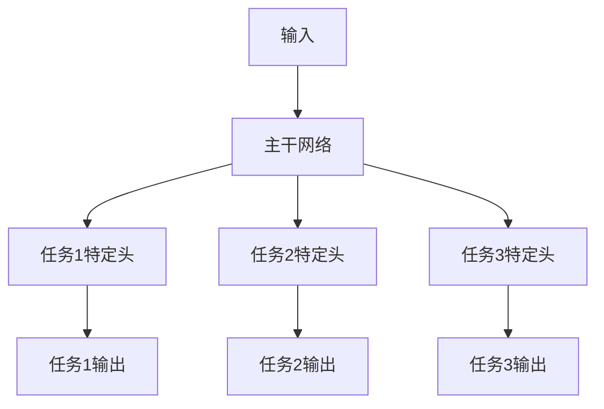

# 多任务学习Multi-Task Learning原理与代码实例讲解

## 1.背景介绍

在现实世界中,我们经常会遇到需要同时解决多个相关任务的情况。例如,自动驾驶系统不仅需要检测车辆、行人和障碍物,还需要预测它们的运动轨迹;语音助手不仅需要识别语音,还需要理解语义并给出合理的响应。传统的机器学习方法通常是为每个任务单独训练一个模型,这种方式存在一些缺陷:

1. **数据利用率低**:每个任务都需要大量的标注数据,标注数据的获取往往是昂贵和耗时的。
2. **计算资源浪费**:为每个任务训练一个独立的模型,需要消耗大量的计算资源。
3. **任务之间知识无法共享**:不同任务之间可能存在一些共享的知识,如果将它们分开训练,这些共享的知识就无法被充分利用。

多任务学习(Multi-Task Learning, MTL)正是为了解决上述问题而提出的一种机器学习范式。它的核心思想是:在同一个模型中同时学习多个相关任务,使不同任务之间能够共享一部分表示,从而提高每个任务的性能,并且减少了对大量标注数据的需求。

## 2.核心概念与联系

### 2.1 多任务学习的基本概念

多任务学习的基本思想是:在同一个模型中同时学习多个相关任务,使不同任务之间能够共享一部分表示,从而提高每个任务的性能。具体来说,多任务学习包含以下几个核心概念:

- **主干网络(Trunk Network)**:多个任务共享的部分,用于提取共享的表示。
- **任务特定头(Task-Specific Head)**:每个任务独有的部分,用于从共享表示中预测该任务的输出。
- **多任务损失函数(Multi-Task Loss)**:将多个任务的损失函数进行加权求和,作为整个模型的优化目标。



### 2.2 多任务学习与其他机器学习范式的联系

多任务学习与其他一些机器学习范式有着密切的联系:

- **迁移学习(Transfer Learning)**:多任务学习可以看作是一种特殊的迁移学习,不同任务之间共享了一部分表示。
- **多标签学习(Multi-Label Learning)**:多标签学习是多任务学习的一个特例,每个样本都对应多个标签,可以看作是多个二分类任务。
- **多输出学习(Multi-Output Learning)**:多输出学习与多任务学习类似,也是在同一个模型中学习多个相关的输出,但它们的输出通常是不同的视角或维度,而不是完全不同的任务。

## 3.核心算法原理具体操作步骤

多任务学习的核心算法原理可以概括为以下几个步骤:

### 3.1 构建共享主干网络

首先,我们需要构建一个共享的主干网络,用于从输入数据中提取共享的表示。主干网络的结构可以是任何深度学习模型,如卷积神经网络(CNN)、递归神经网络(RNN)或者Transformer等。

### 3.2 构建任务特定头

接下来,为每个任务构建一个任务特定头,用于从共享表示中预测该任务的输出。任务特定头的结构取决于具体的任务,可以是全连接层、卷积层或者其他类型的网络。

### 3.3 定义多任务损失函数

为了同时优化多个任务,我们需要定义一个多任务损失函数。最常见的做法是将每个任务的损失函数进行加权求和:

$$\mathcal{L}_{total} = \sum_{i=1}^{N} \lambda_i \mathcal{L}_i(y_i, \hat{y}_i)$$

其中,$\mathcal{L}_i$是第$i$个任务的损失函数,$y_i$是真实标签,$\hat{y}_i$是模型预测的输出,$\lambda_i$是该任务的权重系数。权重系数可以根据任务的重要性或者难易程度进行调整。

### 3.4 联合训练

最后,我们将多任务模型在所有任务的训练数据上进行联合训练,使用多任务损失函数作为优化目标。在每个训练batch中,我们可以采样不同任务的数据,并计算总的多任务损失函数,然后使用优化算法(如梯度下降)更新模型参数。

需要注意的是,在训练过程中,不同任务之间可能存在数据不平衡的问题。为了解决这个问题,我们可以采用一些策略,如过采样(Over-Sampling)、欠采样(Under-Sampling)或者重新加权(Re-Weighting)等。

## 4.数学模型和公式详细讲解举例说明

在多任务学习中,我们通常会使用一个共享的主干网络$f_s$和多个任务特定头$f_t^i$来构建模型。给定一个输入$x$,主干网络会提取一个共享的表示$h$:

$$h = f_s(x)$$

然后,每个任务特定头$f_t^i$会从共享表示$h$中预测该任务的输出$\hat{y}_i$:

$$\hat{y}_i = f_t^i(h)$$

在训练过程中,我们需要定义一个多任务损失函数,将所有任务的损失进行加权求和:

$$\mathcal{L}_{total} = \sum_{i=1}^{N} \lambda_i \mathcal{L}_i(y_i, \hat{y}_i)$$

其中,$\mathcal{L}_i$是第$i$个任务的损失函数,$y_i$是真实标签,$\hat{y}_i$是模型预测的输出,$\lambda_i$是该任务的权重系数。

我们以一个具体的例子来说明多任务学习的数学模型。假设我们有两个任务:图像分类和目标检测。我们使用一个共享的卷积神经网络作为主干网络$f_s$,提取图像的特征表示$h$。然后,我们为图像分类任务构建一个全连接头$f_t^{cls}$,将特征表示$h$映射到类别概率分布$\hat{y}_{cls}$:

$$\hat{y}_{cls} = f_t^{cls}(h) = \text{softmax}(W_c h + b_c)$$

其中,$W_c$和$b_c$是全连接层的权重和偏置。对于目标检测任务,我们构建一个卷积头$f_t^{det}$,将特征表示$h$映射到边界框和类别概率:

$$\hat{y}_{det} = f_t^{det}(h) = [\hat{b}, \hat{c}]$$

其中,$\hat{b}$是预测的边界框,$\hat{c}$是预测的类别概率分布。

在训练过程中,我们可以使用交叉熵损失函数$\mathcal{L}_{ce}$作为分类任务的损失函数,使用一些常见的目标检测损失函数(如Smooth L1损失)作为目标检测任务的损失函数$\mathcal{L}_{det}$。然后,我们将两个任务的损失进行加权求和,作为多任务损失函数:

$$\mathcal{L}_{total} = \lambda_{cls} \mathcal{L}_{ce}(y_{cls}, \hat{y}_{cls}) + \lambda_{det} \mathcal{L}_{det}(y_{det}, \hat{y}_{det})$$

其中,$\lambda_{cls}$和$\lambda_{det}$是分类任务和目标检测任务的权重系数。在训练过程中,我们优化这个多任务损失函数,使模型能够同时学习两个任务。

## 5.项目实践:代码实例和详细解释说明

在这一部分,我们将通过一个具体的代码示例来展示如何使用PyTorch实现多任务学习。我们将构建一个简单的多任务模型,同时学习图像分类和目标检测两个任务。

### 5.1 导入必要的库

```python
import torch
import torch.nn as nn
import torch.optim as optim
from torchvision import datasets, transforms
```

### 5.2 定义模型

我们首先定义一个共享的主干网络,这里我们使用一个简单的卷积神经网络。然后,我们为分类任务和目标检测任务分别定义任务特定头。

```python
class MultiTaskModel(nn.Module):
    def __init__(self):
        super(MultiTaskModel, self).__init__()
        
        # 共享的主干网络
        self.trunk = nn.Sequential(
            nn.Conv2d(3, 16, 3, padding=1),
            nn.ReLU(),
            nn.MaxPool2d(2, 2),
            nn.Conv2d(16, 32, 3, padding=1),
            nn.ReLU(),
            nn.MaxPool2d(2, 2),
            nn.Flatten(),
        )
        
        # 分类任务特定头
        self.cls_head = nn.Sequential(
            nn.Linear(32 * 7 * 7, 128),
            nn.ReLU(),
            nn.Linear(128, 10)
        )
        
        # 目标检测任务特定头
        self.det_head = nn.Sequential(
            nn.Linear(32 * 7 * 7, 128),
            nn.ReLU(),
            nn.Linear(128, 4)
        )
        
    def forward(self, x):
        shared_features = self.trunk(x)
        cls_output = self.cls_head(shared_features)
        det_output = self.det_head(shared_features)
        return cls_output, det_output
```

### 5.3 定义损失函数

我们定义分类任务的损失函数为交叉熵损失,目标检测任务的损失函数为均方误差损失。然后,我们将两个任务的损失进行加权求和,得到多任务损失函数。

```python
def multi_task_loss(cls_output, cls_target, det_output, det_target):
    cls_loss = nn.CrossEntropyLoss()(cls_output, cls_target)
    det_loss = nn.MSELoss()(det_output, det_target)
    return 0.5 * cls_loss + 0.5 * det_loss
```

### 5.4 准备数据

我们使用MNIST数据集进行训练和测试。对于分类任务,我们使用MNIST图像的标签;对于目标检测任务,我们将每个数字的边界框作为目标。

```python
train_data = datasets.MNIST(root='data', train=True, download=True, transform=transforms.ToTensor())
test_data = datasets.MNIST(root='data', train=False, download=True, transform=transforms.ToTensor())

# 构造目标检测任务的标签
def get_det_target(img):
    # 计算边界框
    rows = torch.any(img.squeeze(0) > 0, dim=1)
    cols = torch.any(img.squeeze(0) > 0, dim=0)
    rmin, rmax = torch.where(rows)[0][[0, -1]]
    cmin, cmax = torch.where(cols)[0][[0, -1]]
    return torch.tensor([rmin, cmin, rmax, cmax])

train_cls_targets = [data[1] for data in train_data]
train_det_targets = [get_det_target(data[0]) for data in train_data]

test_cls_targets = [data[1] for data in test_data]
test_det_targets = [get_det_target(data[0]) for data in test_data]
```

### 5.5 训练模型

我们定义一个训练函数,在每个epoch中,我们从训练数据中采样一个batch,计算多任务损失函数,并使用优化器更新模型参数。

```python
def train(model, optimizer, num_epochs):
    for epoch in range(num_epochs):
        for i, (img, cls_target, det_target) in enumerate(zip(train_data, train_cls_targets, train_det_targets)):
            optimizer.zero_grad()
            cls_output, det_output = model(img.unsqueeze(0))
            loss = multi_task_loss(cls_output, cls_target, det_output, det_target)
            loss.backward()
            optimizer.step()
            
        print(f'Epoch {epoch+1}/{num_epochs}, Loss: {loss.item():.4f}')
        
    return model
```

### 5.6 测试模型

最后,我们定义一个测试函数,在测试集上评估模型的性能。

```python
def test(model):
    cls_correct = 0
    det_correct = 0
    
    with torch.no_grad():
        for img, cls_target, det_target in zip(test_data, test_cls_targets, test_det_targets):
            cls_output, det_output = model(img.unsqueeze(0))
            cls_pred = cls_output.argmax(dim=1)
            det_pred = det_output.round().int()
            