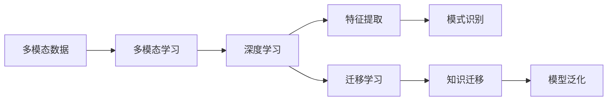

# 多模态大模型：技术原理与实战 中小公司的大模型构建之路

## 1. 背景介绍
在人工智能的发展历程中，多模态大模型已经成为了一个不可忽视的趋势。它通过整合不同类型的数据（如文本、图像、声音等），能够更好地理解和预测复杂的现实世界问题。然而，构建这样的模型往往需要大量的资源和技术积累，这对于中小公司来说是一个巨大的挑战。本文将探讨如何在资源有限的情况下，中小公司可以如何高效地构建和利用多模态大模型。

## 2. 核心概念与联系
多模态大模型涉及的核心概念包括多模态学习、深度学习、迁移学习等。多模态学习是指模型能够处理并融合多种类型的数据源。深度学习为模型提供了处理复杂数据的能力，而迁移学习则允许模型将在一个领域学到的知识迁移到另一个领域。



## 3. 核心算法原理具体操作步骤
构建多模态大模型的核心算法原理包括数据预处理、特征提取、模型训练和优化等步骤。数据预处理涉及数据清洗、标准化等，以确保数据质量。特征提取则是从原始数据中提取有用的信息。模型训练涉及选择合适的网络结构和参数，而优化则是通过算法调整模型以提高性能。

## 4. 数学模型和公式详细讲解举例说明
多模态大模型的数学基础是概率论和统计学，以及优化理论。例如，模型训练常用的损失函数可以表示为：

$$ L(\theta) = -\sum_{i=1}^{N} \log P(y_i | x_i; \theta) $$

其中，$L(\theta)$ 是损失函数，$\theta$ 是模型参数，$P(y_i | x_i; \theta)$ 是在给定输入 $x_i$ 和模型参数 $\theta$ 的条件下，正确输出 $y_i$ 的概率。

## 5. 项目实践：代码实例和详细解释说明
在项目实践部分，我们将通过一个简单的多模态任务来展示如何构建模型。代码示例将使用Python语言，并利用流行的深度学习框架如TensorFlow或PyTorch。

```python
# 示例代码
import tensorflow as tf

# 数据预处理
# ...

# 构建模型
model = tf.keras.models.Sequential([
    # 特征提取层
    # ...
    # 分类层
    tf.keras.layers.Dense(num_classes, activation='softmax')
])

# 编译模型
model.compile(optimizer='adam', loss='categorical_crossentropy', metrics=['accuracy'])

# 训练模型
model.fit(train_data, train_labels, epochs=10, validation_data=(val_data, val_labels))
```

## 6. 实际应用场景
多模态大模型在许多领域都有广泛的应用，如自动驾驶、医疗诊断、智能助手等。在自动驾驶中，模型需要处理视觉、雷达等多种传感器数据；在医疗诊断中，模型则需要分析图像、文本报告等多种数据。

## 7. 工具和资源推荐
对于中小公司来说，开源工具和资源是构建多模态大模型的宝贵财富。推荐的工具包括TensorFlow、PyTorch等深度学习框架，以及Hugging Face等预训练模型库。

## 8. 总结：未来发展趋势与挑战
多模态大模型的发展前景广阔，但也面临着数据隐私、模型解释性等挑战。未来的研究方向可能包括提高模型的泛化能力、减少对大数据的依赖、提升模型的可解释性等。

## 9. 附录：常见问题与解答
Q1: 中小公司如何在有限的数据上训练多模态大模型？
A1: 可以通过迁移学习、数据增强等技术来克服数据不足的问题。

Q2: 如何评估多模态大模型的性能？
A2: 除了传统的准确率、召回率等指标外，还应考虑模型在不同模态数据上的表现。

作者：禅与计算机程序设计艺术 / Zen and the Art of Computer Programming