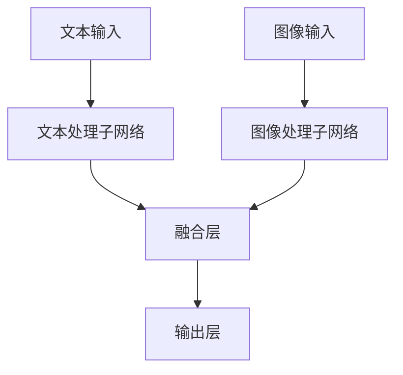

# 多模态大模型：技术原理与实战 读懂ChatGPT的核心技术

## 1.背景介绍

在人工智能领域，近年来多模态大模型（Multimodal Large Models）成为了研究和应用的热点。多模态大模型能够处理和理解多种类型的数据，如文本、图像、音频等，从而实现更为复杂和智能的任务。ChatGPT作为其中的代表性模型，展示了其在自然语言处理（NLP）方面的强大能力。本文将深入探讨多模态大模型的技术原理与实战，帮助读者理解ChatGPT的核心技术。

## 2.核心概念与联系

### 2.1 多模态大模型的定义

多模态大模型是指能够同时处理多种模态数据的深度学习模型。模态可以是文本、图像、音频、视频等。通过融合不同模态的数据，这些模型能够更全面地理解和生成信息。

### 2.2 ChatGPT的基本概念

ChatGPT是基于GPT（Generative Pre-trained Transformer）架构的自然语言处理模型。它通过大量的文本数据进行预训练，然后通过特定任务的数据进行微调，从而在对话生成、文本理解等任务中表现出色。

### 2.3 多模态与单模态的区别

单模态模型只能处理一种类型的数据，而多模态模型能够处理多种类型的数据，并且能够在不同模态之间进行信息的交互和融合。这使得多模态模型在处理复杂任务时具有更大的优势。

## 3.核心算法原理具体操作步骤

### 3.1 数据预处理

数据预处理是多模态大模型训练的第一步。不同模态的数据需要进行不同的预处理步骤。例如，文本数据需要进行分词、去停用词等处理；图像数据需要进行归一化、数据增强等处理。

### 3.2 模型架构设计

多模态大模型的架构设计是其核心。常见的架构包括Transformer、CNN、RNN等。不同模态的数据通过不同的子网络进行处理，然后在高层进行融合。



### 3.3 模型训练

模型训练包括预训练和微调两个阶段。预训练阶段，模型通过大量的无标签数据进行自监督学习；微调阶段，模型通过少量的有标签数据进行有监督学习。

### 3.4 模型评估

模型评估是验证模型性能的重要步骤。常用的评估指标包括准确率、精确率、召回率、F1值等。对于多模态模型，还需要评估不同模态之间的协同效果。

## 4.数学模型和公式详细讲解举例说明

### 4.1 Transformer架构

Transformer是多模态大模型的基础架构之一。其核心是自注意力机制（Self-Attention），能够捕捉序列中不同位置之间的依赖关系。

$$
\text{Attention}(Q, K, V) = \text{softmax}\left(\frac{QK^T}{\sqrt{d_k}}\right)V
$$

其中，$Q$、$K$、$V$分别是查询矩阵、键矩阵和值矩阵，$d_k$是键的维度。

### 4.2 损失函数

多模态大模型的损失函数通常是多任务的组合。例如，对于文本生成任务，可以使用交叉熵损失函数：

$$
\mathcal{L}_{\text{CE}} = -\sum_{i=1}^{N} y_i \log(\hat{y}_i)
$$

其中，$y_i$是实际标签，$\hat{y}_i$是预测概率。

### 4.3 优化算法

常用的优化算法包括Adam、SGD等。Adam优化算法的更新规则如下：

$$
m_t = \beta_1 m_{t-1} + (1 - \beta_1) g_t
$$

$$
v_t = \beta_2 v_{t-1} + (1 - \beta_2) g_t^2
$$

$$
\theta_t = \theta_{t-1} - \alpha \frac{m_t}{\sqrt{v_t} + \epsilon}
$$

其中，$m_t$和$v_t$分别是梯度的一阶和二阶动量，$\alpha$是学习率。

## 5.项目实践：代码实例和详细解释说明

### 5.1 数据准备

首先，我们需要准备多模态数据集。以文本和图像为例，可以使用COCO数据集。

```python
import torch
from torchvision import datasets, transforms

transform = transforms.Compose([
    transforms.Resize((224, 224)),
    transforms.ToTensor()
])

dataset = datasets.CocoCaptions(root='path/to/coco', transform=transform)
dataloader = torch.utils.data.DataLoader(dataset, batch_size=32, shuffle=True)
```

### 5.2 模型定义

接下来，我们定义一个简单的多模态模型，包括文本处理子网络和图像处理子网络。

```python
import torch.nn as nn
import torchvision.models as models

class MultimodalModel(nn.Module):
    def __init__(self):
        super(MultimodalModel, self).__init__()
        self.text_net = nn.Embedding(num_embeddings=10000, embedding_dim=256)
        self.image_net = models.resnet50(pretrained=True)
        self.fc = nn.Linear(256 + 1000, 10)
    
    def forward(self, text, image):
        text_features = self.text_net(text)
        image_features = self.image_net(image)
        combined_features = torch.cat((text_features, image_features), dim=1)
        output = self.fc(combined_features)
        return output
```

### 5.3 模型训练

定义好模型后，我们进行模型训练。

```python
import torch.optim as optim

model = MultimodalModel()
criterion = nn.CrossEntropyLoss()
optimizer = optim.Adam(model.parameters(), lr=0.001)

for epoch in range(10):
    for text, image, labels in dataloader:
        optimizer.zero_grad()
        outputs = model(text, image)
        loss = criterion(outputs, labels)
        loss.backward()
        optimizer.step()
    print(f'Epoch {epoch+1}, Loss: {loss.item()}')
```

### 5.4 模型评估

最后，我们对模型进行评估。

```python
correct = 0
total = 0

with torch.no_grad():
    for text, image, labels in dataloader:
        outputs = model(text, image)
        _, predicted = torch.max(outputs.data, 1)
        total += labels.size(0)
        correct += (predicted == labels).sum().item()

print(f'Accuracy: {100 * correct / total}%')
```

## 6.实际应用场景

### 6.1 医疗诊断

多模态大模型在医疗诊断中具有广泛的应用。例如，通过结合患者的病历文本和医学影像数据，可以实现更准确的疾病诊断。

### 6.2 自动驾驶

在自动驾驶领域，多模态大模型可以结合摄像头、激光雷达、雷达等多种传感器的数据，实现更为精准的环境感知和决策。

### 6.3 智能客服

智能客服系统可以利用多模态大模型，结合文本、语音、图像等多种数据，为用户提供更为智能和个性化的服务。

## 7.工具和资源推荐

### 7.1 开源框架

- **TensorFlow**：谷歌开发的开源深度学习框架，支持多模态数据处理。
- **PyTorch**：Facebook开发的开源深度学习框架，广泛应用于研究和工业界。

### 7.2 数据集

- **COCO**：一个大规模的图像数据集，包含丰富的图像和对应的文本描述。
- **ImageNet**：一个大规模的图像数据集，广泛用于图像分类任务。

### 7.3 书籍和文献

- **《深度学习》**：Ian Goodfellow等人编写的经典教材，详细介绍了深度学习的基本原理和应用。
- **《模式识别与机器学习》**：Christopher Bishop编写的经典教材，涵盖了模式识别和机器学习的基本概念和方法。

## 8.总结：未来发展趋势与挑战

多模态大模型在人工智能领域展现了巨大的潜力，但也面临着诸多挑战。未来的发展趋势包括：

### 8.1 模型的可解释性

随着多模态大模型的复杂性增加，模型的可解释性成为一个重要的研究方向。如何让模型的决策过程透明化，是未来的重要课题。

### 8.2 数据的多样性和质量

多模态大模型的性能依赖于高质量的多模态数据。如何获取和处理多样化的高质量数据，是一个重要的挑战。

### 8.3 计算资源的需求

多模态大模型的训练和推理需要大量的计算资源。如何优化模型的计算效率，降低资源消耗，是未来的重要研究方向。

## 9.附录：常见问题与解答

### 9.1 多模态大模型的优势是什么？

多模态大模型能够处理和融合多种类型的数据，从而实现更为复杂和智能的任务。例如，在图像和文本结合的任务中，多模态大模型能够同时理解图像和文本的信息，从而实现更为准确的结果。

### 9.2 如何选择合适的多模态大模型架构？

选择合适的多模态大模型架构需要考虑任务的具体需求和数据的特点。常见的架构包括Transformer、CNN、RNN等。可以根据任务的复杂性和数据的模态选择合适的子网络和融合方式。

### 9.3 多模态大模型的训练需要注意哪些问题？

多模态大模型的训练需要注意数据的预处理、模型的架构设计、损失函数的选择和优化算法的使用。此外，还需要注意模型的评估和调优，以确保模型的性能和泛化能力。

### 9.4 多模态大模型的应用前景如何？

多模态大模型在医疗诊断、自动驾驶、智能客服等领域具有广泛的应用前景。随着技术的不断发展，多模态大模型将在更多的领域展现其强大的能力。

---

作者：禅与计算机程序设计艺术 / Zen and the Art of Computer Programming