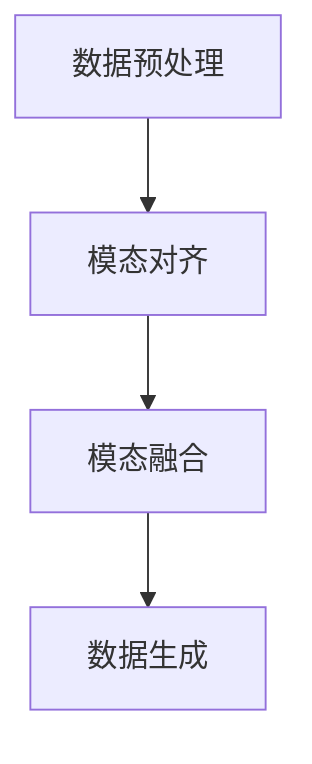

# 多模态生成(Multimodal Generation) - 原理与代码实例讲解

## 1.背景介绍

多模态生成（Multimodal Generation）是当前人工智能领域的一个重要研究方向。它涉及从多种不同类型的数据（如文本、图像、音频等）中生成新的数据。随着深度学习和神经网络技术的快速发展，多模态生成在图像生成、文本生成、视频生成等方面取得了显著的进展。本文将深入探讨多模态生成的核心概念、算法原理、数学模型，并通过代码实例展示其实际应用。

## 2.核心概念与联系

### 2.1 多模态数据

多模态数据是指来自不同模态的数据类型，如文本、图像、音频、视频等。这些数据类型各自具有独特的特征和信息表达方式。

### 2.2 多模态生成

多模态生成是指利用多模态数据生成新的数据。例如，利用文本描述生成图像，或利用图像生成相应的文本描述。

### 2.3 多模态学习

多模态学习是指通过学习不同模态之间的关系和相互作用来提高模型的性能。它包括多模态融合、多模态对齐和多模态生成等任务。

### 2.4 核心联系

多模态生成的核心在于如何有效地融合和对齐不同模态的数据，以生成高质量的输出。这需要在模型设计和训练过程中充分考虑各模态之间的相互关系。

## 3.核心算法原理具体操作步骤

### 3.1 数据预处理

数据预处理是多模态生成的第一步。不同模态的数据需要进行不同的预处理步骤，如文本的分词和向量化，图像的归一化和特征提取等。

### 3.2 模态对齐

模态对齐是指将不同模态的数据映射到同一特征空间，以便进行融合和生成。常用的方法包括对齐网络和对抗性训练。

### 3.3 模态融合

模态融合是指将对齐后的多模态数据进行融合，以生成新的数据。常用的方法包括加权平均、注意力机制和多模态变分自编码器（VAE）。

### 3.4 数据生成

数据生成是多模态生成的最终步骤。常用的方法包括生成对抗网络（GAN）、变分自编码器（VAE）和自回归模型。



## 4.数学模型和公式详细讲解举例说明

### 4.1 生成对抗网络（GAN）

生成对抗网络（GAN）由生成器（Generator）和判别器（Discriminator）组成。生成器试图生成逼真的数据，而判别器试图区分真实数据和生成数据。

生成器的目标是最小化以下损失函数：
$$
L_G = -\mathbb{E}_{z \sim p_z(z)} [\log D(G(z))]
$$

判别器的目标是最大化以下损失函数：
$$
L_D = \mathbb{E}_{x \sim p_{data}(x)} [\log D(x)] + \mathbb{E}_{z \sim p_z(z)} [\log (1 - D(G(z)))]
$$

### 4.2 变分自编码器（VAE）

变分自编码器（VAE）通过最大化以下证据下界（ELBO）来训练：
$$
\mathcal{L} = \mathbb{E}_{q(z|x)} [\log p(x|z)] - D_{KL}(q(z|x) || p(z))
$$

其中，$q(z|x)$ 是近似后验分布，$p(z)$ 是先验分布，$D_{KL}$ 是Kullback-Leibler散度。

## 5.项目实践：代码实例和详细解释说明

### 5.1 数据预处理

```python
import numpy as np
import pandas as pd
from sklearn.preprocessing import StandardScaler

# 加载数据
data = pd.read_csv('data.csv')

# 数据标准化
scaler = StandardScaler()
data_scaled = scaler.fit_transform(data)
```

### 5.2 模态对齐

```python
import torch
import torch.nn as nn

class AlignmentNetwork(nn.Module):
    def __init__(self, input_dim, output_dim):
        super(AlignmentNetwork, self).__init__()
        self.fc = nn.Linear(input_dim, output_dim)
    
    def forward(self, x):
        return self.fc(x)

# 初始化对齐网络
alignment_net = AlignmentNetwork(input_dim=128, output_dim=64)
```

### 5.3 模态融合

```python
class FusionNetwork(nn.Module):
    def __init__(self, input_dim, output_dim):
        super(FusionNetwork, self).__init__()
        self.fc = nn.Linear(input_dim, output_dim)
    
    def forward(self, x1, x2):
        x = torch.cat((x1, x2), dim=1)
        return self.fc(x)

# 初始化融合网络
fusion_net = FusionNetwork(input_dim=128, output_dim=64)
```

### 5.4 数据生成

```python
class Generator(nn.Module):
    def __init__(self, input_dim, output_dim):
        super(Generator, self).__init__()
        self.fc = nn.Linear(input_dim, output_dim)
    
    def forward(self, x):
        return self.fc(x)

class Discriminator(nn.Module):
    def __init__(self, input_dim):
        super(Discriminator, self).__init__()
        self.fc = nn.Linear(input_dim, 1)
    
    def forward(self, x):
        return torch.sigmoid(self.fc(x))

# 初始化生成器和判别器
generator = Generator(input_dim=64, output_dim=128)
discriminator = Discriminator(input_dim=128)
```

## 6.实际应用场景

### 6.1 图像生成

多模态生成在图像生成方面有广泛的应用。例如，通过文本描述生成相应的图像，或通过图像生成相应的文本描述。

### 6.2 视频生成

多模态生成在视频生成方面也有重要应用。例如，通过文本描述生成相应的视频，或通过视频生成相应的文本描述。

### 6.3 音频生成

多模态生成在音频生成方面也有广泛的应用。例如，通过文本描述生成相应的音频，或通过音频生成相应的文本描述。

## 7.工具和资源推荐

### 7.1 工具

- TensorFlow：一个开源的机器学习框架，适用于多模态生成任务。
- PyTorch：一个开源的深度学习框架，适用于多模态生成任务。
- OpenCV：一个开源的计算机视觉库，适用于图像和视频处理。

### 7.2 资源

- 数据集：COCO、ImageNet、VGGSound等多模态数据集。
- 论文：阅读相关领域的最新研究论文，如GAN、VAE等。

## 8.总结：未来发展趋势与挑战

多模态生成是一个充满潜力的研究领域，未来的发展趋势包括：

- 更高效的多模态对齐和融合方法。
- 更高质量的生成模型。
- 更广泛的实际应用场景。

然而，多模态生成也面临一些挑战，如数据的多样性和复杂性、模型的训练难度等。

## 9.附录：常见问题与解答

### 9.1 多模态生成的主要应用场景有哪些？

多模态生成的主要应用场景包括图像生成、视频生成、音频生成等。

### 9.2 多模态生成的主要挑战是什么？

多模态生成的主要挑战包括数据的多样性和复杂性、模型的训练难度等。

### 9.3 如何选择合适的多模态生成模型？

选择合适的多模态生成模型需要根据具体的应用场景和数据特点进行选择。常用的模型包括GAN、VAE等。

---

作者：禅与计算机程序设计艺术 / Zen and the Art of Computer Programming