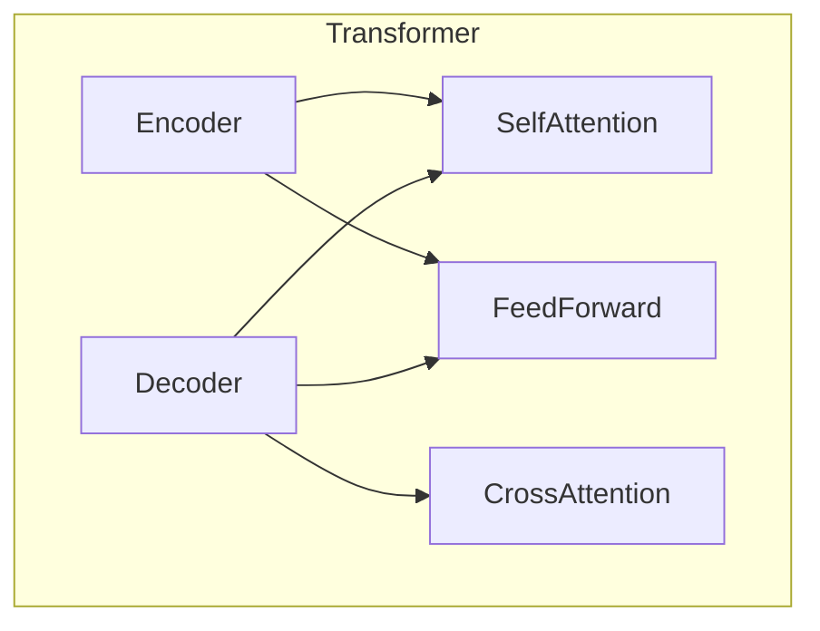

# 大规模语言模型从理论到实践 LLaMA的模型结构

## 1.背景介绍

### 1.1 大规模语言模型的兴起

近年来,大规模语言模型(Large Language Models, LLMs)在自然语言处理(NLP)领域掀起了一场革命。这些模型通过在海量文本数据上进行预训练,学习了丰富的语言知识和上下文关联,能够生成看似人类水平的自然语言输出。

GPT-3、PaLM、ChatGPT等大型语言模型的出现,不仅展现了令人惊叹的语言生成能力,更重要的是证明了通过规模化训练,神经网络模型能够学习到有价值的知识表示,为各种下游任务提供强大的迁移能力。

### 1.2 LLaMA模型简介 

LLaMA(Lean Big-Aligned-Awesome Model Approach)是2023年由Meta AI推出的一款大规模语言模型。它采用了与GPT-3类似的Transformer架构,但在训练数据、模型规模和效率等方面进行了优化和创新。

LLaMA模型的特点包括:

- 支持多语种 (多达65种语言)
- 模型规模从7B到65B参数不等
- 采用指令微调(Instruction Tuning)技术,提高了指令遵循能力
- 引入了SFT(Supervised Fine Tuning)技术,提升了下游任务性能
- 具有较高的计算效率和内存利用率

LLaMA模型在保持强大的语言生成能力的同时,还注重模型的可解释性、可控性和安全性,是大规模语言模型发展的一个重要里程碑。

## 2.核心概念与联系

### 2.1 Transformer架构

Transformer是LLaMA模型的核心架构,也是当前主流的序列到序列(Seq2Seq)模型。它完全基于注意力(Attention)机制,摒弃了传统的RNN和CNN结构,大大提高了并行计算能力。

Transformer架构主要由编码器(Encoder)和解码器(Decoder)两部分组成。编码器将输入序列编码为上下文表示,解码器则根据上下文表示生成目标序列。



其中,Self-Attention用于捕获输入/输出序列内部的依赖关系,Cross-Attention则捕获输入和输出序列之间的依赖关系。FeedForward网络则用于对注意力表示进行非线性变换。

### 2.2 预训练与微调

LLaMA模型采用了两阶段训练策略:

1. **预训练(Pre-training)**: 在海量文本数据上进行自监督学习,获得通用的语言表示能力。
2. **微调(Fine-tuning)**: 在特定任务数据上进行有监督训练,将通用语言表示迁移到下游任务。

预训练阶段通常采用自编码(Auto-Encoding)、因果语言模型(Causal LM)或掩码语言模型(Masked LM)等目标,学习文本的语义和语法知识。微调阶段则根据任务类型采用不同的训练目标,如序列生成、文本分类等。

### 2.3 指令微调

传统的语言模型往往缺乏对指令的理解和遵循能力。LLaMA引入了指令微调(Instruction Tuning)技术,使模型能够更好地理解和执行各种指令。

指令微调的核心思想是,在微调阶段构建一个包含大量指令-输出对的数据集,并以指令作为输入,目标输出作为监督信号,对模型进行有监督训练。通过这种方式,模型能够学习到指令与输出之间的映射关系,提高了指令遵循能力。

## 3.核心算法原理具体操作步骤

### 3.1 Transformer模型训练

Transformer模型的训练过程可以概括为以下几个步骤:

1. **数据预处理**: 将文本数据转换为模型可以接受的形式,通常是将文本tokenize为子词(Subword)序列。

2. **构建数据批次(Batch)**: 将多个序列组合成批次,以提高训练效率。

3. **位置编码(Positional Encoding)**: 为每个token添加位置信息,使Transformer能够捕获序列的位置依赖关系。

4. **前向传播(Forward Pass)**: 将输入序列通过Transformer的编码器和解码器,计算出预测的输出序列。

5. **计算损失(Loss)**: 将预测输出与真实输出进行比较,计算损失函数(如交叉熵损失)。

6. **反向传播(Backward Pass)**: 根据损失函数,计算模型参数的梯度。

7. **参数更新**: 使用优化器(如Adam)根据梯度更新模型参数。

8. **重复训练**: 重复上述步骤,直到模型收敛或达到预设的训练轮次。

对于大规模模型而言,数据并行和模型并行是提高训练效率的关键技术。数据并行将数据批次划分到多个GPU/TPU上进行并行计算,而模型并行则将模型的不同层或注意力头划分到不同的加速器上。

### 3.2 指令微调算法

指令微调的核心算法可以概括为以下步骤:

1. **构建指令数据集**: 收集大量的指令-输出对,作为微调的训练数据。指令可以是自然语言指令,也可以是程序化的指令。

2. **数据预处理**: 将指令和输出序列tokenize,构建成模型可接受的输入格式。

3. **前向传播**: 将指令作为输入,通过Transformer模型计算出预测的输出序列。

4. **计算损失**: 将预测输出与真实输出进行比较,计算损失函数(如交叉熵损失)。

5. **反向传播和参数更新**: 根据损失函数计算梯度,并使用优化器更新模型参数。

6. **重复训练**: 重复上述步骤,直到模型在验证集上的指标满意为止。

在指令微调过程中,一个关键点是如何构建高质量的指令数据集。常见的方法包括:

- 人工标注: 由专家人工编写指令-输出对。
- 自动构建: 利用已有的数据集(如问答数据集)自动生成指令-输出对。
- 反馈循环: 利用模型生成的输出,由人工进行反馈和修正,不断迭代优化数据集质量。

## 4.数学模型和公式详细讲解举例说明

### 4.1 Transformer中的Self-Attention

Self-Attention是Transformer架构的核心机制,它能够捕获输入序列中任意两个token之间的依赖关系。给定一个输入序列 $X = (x_1, x_2, \dots, x_n)$,Self-Attention的计算过程如下:

1. 将输入序列线性映射到Query、Key和Value向量:

$$
\begin{aligned}
Q &= XW_Q \\
K &= XW_K \\
V &= XW_V
\end{aligned}
$$

其中 $W_Q, W_K, W_V$ 为可学习的权重矩阵。

2. 计算Query和Key的点积,获得注意力分数矩阵:

$$
\text{Attention}(Q, K, V) = \text{softmax}\left(\frac{QK^T}{\sqrt{d_k}}\right)V
$$

其中 $d_k$ 为Query和Key的维度,用于缩放点积值。

3. 将注意力分数与Value相乘,得到加权后的Value向量作为输出。

Self-Attention的核心思想是,通过Query和Key的相似性来确定不同位置token之间的依赖强度,从而动态地捕获长距离依赖关系。

### 4.2 Transformer中的Multi-Head Attention

为了进一步提高模型的表达能力,Transformer引入了Multi-Head Attention机制。它将Self-Attention过程并行运行多次,每次关注输入序列的不同子空间表示,最后将多个注意力头的输出拼接起来,形成最终的注意力表示。

给定 $h$ 个注意力头,Multi-Head Attention的计算过程如下:

$$
\begin{aligned}
\text{MultiHead}(Q, K, V) &= \text{Concat}(\text{head}_1, \dots, \text{head}_h)W^O \\
\text{where } \text{head}_i &= \text{Attention}(QW_i^Q, KW_i^K, VW_i^V)
\end{aligned}
$$

其中 $W_i^Q, W_i^K, W_i^V$ 为第 $i$ 个注意力头的线性映射权重, $W^O$ 为最终的线性映射权重。

Multi-Head Attention不仅提高了模型的表达能力,还有助于提升模型的泛化性和稳定性。

### 4.3 Transformer的残差连接和层归一化

为了缓解深度神经网络中的梯度消失/爆炸问题,并加强特征的传递,Transformer在每个子层之后引入了残差连接(Residual Connection)和层归一化(Layer Normalization)操作。

**残差连接**:

$$
\text{Output} = \text{LayerOutput} + \text{Input}
$$

**层归一化**:

$$
\begin{aligned}
\mu &= \frac{1}{H}\sum_{i=1}^{H}x_i \\
\sigma^2 &= \frac{1}{H}\sum_{i=1}^{H}(x_i - \mu)^2 \\
\hat{x}_i &= \frac{x_i - \mu}{\sqrt{\sigma^2 + \epsilon}} \\
y_i &= \gamma \hat{x}_i + \beta
\end{aligned}
$$

其中 $H$ 为输入的隐层维度, $\gamma$ 和 $\beta$ 为可学习的缩放和偏移参数。

残差连接有助于保留原始输入的信息,防止信息在深层传递时被过度压缩或扭曲。层归一化则通过对每个样本进行归一化,有助于加速模型收敛并提高泛化性能。

## 5.项目实践:代码实例和详细解释说明

以下是一个使用PyTorch实现Transformer模型的简化代码示例,用于说明Transformer的核心组件。

```python
import torch
import torch.nn as nn

# 定义一个简单的Multi-Head Attention模块
class MultiHeadAttention(nn.Module):
    def __init__(self, embed_dim, num_heads):
        super().__init__()
        self.embed_dim = embed_dim
        self.num_heads = num_heads
        self.head_dim = embed_dim // num_heads

        self.qkv_proj = nn.Linear(embed_dim, 3 * embed_dim)
        self.out_proj = nn.Linear(embed_dim, embed_dim)

    def forward(self, x):
        batch_size, seq_len, _ = x.size()
        qkv = self.qkv_proj(x)  # [batch_size, seq_len, 3 * embed_dim]
        q, k, v = qkv.chunk(3, dim=-1)  # [batch_size, seq_len, embed_dim]

        # 多头注意力计算
        q = q.view(batch_size, seq_len, self.num_heads, self.head_dim).transpose(1, 2)
        k = k.view(batch_size, seq_len, self.num_heads, self.head_dim).transpose(1, 2)
        v = v.view(batch_size, seq_len, self.num_heads, self.head_dim).transpose(1, 2)

        attn_scores = torch.matmul(q, k.transpose(-2, -1)) / (self.head_dim ** 0.5)
        attn_scores = attn_scores.softmax(dim=-1)
        attn_output = torch.matmul(attn_scores, v).transpose(1, 2).contiguous()
        attn_output = attn_output.view(batch_size, seq_len, self.embed_dim)

        out = self.out_proj(attn_output)
        return out

# 定义一个简单的Transformer编码器层
class TransformerEncoderLayer(nn.Module):
    def __init__(self, embed_dim, num_heads, ff_dim, dropout=0.1):
        super().__init__()
        self.attn = MultiHeadAttention(embed_dim, num_heads)
        self.ff = nn.Sequential(
            nn.Linear(embed_dim, ff_dim),
            nn.ReLU(),
            nn.Dropout(dropout),
            nn.Linear(ff_dim, embed_dim),
            nn.Dropout(dropout)
        )
        self.norm1 = nn.LayerNorm(embed_dim)
        self.norm2 = nn.LayerNorm(embed_dim)

    def forward(self, x):
        residual = x
        x = self.norm1(x)
        x = self.attn(x) + residual  # 残差连接

        residual = x
        x = self.norm2(x)
        x = self.ff(x) + residual  # 残差连接

        return x

# 定义一个简单的Transformer编码器
class TransformerEncoder