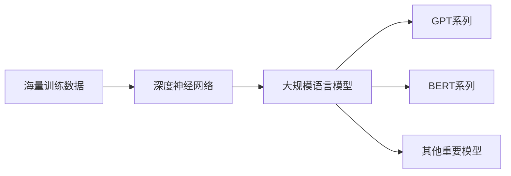

# 大规模语言模型从理论到实践 知识与能力

## 1.背景介绍
### 1.1 大规模语言模型的发展历程
#### 1.1.1 早期的语言模型
#### 1.1.2 神经网络语言模型的兴起
#### 1.1.3 Transformer的革命性突破

### 1.2 大规模语言模型的重要意义
#### 1.2.1 自然语言理解与生成的里程碑
#### 1.2.2 推动人工智能技术的发展
#### 1.2.3 开启认知智能新时代

## 2.核心概念与联系
### 2.1 语言模型的定义与原理
#### 2.1.1 语言模型的数学定义
#### 2.1.2 语言模型的概率解释
#### 2.1.3 语言模型的评估指标

### 2.2 大规模语言模型的特点
#### 2.2.1 海量的训练数据
#### 2.2.2 深度的神经网络结构
#### 2.2.3 强大的泛化与迁移能力

### 2.3 大规模语言模型的类型
#### 2.3.1 GPT系列模型
#### 2.3.2 BERT系列模型
#### 2.3.3 其他重要的大规模语言模型



## 3.核心算法原理具体操作步骤
### 3.1 Transformer的核心原理
#### 3.1.1 自注意力机制
#### 3.1.2 多头注意力
#### 3.1.3 位置编码

### 3.2 预训练与微调
#### 3.2.1 无监督预训练
#### 3.2.2 有监督微调
#### 3.2.3 预训练任务的设计

### 3.3 知识蒸馏与模型压缩
#### 3.3.1 知识蒸馏的原理
#### 3.3.2 软标签与温度参数
#### 3.3.3 模型压缩技术

## 4.数学模型和公式详细讲解举例说明
### 4.1 Transformer的数学表示
#### 4.1.1 自注意力的数学公式
$Attention(Q,K,V) = softmax(\frac{QK^T}{\sqrt{d_k}})V$
#### 4.1.2 多头注意力的数学公式
$MultiHead(Q,K,V) = Concat(head_1,...,head_h)W^O$
#### 4.1.3 前馈神经网络的数学公式
$FFN(x) = max(0, xW_1 + b_1)W_2 + b_2$

### 4.2 语言模型的概率计算
#### 4.2.1 n-gram语言模型
$P(w_1, w_2, ..., w_n) = \prod_{i=1}^{n} P(w_i|w_1, ..., w_{i-1})$
#### 4.2.2 神经网络语言模型
$P(w_1, w_2, ..., w_n) = \prod_{i=1}^{n} P(w_i|w_1, ..., w_{i-1}; \theta)$
#### 4.2.3 大规模语言模型的概率计算

### 4.3 损失函数与优化算法
#### 4.3.1 交叉熵损失函数
$L(\theta) = -\frac{1}{N}\sum_{i=1}^{N}\sum_{j=1}^{|V|}y_{ij}log(p_{ij})$
#### 4.3.2 AdamW优化算法
$m_t = \beta_1 m_{t-1} + (1 - \beta_1) g_t$
$v_t = \beta_2 v_{t-1} + (1 - \beta_2) g_t^2$
$\hat{m}_t = \frac{m_t}{1 - \beta_1^t}$
$\hat{v}_t = \frac{v_t}{1 - \beta_2^t}$
$\theta_t = \theta_{t-1} - \frac{\eta}{\sqrt{\hat{v}_t} + \epsilon} \hat{m}_t$
#### 4.3.3 学习率调度策略

## 5.项目实践：代码实例和详细解释说明
### 5.1 使用PyTorch实现Transformer
#### 5.1.1 定义Transformer模型类
```python
class Transformer(nn.Module):
    def __init__(self, ...):
        super().__init__()
        self.encoder = TransformerEncoder(...)
        self.decoder = TransformerDecoder(...)
    
    def forward(self, src, tgt):
        ...
```
#### 5.1.2 实现自注意力机制
```python
class MultiHeadAttention(nn.Module):
    def __init__(self, ...):
        super().__init__()
        self.W_q = nn.Linear(d_model, d_model)
        self.W_k = nn.Linear(d_model, d_model)  
        self.W_v = nn.Linear(d_model, d_model)
        self.W_o = nn.Linear(d_model, d_model)
        
    def forward(self, query, key, value, mask=None):
        ...
```
#### 5.1.3 实现位置编码
```python
class PositionalEncoding(nn.Module):
    def __init__(self, d_model, max_len=5000):
        super().__init__()
        pe = torch.zeros(max_len, d_model)
        position = torch.arange(0, max_len, dtype=torch.float).unsqueeze(1)
        div_term = torch.exp(torch.arange(0, d_model, 2).float() * (-math.log(10000.0) / d_model))
        pe[:, 0::2] = torch.sin(position * div_term)
        pe[:, 1::2] = torch.cos(position * div_term)
        pe = pe.unsqueeze(0).transpose(0, 1)
        self.register_buffer('pe', pe)
        
    def forward(self, x):
        x = x + self.pe[:x.size(0), :]
        return x
```

### 5.2 使用HuggingFace的Transformers库
#### 5.2.1 加载预训练模型
```python
from transformers import AutoTokenizer, AutoModel

tokenizer = AutoTokenizer.from_pretrained("bert-base-uncased")
model = AutoModel.from_pretrained("bert-base-uncased")
```
#### 5.2.2 微调预训练模型
```python
from transformers import AdamW

optimizer = AdamW(model.parameters(), lr=1e-5)
for epoch in range(num_epochs):
    for batch in train_dataloader:
        optimizer.zero_grad()
        outputs = model(**batch)
        loss = outputs.loss
        loss.backward()
        optimizer.step()
```
#### 5.2.3 使用微调后的模型进行推理
```python
inputs = tokenizer("Hello world!", return_tensors="pt")
outputs = model(**inputs)
```

### 5.3 大规模语言模型的实际应用
#### 5.3.1 文本分类
#### 5.3.2 命名实体识别
#### 5.3.3 问答系统
#### 5.3.4 文本生成

## 6.实际应用场景
### 6.1 智能客服
#### 6.1.1 客户意图识别
#### 6.1.2 自动回复生成
#### 6.1.3 情感分析

### 6.2 内容生成
#### 6.2.1 新闻写作
#### 6.2.2 小说创作
#### 6.2.3 广告文案生成

### 6.3 语言翻译
#### 6.3.1 机器翻译
#### 6.3.2 同声传译
#### 6.3.3 多语言支持

### 6.4 知识图谱
#### 6.4.1 实体链接
#### 6.4.2 关系抽取
#### 6.4.3 知识推理

## 7.工具和资源推荐
### 7.1 开源工具库
#### 7.1.1 PyTorch
#### 7.1.2 TensorFlow
#### 7.1.3 HuggingFace Transformers

### 7.2 预训练模型
#### 7.2.1 BERT
#### 7.2.2 GPT-2/GPT-3
#### 7.2.3 RoBERTa
#### 7.2.4 XLNet

### 7.3 数据集
#### 7.3.1 Wikipedia
#### 7.3.2 BookCorpus
#### 7.3.3 Common Crawl
#### 7.3.4 OpenWebText

### 7.4 云平台与硬件支持
#### 7.4.1 Google Cloud TPU
#### 7.4.2 AWS EC2
#### 7.4.3 NVIDIA GPU

## 8.总结：未来发展趋势与挑战
### 8.1 大规模语言模型的发展趋势
#### 8.1.1 模型参数量的增长
#### 8.1.2 训练数据的扩充
#### 8.1.3 计算资源的提升

### 8.2 面临的挑战
#### 8.2.1 偏见与公平性
#### 8.2.2 隐私与安全
#### 8.2.3 可解释性与可控性

### 8.3 未来的研究方向
#### 8.3.1 多模态语言模型
#### 8.3.2 知识增强语言模型
#### 8.3.3 小样本学习

## 9.附录：常见问题与解答
### 9.1 如何选择合适的预训练模型？
### 9.2 如何处理训练过程中的过拟合问题？
### 9.3 如何平衡模型的性能和效率？
### 9.4 如何评估生成文本的质量？
### 9.5 如何应对训练数据中的噪声和错误？

作者：禅与计算机程序设计艺术 / Zen and the Art of Computer Programming