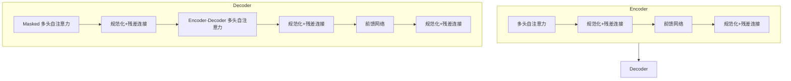

# 大语言模型 (Large Language Models, LLM) 原理与代码实例讲解

## 1. 背景介绍

### 1.1 什么是大语言模型?

大语言模型(Large Language Models, LLM)是一种基于深度学习的自然语言处理(NLP)模型,旨在从大量文本数据中学习语言模式和上下文关系。这些模型通过训练巨大的神经网络,能够生成看似人类写作的连贯、流畅和相关的文本输出。

LLM的出现源于计算能力的飞速发展和海量文本数据的积累。随着算力的提升和数据集的扩大,研究人员能够训练包含数十亿甚至数万亿参数的庞大语言模型,从而捕捉更复杂、更丰富的语言结构和语义关系。

### 1.2 大语言模型的重要性

大语言模型在自然语言处理领域产生了深远的影响,为各种下游任务提供了强大的基础模型。它们可以应用于文本生成、机器翻译、问答系统、文本摘要等多个场景,显著提高了这些任务的性能水平。

除了卓越的语言生成能力,LLM还展现出了一定的推理和学习能力,可以从有限的训练数据中获取知识,并将其应用于新的上下文和场景。这使得LLM在一些需要推理和决策的领域也有潜在的应用前景。

### 1.3 大语言模型的发展历程

大语言模型的发展经历了几个重要阶段:

- **Word Embedding**: 将单词表示为密集向量,捕捉单词之间的语义关系。
- **RNN 和 LSTM**: 循环神经网络能够处理序列数据,但存在梯度消失和爆炸问题。
- **Transformer**: 自注意力机制的引入,使模型能够更好地捕捉长距离依赖关系。
- **GPT、BERT 等预训练模型**: 在大规模无监督语料库上预训练,再通过微调应用于下游任务。
- **大模型时代**: 训练参数达数十亿至数万亿,展现出更强的语言理解和生成能力。

随着模型规模和训练数据的不断扩大,大语言模型的性能也在持续提升,但同时也面临着一些新的挑战和问题。

## 2. 核心概念与联系

### 2.1 自注意力机制 (Self-Attention)

自注意力机制是大语言模型中的核心概念之一,它允许模型捕捉输入序列中任意两个位置之间的依赖关系,而不受距离的限制。这种机制的引入使得模型能够更好地理解长距离的上下文信息。

在自注意力机制中,每个输入位置都会关注整个输入序列中的所有位置,并根据它们的相关性赋予不同的权重。这种计算方式使得模型能够同时考虑全局和局部的信息,从而更好地捕捉语义关系。

自注意力机制可以形式化表示为:

$$
\mathrm{Attention}(Q, K, V) = \mathrm{softmax}\left(\frac{QK^T}{\sqrt{d_k}}\right)V
$$

其中 $Q$ 表示查询(Query)、$K$ 表示键(Key)、$V$ 表示值(Value)。$d_k$ 是缩放因子,用于防止点积的值过大导致梯度消失或爆炸。

### 2.2 Transformer 架构

Transformer 是一种全新的序列到序列(Sequence-to-Sequence)模型架构,它完全基于自注意力机制,不使用循环神经网络(RNN)或卷积神经网络(CNN)。Transformer 架构主要由编码器(Encoder)和解码器(Decoder)两个模块组成。

编码器的作用是将输入序列映射为一系列连续的表示,而解码器则根据编码器的输出和前一步的预测来生成目标序列。两个模块都使用了多头自注意力机制和前馈神经网络。

Transformer 架构的优势在于并行计算能力强、能够更好地捕捉长距离依赖关系,同时避免了RNN中的梯度消失和爆炸问题。它为大语言模型的发展奠定了基础。

### 2.3 预训练与微调

大语言模型通常采用两阶段训练策略:预训练(Pre-training)和微调(Fine-tuning)。

**预训练**阶段是在大规模无监督语料库上训练模型,目标是让模型捕捉通用的语言知识和模式。常见的预训练目标包括:

- **蒙版语言模型(Masked Language Modeling, MLM)**: 预测被掩码的单词。
- **下一句预测(Next Sentence Prediction, NSP)**: 判断两个句子是否相邻。
- **因果语言模型(Causal Language Modeling, CLM)**: 给定前文,预测下一个单词。

**微调**阶段是在特定任务的标注数据上继续训练模型,使其适应目标任务。微调通常只需要对模型的部分参数进行更新,从而避免从头开始训练,大大提高了效率。

预训练和微调的结合使得大语言模型能够在保留通用语言知识的同时,针对特定任务进行专门的优化和调整。

### 2.4 模型规模与性能

大语言模型的性能与其规模(参数数量)密切相关。一般来说,规模越大,模型的表现就越好。但是,过度追求规模也会带来一些挑战,如计算资源需求高、训练时间长、环境影响等。

GPT-3 是目前最大的语言模型之一,拥有 1750 亿个参数。与之前的模型相比,GPT-3 展现出了更强的语言理解和生成能力,能够完成一些看似需要推理和常识知识的任务。

然而,大规模并不能完全解决语言模型的所有问题。一些研究表明,即使是大规模模型,在一些特定任务上的表现也可能不尽如人意。因此,如何平衡模型规模、计算资源和性能,是未来需要解决的重要问题。

## 3. 核心算法原理具体操作步骤

### 3.1 自注意力机制计算过程

自注意力机制的计算过程可以分为以下几个步骤:

1. **查询(Query)、键(Key)和值(Value)的计算**

   输入序列 $X = (x_1, x_2, ..., x_n)$ 首先通过三个不同的线性变换,分别得到查询 $Q$、键 $K$ 和值 $V$:

   $$
   Q = XW^Q, \quad K = XW^K, \quad V = XW^V
   $$

   其中 $W^Q$、$W^K$ 和 $W^V$ 是可学习的权重矩阵。

2. **计算注意力分数**

   计算查询 $Q$ 与所有键 $K$ 的缩放点积,得到注意力分数矩阵:

   $$
   \mathrm{Attention}(Q, K, V) = \mathrm{softmax}\left(\frac{QK^T}{\sqrt{d_k}}\right)V
   $$

   其中 $d_k$ 是缩放因子,用于防止点积的值过大导致梯度消失或爆炸。

3. **多头注意力**

   为了捕捉不同的子空间信息,通常会使用多头注意力机制。将查询、键和值分别线性投影到不同的子空间,并在每个子空间内计算注意力,最后将所有子空间的注意力结果拼接起来。

4. **残差连接和层归一化**

   为了更好地训练模型,自注意力模块通常会与残差连接和层归一化(Layer Normalization)相结合,有助于梯度的传播和模型的收敛。

通过上述步骤,自注意力机制能够捕捉输入序列中任意两个位置之间的依赖关系,从而更好地理解和生成语言。

### 3.2 Transformer 编码器和解码器

Transformer 架构由编码器(Encoder)和解码器(Decoder)两个主要模块组成,它们的具体计算过程如下:

**编码器(Encoder)**

1. 输入嵌入层: 将输入序列 $X = (x_1, x_2, ..., x_n)$ 映射为嵌入向量序列。
2. 位置编码: 为每个位置添加位置信息,使模型能够捕捉序列的顺序。
3. 多层编码器层: 每层包含一个多头自注意力子层和一个前馈网络子层,两者之间使用残差连接和层归一化。
4. 输出: 编码器的最终输出是一系列连续的表示,捕捉了输入序列的上下文信息。

**解码器(Decoder)**

1. 输出嵌入层: 将输出序列 $Y = (y_1, y_2, ..., y_m)$ 映射为嵌入向量序列。
2. 掩码多头自注意力: 对当前位置的单词进行自注意力,但被掩码的未来位置不可见。
3. 编码器-解码器注意力: 将解码器的输出与编码器的输出进行注意力计算,获取输入序列的上下文信息。
4. 前馈网络: 对注意力输出进行非线性变换,产生最终的解码器输出。
5. 输出层: 将解码器输出映射为目标序列的概率分布。

通过编码器捕捉输入序列的上下文信息,解码器则根据编码器的输出和前一步的预测来生成目标序列。这种编码器-解码器架构使 Transformer 能够高效地处理各种序列到序列的任务,如机器翻译、文本摘要等。

## 4. 数学模型和公式详细讲解举例说明

### 4.1 自注意力机制的数学表示

自注意力机制是大语言模型中的核心组件,它允许模型捕捉输入序列中任意两个位置之间的依赖关系。自注意力机制的数学表示如下:

$$
\mathrm{Attention}(Q, K, V) = \mathrm{softmax}\left(\frac{QK^T}{\sqrt{d_k}}\right)V
$$

其中:

- $Q$ 表示查询(Query)矩阵,用于计算当前位置与其他位置的相关性。
- $K$ 表示键(Key)矩阵,用于计算其他位置与当前位置的相关性。
- $V$ 表示值(Value)矩阵,包含了需要关注的信息。
- $d_k$ 是缩放因子,用于防止点积的值过大导致梯度消失或爆炸。

计算过程如下:

1. 计算查询 $Q$ 与所有键 $K$ 的缩放点积,得到注意力分数矩阵 $\mathrm{score}$:

   $$
   \mathrm{score} = \frac{QK^T}{\sqrt{d_k}}
   $$

2. 对注意力分数矩阵应用 softmax 函数,得到注意力权重矩阵 $\alpha$:

   $$
   \alpha = \mathrm{softmax}(\mathrm{score})
   $$

3. 将注意力权重矩阵 $\alpha$ 与值矩阵 $V$ 相乘,得到加权和表示 $\mathrm{output}$:

   $$
   \mathrm{output} = \alpha V
   $$

通过这种方式,自注意力机制能够捕捉输入序列中任意两个位置之间的依赖关系,从而更好地理解和生成语言。

### 4.2 多头自注意力机制

为了捕捉不同的子空间信息,通常会使用多头自注意力机制。多头自注意力机制的数学表示如下:

$$
\mathrm{MultiHead}(Q, K, V) = \mathrm{Concat}(\mathrm{head}_1, \mathrm{head}_2, ..., \mathrm{head}_h)W^O
$$

其中:

- $h$ 表示头数,每个头都是一个独立的自注意力机制。
- $\mathrm{hea