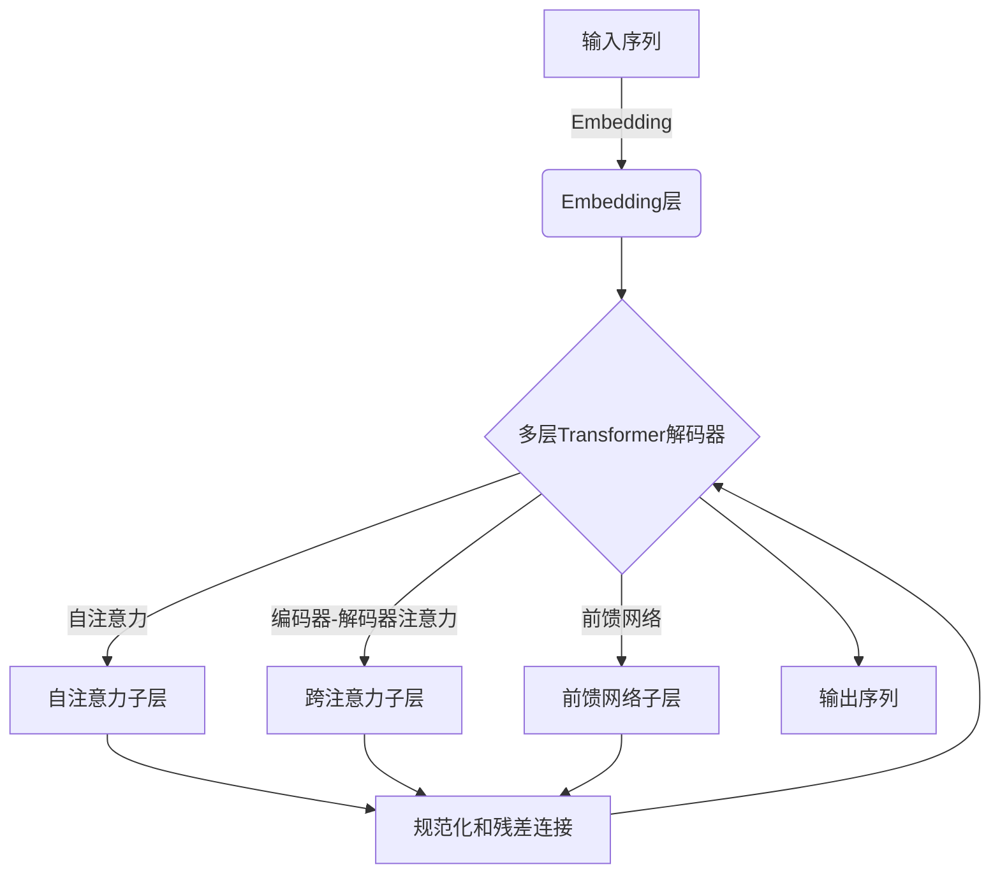

# 大语言模型原理与工程实践：Decoder 的代表：GPT 系列

## 1. 背景介绍

### 1.1 自然语言处理的重要性

在当今信息时代,自然语言处理(NLP)已经成为人工智能领域中最重要和最具挑战性的研究方向之一。作为人类与机器交互的桥梁,NLP技术使计算机能够理解和生成自然语言,从而实现人机自然交互。随着大数据和计算能力的不断提升,NLP技术在机器翻译、智能问答、语音识别、信息检索等领域得到了广泛应用。

### 1.2 语言模型在NLP中的作用

语言模型是NLP中的基础技术,旨在捕捉语言的统计规律和语义信息。传统的基于规则的语言模型存在一定局限性,而近年来兴起的基于深度学习的神经网络语言模型展现出了强大的语言理解和生成能力,推动了NLP技术的飞速发展。

### 1.3 GPT系列模型的重要意义

在深度学习语言模型中,GPT(Generative Pre-trained Transformer)系列模型因其卓越的表现而备受关注。GPT是一种基于Transformer架构的大型预训练语言模型,通过在大规模语料库上进行无监督预训练,学习到了丰富的语言知识。GPT系列模型不仅在自然语言生成任务上表现出色,而且还可以通过微调(fine-tuning)的方式迁移到各种下游NLP任务,展现出了强大的通用性。

## 2. 核心概念与联系

### 2.1 自注意力机制(Self-Attention)

自注意力机制是Transformer架构的核心,它允许模型捕捉输入序列中任意两个位置之间的关系,从而更好地建模长距离依赖关系。与传统的RNN和CNN相比,自注意力机制具有更好的并行计算能力和更长的依赖捕捉范围。

### 2.2 Transformer解码器(Decoder)

Transformer解码器是Transformer架构中用于序列生成的核心组件。它由多个解码器层组成,每个解码器层包含一个多头自注意力子层、一个编码器-解码器注意力子层和一个前馈神经网络子层。解码器通过自注意力机制捕捉输出序列的内部依赖关系,并通过编码器-解码器注意力机制关注输入序列的相关部分,从而生成高质量的输出序列。

### 2.3 GPT模型架构

GPT模型的核心架构是基于Transformer解码器的,它由多个解码器层堆叠而成。与标准的Transformer模型不同,GPT模型只包含解码器部分,没有编码器部分。这种架构设计使GPT模型专注于语言生成任务,并且具有更高的计算效率。

上图展示了GPT模型的基本架构。输入序列首先通过Embedding层转换为向量表示,然后被送入多层Transformer解码器进行处理。每个解码器层包含三个主要子层:自注意力子层、跨注意力子层和前馈网络子层。这些子层通过残差连接和层归一化相互组合,捕捉输入序列的长距离依赖关系和语义信息。最终,模型输出一个概率分布,表示下一个词的预测概率。

## 3. 核心算法原理具体操作步骤

### 3.1 输入表示

GPT模型的输入是一个文本序列,首先需要将其转换为向量表示。这通常是通过词嵌入(Word Embedding)和位置编码(Positional Encoding)两个步骤完成的。

1. **词嵌入**:将每个词映射到一个固定长度的向量,这些向量能够捕捉词与词之间的语义关系。词嵌入可以通过预训练的词向量或者在模型训练过程中学习得到。

2. **位置编码**:由于Transformer模型没有像RNN那样的递归结构,因此需要一种机制来为序列中的每个位置编码位置信息。位置编码通常是一个固定的向量,它与词嵌入相加,从而将位置信息注入到输入表示中。

### 3.2 Transformer解码器层

Transformer解码器层是GPT模型的核心部分,它由三个主要子层组成:自注意力子层、编码器-解码器注意力子层和前馈网络子层。

#### 3.2.1 自注意力子层

自注意力子层允许模型捕捉输入序列中任意两个位置之间的关系。它的计算过程如下:

1. 将输入序列线性映射到查询(Query)、键(Key)和值(Value)向量。
2. 计算查询和所有键之间的点积,得到注意力分数。
3. 通过Softmax函数对注意力分数进行归一化,得到注意力权重。
4. 使用注意力权重对值向量进行加权求和,得到注意力输出。
5. 将注意力输出和输入序列相加,得到自注意力子层的输出。

自注意力机制允许模型在生成每个词时关注整个输入序列的相关部分,从而更好地捕捉长距离依赖关系。

#### 3.2.2 编码器-解码器注意力子层

在生成任务中,解码器需要关注输入序列的相关部分。编码器-解码器注意力子层的作用是将解码器的输出与编码器的输出进行注意力计算,从而获取输入序列的相关信息。

1. 将输入序列通过编码器处理,得到编码器输出。
2. 将解码器的输出线性映射到查询向量。
3. 计算查询向量与编码器输出的键和值向量之间的注意力分数和权重。
4. 使用注意力权重对编码器输出的值向量进行加权求和,得到注意力输出。
5. 将注意力输出和解码器输出相加,得到编码器-解码器注意力子层的输出。

编码器-解码器注意力机制允许解码器选择性地关注输入序列的相关部分,从而更好地生成与输入相关的输出序列。

#### 3.2.3 前馈网络子层

前馈网络子层是一个简单的前馈神经网络,它对输入进行两次线性变换和非线性激活,以捕捉更复杂的特征。具体操作步骤如下:

1. 将子层输入通过一个线性变换和ReLU激活函数处理。
2. 将上一步的输出再通过另一个线性变换处理。
3. 将线性变换的输出和子层输入相加,得到前馈网络子层的输出。

前馈网络子层为模型引入了非线性变换,增强了其表示能力。

### 3.3 输出生成

在每个解码器层的计算完成后,GPT模型会输出一个概率分布,表示下一个词的预测概率。具体操作步骤如下:

1. 将最后一个解码器层的输出通过一个线性变换和Softmax函数处理,得到词汇表上的概率分布。
2. 根据概率分布对词汇表进行采样,得到下一个词的预测。
3. 将预测的词附加到输出序列的末尾,作为下一步的输入。
4. 重复步骤1-3,直到达到预设的序列长度或者生成结束标记。

通过上述步骤,GPT模型可以自回归地生成文本序列。在训练过程中,模型会最小化预测词与真实词之间的交叉熵损失,从而学习到生成高质量文本的能力。

## 4. 数学模型和公式详细讲解举例说明

### 4.1 自注意力机制

自注意力机制是Transformer模型的核心,它允许模型捕捉输入序列中任意两个位置之间的关系。给定一个长度为 $n$ 的输入序列 $X = (x_1, x_2, \dots, x_n)$,自注意力机制的计算过程如下:

1. **线性映射**:将输入序列 $X$ 线性映射到查询(Query)、键(Key)和值(Value)向量,得到 $Q$、$K$ 和 $V$。

$$Q = XW^Q$$
$$K = XW^K$$
$$V = XW^V$$

其中 $W^Q$、$W^K$ 和 $W^V$ 是可学习的权重矩阵。

2. **计算注意力分数**:计算查询 $Q$ 和所有键 $K$ 之间的点积,得到注意力分数矩阵 $S$。

$$S = QK^T$$

3. **注意力权重**:通过Softmax函数对注意力分数矩阵 $S$ 进行归一化,得到注意力权重矩阵 $A$。

$$A = \text{Softmax}(S/\sqrt{d_k})$$

其中 $d_k$ 是缩放因子,用于防止注意力分数过大或过小。

4. **注意力输出**:使用注意力权重矩阵 $A$ 对值向量 $V$ 进行加权求和,得到注意力输出 $Z$。

$$Z = AV$$

自注意力机制允许模型在生成每个词时关注整个输入序列的相关部分,从而更好地捕捉长距离依赖关系。

### 4.2 多头注意力机制

为了捕捉不同子空间的关系,Transformer模型采用了多头注意力机制。多头注意力机制将注意力分成多个"头部",每个头部都独立地计算注意力,最后将所有头部的输出进行拼接。具体计算过程如下:

1. **线性映射**:将输入序列 $X$ 线性映射到查询、键和值向量,得到 $Q$、$K$ 和 $V$。

$$Q = XW^Q$$
$$K = XW^K$$
$$V = XW^V$$

其中 $W^Q$、$W^K$ 和 $W^V$ 是可学习的权重矩阵,将输入向量映射到不同的子空间。

2. **多头注意力计算**:对于每个头部 $i$,计算自注意力输出 $Z_i$。

$$Z_i = \text{Attention}(QW_i^Q, KW_i^K, VW_i^V)$$

其中 $W_i^Q$、$W_i^K$ 和 $W_i^V$ 是第 $i$ 个头部的可学习权重矩阵。

3. **多头拼接**:将所有头部的注意力输出 $Z_i$ 沿着最后一个维度拼接,得到多头注意力输出 $Z$。

$$Z = \text{Concat}(Z_1, Z_2, \dots, Z_h)W^O$$

其中 $h$ 是头部数量,而 $W^O$ 是可学习的线性变换权重矩阵。

多头注意力机制允许模型从不同的子空间捕捉不同的关系,从而提高了模型的表示能力。

### 4.3 掩码自注意力机制

在自回归语言模型中,解码器在生成每个词时只能关注已生成的词,而不能关注未来的词。为了实现这一点,GPT模型采用了掩码自注意力机制。

具体来说,在计算自注意力分数矩阵 $S$ 时,GPT模型会对未来位置的注意力分数施加一个非常大的负值(例如 $-\infty$),从而使得这些位置的注意力权重接近于 0。这种掩码操作可以用下式表示:

$$S_{ij} = \begin{cases}
QK^T & \text{if } i \geq j\\
-\infty & \text{if } i < j
\end{cases}$$

其中 $i$ 和 $j$ 分别表示序列中的位置索引。通过这种方式,GPT模型在生成第 $i$ 个词时只能关注前 $i-1$ 个词,而无法关注后面的词。

掩码自注意力机制确保了模型的自回归性质,使得它能够逐步生成序列,同时还保留了自注意力机制捕捉长距离依赖关系的优势。

## 5. 项目实践:代码实例和详细解释说明

为了更好地理解GPT模型的原理和实现,我们将提供一个基于PyTorch的代码示例,实现一个简化版本的GPT模型。

### 5