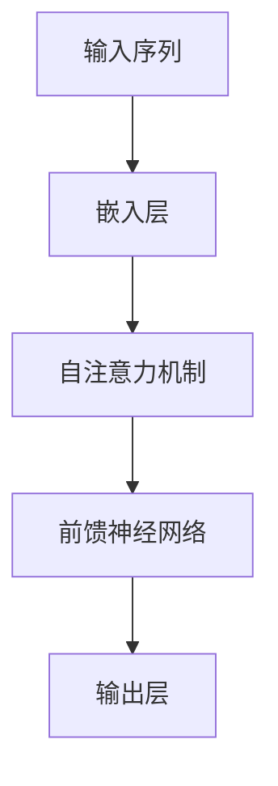
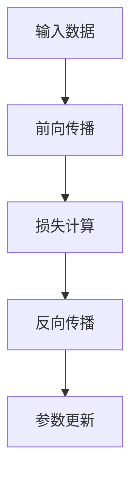

# 大语言模型原理与工程实践：ROOTS

## 1.背景介绍

大语言模型（Large Language Models, LLMs）是近年来人工智能领域的一个重要突破。它们通过大量的文本数据进行训练，能够生成高质量的自然语言文本，完成翻译、问答、文本生成等多种任务。大语言模型的代表作包括OpenAI的GPT系列、Google的BERT和Transformer等。

在这篇文章中，我们将深入探讨大语言模型的原理与工程实践，特别是以ROOTS为例，详细介绍其核心概念、算法原理、数学模型、项目实践、实际应用场景、工具和资源推荐，并展望其未来发展趋势与挑战。

## 2.核心概念与联系

### 2.1 大语言模型的定义

大语言模型是一种基于深度学习的自然语言处理模型，通过大量的文本数据进行训练，能够理解和生成自然语言。其核心在于使用神经网络，特别是Transformer架构，来捕捉语言中的复杂模式和结构。

### 2.2 Transformer架构

Transformer是大语言模型的基础架构，其核心组件包括自注意力机制（Self-Attention）和前馈神经网络（Feed-Forward Neural Network）。自注意力机制允许模型在处理每个词时关注输入序列中的其他词，从而捕捉长距离依赖关系。



### 2.3 预训练与微调

大语言模型的训练过程通常分为两个阶段：预训练和微调。预训练阶段，模型在大规模无监督数据上进行训练，学习语言的基本模式和结构。微调阶段，模型在特定任务的数据上进行有监督训练，以适应具体任务的需求。

## 3.核心算法原理具体操作步骤

### 3.1 数据预处理

数据预处理是大语言模型训练的第一步，包括文本清洗、分词、去停用词等步骤。目的是将原始文本数据转换为模型可以处理的格式。

### 3.2 模型初始化

模型初始化是指设置模型的初始参数。常见的方法包括随机初始化和使用预训练模型的参数。初始化的好坏直接影响模型的收敛速度和最终性能。

### 3.3 训练过程

训练过程包括前向传播、损失计算和反向传播。前向传播是指将输入数据通过模型计算输出，损失计算是指计算模型输出与真实标签之间的差异，反向传播是指通过梯度下降算法更新模型参数。



### 3.4 模型评估

模型评估是指在验证集上评估模型的性能，常用的评估指标包括准确率、精确率、召回率、F1值等。评估结果用于指导模型的优化和调整。

## 4.数学模型和公式详细讲解举例说明

### 4.1 自注意力机制

自注意力机制是Transformer的核心，其计算公式如下：

$$
\text{Attention}(Q, K, V) = \text{softmax}\left(\frac{QK^T}{\sqrt{d_k}}\right)V
$$

其中，$Q$、$K$、$V$分别表示查询矩阵、键矩阵和值矩阵，$d_k$表示键矩阵的维度。

### 4.2 损失函数

大语言模型常用的损失函数是交叉熵损失，其计算公式如下：

$$
\text{Loss} = -\sum_{i=1}^{N} y_i \log(\hat{y}_i)
$$

其中，$y_i$表示真实标签，$\hat{y}_i$表示模型预测的概率。

### 4.3 梯度下降

梯度下降是优化模型参数的常用方法，其更新公式如下：

$$
\theta = \theta - \eta \nabla_\theta J(\theta)
$$

其中，$\theta$表示模型参数，$\eta$表示学习率，$J(\theta)$表示损失函数。

## 5.项目实践：代码实例和详细解释说明

### 5.1 数据预处理

```python
import re
import nltk
from nltk.corpus import stopwords

# 下载停用词
nltk.download('stopwords')

def preprocess_text(text):
    # 转换为小写
    text = text.lower()
    # 去除标点符号
    text = re.sub(r'[^\w\s]', '', text)
    # 分词
    words = text.split()
    # 去除停用词
    words = [word for word in words if word not in stopwords.words('english')]
    return ' '.join(words)

sample_text = "This is a sample text for preprocessing."
processed_text = preprocess_text(sample_text)
print(processed_text)
```

### 5.2 模型训练

```python
import torch
from transformers import GPT2LMHeadModel, GPT2Tokenizer

# 加载预训练模型和分词器
model_name = 'gpt2'
model = GPT2LMHeadModel.from_pretrained(model_name)
tokenizer = GPT2Tokenizer.from_pretrained(model_name)

# 定义训练数据
train_texts = ["Hello, how are you?", "I am fine, thank you!"]
train_encodings = tokenizer(train_texts, return_tensors='pt', padding=True, truncation=True)

# 定义优化器
optimizer = torch.optim.AdamW(model.parameters(), lr=5e-5)

# 训练模型
model.train()
for epoch in range(3):
    optimizer.zero_grad()
    outputs = model(**train_encodings, labels=train_encodings['input_ids'])
    loss = outputs.loss
    loss.backward()
    optimizer.step()
    print(f"Epoch {epoch+1}, Loss: {loss.item()}")
```

### 5.3 模型评估

```python
from sklearn.metrics import accuracy_score

# 定义验证数据
val_texts = ["Hello, how are you?", "I am fine, thank you!"]
val_labels = [0, 1]  # 假设0表示问句，1表示答句
val_encodings = tokenizer(val_texts, return_tensors='pt', padding=True, truncation=True)

# 评估模型
model.eval()
with torch.no_grad():
    outputs = model(**val_encodings)
    predictions = torch.argmax(outputs.logits, dim=-1)
    accuracy = accuracy_score(val_labels, predictions)
    print(f"Validation Accuracy: {accuracy}")
```

## 6.实际应用场景

### 6.1 机器翻译

大语言模型在机器翻译中表现出色，能够实现高质量的多语言翻译。通过预训练和微调，大语言模型可以在不同语言之间进行无缝转换。

### 6.2 问答系统

大语言模型在问答系统中也有广泛应用。通过训练模型理解问题并生成答案，可以实现智能客服、在线教育等场景的自动化问答。

### 6.3 文本生成

大语言模型在文本生成方面表现出色，可以用于生成新闻报道、小说、诗歌等多种类型的文本。其生成的文本质量高，具有较强的连贯性和逻辑性。

## 7.工具和资源推荐

### 7.1 工具

- **Transformers库**：由Hugging Face提供的开源库，支持多种大语言模型的训练和推理。
- **TensorFlow**：谷歌开发的开源深度学习框架，支持大规模分布式训练。
- **PyTorch**：Facebook开发的开源深度学习框架，具有灵活性和易用性。

### 7.2 资源

- **OpenAI GPT-3**：提供API接口，可以方便地进行文本生成、翻译等任务。
- **Google BERT**：提供预训练模型和代码，可以用于多种自然语言处理任务。
- **Hugging Face Model Hub**：提供多种预训练模型和数据集，方便进行模型训练和评估。

## 8.总结：未来发展趋势与挑战

大语言模型在自然语言处理领域取得了显著的进展，但仍面临一些挑战。未来的发展趋势包括：

- **模型规模和计算资源**：随着模型规模的不断增大，训练和推理所需的计算资源也在增加。如何高效地利用计算资源是一个重要的研究方向。
- **模型解释性**：大语言模型的黑箱特性使得其决策过程难以解释。提高模型的可解释性是未来的重要研究方向。
- **伦理和隐私问题**：大语言模型在生成文本时可能会产生偏见和不当内容。如何确保模型的公平性和隐私保护是一个重要的挑战。

## 9.附录：常见问题与解答

### 9.1 大语言模型的训练需要多长时间？

大语言模型的训练时间取决于模型的规模和计算资源。一般来说，训练一个大型模型可能需要数周甚至数月的时间。

### 9.2 如何选择合适的预训练模型？

选择预训练模型时，可以根据具体任务的需求和数据集的特点进行选择。常见的预训练模型包括GPT、BERT、Transformer等。

### 9.3 如何提高模型的性能？

提高模型性能的方法包括增加训练数据、优化模型架构、调整超参数等。此外，使用迁移学习和微调技术也可以显著提高模型的性能。

### 9.4 大语言模型的应用场景有哪些？

大语言模型的应用场景包括机器翻译、问答系统、文本生成、情感分析等。其广泛的应用前景使其成为自然语言处理领域的重要工具。

### 9.5 如何解决大语言模型的伦理问题？

解决大语言模型的伦理问题需要多方面的努力，包括数据集的公平性、模型的透明性和可解释性、以及对生成内容的监控和过滤。

---

作者：禅与计算机程序设计艺术 / Zen and the Art of Computer Programming