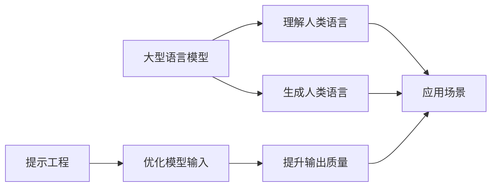

## 1. 背景介绍

随着人工智能技术的飞速发展，大型语言模型（Large Language Models，LLMs）已经成为了自然语言处理（Natural Language Processing，NLP）领域的一个热点。这些模型通过在海量文本数据上进行训练，能够理解和生成人类语言，广泛应用于机器翻译、文本摘要、问答系统等任务。提示工程（Prompt Engineering）作为一种新兴的技术，它通过精心设计输入给模型的提示（prompts），能够有效地引导模型输出更加准确和相关的信息。

## 2. 核心概念与联系

### 2.1 大型语言模型（LLMs）
大型语言模型是基于深度学习的模型，通常使用变换器（Transformer）架构，能够处理长距离依赖和复杂的语言结构。

### 2.2 提示工程（Prompt Engineering）
提示工程是一种技术，它通过设计模型的输入提示来改善模型的输出。这些提示可以是问题、陈述或者是一段对话。

### 2.3 关系图


## 3. 核心算法原理具体操作步骤

### 3.1 模型训练
1. 数据预处理：清洗和标准化文本数据。
2. 选择模型架构：通常是基于Transformer的架构。
3. 参数初始化：随机初始化或使用预训练模型的参数。
4. 训练过程：使用大量文本数据进行训练，优化模型参数。

### 3.2 提示设计
1. 确定任务目标：明确模型需要完成的任务。
2. 设计提示模板：根据任务目标设计输入提示。
3. 微调提示：通过实验测试和优化提示的效果。

## 4. 数学模型和公式详细讲解举例说明

### 4.1 Transformer模型
Transformer模型的核心是自注意力机制（Self-Attention），其数学表达为：
$$
\text{Attention}(Q, K, V) = \text{softmax}\left(\frac{QK^T}{\sqrt{d_k}}\right)V
$$
其中，$Q$、$K$、$V$分别是查询（Query）、键（Key）、值（Value）矩阵，$d_k$是键的维度。

### 4.2 提示效果评估
提示的效果可以通过交叉熵损失函数（Cross-Entropy Loss）来评估：
$$
L = -\sum_{i=1}^{N} y_i \log(p_i)
$$
其中，$y_i$是真实标签，$p_i$是模型预测的概率。

## 5. 项目实践：代码实例和详细解释说明

### 5.1 模型训练代码示例
```python
import torch
from transformers import BertTokenizer, BertForMaskedLM

# 初始化分词器和模型
tokenizer = BertTokenizer.from_pretrained('bert-base-uncased')
model = BertForMaskedLM.from_pretrained('bert-base-uncased')

# 准备数据
inputs = tokenizer("The capital of France is [MASK].", return_tensors="pt")
labels = tokenizer("The capital of France is Paris.", return_tensors="pt")["input_ids"]

# 训练模型
outputs = model(**inputs, labels=labels)
loss = outputs.loss
loss.backward()
```

### 5.2 提示设计代码示例
```python
prompt = "The capital of France is [MASK]."
response = model.generate(prompt)
print(tokenizer.decode(response))
```

## 6. 实际应用场景

大型语言模型和提示工程在多个领域都有广泛应用，例如：
- 机器翻译：使用提示来指导模型进行特定语言的翻译。
- 文本摘要：设计提示来帮助模型提取关键信息。
- 智能对话：通过提示引导模型进行更自然的对话。

## 7. 工具和资源推荐

- Transformers库：提供了多种预训练的大型语言模型。
- GPT-3 Playground：可以在线尝试不同的提示和模型。
- Papers With Code：提供了最新的研究论文和代码实现。

## 8. 总结：未来发展趋势与挑战

大型语言模型和提示工程的结合将继续推动NLP领域的发展。未来的趋势可能包括更加智能的提示自动生成、多模态模型的发展以及对模型偏见和伦理问题的关注。

## 9. 附录：常见问题与解答

Q1: 提示工程的效果如何评估？
A1: 可以通过任务特定的评估指标，如准确率、BLEU分数等来评估。

Q2: 如何设计有效的提示？
A2: 需要结合任务目标和模型特性，通过实验来不断优化。

作者：禅与计算机程序设计艺术 / Zen and the Art of Computer Programming