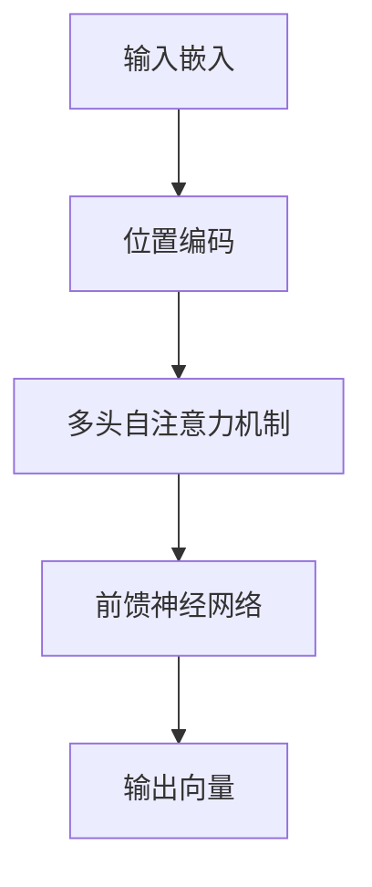

# 大语言模型原理与工程实践：语言模型的发展

## 1.背景介绍

### 1.1 语言模型的起源与发展

语言模型（Language Model, LM）是自然语言处理（NLP）领域的核心技术之一。其主要任务是通过统计和机器学习方法，预测一个句子中下一个词的概率。早期的语言模型主要基于统计方法，如n-gram模型。随着计算能力和数据量的增加，深度学习方法逐渐成为主流，特别是基于神经网络的语言模型，如RNN、LSTM和Transformer。

### 1.2 大语言模型的崛起

近年来，大语言模型（Large Language Models, LLMs）如GPT-3、BERT等，凭借其强大的生成和理解能力，迅速成为NLP领域的研究热点。这些模型通过大规模的预训练和微调，能够在多种任务中表现出色，如文本生成、翻译、问答等。

### 1.3 研究动机与目标

本文旨在深入探讨大语言模型的原理与工程实践，帮助读者理解其核心概念、算法原理、数学模型，并通过实际项目实践，展示其在不同应用场景中的价值。

## 2.核心概念与联系

### 2.1 语言模型的基本概念

语言模型的基本任务是计算一个句子中词序列的概率。对于一个给定的词序列 $w_1, w_2, ..., w_n$，语言模型的目标是计算 $P(w_1, w_2, ..., w_n)$。这可以通过链式法则分解为：

$$
P(w_1, w_2, ..., w_n) = P(w_1) \cdot P(w_2|w_1) \cdot P(w_3|w_1, w_2) \cdot ... \cdot P(w_n|w_1, w_2, ..., w_{n-1})
$$

### 2.2 大语言模型的特点

大语言模型通常具有以下几个特点：

1. **大规模数据预训练**：使用海量的文本数据进行预训练，捕捉语言的丰富语义和语法信息。
2. **深度神经网络架构**：采用深度神经网络，如Transformer，能够更好地捕捉长距离依赖关系。
3. **多任务学习**：通过多任务学习，提升模型在不同任务上的泛化能力。

### 2.3 语言模型与其他NLP任务的联系

语言模型是许多NLP任务的基础，如机器翻译、文本生成、情感分析等。通过预训练语言模型，可以为这些任务提供强大的特征表示，从而提升模型性能。

## 3.核心算法原理具体操作步骤

### 3.1 预训练与微调

大语言模型的训练通常分为两个阶段：预训练和微调。

1. **预训练**：在大规模无标签文本数据上进行自监督学习，学习词与词之间的关系。常见的方法有掩码语言模型（Masked Language Model, MLM）和自回归语言模型（Autoregressive Language Model, ARLM）。
2. **微调**：在特定任务的数据集上进行有监督学习，调整模型参数以适应特定任务。

### 3.2 Transformer架构

Transformer是当前大语言模型的主流架构，其核心组件包括多头自注意力机制和前馈神经网络。其主要步骤如下：

1. **输入嵌入**：将输入词序列转换为词向量。
2. **位置编码**：加入位置编码，捕捉词序列中的位置信息。
3. **多头自注意力机制**：计算词与词之间的相关性，生成上下文向量。
4. **前馈神经网络**：对上下文向量进行非线性变换，生成输出向量。

以下是Transformer的Mermaid流程图：



### 3.3 训练过程中的优化技术

1. **学习率调度**：采用动态学习率调度策略，如Warmup和Cosine Annealing，提升训练效果。
2. **正则化技术**：使用Dropout、Layer Normalization等正则化技术，防止过拟合。
3. **混合精度训练**：采用混合精度训练，提升训练速度和内存利用率。

## 4.数学模型和公式详细讲解举例说明

### 4.1 自注意力机制

自注意力机制是Transformer的核心，其计算公式如下：

$$
\text{Attention}(Q, K, V) = \text{softmax}\left(\frac{QK^T}{\sqrt{d_k}}\right)V
$$

其中，$Q$、$K$、$V$分别表示查询矩阵、键矩阵和值矩阵，$d_k$表示键向量的维度。

### 4.2 多头自注意力机制

多头自注意力机制通过并行计算多个自注意力，提升模型的表达能力。其计算公式如下：

$$
\text{MultiHead}(Q, K, V) = \text{Concat}(\text{head}_1, \text{head}_2, ..., \text{head}_h)W^O
$$

其中，$\text{head}_i = \text{Attention}(QW_i^Q, KW_i^K, VW_i^V)$，$W_i^Q$、$W_i^K$、$W_i^V$和$W^O$为可训练参数矩阵。

### 4.3 前馈神经网络

前馈神经网络由两个线性变换和一个激活函数组成，其计算公式如下：

$$
\text{FFN}(x) = \text{max}(0, xW_1 + b_1)W_2 + b_2
$$

其中，$W_1$、$W_2$、$b_1$和$b_2$为可训练参数。

## 5.项目实践：代码实例和详细解释说明

### 5.1 环境准备

首先，确保安装了必要的Python库，如TensorFlow或PyTorch。

```bash
pip install tensorflow
pip install transformers
```

### 5.2 数据预处理

使用Hugging Face的Transformers库加载预训练模型和数据集。

```python
from transformers import BertTokenizer, TFBertModel

tokenizer = BertTokenizer.from_pretrained('bert-base-uncased')
model = TFBertModel.from_pretrained('bert-base-uncased')

text = "Hello, how are you?"
inputs = tokenizer(text, return_tensors='tf')
outputs = model(inputs)
```

### 5.3 模型训练

定义自定义任务的模型，并进行微调。

```python
import tensorflow as tf
from transformers import TFBertForSequenceClassification

model = TFBertForSequenceClassification.from_pretrained('bert-base-uncased', num_labels=2)

optimizer = tf.keras.optimizers.Adam(learning_rate=3e-5)
model.compile(optimizer=optimizer, loss=model.compute_loss, metrics=['accuracy'])

# 假设已经准备好了训练数据集train_dataset
model.fit(train_dataset, epochs=3)
```

### 5.4 模型评估

在测试集上评估模型性能。

```python
# 假设已经准备好了测试数据集test_dataset
loss, accuracy = model.evaluate(test_dataset)
print(f"Loss: {loss}, Accuracy: {accuracy}")
```

## 6.实际应用场景

### 6.1 文本生成

大语言模型在文本生成任务中表现出色，如自动写作、对话系统等。通过预训练模型，可以生成连贯且富有创意的文本。

### 6.2 机器翻译

大语言模型在机器翻译任务中也取得了显著进展。通过大规模的平行语料训练，模型能够在多种语言之间进行高质量的翻译。

### 6.3 情感分析

在情感分析任务中，大语言模型能够捕捉文本中的情感信息，帮助企业进行舆情监控和用户反馈分析。

### 6.4 问答系统

大语言模型在问答系统中表现优异，能够理解用户的问题并生成准确的答案，广泛应用于智能客服和搜索引擎。

## 7.工具和资源推荐

### 7.1 开源库

1. **Hugging Face Transformers**：提供了丰富的预训练模型和工具，方便进行大语言模型的训练和应用。
2. **TensorFlow**：广泛使用的深度学习框架，支持大规模模型的训练和部署。
3. **PyTorch**：灵活且易用的深度学习框架，适合研究和开发。

### 7.2 数据集

1. **OpenAI GPT-3**：提供了大规模的预训练模型和API，方便进行文本生成和理解任务。
2. **Google BERT**：提供了多种预训练模型，适用于多种NLP任务。
3. **GLUE Benchmark**：广泛使用的NLP任务评估基准，包含多种任务的数据集。

### 7.3 在线资源

1. **arXiv**：提供了大量最新的研究论文，帮助了解大语言模型的前沿进展。
2. **GitHub**：丰富的开源项目和代码示例，方便学习和实践。

## 8.总结：未来发展趋势与挑战

### 8.1 未来发展趋势

1. **模型规模继续扩大**：随着计算能力的提升，未来的大语言模型将继续扩大规模，捕捉更丰富的语言信息。
2. **多模态学习**：结合图像、音频等多模态数据，提升模型的综合理解能力。
3. **自监督学习**：探索更高效的自监督学习方法，减少对大规模标注数据的依赖。

### 8.2 面临的挑战

1. **计算资源需求**：大语言模型的训练和推理需要大量的计算资源，如何提升效率是一个重要挑战。
2. **模型解释性**：大语言模型的黑箱特性使得其决策过程难以解释，影响其在关键领域的应用。
3. **伦理与安全**：大语言模型在生成内容时可能存在偏见和不当信息，如何确保其伦理和安全性是一个重要问题。

## 9.附录：常见问题与解答

### 9.1 大语言模型的训练需要多长时间？

训练大语言模型的时间取决于模型规模、数据量和计算资源。通常需要数周甚至数月的时间。

### 9.2 如何选择合适的预训练模型？

选择预训练模型时，应考虑任务需求、数据集规模和计算资源。常见的预训练模型有BERT、GPT-3、T5等。

### 9.3 如何提升大语言模型的性能？

可以通过数据增强、模型蒸馏、混合精度训练等技术，提升大语言模型的性能。

### 9.4 大语言模型在实际应用中有哪些限制？

大语言模型在实际应用中可能面临计算资源需求高、模型解释性差、伦理与安全问题等限制。

### 9.5 如何应对大语言模型的伦理与安全问题？

可以通过数据清洗、偏见检测、内容审核等方法，确保大语言模型的伦理和安全性。

---

作者：禅与计算机程序设计艺术 / Zen and the Art of Computer Programming