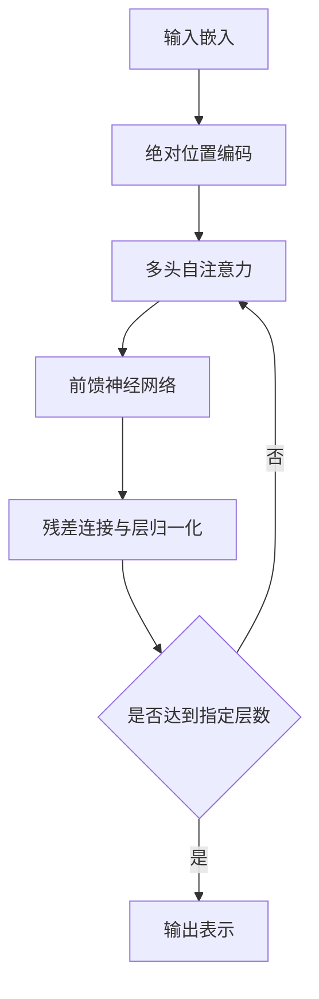

# 大语言模型原理基础与前沿 绝对位置编码

## 1.背景介绍
### 1.1 大语言模型的发展历程
#### 1.1.1 早期的语言模型
#### 1.1.2 神经网络语言模型的兴起
#### 1.1.3 Transformer的革命性突破

### 1.2 位置编码的重要性
#### 1.2.1 序列建模中的位置信息
#### 1.2.2 相对位置编码与绝对位置编码
#### 1.2.3 位置编码对模型性能的影响

## 2.核心概念与联系
### 2.1 自注意力机制
#### 2.1.1 Scaled Dot-Product Attention
#### 2.1.2 Multi-Head Attention
#### 2.1.3 自注意力与位置编码的关系

### 2.2 前馈神经网络
#### 2.2.1 前馈神经网络的结构
#### 2.2.2 残差连接与层归一化
#### 2.2.3 前馈神经网络在Transformer中的作用

### 2.3 绝对位置编码
#### 2.3.1 正弦余弦位置编码
#### 2.3.2 可学习的位置编码
#### 2.3.3 绝对位置编码的优缺点

## 3.核心算法原理具体操作步骤
### 3.1 Transformer的整体架构
#### 3.1.1 编码器与解码器
#### 3.1.2 自注意力与前馈神经网络的堆叠
#### 3.1.3 位置编码的加入方式

### 3.2 绝对位置编码的实现
#### 3.2.1 正弦余弦位置编码的生成
#### 3.2.2 可学习位置编码的初始化与更新
#### 3.2.3 位置编码与输入嵌入的融合

### 3.3 训练与推理过程
#### 3.3.1 预训练与微调
#### 3.3.2 自回归生成与非自回归生成
#### 3.3.3 推理时的位置编码处理

## 4.数学模型和公式详细讲解举例说明
### 4.1 自注意力的数学表示
#### 4.1.1 查询、键、值的计算
#### 4.1.2 注意力权重的计算与归一化
#### 4.1.3 注意力输出的计算

### 4.2 前馈神经网络的数学表示  
#### 4.2.1 线性变换与激活函数
#### 4.2.2 残差连接与层归一化的数学表示
#### 4.2.3 前馈神经网络的矩阵计算

### 4.3 绝对位置编码的数学表示
#### 4.3.1 正弦余弦位置编码的数学公式
#### 4.3.2 可学习位置编码的参数更新公式
#### 4.3.3 位置编码与输入嵌入的融合公式

## 5.项目实践：代码实例和详细解释说明
### 5.1 使用PyTorch实现Transformer
#### 5.1.1 定义Transformer模型类
#### 5.1.2 实现自注意力与前馈神经网络
#### 5.1.3 实现绝对位置编码

### 5.2 训练与评估
#### 5.2.1 数据准备与预处理
#### 5.2.2 定义损失函数与优化器
#### 5.2.3 训练循环与评估指标

### 5.3 生成任务的应用
#### 5.3.1 使用训练好的模型进行生成
#### 5.3.2 生成策略与解码方法
#### 5.3.3 生成结果的评估与分析

## 6.实际应用场景
### 6.1 机器翻译
#### 6.1.1 Transformer在机器翻译中的应用
#### 6.1.2 绝对位置编码在机器翻译中的效果
#### 6.1.3 机器翻译任务的评估指标

### 6.2 文本摘要
#### 6.2.1 Transformer用于文本摘要的改进
#### 6.2.2 绝对位置编码在文本摘要中的作用
#### 6.2.3 文本摘要任务的评估方法

### 6.3 对话系统
#### 6.3.1 Transformer在对话系统中的应用
#### 6.3.2 绝对位置编码在对话系统中的效果
#### 6.3.3 对话系统的评估与挑战

## 7.工具和资源推荐
### 7.1 开源实现
#### 7.1.1 Hugging Face Transformers库
#### 7.1.2 OpenNMT与Fairseq
#### 7.1.3 TensorFlow与PyTorch官方实现

### 7.2 预训练模型
#### 7.2.1 BERT与GPT系列模型
#### 7.2.2 T5与BART模型
#### 7.2.3 预训练模型的微调与应用

### 7.3 数据集与评估基准
#### 7.3.1 WMT机器翻译数据集
#### 7.3.2 CNN/Daily Mail文本摘要数据集
#### 7.3.3 常用评估基准与工具

## 8.总结：未来发展趋势与挑战
### 8.1 大语言模型的发展方向
#### 8.1.1 模型规模的扩大与效率提升
#### 8.1.2 知识增强与多模态融合
#### 8.1.3 可解释性与可控性

### 8.2 位置编码的改进与创新
#### 8.2.1 自适应位置编码
#### 8.2.2 结构化位置编码
#### 8.2.3 位置编码与注意力机制的结合

### 8.3 挑战与机遇
#### 8.3.1 计算资源与训练效率
#### 8.3.2 数据隐私与安全
#### 8.3.3 模型的泛化能力与鲁棒性

## 9.附录：常见问题与解答
### 9.1 Transformer为什么需要位置编码？
### 9.2 绝对位置编码与相对位置编码的区别？
### 9.3 位置编码对模型性能有多大影响？
### 9.4 如何选择合适的位置编码方式？
### 9.5 位置编码在其他序列建模任务中的应用？

大语言模型的发展历程可以追溯到早期的统计语言模型，如n-gram模型。随着深度学习的兴起，神经网络语言模型逐渐取代了传统的统计语言模型，并在各种自然语言处理任务中取得了显著的性能提升。2017年，Google提出的Transformer模型在机器翻译任务上取得了突破性的进展，标志着大语言模型时代的到来。

Transformer模型的核心是自注意力机制，它允许模型在处理当前词时考虑句子中的所有其他词，捕捉词与词之间的长距离依赖关系。然而，由于自注意力机制本身是位置不变的，因此需要引入位置编码来为模型提供序列中每个词的位置信息。绝对位置编码是最常用的位置编码方式之一，它通过将位置信息直接编码到输入嵌入中，使模型能够区分不同位置的词。

绝对位置编码主要有两种实现方式：正弦余弦位置编码和可学习的位置编码。正弦余弦位置编码使用不同频率的正弦和余弦函数来表示位置，而可学习的位置编码则将位置编码参数化为可学习的向量。在训练过程中，可学习的位置编码可以与其他模型参数一起更新，以更好地适应特定任务。

在Transformer模型中，绝对位置编码与输入嵌入相加，然后作为自注意力机制的输入。自注意力机制通过计算查询、键、值之间的注意力权重来捕捉词与词之间的依赖关系。接下来，自注意力的输出经过前馈神经网络、残差连接和层归一化等操作，最终得到每个位置的输出表示。这个过程在编码器和解码器中重复多次，形成了Transformer模型的基本结构。

绝对位置编码在大语言模型的训练和应用中发挥着关键作用。在机器翻译、文本摘要、对话系统等任务中，绝对位置编码能够帮助模型更好地理解和生成序列。随着大语言模型的不断发展，位置编码技术也在不断改进和创新。未来，自适应位置编码、结构化位置编码等新方法有望进一步提升模型性能，同时也面临着计算资源、数据隐私、模型泛化等方面的挑战。

作者：禅与计算机程序设计艺术 / Zen and the Art of Computer Programming