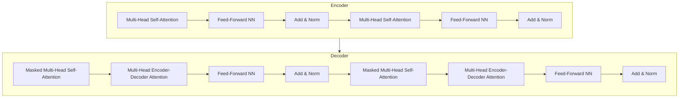
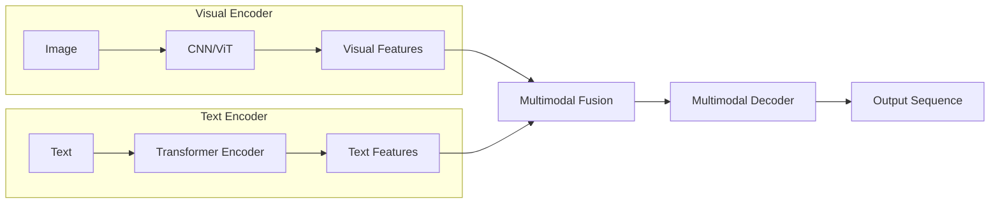

# 大语言模型原理基础与前沿 视觉增强语言建模

## 1.背景介绍

### 1.1 大语言模型的兴起

近年来,大型语言模型(Large Language Models, LLMs)在自然语言处理(NLP)领域取得了令人瞩目的进展。LLMs是指具有数十亿甚至上万亿参数的巨大神经网络模型,通过在大规模文本语料库上进行预训练,学习捕获丰富的语言知识和上下文信息。

代表性的LLMs包括GPT(Generative Pre-trained Transformer)系列、BERT(Bidirectional Encoder Representations from Transformers)、XLNet、RoBERTa等。这些模型展现出了强大的语言生成、理解和推理能力,在自然语言处理的诸多任务中取得了卓越的性能,如机器翻译、问答系统、文本摘要、情感分析等。

### 1.2 视觉增强语言建模的兴起

尽管LLMs在纯文本领域取得了巨大成功,但在涉及视觉信息的任务中,它们的性能往往受到限制。这促使研究人员开始探索将视觉和语言信息相结合的多模态模型,以期在视觉和语言理解任务中获得更好的性能。

视觉增强语言建模(Vision-augmented Language Modeling, VaLM)就是这一领域的重要探索方向之一。VaLM模型旨在同时利用视觉和文本信息,通过在图像-文本数据对上进行联合预训练,学习视觉和语言之间的关联性,从而提高在涉及视觉和语言的下游任务中的性能。

典型的VaLM模型包括ViLBERT、UNITER、OSCAR、VinVL等。这些模型在图像描述、视觉问答、图文推理等任务中展现出了优异的性能,推动了视觉和语言的多模态融合发展。

## 2.核心概念与联系

### 2.1 自注意力机制(Self-Attention)

自注意力机制是Transformer模型的核心组件,也是大语言模型和视觉增强语言模型的基础。自注意力机制允许模型捕捉输入序列中任意两个位置之间的关系,而不受位置的限制。这使得模型能够有效地建模长距离依赖关系,提高了对复杂语义的理解能力。

在自注意力机制中,每个输入位置都被映射为一个查询(Query)向量、一个键(Key)向量和一个值(Value)向量。然后,通过计算查询向量与所有键向量的相似性得分,生成一个注意力分布,用于对值向量进行加权求和,得到该位置的表示。这种机制使模型能够自适应地关注输入序列中的不同部分,捕捉全局信息。

### 2.2 Transformer编码器-解码器架构

Transformer编码器-解码器架构是大语言模型和视觉增强语言模型的典型架构。编码器用于编码输入序列(如文本或图像),生成上下文表示;解码器则利用编码器的输出,生成目标序列(如翻译、摘要或描述)。

在视觉增强语言模型中,编码器通常采用双流结构,分别编码图像和文本信息,并在特定层次将两种模态的表示进行交互。解码器则根据融合后的多模态表示,生成目标序列。这种架构使模型能够同时利用视觉和语言信息,提高了在多模态任务中的性能。

### 2.3 预训练与微调(Pre-training and Fine-tuning)

预训练和微调是大语言模型和视觉增强语言模型的核心范式。在预训练阶段,模型在大规模无监督数据(如网络文本语料、图像-文本对)上进行训练,学习通用的语言和视觉表示。在微调阶段,预训练模型被转移到特定的下游任务上,通过在有监督数据上进行进一步训练,使模型适应特定任务的需求。

预训练使模型能够捕捉丰富的语言和视觉知识,而微调则使模型能够针对特定任务进行优化,提高性能。这种预训练-微调范式已成为大语言模型和视觉增强语言模型的标准做法,显著提高了模型的泛化能力和性能。

## 3.核心算法原理具体操作步骤

### 3.1 Transformer模型架构

Transformer模型是大语言模型和视觉增强语言模型的核心架构,其主要由编码器(Encoder)和解码器(Decoder)两个部分组成。

#### 3.1.1 编码器(Encoder)

编码器的主要作用是将输入序列(如文本或图像)编码为上下文表示。它由多个相同的层组成,每层包含两个子层:多头自注意力机制(Multi-Head Self-Attention)和前馈神经网络(Feed-Forward Neural Network)。

1. **多头自注意力机制**:
   - 将输入序列映射为查询(Query)、键(Key)和值(Value)向量。
   - 计算查询向量与所有键向量的相似性得分(注意力分数)。
   - 使用注意力分数对值向量进行加权求和,得到该位置的表示。
   - 通过多头机制,从不同的子空间捕捉不同的注意力模式。

2. **前馈神经网络**:
   - 对自注意力层的输出进行进一步处理和非线性变换。
   - 通常由两个全连接层组成,中间使用ReLU激活函数。

编码器层通过残差连接(Residual Connection)和层归一化(Layer Normalization)来促进梯度流动和模型收敛。

#### 3.1.2 解码器(Decoder)

解码器的作用是根据编码器的输出和目标序列的前缀,生成目标序列(如翻译、摘要或描述)。它也由多个相同的层组成,每层包含三个子层:

1. **掩码多头自注意力机制**:
   - 与编码器的自注意力机制类似,但引入了掩码机制,防止每个位置关注到未来位置的信息。

2. **编码器-解码器注意力机制**:
   - 计算解码器输出与编码器输出之间的注意力,捕捉输入和输出序列之间的关系。

3. **前馈神经网络**:
   - 与编码器中的前馈神经网络相同,对注意力输出进行进一步处理和非线性变换。

解码器层也使用残差连接和层归一化来促进梯度流动和模型收敛。

### 3.2 视觉增强语言模型(VaLM)架构

视觉增强语言模型(VaLM)旨在同时利用视觉和语言信息,通过在图像-文本数据对上进行联合预训练,学习视觉和语言之间的关联性。典型的VaLM架构包括以下几个关键组件:

#### 3.2.1 视觉编码器(Visual Encoder)

视觉编码器用于编码输入图像,生成视觉特征表示。常用的视觉编码器包括:

- **CNN(卷积神经网络)**:如ResNet、Inception等,用于提取图像的低级视觉特征。
- **ViT(Vision Transformer)**:采用Transformer架构直接对图像进行编码,捕捉长距离依赖关系。

#### 3.2.2 文本编码器(Text Encoder)

文本编码器用于编码输入文本,生成语言特征表示。通常采用Transformer的编码器部分,对文本序列进行编码。

#### 3.2.3 多模态融合(Multimodal Fusion)

多模态融合模块用于将视觉和语言特征进行融合,生成统一的多模态表示。常见的融合方式包括:

- **特征级融合**:直接拼接或求和视觉和语言特征。
- **注意力融合**:使用跨模态注意力机制,捕捉视觉和语言特征之间的相关性。
- **交互融合**:在Transformer层中引入跨模态自注意力,实现视觉和语言特征的交互融合。

#### 3.2.4 多模态解码器(Multimodal Decoder)

多模态解码器基于融合后的多模态表示,生成目标序列(如图像描述、视觉问答等)。通常采用Transformer的解码器部分,结合掩码自注意力和跨模态注意力机制。

### 3.3 预训练与微调

预训练和微调是大语言模型和视觉增强语言模型的核心范式,具体操作步骤如下:

#### 3.3.1 预训练(Pre-training)

1. **数据准备**:收集大规模无监督数据,如网络文本语料、图像-文本对等。

2. **预训练任务设计**:设计预训练任务,如掩码语言模型(Masked Language Modeling)、图像-文本对契合(Image-Text Matching)等,用于学习通用的语言和视觉表示。

3. **模型初始化**:初始化模型参数,如采用随机初始化或预训练模型的参数。

4. **预训练过程**:
   - 对每个批次的数据,构建预训练任务的输入和目标。
   - 通过前向传播计算模型输出和损失函数。
   - 使用优化算法(如Adam)反向传播并更新模型参数。
   - 迭代训练,直至模型收敛或达到预设的训练步数。

5. **模型保存**:保存预训练模型的参数,用于后续的微调和推理。

#### 3.3.2 微调(Fine-tuning)

1. **数据准备**:收集特定任务的有监督数据,如图像描述数据集、视觉问答数据集等。

2. **任务设计**:设计特定任务的输入和输出格式,如将图像描述任务转化为序列到序列的生成任务。

3. **模型初始化**:加载预训练模型的参数,并根据需要进行适当的修改和初始化。

4. **微调过程**:
   - 对每个批次的数据,构建特定任务的输入和目标。
   - 通过前向传播计算模型输出和损失函数。
   - 使用优化算法(如Adam)反向传播并更新模型参数。
   - 迭代训练,直至模型在验证集上的性能不再提升或达到预设的训练步数。

5. **模型评估**:在测试集上评估微调后模型的性能,如准确率、BLEU分数等指标。

6. **模型部署**:将微调后的模型部署到实际应用中,用于推理和预测。

通过预训练和微调的组合,大语言模型和视觉增强语言模型能够在特定任务上获得优异的性能,同时保持了良好的泛化能力。

## 4.数学模型和公式详细讲解举例说明

### 4.1 自注意力机制(Self-Attention)

自注意力机制是Transformer模型的核心组件,它允许模型捕捉输入序列中任意两个位置之间的关系,而不受位置的限制。下面我们详细介绍自注意力机制的数学原理。

给定一个输入序列 $X = (x_1, x_2, \dots, x_n)$,其中 $x_i \in \mathbb{R}^{d_x}$ 表示第 $i$ 个位置的输入向量。自注意力机制的计算过程如下:

1. **线性投影**:将输入序列 $X$ 映射为查询(Query)、键(Key)和值(Value)向量:

$$
\begin{aligned}