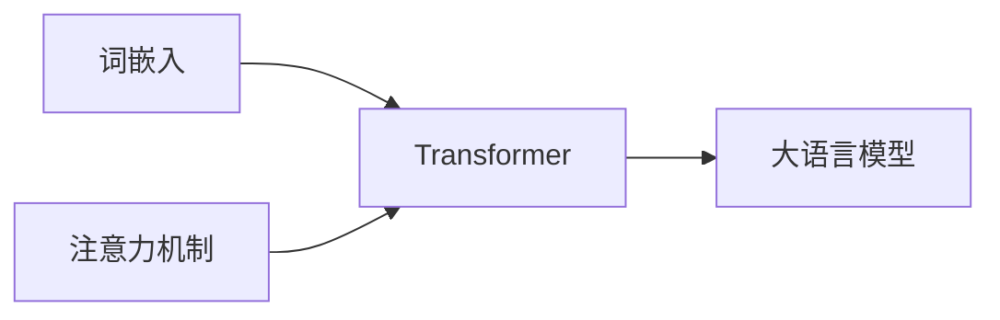

# 大语言模型应用指南：入门

## 1. 背景介绍
随着人工智能技术的飞速发展，大语言模型（Large Language Models，LLMs）已经成为了自然语言处理（NLP）领域的一个重要分支。这些模型通过在海量文本数据上进行训练，能够理解和生成人类语言，广泛应用于机器翻译、文本摘要、问答系统等多个场景。本文将深入探讨大语言模型的核心概念、算法原理、数学模型，并通过项目实践和实际应用场景，为读者提供一个全面的入门指南。

## 2. 核心概念与联系
大语言模型是基于深度学习的统计模型，它们通过学习大量文本数据来预测下一个词的概率。核心概念包括词嵌入（Word Embedding）、注意力机制（Attention Mechanism）、Transformer架构等。这些概念相互联系，共同构成了大语言模型的基础。



## 3. 核心算法原理具体操作步骤
大语言模型的核心算法原理是基于Transformer架构，其操作步骤包括输入编码、自注意力计算、层归一化、前馈神经网络和输出解码等。每一步都是模型理解和生成语言的关键。

## 4. 数学模型和公式详细讲解举例说明
大语言模型的数学基础是概率论和线性代数。例如，自注意力机制可以用以下公式表示：

$$
\text{Attention}(Q, K, V) = \text{softmax}\left(\frac{QK^T}{\sqrt{d_k}}\right)V
$$

其中，$Q$、$K$、$V$分别代表查询（Query）、键（Key）和值（Value），$d_k$是键的维度。通过这个公式，模型能够计算输入序列中各个词之间的关联度。

## 5. 项目实践：代码实例和详细解释说明
为了更好地理解大语言模型，我们将通过一个简单的文本生成项目来展示如何使用这些模型。以下是使用Python和TensorFlow实现的代码片段：

```python
import tensorflow as tf

# 定义模型参数
vocab_size = 10000  # 词汇表大小
embedding_dim = 256  # 词嵌入维度
num_heads = 8  # 注意力头数
dff = 1024  # 前馈网络维度

# 构建模型
model = tf.keras.Sequential([
    tf.keras.layers.Embedding(vocab_size, embedding_dim),
    tf.keras.layers.MultiHeadAttention(num_heads=num_heads, key_dim=embedding_dim),
    tf.keras.layers.Dense(dff, activation='relu'),
    tf.keras.layers.Dense(vocab_size)
])

# 模型编译
model.compile(optimizer='adam', loss=tf.keras.losses.SparseCategoricalCrossentropy(from_logits=True))
```

这段代码展示了如何构建一个简单的Transformer模型用于文本生成。

## 6. 实际应用场景
大语言模型在多个领域都有广泛应用，如聊天机器人、内容推荐、情感分析等。在医疗领域，它们可以帮助解读医学文献和辅助诊断；在金融领域，可以用于市场分析和风险评估。

## 7. 工具和资源推荐
对于初学者来说，可以使用如TensorFlow、PyTorch等深度学习框架来实践大语言模型。此外，Hugging Face提供了大量预训练模型和工具，非常适合快速开始项目实践。

## 8. 总结：未来发展趋势与挑战
大语言模型的未来发展趋势包括模型规模的进一步扩大、多模态模型的发展以及更高效的训练方法。同时，这些模型也面临着诸如偏见、隐私和伦理等挑战。

## 9. 附录：常见问题与解答
Q1: 大语言模型的训练成本高吗？
A1: 是的，训练大型模型需要大量的计算资源和时间，因此成本较高。

Q2: 如何评估大语言模型的性能？
A2: 通常通过困惑度（Perplexity）、BLEU分数等指标来评估模型的性能。

作者：禅与计算机程序设计艺术 / Zen and the Art of Computer Programming