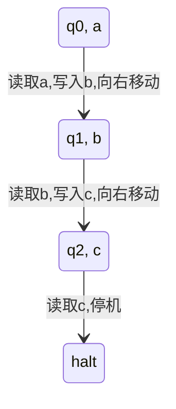
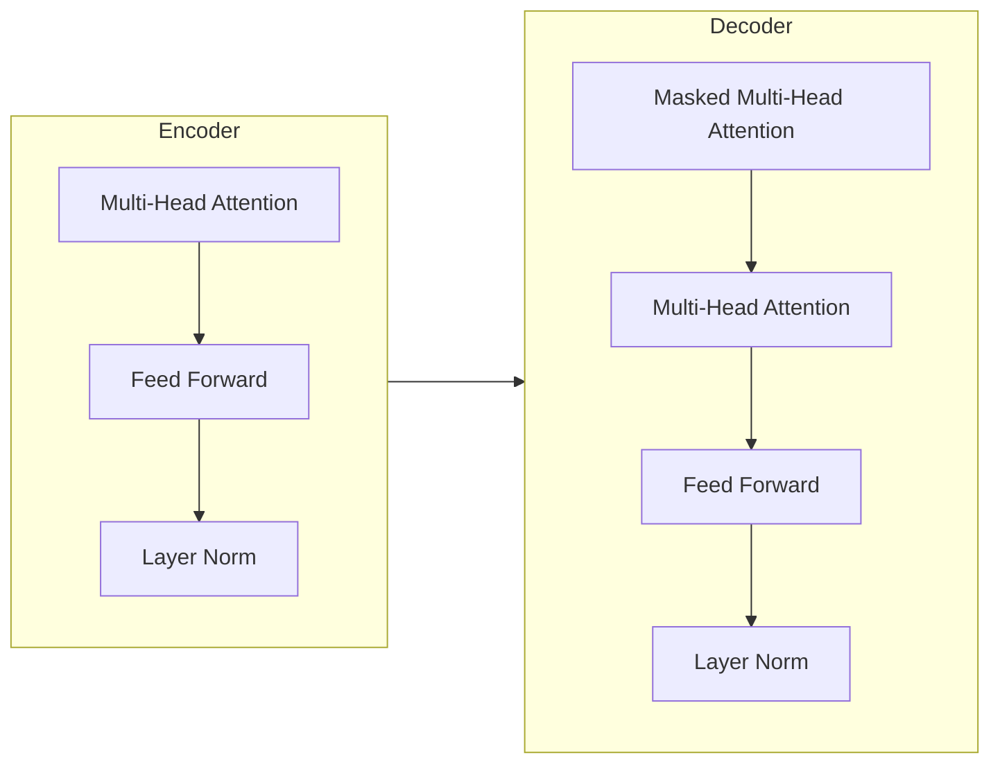

# 大语言模型应用指南：图灵机与大语言模型：可计算性与时间复杂度

## 1. 背景介绍

### 1.1 图灵机的诞生

在20世纪30年代，数学家阿兰·图灵(Alan Turing)提出了一种理论计算模型——图灵机(Turing Machine)。图灵机是一种抽象的计算机模型,旨在模拟人类计算过程,并研究计算的本质和极限。它由一个无限长的磁带、一个读写头和一组状态转移规则组成。

图灵机的工作原理是:读写头读取磁带上的符号,根据当前状态和读取的符号,按照状态转移规则执行相应的操作(写入、移动、改变状态等),直到达到停机状态或进入循环。

### 1.2 图灵机的意义

图灵机的提出,为计算理论奠定了坚实的基础。它不仅描述了一种理论计算模型,更重要的是阐明了"可计算性"(Computability)的概念。一个函数或问题是否可计算,取决于是否存在一个图灵机能够计算出它的值或解决它。

图灵证明了,存在一些函数或问题是不可计算的,即不存在任何图灵机能够计算或解决它们。这一结果被称为"图灵不可计算性定理"(Turing's Undecidability Theorem),它为计算理论划定了一个本质的界限。

### 1.3 大语言模型的兴起

进入21世纪以来,随着数据量的激增和计算能力的飞速提升,人工智能领域取得了长足的进展。尤其是自然语言处理(Natural Language Processing, NLP)技术的发展,催生了大语言模型(Large Language Model, LLM)的兴起。

大语言模型是一种基于深度学习的语言模型,通过在大规模语料库上进行预训练,学习自然语言的语义和语法知识。经过预训练后,大语言模型可以在下游任务上进行微调,展现出令人惊叹的自然语言理解和生成能力。

### 1.4 图灵机与大语言模型的关联

尽管图灵机和大语言模型分属不同时代,但它们之间存在着一些内在的联系。首先,图灵机描述了一种理论计算模型,而大语言模型则是一种实际的计算模型,两者都旨在模拟和实现某种计算过程。

其次,图灵机的状态转移规则类似于大语言模型中的参数更新规则,都是根据输入和当前状态,按照一定的规则进行转移或更新。

最后,图灵机的不可计算性定理为大语言模型的局限性提供了一个理论基础。尽管大语言模型展现出了强大的语言能力,但它们毕竟是有限的计算模型,必然存在无法计算或生成的语言或任务。

本文将探讨图灵机与大语言模型之间的关系,阐述它们在可计算性和时间复杂度方面的异同,为大语言模型的应用提供理论指导。

## 2. 核心概念与联系

### 2.1 图灵机的核心概念

#### 2.1.1 图灵机的形式化定义

图灵机是一个7元组 $M = (Q, \Gamma, b, \Sigma, \delta, q_0, F)$,其中:

- $Q$ 是一个有限的状态集合
- $\Gamma$ 是一个有限的磁带符号集合,其中 $b \in \Gamma$ 是磁带的空白符号
- $\Sigma \subseteq \Gamma - \{b\}$ 是输入符号集合
- $\delta: Q \times \Gamma \rightarrow Q \times \Gamma \times \{L, R\}$ 是状态转移函数
- $q_0 \in Q$ 是初始状态
- $F \subseteq Q$ 是终止状态集合

#### 2.1.2 图灵机的工作过程

图灵机的工作过程可以用状态转移图来描述:



上图描述了一个简单的图灵机,它从初始状态 $q_0$ 开始,读取磁带上的符号 $a$,写入 $b$,并向右移动到状态 $q_1$。接下来,它读取 $b$,写入 $c$,并向右移动到状态 $q_2$。最后,它读取 $c$,进入停机状态。

#### 2.1.3 图灵机的计算能力

图灵机的计算能力可以用"可计算函数"(Computable Function)来描述。一个函数 $f: \Sigma^* \rightarrow \Gamma^*$ 是可计算的,当且仅当存在一个图灵机 $M$,对于任意输入 $x \in \Sigma^*$,都能计算出 $f(x)$。

图灵证明了,存在一些函数是不可计算的,即不存在任何图灵机能够计算出它们的值。这些函数包括著名的"停机问题"(Halting Problem)和"对角线函数"(Diagonalization Function)等。

### 2.2 大语言模型的核心概念

#### 2.2.1 自然语言的表示

在大语言模型中,自然语言通常被表示为一系列的Token序列。Token可以是单词、子词或字符等最小语义单元。例如,一个句子"I love natural language processing"可以被表示为:

```
[I, love, natural, language, processing]
```

每个Token都会被映射为一个唯一的数值ID,构成模型的输入向量。

#### 2.2.2 自注意力机制

自注意力机制(Self-Attention)是大语言模型的核心组件之一。它允许模型捕捉输入序列中任意两个位置之间的关系,从而更好地建模长距离依赖关系。

自注意力机制的计算过程如下:

$$
\begin{aligned}
\text{Attention}(Q, K, V) &= \text{softmax}(\frac{QK^T}{\sqrt{d_k}})V \\
\text{MultiHead}(Q, K, V) &= \text{Concat}(\text{head}_1, \ldots, \text{head}_h)W^O\\
\text{where}\  \text{head}_i &= \text{Attention}(QW_i^Q, KW_i^K, VW_i^V)
\end{aligned}
$$

其中 $Q$、$K$、$V$ 分别表示查询(Query)、键(Key)和值(Value)。通过计算查询和键之间的相似性,并与值相结合,模型可以关注到与当前位置相关的其他位置的信息。

#### 2.2.3 transformer架构

Transformer是一种基于自注意力机制的序列到序列(Seq2Seq)模型架构,广泛应用于机器翻译、文本生成等任务。它主要由编码器(Encoder)和解码器(Decoder)两部分组成。

编码器将输入序列编码为一系列向量表示,解码器则根据编码器的输出和前一步的输出,生成下一个Token。两者之间通过自注意力机制建立联系,实现端到端的序列转换。



上图展示了Transformer的基本架构。编码器由多头自注意力层、前馈网络层和层归一化层组成,解码器在此基础上增加了掩码多头自注意力层,用于防止attending到未来的位置。

### 2.3 图灵机与大语言模型的联系

虽然图灵机和大语言模型在形式上存在差异,但它们之间仍然存在一些内在的联系:

1. **计算模型**: 它们都是一种计算模型,旨在模拟和实现某种计算过程。图灵机模拟人类的计算过程,而大语言模型则模拟自然语言的生成和理解过程。

2. **状态转移**: 图灵机的状态转移规则类似于大语言模型中的参数更新规则,都是根据输入和当前状态,按照一定的规则进行转移或更新。

3. **可计算性**: 图灵机的不可计算性定理为大语言模型的局限性提供了一个理论基础。尽管大语言模型展现出了强大的语言能力,但它们毕竟是有限的计算模型,必然存在无法计算或生成的语言或任务。

4. **复杂度分析**: 对于图灵机和大语言模型,我们都需要分析它们的时间和空间复杂度,以评估它们的计算效率和资源消耗。

5. **形式化描述**: 图灵机和大语言模型都可以用数学语言进行形式化描述,从而更精确地定义它们的计算过程和能力。

总的来说,尽管图灵机和大语言模型分属不同领域,但它们之间存在着一些内在的联系,探讨它们之间的关系有助于我们更好地理解和应用大语言模型。

## 3. 核心算法原理具体操作步骤

### 3.1 图灵机的工作原理

图灵机的工作原理可以概括为以下几个步骤:

1. **初始化**: 给定一个输入字符串 $x \in \Sigma^*$,将其写在图灵机的磁带上,读写头指向第一个字符。同时,图灵机处于初始状态 $q_0$。

2. **读取**: 读写头读取当前位置的磁带符号。

3. **转移**: 根据当前状态 $q$ 和读取的磁带符号 $a$,通过状态转移函数 $\delta(q, a)$ 确定下一步的操作,包括写入一个新的磁带符号、移动读写头的方向(左或右)以及转移到新的状态。

4. **执行**: 执行状态转移函数给出的操作。

5. **重复**: 重复步骤2-4,直到进入终止状态 $q_f \in F$ 或进入循环。

6. **输出**: 如果进入终止状态,则图灵机的计算结束,磁带上的字符串即为输出结果。如果进入循环,则图灵机不会终止。

以下是一个具体的图灵机工作示例:


假设输入字符串为 $x = aab$,初始状态为 $q_0$,终止状态为 $\{q_2\}$。图灵机的工作过程如下:

1. 初始化: 将 $aab$ 写在磁带上,读写头指向第一个字符 $a$,当前状态为 $q_0$。
2. 读取 $a$,根据 $\delta(q_0, a)$,写入 $b$,向右移动,转移到状态 $q_1$。
3. 读取 $a$,根据 $\delta(q_1, a)$,写入 $b$,向右移动,转移到状态 $q_2$。
4. 读取 $b$,根据 $\delta(q_2, b)$,写入 $c$,向右移动,转移到状态 $q_2$。
5. 读取磁带末尾的空白符号,进入终止状态 $q_2$。
6. 输出: 磁带上的字符串为 $bbc$。

### 3.2 大语言模型的训练过程

大语言模型的训练过程通常分为两个阶段:预训练(Pre-training)和微调(Fine-tuning)。

#### 3.2.1 预训练

预训练阶段的目标是在大规模语料库上学习通用的语言知识,包括词汇、语法和语义等方面的知识。常见的预训练目标包括:

- **掩码语言模型(Masked Language Modeling, MLM)**: 随机掩码输入序列中的一些Token,模型需要预测被掩码的Token。