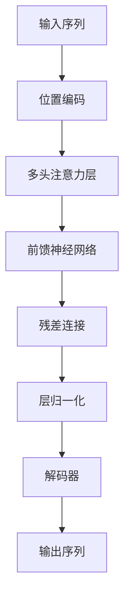

# 大语言模型应用指南：达特茅斯会议

## 1. 背景介绍

### 1.1 大语言模型的兴起

近年来,大型语言模型(Large Language Models, LLMs)在自然语言处理领域掀起了一场革命。这些模型通过在海量文本数据上进行预训练,学习了丰富的语言知识和上下文关联性,展现出令人惊叹的生成能力。

代表性的大语言模型包括 GPT-3、BERT、XLNet、ALBERT 等,它们在机器翻译、文本摘要、问答系统、内容生成等多个领域取得了突破性的进展。其中,OpenAI 推出的 GPT-3 因其惊人的 1750 亿参数规模和强大的生成能力而备受瞩目。

### 1.2 达特茅斯会议的重要性

1956 年,人工智能的概念在达特茅斯会议上首次被正式提出。这场会议被视为人工智能领域的里程碑事件,为未来几十年的研究奠定了基础。如今,大语言模型的突破性进展再次将人工智能推向了一个新的里程碑。

为了探讨大语言模型的现状、挑战和未来发展方向,一场新的"达特茅斯会议"将于 2024 年 6 月在美国新罕布什尔州的达特茅斯学院召开。这场会议将汇聚来自世界各地的顶尖学者、研究人员和行业领袖,共同探讨大语言模型的应用指南。

## 2. 核心概念与联系

### 2.1 大语言模型的核心概念

大语言模型是一种基于深度学习的自然语言处理模型,旨在从大规模语料库中学习语言的统计规律和上下文关联性。它们通过自监督学习的方式,在海量文本数据上进行预训练,获取丰富的语言知识和上下文理解能力。

核心概念包括:

1. **自监督学习**: 无需人工标注的大规模预训练,通过掩码语言模型(Masked Language Modeling)和下一句预测(Next Sentence Prediction)等任务,学习语言的统计规律和上下文关联性。

2. **注意力机制(Attention Mechanism)**: 允许模型在处理序列数据时,动态地关注输入的不同部分,捕捉长距离依赖关系。

3. **变压器架构(Transformer Architecture)**: 基于注意力机制的全新神经网络架构,有效解决了传统序列模型的长距离依赖问题。

4. **参数规模**: 大语言模型通常拥有数十亿甚至上千亿个参数,以捕获更丰富的语言知识。

5. **迁移学习(Transfer Learning)**: 通过微调(Fine-tuning)等方法,将预训练模型迁移到下游任务,实现快速适应和高效学习。

### 2.2 大语言模型与其他技术的联系

大语言模型与多个领域和技术紧密相关,包括:

1. **机器学习**: 大语言模型是基于深度学习和自监督学习等机器学习技术发展而来。

2. **自然语言处理(NLP)**: 大语言模型是 NLP 领域的核心技术,推动了机器翻译、文本生成、问答系统等应用的进步。

3. **知识图谱**: 大语言模型可以与知识图谱相结合,提高语义理解和推理能力。

4. **多模态学习**: 大语言模型可以与计算机视觉、语音识别等技术相结合,实现多模态学习和交互。

5. **人工智能伦理**: 大语言模型的发展也带来了隐私、偏见、安全等伦理问题,需要与相关领域密切合作。

## 3. 核心算法原理具体操作步骤

大语言模型的核心算法原理主要包括以下几个方面:

### 3.1 自监督学习

自监督学习是大语言模型预训练的关键技术。主要步骤如下:

1. **数据预处理**: 从互联网、书籍、维基百科等来源收集大量文本语料,进行清洗、标记化等预处理。

2. **掩码语言模型(Masked Language Modeling, MLM)**: 随机掩码部分词元(Token),模型需要根据上下文预测被掩码的词元。

3. **下一句预测(Next Sentence Prediction, NSP)**: 给定两个句子,模型需要判断第二个句子是否为第一个句子的下一句。

4. **预训练**: 使用 MLM 和 NSP 等任务,在海量语料库上进行自监督预训练,学习语言的统计规律和上下文关联性。

5. **模型更新**: 根据预测结果和真实标签,使用梯度下降等优化算法更新模型参数。

### 3.2 注意力机制

注意力机制是大语言模型的核心技术之一,它允许模型动态地关注输入序列的不同部分,捕捉长距离依赖关系。具体操作步骤如下:

1. **查询(Query)、键(Key)、值(Value)**: 将输入序列分别映射到查询、键和值的向量空间。

2. **相似度计算**: 计算查询向量与每个键向量的相似度(点积或缩放点积)。

3. **软性掩码(Softmax)**: 将相似度值通过 Softmax 函数转换为注意力权重。

4. **加权求和**: 使用注意力权重对值向量进行加权求和,得到注意力输出。

5. **多头注意力(Multi-Head Attention)**: 将注意力机制并行运行多次,捕捉不同的依赖关系。

### 3.3 变压器架构

变压器架构是基于注意力机制构建的全新神经网络架构,它有效解决了传统序列模型的长距离依赖问题。主要操作步骤如下:

1. **位置编码(Positional Encoding)**: 为每个词元添加位置信息,使模型能够捕捉序列的顺序信息。

2. **多头注意力层(Multi-Head Attention Layer)**: 应用多头注意力机制,捕捉输入序列中的依赖关系。

3. **前馈神经网络(Feed-Forward Neural Network)**: 对注意力输出进行非线性变换,提取更高级的特征表示。

4. **残差连接(Residual Connection)**: 将输入和输出相加,缓解了深层网络的梯度消失问题。

5. **层归一化(Layer Normalization)**: 对每一层的输出进行归一化,加速收敛并提高模型稳定性。

6. **解码器(Decoder)**: 在编码器的基础上,添加掩码多头注意力层,用于生成目标序列。

通过上述步骤,变压器架构可以高效地建模长距离依赖关系,成为大语言模型的核心网络结构。

## 4. 数学模型和公式详细讲解举例说明

在大语言模型中,数学模型和公式扮演着重要的角色,用于描述和优化模型的各个组成部分。以下是一些核心公式及其详细解释:

### 4.1 自注意力(Self-Attention)

自注意力是注意力机制的一种形式,它允许模型捕捉输入序列中的长距离依赖关系。其数学表达式如下:

$$
\text{Attention}(Q, K, V) = \text{softmax}\left(\frac{QK^T}{\sqrt{d_k}}\right)V
$$

其中:

- $Q$ 表示查询(Query)矩阵,用于计算注意力权重。
- $K$ 表示键(Key)矩阵,用于计算注意力权重。
- $V$ 表示值(Value)矩阵,包含要关注的信息。
- $d_k$ 是缩放因子,用于防止内积过大导致梯度饱和。

通过计算查询和键之间的相似度,并对相似度进行 Softmax 操作,我们可以得到注意力权重矩阵。然后,将注意力权重与值矩阵相乘,即可获得注意力输出。

### 4.2 多头注意力(Multi-Head Attention)

多头注意力是一种并行运行多个注意力机制的方法,旨在从不同的表示子空间捕捉不同的依赖关系。其数学表达式如下:

$$
\text{MultiHead}(Q, K, V) = \text{Concat}(\text{head}_1, \dots, \text{head}_h)W^O
$$

$$
\text{where } \text{head}_i = \text{Attention}(QW_i^Q, KW_i^K, VW_i^V)
$$

其中:

- $h$ 表示注意力头的数量。
- $W_i^Q$、$W_i^K$、$W_i^V$ 分别是查询、键和值的线性投影矩阵。
- $W^O$ 是最终的线性变换矩阵,用于将多个注意力头的输出合并。

通过多头注意力机制,模型可以从不同的子空间捕捉不同的依赖关系,提高了模型的表示能力和泛化性能。

### 4.3 掩码语言模型(Masked Language Modeling)

掩码语言模型是大语言模型预训练的核心任务之一,其目标是根据上下文预测被掩码的词元。其数学表达式如下:

$$
\mathcal{L}_{\text{MLM}} = -\mathbb{E}_{x \sim X} \left[ \sum_{i \in \text{mask}} \log P(x_i | x_{\backslash i}) \right]
$$

其中:

- $X$ 表示语料库中的所有序列。
- $x_i$ 表示序列 $x$ 中的第 $i$ 个词元。
- $x_{\backslash i}$ 表示序列 $x$ 中除第 $i$ 个词元之外的所有词元。
- $\text{mask}$ 表示被掩码的词元索引集合。

目标是最小化掩码词元的负对数似然,从而使模型能够根据上下文准确预测被掩码的词元。

### 4.4 下一句预测(Next Sentence Prediction)

下一句预测是另一个预训练任务,旨在让模型学习句子之间的关系和连贯性。其数学表达式如下:

$$
\mathcal{L}_{\text{NSP}} = -\mathbb{E}_{(x, y) \sim D} \left[ \log P(y | x) \right]
$$

其中:

- $D$ 表示由句子对构成的数据集。
- $x$ 表示输入句子。
- $y$ 表示标签,表示第二个句子是否为第一个句子的下一句。
- $P(y | x)$ 表示给定输入句子 $x$ 时,正确预测标签 $y$ 的概率。

目标是最小化句子对的负对数似然,从而使模型能够捕捉句子之间的关系和连贯性。

通过上述数学模型和公式,大语言模型可以有效地学习语言的统计规律和上下文关联性,实现强大的生成和理解能力。

## 5. 项目实践: 代码实例和详细解释说明

为了更好地理解大语言模型的实现细节,我们将提供一个基于 PyTorch 的代码实例,实现一个简化版的 GPT 模型。

### 5.1 模型架构

我们将使用变压器架构作为模型的基础。下面是模型架构的 Mermaid 流程图:



上图展示了模型的主要组成部分:

1. 位置编码: 为输入序列添加位置信息。
2. 多头注意力层: 捕捉输入序列中的依赖关系。
3. 前馈神经网络: 提取更高级的特征表示。
4. 残差连接和层归一化: 加速收敛并提高模型稳定性。
5. 解码器: 生成目标序列。

### 5.2 代码实现

下面是一个简化版的 GPT 模型的 PyTorch 实现:

```python
import torch
import torch.nn as nn

class MultiHeadAttention(nn.Module):
    def __init__(self, embed_dim, num_heads):
        super().__init__()
        self.embed_dim = embed_dim
        self.num_heads = num_heads
        self.head_dim = embed_dim // num_heads

        self.qkv_proj = nn.Linear(embed_dim, 3 * embed_dim)
        self.out_proj = nn.Linear(embed_dim, embed_dim)

    def forward(self, x):
        batch_size, seq_len, _ = x.size()
        qkv = self.qkv_proj(x)