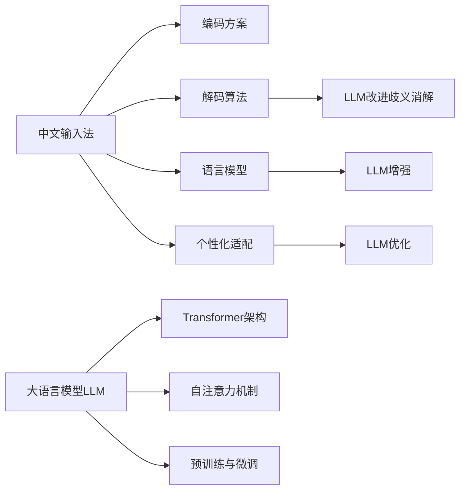

# 实时中文输入法中AI LLM的应用：更准确、更流畅

## 1. 背景介绍
### 1.1 中文输入法的发展历程
#### 1.1.1 早期的中文输入法
#### 1.1.2 统计语言模型的引入
#### 1.1.3 深度学习时代的中文输入法

### 1.2 实时中文输入面临的挑战
#### 1.2.1 汉字数量众多,输入复杂
#### 1.2.2 歧义问题严重
#### 1.2.3 个性化需求日益增长

### 1.3 AI大语言模型(LLM)的崛起
#### 1.3.1 Transformer架构的突破
#### 1.3.2 预训练语言模型的发展
#### 1.3.3 LLM在自然语言处理领域的广泛应用

## 2. 核心概念与联系
### 2.1 中文输入法的关键技术
#### 2.1.1 编码方案
#### 2.1.2 解码算法
#### 2.1.3 语言模型
#### 2.1.4 个性化适配

### 2.2 大语言模型(LLM)的原理
#### 2.2.1 Transformer架构
#### 2.2.2 自注意力机制
#### 2.2.3 预训练与微调

### 2.3 LLM在中文输入法中的应用
#### 2.3.1 语言模型的增强
#### 2.3.2 个性化适配的优化
#### 2.3.3 歧义消解的改进



## 3. 核心算法原理具体操作步骤
### 3.1 基于LLM的中文输入法语言模型
#### 3.1.1 构建海量中文语料库
#### 3.1.2 基于Transformer的LLM预训练
#### 3.1.3 针对输入法场景的模型微调

### 3.2 融合LLM的解码算法
#### 3.2.1 传统解码算法的局限性
#### 3.2.2 引入LLM进行解码优化
#### 3.2.3 LLM与传统算法的融合策略

### 3.3 基于LLM的个性化适配
#### 3.3.1 用户输入数据的收集与处理
#### 3.3.2 个性化LLM的训练
#### 3.3.3 在线推理与动态更新

## 4. 数学模型和公式详细讲解举例说明
### 4.1 Transformer的数学原理
#### 4.1.1 自注意力机制的数学表示
给定输入序列 $X=(x_1,\cdots,x_n)$,自注意力机制可表示为:

$$
\begin{aligned}
Q &= XW^Q \\
K &= XW^K \\
V &= XW^V \\
Attention(Q,K,V) &= softmax(\frac{QK^T}{\sqrt{d_k}})V
\end{aligned}
$$

其中,$W^Q,W^K,W^V$为可学习的参数矩阵,$d_k$为K的维度。

#### 4.1.2 多头注意力机制
多头注意力机制可以捕捉输入序列的不同方面信息,公式为:

$$
\begin{aligned}
MultiHead(Q,K,V) &= Concat(head_1,\cdots,head_h)W^O \\
head_i &= Attention(QW_i^Q,KW_i^K,VW_i^V)
\end{aligned}
$$

其中,$W_i^Q \in \mathbb{R}^{d_{model} \times d_k}$,$W_i^K \in \mathbb{R}^{d_{model} \times d_k}$,$W_i^V \in \mathbb{R}^{d_{model} \times d_v}$,$W^O \in \mathbb{R}^{hd_v \times d_{model}}$为可学习参数矩阵。

### 4.2 LLM在中文输入法中的应用实例
#### 4.2.1 语言模型示例
假设用户输入"wo"，传统的二元语法模型预测下一个词为"我"的概率为:

$$P(我|wo) = \frac{Count(wo,我)}{Count(wo)}$$

而基于LLM的语言模型则可以考虑更长距离的上下文信息,给出更准确的预测:

$$P(我|wo,context) = LLM(wo,context)$$

#### 4.2.2 个性化适配示例
对于用户 $u$,收集其输入序列 $X_u=(x_1,\cdots,x_n)$,个性化LLM模型的损失函数为:

$$Loss(u) = -\sum_{i=1}^{n}\log P(x_i|x_{<i},u;\theta)$$

其中,$\theta$为LLM的参数。通过最小化该损失函数,可以得到用户 $u$ 个性化的LLM模型参数 $\theta_u$。

## 5. 项目实践：代码实例和详细解释说明
### 5.1 基于PyTorch实现LLM预训练
```python
import torch
import torch.nn as nn

class TransformerBlock(nn.Module):
    def __init__(self, d_model, nhead, dim_feedforward, dropout=0.1):
        super().__init__()
        self.attn = nn.MultiheadAttention(d_model, nhead, dropout=dropout)
        self.linear1 = nn.Linear(d_model, dim_feedforward)
        self.dropout = nn.Dropout(dropout)
        self.linear2 = nn.Linear(dim_feedforward, d_model)
        self.norm1 = nn.LayerNorm(d_model)
        self.norm2 = nn.LayerNorm(d_model)
        self.dropout1 = nn.Dropout(dropout)
        self.dropout2 = nn.Dropout(dropout)
        
    def forward(self, src):
        src2 = self.attn(src, src, src)[0]
        src = src + self.dropout1(src2)
        src = self.norm1(src)
        src2 = self.linear2(self.dropout(torch.relu(self.linear1(src))))
        src = src + self.dropout2(src2)
        src = self.norm2(src)
        return src

class LLM(nn.Module):
    def __init__(self, vocab_size, d_model, nhead, dim_feedforward, num_layers, dropout=0.1):
        super().__init__()
        self.embedding = nn.Embedding(vocab_size, d_model)
        self.pos_encoder = PositionalEncoding(d_model, dropout)
        self.transformer_blocks = nn.ModuleList([TransformerBlock(d_model, nhead, dim_feedforward, dropout) for _ in range(num_layers)])
        self.fc = nn.Linear(d_model, vocab_size)
        
    def forward(self, src):
        src = self.embedding(src) * math.sqrt(self.d_model)
        src = self.pos_encoder(src)
        for block in self.transformer_blocks:
            src = block(src)
        output = self.fc(src)
        return output
```

以上代码实现了一个基础的LLM模型,主要组件包括:

- Embedding层:将离散的词元映射为连续的向量表示。
- PositionalEncoding:为每个位置添加位置编码,引入序列的位置信息。
- TransformerBlock:Transformer的基本组件,包括多头自注意力机制和前馈神经网络。
- 多个TransformerBlock堆叠而成的深度模型。
- 最后的全连接层,将Transformer的输出映射为词表概率分布。

### 5.2 使用LLM进行解码
```python
def llm_decode(input_seq, llm_model, max_len=10, temperature=1.0):
    output_seq = []
    for _ in range(max_len):
        input_tensor = torch.tensor(input_seq).unsqueeze(0)
        output = llm_model(input_tensor)
        output = output[-1] / temperature
        probs = torch.softmax(output, dim=-1)
        next_token = torch.multinomial(probs, num_samples=1).item()
        input_seq.append(next_token)
        output_seq.append(next_token)
        if next_token == EOS_TOKEN:
            break
    return output_seq
```

以上代码展示了如何使用训练好的LLM模型进行解码,主要步骤包括:

1. 将当前输入序列转化为张量输入到LLM模型中。
2. 获取LLM最后一个位置的输出,并除以温度系数以控制生成的多样性。
3. 对输出应用softmax函数,得到下一个词元的概率分布。
4. 根据概率分布采样得到下一个词元,加入到输入序列和输出序列中。
5. 重复步骤1-4,直到达到最大长度或遇到结束标记。

通过调节温度系数,可以控制生成结果的确定性和多样性。温度系数越高,生成结果越多样化;温度系数越低,生成结果越确定。

## 6. 实际应用场景
### 6.1 移动设备上的智能输入法
在智能手机、平板等移动设备上,基于LLM的中文输入法可以大幅提升输入效率和体验:

- 更准确的候选词预测和优先级排序
- 支持长句输入的智能联想与补全
- 个性化学习用户的输入习惯与偏好

### 6.2 语音输入的文本转换
将语音识别的结果作为LLM的输入,可以智能纠错、补全和优化转换后的文本:

- 修复语音识别的错误
- 补全语音断句后的残缺文本
- 根据上下文优化文本表达

### 6.3 跨平台云输入法
将LLM部署在云端,可以实现跨平台、跨设备的智能输入法服务:

- 统一的用户个性化模型
- 多设备同步输入历史与习惯
- 支持PC、移动、Web等多种平台

## 7. 工具和资源推荐
### 7.1 开源中文LLM模型
- CPM:[https://github.com/TsinghuaAI/CPM-Generate](https://github.com/TsinghuaAI/CPM-Generate)
- EVA:[https://github.com/thu-coai/EVA](https://github.com/thu-coai/EVA)
- GLM:[https://github.com/THUDM/GLM](https://github.com/THUDM/GLM)

### 7.2 中文输入法开源项目
- RIME:[https://rime.im/](https://rime.im/) 
- Sunpinyin:[https://github.com/sunpinyin/sunpinyin](https://github.com/sunpinyin/sunpinyin)
- Libgooglepinyin:[https://github.com/libgooglepinyin/libgooglepinyin](https://github.com/libgooglepinyin/libgooglepinyin)

### 7.3 相关论文与资源
- Attention Is All You Need:[https://arxiv.org/abs/1706.03762](https://arxiv.org/abs/1706.03762)
- RNN语言模型在中文输入法中的应用:[https://www.jiqizhixin.com/articles/2018-06-28-3](https://www.jiqizhixin.com/articles/2018-06-28-3)  
- 达观数据中文输入法智能引擎:[https://www.jiqizhixin.com/articles/2019-11-14-9](https://www.jiqizhixin.com/articles/2019-11-14-9)

## 8. 总结：未来发展趋势与挑战
### 8.1 LLM与知识图谱的结合
利用知识图谱对LLM进行增强,可以显著提升中文输入法在特定领域的表现:

- 融入领域知识,提高专业词汇与术语的输入效率
- 结合知识推理,实现智能问答与信息检索
- 引入常识知识,增强语义理解与歧义消解能力

### 8.2 个性化与隐私保护
随着LLM在输入法中的广泛应用,用户隐私保护与个性化模型安全成为亟待解决的挑战:

- 采用联邦学习等隐私保护机制,在不暴露用户原始数据的前提下实现个性化
- 设计安全高效的个性化模型管理方案,防止个人信息泄露
- 平衡数据利用与隐私保护,建立用户信任

### 8.3 模型效率与移动端部署
为了在资源受限的移动设备上实现实时的智能输入,需要不断优化LLM的效率与性能:

- 模型压缩与剪枝,在保证精度的同时减小模型体积
- 低精度推理与量化,降低计算资源占用
- 模型分割与动态加载,实现灵活高效的移动端部署

## 9. 附录：常见问题与解答
### 9.1 如何平衡通用性与个性化？
在实际应用中,需要在通用LLM与个性化模型之间寻求平衡:

-