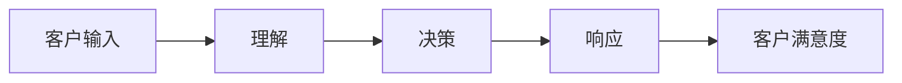

## 1.背景介绍

在当今的数字化时代，客户服务的需求和期待正在迅速增长。随着技术的快速发展，人工智能（AI）已经成为客户服务的重要组成部分，尤其是在处理高度重复性的查询和请求时。AI代理，也被称为聊天机器人或虚拟助手，可以提供24/7的服务，无论是在节假日还是在非工作时间，都可以实时处理客户的问题。

## 2.核心概念与联系

AI代理的工作流程可以分为三个核心部分：理解、决策和响应。首先，AI代理需要理解客户的需求，这通常通过自然语言处理（NLP）技术实现。然后，AI代理需要做出决策，这通常通过机器学习算法实现。最后，AI代理需要生成响应，这通常通过自然语言生成（NLG）技术实现。



## 3.核心算法原理具体操作步骤

在理解阶段，AI代理使用NLP技术来解析客户的输入。这包括词汇分析、句法分析和语义分析。词汇分析是将输入分解为单词或短语。句法分析是确定单词或短语之间的关系。语义分析是理解单词或短语的含义。

在决策阶段，AI代理使用机器学习算法来确定最佳的响应。这通常涉及到分类或回归任务。分类任务是确定输入属于哪个类别，例如，确定客户的请求是关于账单查询还是技术支持。回归任务是预测一个数值，例如，预测客户满意度的可能性。

在响应阶段，AI代理使用NLG技术来生成人类可理解的文本。这包括选择适当的词汇、构建语法正确的句子和确保语境的连贯性。

## 4.数学模型和公式详细讲解举例说明

在AI代理的工作流程中，常用的数学模型包括词嵌入模型、深度学习模型和强化学习模型。

词嵌入模型，如Word2Vec，可以将词汇映射到高维空间，使得语义相近的词汇在空间中的距离也相近。词嵌入模型的基本公式如下：

$$ W = X \cdot Y $$

其中，$W$ 是词嵌入矩阵，$X$ 是词汇矩阵，$Y$ 是上下文矩阵。

深度学习模型，如神经网络，可以从原始输入中提取高级特征。神经网络的基本公式如下：

$$ y = f(W \cdot x + b) $$

其中，$y$ 是输出，$f$ 是激活函数，$W$ 是权重矩阵，$x$ 是输入，$b$ 是偏置。

强化学习模型，如Q-learning，可以通过试错学习最优策略。Q-learning的基本公式如下：

$$ Q(s, a) = r + \gamma \max_{a'} Q(s', a') $$

其中，$Q(s, a)$ 是在状态$s$下采取行动$a$的价值，$r$ 是即时奖励，$\gamma$ 是折扣因子，$s'$ 是新状态，$a'$ 是新行动。

## 5.项目实践：代码实例和详细解释说明

以下是一个简单的AI代理的代码实例，使用Python的NLTK库实现。

```python
import nltk
from nltk.chat.util import Chat, reflections

pairs = [
    [
        r"我需要(.*)",
        ["我们可以帮助你%s", "你可以尝试%s"],
    ],
    [
        r"我的名字是(.*)",
        ["你好，%1，有什么可以帮助你的吗？", "很高兴认识你，%1！"],
    ],
]

def chatbot():
    print("你好，我是AI代理。你有什么需要帮助的吗？")
    chat = Chat(pairs, reflections)
    chat.converse()

if __name__ == "__main__":
    chatbot()
```

在这个代码中，我们定义了一个名为pairs的列表，其中包含了客户输入和AI代理响应的匹配模式。然后，我们创建了一个Chat对象，并调用converse方法开始对话。

## 6.实际应用场景

AI代理在许多领域都有广泛的应用，包括客户服务、电子商务、医疗保健、教育和娱乐。例如，在客户服务中，AI代理可以处理账单查询、订单状态更新和技术支持等请求。在电子商务中，AI代理可以提供产品推荐、购物助手和售后服务。在医疗保健中，AI代理可以提供症状检查、健康咨询和药物提醒。在教育中，AI代理可以提供课程辅导、作业帮助和学习资源。在娱乐中，AI代理可以提供新闻摘要、游戏助手和音乐推荐。

## 7.工具和资源推荐

如果你对AI代理感兴趣，以下是一些推荐的工具和资源：

- NLTK：一个强大的Python库，提供了众多NLP工具，包括词汇分析、句法分析和语义分析。
- TensorFlow：一个开源的深度学习框架，提供了众多机器学习算法，包括神经网络、卷积神经网络和递归神经网络。
- OpenAI Gym：一个开源的强化学习框架，提供了众多环境和算法，包括Q-learning、deep Q-learning和policy gradient。
- Chatbots Magazine：一个专门关于聊天机器人的在线杂志，提供了众多教程、案例研究和最新动态。

## 8.总结：未来发展趋势与挑战

随着技术的快速发展，AI代理的未来充满了可能性。一方面，AI代理将变得更加智能，能够理解更复杂的需求，做出更精确的决策，生成更自然的响应。另一方面，AI代理将变得更加个性化，能够根据客户的行为、喜好和情绪提供定制化的服务。

然而，AI代理也面临着许多挑战。首先，如何保证AI代理的公正性和透明性？AI代理的决策过程往往是黑箱的，这可能导致偏见和歧视。其次，如何保护客户的隐私和安全？AI代理需要处理大量的个人数据，这可能导致数据泄露和身份盗窃。最后，如何管理AI代理的道德和法律责任？AI代理可能会做出有害的行为，这可能导致伦理争议和法律纠纷。

## 9.附录：常见问题与解答

- 问题：AI代理可以完全替代人类客服吗？
  答：虽然AI代理在处理高度重复性的查询和请求方面非常有效，但在处理复杂和敏感的问题时，人类客服仍然是必不可少的。因此，AI代理和人类客服应该是互补的，而不是替代的。

- 问题：AI代理如何处理未知的问题？
  答：当AI代理遇到未知的问题时，它可以使用多种策略，例如提供一般性的建议、请求更多的信息或转接到人类客服。

- 问题：AI代理如何处理恶意的输入？
  答：AI代理可以使用多种技术来处理恶意的输入，例如文本过滤、情绪分析和行为建模。

作者：禅与计算机程序设计艺术 / Zen and the Art of Computer Programming