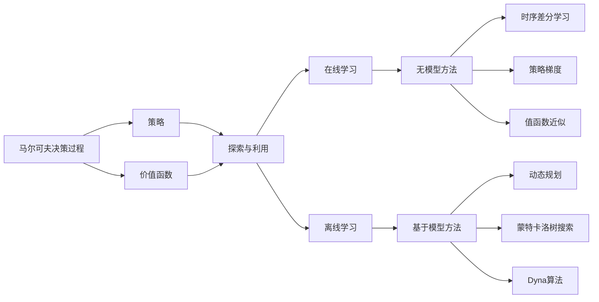

# 强化学习 (Reinforcement Learning)

## 1. 背景介绍

强化学习(Reinforcement Learning,RL)是机器学习的一个重要分支,它研究如何让智能体(Agent)在与环境的交互中学习最优策略,以最大化累积奖励。与监督学习和非监督学习不同,强化学习不需要预先准备好的训练数据,而是通过探索和试错来学习。

强化学习的理论基础可以追溯到20世纪50年代,当时Richard Bellman提出了动态规划的概念。1989年,Christopher Watkins在his博士论文中首次提出Q-learning算法,标志着现代强化学习的诞生。近年来,随着深度学习的发展,深度强化学习(Deep Reinforcement Learning,DRL)取得了令人瞩目的成就,如AlphaGo击败世界围棋冠军、OpenAI Five战胜人类Dota2选手等。

### 1.1 强化学习的定义与特点

强化学习可以形式化地定义为一个马尔可夫决策过程(Markov Decision Process,MDP),它由以下元素组成:

- 状态空间 $\mathcal{S}$:表示智能体所处的环境状态集合。
- 动作空间 $\mathcal{A}$:表示智能体可以采取的动作集合。
- 转移概率 $\mathcal{P}$:表示在状态 $s$ 下执行动作 $a$ 后转移到状态 $s'$ 的概率,即 $P(s'|s,a)$。
- 奖励函数 $\mathcal{R}$:表示智能体在状态 $s$ 下执行动作 $a$ 后获得的即时奖励,即 $R(s,a)$。
- 折扣因子 $\gamma \in [0,1]$:表示对未来奖励的衰减程度,用于平衡即时奖励和长期奖励。

强化学习的目标是学习一个最优策略 $\pi^*$,使得在该策略下智能体能够获得最大的期望累积奖励:

$$\pi^* = \arg\max_{\pi} \mathbb{E}_{\pi} \left[ \sum_{t=0}^{\infty} \gamma^t R(s_t,a_t) \right]$$

与监督学习和非监督学习相比,强化学习具有以下特点:

1. 通过与环境的交互来学习,而不是使用预先准备好的训练数据。
2. 考虑动作的长期影响,而不仅仅是即时奖励。
3. 需要在探索(exploration)和利用(exploitation)之间权衡,以发现更优策略。
4. 面临延迟奖励(delayed reward)问题,即当前动作的影响可能在未来才体现出来。

### 1.2 强化学习的应用领域

强化学习在许多领域都有广泛的应用,包括但不限于:

1. 游戏:如国际象棋、围棋、雅达利游戏、Dota2等。
2. 机器人控制:如机器人运动规划、机械臂操作等。
3. 自动驾驶:如无人车的决策与控制。
4. 推荐系统:如个性化推荐、广告投放等。
5. 网络优化:如路由选择、流量调度等。
6. 金融:如投资组合优化、算法交易等。

## 2. 核心概念与联系

### 2.1 马尔可夫决策过程(MDP)

马尔可夫决策过程是强化学习的理论基础,它提供了一个数学框架来描述智能体与环境的交互过程。MDP满足马尔可夫性质,即下一状态只取决于当前状态和动作,与之前的状态和动作无关:

$$P(s_{t+1}|s_t,a_t,s_{t-1},a_{t-1},...,s_0,a_0) = P(s_{t+1}|s_t,a_t)$$

MDP的最优策略可以通过求解贝尔曼方程(Bellman Equation)来获得:

$$V^*(s) = \max_{a \in \mathcal{A}} \left[ R(s,a) + \gamma \sum_{s' \in \mathcal{S}} P(s'|s,a) V^*(s') \right]$$

其中,$V^*(s)$表示状态$s$的最优状态值函数。类似地,最优动作值函数$Q^*(s,a)$满足:

$$Q^*(s,a) = R(s,a) + \gamma \sum_{s' \in \mathcal{S}} P(s'|s,a) \max_{a' \in \mathcal{A}} Q^*(s',a')$$

### 2.2 策略与价值函数

策略(Policy)是强化学习中的核心概念之一,它定义了智能体在每个状态下应该采取的动作。策略可以是确定性的(Deterministic),即 $a=\pi(s)$;也可以是随机性的(Stochastic),即 $a \sim \pi(\cdot|s)$。

价值函数(Value Function)用于评估策略的好坏,包括状态值函数 $V^{\pi}(s)$ 和动作值函数 $Q^{\pi}(s,a)$:

- 状态值函数:表示从状态 $s$ 开始,遵循策略 $\pi$ 的期望累积奖励。
  $$V^{\pi}(s) = \mathbb{E}_{\pi} \left[ \sum_{t=0}^{\infty} \gamma^t R(s_t,a_t) | s_0=s \right]$$
- 动作值函数:表示在状态 $s$ 下采取动作 $a$,然后遵循策略 $\pi$ 的期望累积奖励。
  $$Q^{\pi}(s,a) = \mathbb{E}_{\pi} \left[ \sum_{t=0}^{\infty} \gamma^t R(s_t,a_t) | s_0=s, a_0=a \right]$$

策略和价值函数满足以下关系:

$$V^{\pi}(s) = \sum_{a \in \mathcal{A}} \pi(a|s) Q^{\pi}(s,a)$$

$$Q^{\pi}(s,a) = R(s,a) + \gamma \sum_{s' \in \mathcal{S}} P(s'|s,a) V^{\pi}(s')$$

### 2.3 探索与利用

探索(Exploration)和利用(Exploitation)是强化学习中的一对矛盾。探索是指智能体尝试新的动作以发现可能更优的策略,而利用是指智能体采取当前已知的最优动作以获得更多奖励。过度探索会导致奖励减少,而过度利用则可能错失更优策略。

常见的探索策略包括:

1. $\epsilon$-贪心($\epsilon$-greedy):以概率 $\epsilon$ 随机选择动作,以概率 $1-\epsilon$ 选择当前最优动作。
2. Softmax探索:根据动作值函数的指数函数概率选择动作,温度参数控制探索的程度。
3. 上置信区间(Upper Confidence Bound,UCB):选择动作值函数的均值和不确定性都较高的动作。
4. Thompson采样:根据后验分布采样动作值函数,然后选择最优动作。

### 2.4 在线学习与离线学习

强化学习可以分为在线学习(Online Learning)和离线学习(Offline Learning,也称为Batch Learning)两种模式。

在线学习是指智能体在与环境交互的过程中同步更新策略或价值函数,每次交互后都立即使用新的经验数据来学习。这种模式的优点是适应性强,可以快速响应环境的变化;缺点是样本效率低,难以利用历史数据。

离线学习是指智能体先收集一批经验数据,然后再用这些数据来更新策略或价值函数,更新完成后再次与环境交互收集新的数据。这种模式的优点是样本效率高,可以重复利用历史数据;缺点是适应性差,无法及时响应环境的变化。

### 2.5 模型学习

在强化学习中,环境模型(Environment Model)指的是对环境动力学(转移概率)和奖励函数的估计。根据是否学习环境模型,强化学习可以分为基于模型的方法(Model-Based)和无模型的方法(Model-Free)。

基于模型的方法通过学习环境模型来规划最优策略,常见的算法包括:

1. 动态规划(Dynamic Programming):适用于已知环境模型的情况,通过迭代贝尔曼方程求解最优策略。
2. 蒙特卡洛树搜索(Monte Carlo Tree Search,MCTS):通过模拟和搜索来估计动作值函数,并选择最优动作。
3. Dyna算法:结合模型学习和无模型学习,通过学习环境模型生成虚拟经验数据来加速学习。

无模型的方法直接学习策略或价值函数,不需要显式地建模环境,常见的算法包括:

1. 时序差分学习(Temporal Difference Learning):通过自举(Bootstrap)更新值函数,如Q-Learning、Sarsa等。
2. 策略梯度(Policy Gradient):通过估计策略梯度来直接优化策略,如REINFORCE、Actor-Critic等。
3. 值函数近似(Value Function Approximation):用函数近似器(如神经网络)来表示值函数,克服状态空间过大的问题。

下图展示了强化学习的核心概念与联系:

## 3. 核心算法原理与具体操作步骤

### 3.1 Q-Learning算法

Q-Learning是一种经典的无模型时序差分学习算法,它直接学习动作值函数 $Q(s,a)$。Q-Learning的更新规则为:

$$Q(s_t,a_t) \leftarrow Q(s_t,a_t) + \alpha \left[ r_t + \gamma \max_{a} Q(s_{t+1},a) - Q(s_t,a_t) \right]$$

其中,$\alpha \in (0,1]$是学习率,$\gamma \in [0,1]$是折扣因子。Q-Learning的具体操作步骤如下:

1. 初始化Q表格 $Q(s,a)$,对所有状态-动作对初始化为0或随机值。
2. 重复以下步骤直到收敛或达到最大迭代次数:
   - 根据当前状态 $s_t$,使用探索策略(如$\epsilon$-贪心)选择动作 $a_t$。
   - 执行动作 $a_t$,观察奖励 $r_t$ 和下一状态 $s_{t+1}$。
   - 根据Q-Learning的更新规则更新 $Q(s_t,a_t)$。
   - 将当前状态更新为下一状态,即 $s_t \leftarrow s_{t+1}$。
3. 返回学习到的Q表格 $Q(s,a)$。

在执行阶段,智能体直接根据学习到的Q表格选择具有最大Q值的动作。Q-Learning算法的收敛性得到了理论证明,在适当的条件下(如探索充分、学习率满足Robbins-Monro条件等),Q-Learning能够收敛到最优动作值函数 $Q^*(s,a)$。

### 3.2 Sarsa算法

Sarsa(State-Action-Reward-State-Action)算法也是一种无模型时序差分学习算法,与Q-Learning的区别在于它使用当前策略来选择下一状态的动作,而不是使用贪心策略。Sarsa的更新规则为:

$$Q(s_t,a_t) \leftarrow Q(s_t,a_t) + \alpha \left[ r_t + \gamma Q(s_{t+1},a_{t+1}) - Q(s_t,a_t) \right]$$

其中,$a_{t+1}$是根据当前策略 $\pi$ 在状态 $s_{t+1}$ 下选择的动作。Sarsa算法的具体操作步骤与Q-Learning类似,只是在更新Q值时使用当前策略选择下一动作,而不是使用贪心策略。

Sarsa算法是一种同策略(On-Policy)学习方法,它学习的是当前执行的策略。相比之下,Q-Learning是一种异策略(Off-Policy)学习方法,它学习的是最优策略,而执行的是另一个策略(如探索策略)。

### 3.3 DQN算法

深度Q网络(Deep Q-Network,DQN)算法是将Q-Learning与深度神经网络相结合的一种强化