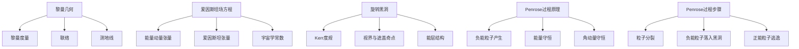

# 微分几何入门与广义相对论：从旋转黑洞提取能量（Penrose过程）

## 1. 背景介绍
### 1.1 微分几何概述
### 1.2 广义相对论简介
### 1.3 黑洞物理学基础

## 2. 核心概念与联系
### 2.1 黎曼几何
#### 2.1.1 黎曼度量
#### 2.1.2 联络
#### 2.1.3 测地线
### 2.2 爱因斯坦场方程
#### 2.2.1 能量-动量张量
#### 2.2.2 爱因斯坦张量
#### 2.2.3 宇宙学常数
### 2.3 旋转黑洞
#### 2.3.1 Kerr度规
#### 2.3.2 视界与遮盖奇点
#### 2.3.3 能层结构

## 3. 核心算法原理具体操作步骤
### 3.1 Penrose过程原理
#### 3.1.1 负能粒子产生
#### 3.1.2 能量守恒
#### 3.1.3 角动量守恒
### 3.2 Penrose过程步骤
#### 3.2.1 粒子分裂
#### 3.2.2 负能粒子落入黑洞
#### 3.2.3 正能粒子逃逸

## 4. 数学模型和公式详细讲解举例说明
### 4.1 Kerr度规的数学表达
### 4.2 Carter-Penrose图解
### 4.3 Penrose过程的数学描述
#### 4.3.1 四动量守恒
#### 4.3.2 能量提取效率计算
#### 4.3.3 数值模拟与结果分析

## 5. 项目实践：代码实例和详细解释说明
### 5.1 数值相对论基础
#### 5.1.1 时空网格构建
#### 5.1.2 边界条件处理
#### 5.1.3 数值稳定性分析
### 5.2 Penrose过程数值模拟
#### 5.2.1 测地线求解
#### 5.2.2 粒子运动模拟
#### 5.2.3 能量提取效率计算
### 5.3 代码实现与结果可视化
#### 5.3.1 Python代码实现
#### 5.3.2 C++代码优化
#### 5.3.3 可视化结果分析

## 6. 实际应用场景
### 6.1 高能天体物理
#### 6.1.1 活动星系核
#### 6.1.2 伽马射线暴
#### 6.1.3 引力波源
### 6.2 新概念推进系统
#### 6.2.1 黑洞能量采集
#### 6.2.2 高效推进方案
#### 6.2.3 技术挑战与前景

## 7. 工具和资源推荐
### 7.1 数值相对论工具包
#### 7.1.1 Einstein Toolkit
#### 7.1.2 GRChombo
#### 7.1.3 SpEC
### 7.2 数据分析与可视化
#### 7.2.1 VisIt
#### 7.2.2 ParaView
#### 7.2.3 yt
### 7.3 学习资源
#### 7.3.1 教材与讲义
#### 7.3.2 在线课程
#### 7.3.3 研究论文

## 8. 总结：未来发展趋势与挑战
### 8.1 旋转黑洞能量提取的理论拓展
### 8.2 数值模拟技术的进步
### 8.3 天文观测与实验验证
### 8.4 工程应用前景与挑战

## 9. 附录：常见问题与解答
### 9.1 为什么旋转黑洞可以提取能量？
### 9.2 Penrose过程的能量提取效率有多高？
### 9.3 数值相对论模拟中需要注意哪些问题？
### 9.4 Penrose过程在天文观测中有何证据？
### 9.5 利用黑洞能量推进飞船在技术上可行吗？

微分几何和广义相对论是现代物理学的重要基石，它们不仅为我们理解宇宙的本质提供了全新的视角，更为探索极端条件下的物理现象开辟了道路。黑洞作为广义相对论预言的奇特天体，其独特的时空结构和能量性质一直是科学家们关注的焦点。特别是旋转黑洞，由于其能层结构的存在，为能量提取提供了可能性。

1969年，英国物理学家Roger Penrose提出了一种从旋转黑洞提取能量的机制，即著名的Penrose过程。该过程利用黑洞能层中的负能区域，通过粒子分裂和黑洞吸积实现能量提取。尽管Penrose过程在理论上是可行的，但由于其对极端条件的要求，在实际应用中仍面临诸多挑战。

为了深入理解Penrose过程的物理机制，我们需要首先掌握微分几何和广义相对论的基本概念和数学工具。黎曼几何为描述时空奠定了基础，而爱因斯坦场方程则揭示了时空与物质之间的联系。在此基础上，我们可以推导出旋转黑洞的Kerr度规，并分析其视界结构和能层性质。

Penrose过程的核心在于利用黑洞能层中的负能区域，通过粒子分裂产生负能粒子，并使其落入黑洞。在这一过程中，正能粒子则可以携带更多能量逃逸出去，从而实现能量提取。这一过程需要满足能量和角动量守恒，同时也对粒子的初始条件提出了严格要求。

为了定量分析Penrose过程的能量提取效率，我们需要借助数学模型和数值模拟方法。通过对Kerr度规的数学描述和Carter-Penrose图的分析，我们可以得到Penrose过程的解析解。同时，数值相对论方法为我们提供了更为直观和精确的模拟工具。通过构建时空网格、求解测地线方程和模拟粒子运动，我们可以计算能量提取效率并分析影响因素。

Penrose过程在高能天体物理领域有着广泛的应用前景。活动星系核、伽马射线暴和引力波源等极端天体环境中，都可能存在旋转黑洞能量提取的迹象。同时，Penrose过程也为新概念推进系统的设计提供了灵感。通过黑洞能量采集和高效推进方案，我们有望在未来实现更远的星际探索。

当然，将Penrose过程付诸实践仍面临诸多技术挑战。我们需要发展更为精确和高效的数值相对论工具，并与天文观测紧密结合，寻找Penrose过程的观测证据。同时，在工程应用方面，我们还需要攻克材料、控制和能量转化等关键技术难题。

总的来说，Penrose过程为我们开启了利用旋转黑洞能量的大门，展现了广义相对论的奇妙魅力。随着理论研究的深入和观测技术的进步，我们有望在不久的将来揭开黑洞能量之谜，并将其应用于人类文明的发展。在这一过程中，微分几何和广义相对论将继续发挥重要作用，引领我们探索宇宙的奥秘。

作者：禅与计算机程序设计艺术 / Zen and the Art of Computer Programming