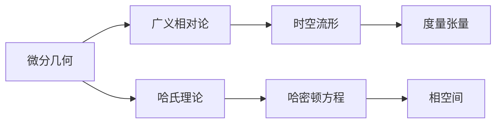

## 1. 背景介绍

微分几何作为现代数学和物理学的基石之一，它在理论物理中的应用尤为重要。广义相对论，作为爱因斯坦的伟大贡献，将时空和引力联系起来，其数学基础正是微分几何。哈密顿（Hamilton）理论是经典力学的一个重要分支，它提供了一种描述物理系统演化的优雅方式。在有限自由度系统中，哈氏理论的应用尤为关键，它能够帮助我们更深入地理解物理现象。本文将探讨微分几何和广义相对论的基本概念，并深入讨论哈氏理论在有限自由度系统中的应用。

## 2. 核心概念与联系

微分几何关注的是曲线、曲面以及它们的高维推广——流形的性质。在广义相对论中，时空被描述为一个四维流形，其上的度量张量定义了距离和角度的概念。哈氏理论则是通过哈密顿方程描述系统的动力学行为，它使用的是相空间的概念，其中每个点代表系统的一个可能状态。



## 3. 核心算法原理具体操作步骤

哈氏理论的核心在于哈密顿方程的求解。这些方程是一阶偏微分方程，它们描述了相空间中的点如何随时间演化。求解哈密顿方程通常涉及以下步骤：

1. 确定系统的哈密顿量（能量函数）。
2. 计算哈密顿量对广义坐标和广义动量的偏导数。
3. 将偏导数代入哈密顿方程。
4. 解偏微分方程得到系统状态随时间的演化。

## 4. 数学模型和公式详细讲解举例说明

哈密顿量是系统总能量的表达式，通常形式为 $H(q,p,t) = T(p) + V(q)$，其中 $T$ 是动能，$V$ 是势能，$q$ 是广义坐标，$p$ 是广义动量。哈密顿方程为：

$$
\begin{align}
\dot{q} &= \frac{\partial H}{\partial p} \\
\dot{p} &= -\frac{\partial H}{\partial q}
\end{align}
$$

以简单的谐振子为例，其哈密顿量为 $H(q,p) = \frac{p^2}{2m} + \frac{1}{2}kq^2$，代入哈密顿方程，可以得到系统的运动方程。

## 5. 项目实践：代码实例和详细解释说明

考虑一个简单的物理系统，我们可以使用Python编写代码来模拟其动力学行为。以下是一个简单的代码示例：

```python
import numpy as np
import matplotlib.pyplot as plt

# 定义哈密顿量
def hamiltonian(q, p, m, k):
    T = p**2 / (2 * m)
    V = k * q**2 / 2
    return T + V

# 定义哈密顿方程
def hamiltons_equations(q, p, m, k):
    dqdt = p / m
    dpdt = -k * q
    return dqdt, dpdt

# 时间步长和总时间
dt = 0.01
time = np.arange(0, 10, dt)

# 初始条件
q0 = 1.0
p0 = 0.0
m = 1.0
k = 1.0

# 初始化数组
q = np.zeros(len(time))
p = np.zeros(len(time))
q[0], p[0] = q0, p0

# 时间演化
for i in range(1, len(time)):
    dqdt, dpdt = hamiltons_equations(q[i-1], p[i-1], m, k)
    q[i] = q[i-1] + dqdt * dt
    p[i] = p[i-1] + dpdt * dt

# 绘图
plt.plot(time, q, label='q (Generalized Coordinate)')
plt.plot(time, p, label='p (Generalized Momentum)')
plt.legend()
plt.show()
```

这段代码模拟了一个谐振子的运动，其中 `hamiltonian` 函数定义了系统的哈密顿量，`hamiltons_equations` 函数定义了哈密顿方程，然后通过数值方法求解这些方程。

## 6. 实际应用场景

微分几何和哈氏理论在多个领域都有应用，例如在粒子物理学中描述基本粒子的相互作用，在宇宙学中研究宇宙的大尺度结构，在机器人学中用于路径规划和运动控制。

## 7. 工具和资源推荐

- **数学软件**：Mathematica、MATLAB和Maple等软件可以用来进行符号计算和数值模拟。
- **编程语言**：Python是一个强大的工具，特别是其科学计算库NumPy和绘图库Matplotlib。
- **在线资源**：arXiv、Coursera和Khan Academy等平台提供了大量的学习资源。

## 8. 总结：未来发展趋势与挑战

微分几何和广义相对论的研究仍在不断深入，特别是在量子引力理论的探索中。哈氏理论在经典和量子力学中都有广泛应用，但其在高能物理和宇宙学中的应用还面临着许多挑战。未来的研究将继续探索这些理论的深层联系和新的应用领域。

## 9. 附录：常见问题与解答

- **Q1**: 微分几何和广义相对论有什么联系？
- **A1**: 微分几何提供了描述时空几何的数学工具，而广义相对论则使用这些工具来描述引力。

- **Q2**: 哈氏理论在物理学中有什么作用？
- **A2**: 哈氏理论提供了一种描述物理系统动力学的方法，它在经典力学、量子力学和统计物理学中都有应用。

- **Q3**: 如何学习微分几何和哈氏理论？
- **A3**: 建议从基础的微积分和线性代数学起，然后逐步学习更高级的微分几何和理论物理课程。

作者：禅与计算机程序设计艺术 / Zen and the Art of Computer Programming