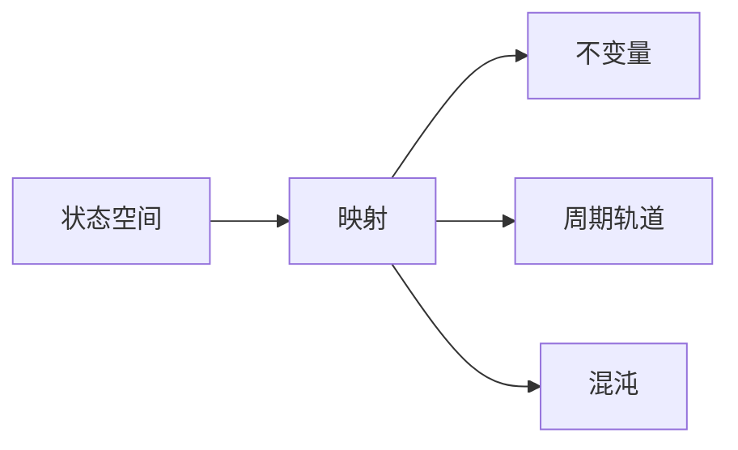

# 拓扑动力系统概论：遍历论基础

## 1. 背景介绍

拓扑动力系统是研究数学中动力系统拓扑性质的一个分支，它在理论物理、生物学、经济学等多个领域都有着广泛的应用。遍历论（Ergodic Theory）作为拓扑动力系统的一个重要组成部分，主要研究在长时间的演化过程中，系统的统计性质和空间性质之间的关系。本文将深入探讨拓扑动力系统的核心概念、算法原理、数学模型，并结合代码实例进行项目实践，以期为读者提供一个全面而深入的理解。

## 2. 核心概念与联系

拓扑动力系统涉及的核心概念包括状态空间、映射、不变量、周期轨道、混沌等。状态空间是系统可能状态的集合，映射则描述了系统状态随时间的演化。不变量是在动力系统演化过程中保持不变的性质，而周期轨道则是系统状态经过有限次映射后返回到初始状态的路径。混沌是指系统表现出的不可预测的长期行为，即使在初始条件几乎相同的情况下，系统的演化路径也会迅速分化。



## 3. 核心算法原理具体操作步骤

拓扑动力系统的核心算法原理包括轨道分析、不变量计算、Lyapunov指数计算等。轨道分析是通过计算系统的轨道来研究系统的动态行为。不变量计算则是找出在系统演化过程中保持不变的量。Lyapunov指数用于量化系统对初始条件的敏感度，是判断系统是否具有混沌特性的重要工具。

操作步骤通常包括：
1. 定义状态空间和映射规则。
2. 选择初始条件，迭代映射以模拟系统轨道。
3. 计算不变量，分析其对系统性质的影响。
4. 计算Lyapunov指数，判断系统是否存在混沌。

## 4. 数学模型和公式详细讲解举例说明

拓扑动力系统的数学模型通常由微分方程或差分方程描述。例如，考虑一个简单的一维映射 $x_{n+1} = f(x_n)$，其中 $f$ 是定义在实数上的连续函数。系统的不变量可以是一个固定点 $x^*$，满足 $f(x^*) = x^*$。Lyapunov指数定义为：

$$
\lambda = \lim_{n \to \infty} \frac{1}{n} \sum_{i=0}^{n-1} \log |f'(x_i)|
$$

举例来说，对于Logistic映射 $x_{n+1} = rx_n(1 - x_n)$，我们可以计算其不变量和Lyapunov指数来分析系统的动态行为。

## 5. 项目实践：代码实例和详细解释说明

以Logistic映射为例，我们可以编写如下Python代码来模拟其动态行为：

```python
import numpy as np
import matplotlib.pyplot as plt

def logistic_map(r, x):
    return r * x * (1 - x)

r = 3.9
x = 0.5
iterations = 1000
x_values = []

for i in range(iterations):
    x_values.append(x)
    x = logistic_map(r, x)

plt.plot(x_values)
plt.show()
```

这段代码初始化了一个Logistic映射，并迭代1000次来观察系统的行为。生成的图表可以帮助我们直观地理解系统的动态特性。

## 6. 实际应用场景

拓扑动力系统在多个领域都有实际应用，例如在气候模型中预测天气变化，在生物学中模拟种群动态，在经济学中分析市场波动等。

## 7. 工具和资源推荐

对于拓扑动力系统的研究，推荐使用Python的NumPy和Matplotlib库进行数值模拟和可视化。此外，专业的数学软件如MATLAB和Mathematica也提供了强大的工具集。

## 8. 总结：未来发展趋势与挑战

拓扑动力系统的研究仍然是一个活跃的领域，未来的发展趋势包括更深入地理解混沌现象、开发新的不变量和量化工具、以及将理论应用于更复杂的实际系统中。挑战则包括处理高维系统的复杂性和提高数值模拟的精度。

## 9. 附录：常见问题与解答

Q1: 拓扑动力系统和一般动力系统有什么区别？
A1: 拓扑动力系统强调的是系统的拓扑性质，如连续性和紧致性，而一般动力系统可能更关注系统的其他性质，如微分结构。

Q2: 如何判断一个系统是否具有混沌特性？
A2: 一个常用的方法是计算系统的Lyapunov指数，如果指数大于零，则系统可能具有混沌特性。

Q3: 在实际应用中，如何选择合适的模型和参数？
A3: 这通常需要根据具体问题来决定。理论分析、历史数据和专家经验都是选择模型和参数的重要依据。

作者：禅与计算机程序设计艺术 / Zen and the Art of Computer Programming