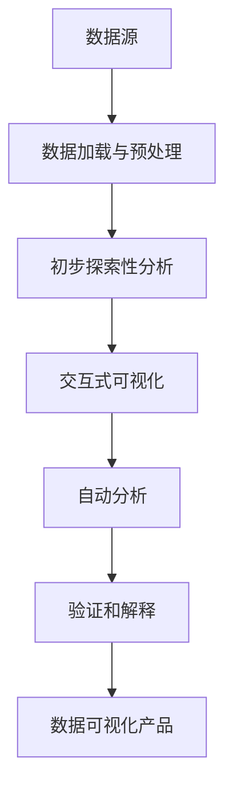

# 数据可视化与数据探索原理与代码实战案例讲解

## 1. 背景介绍

在当今数据爆炸时代,数据可视化和数据探索已成为提取有价值见解的关键工具。通过将复杂的数据转化为直观的视觉表示,我们可以更好地理解和分析数据,从而发现隐藏的模式、趋势和异常。数据可视化不仅有助于数据分析师和科学家快速获取见解,还可以帮助决策者做出明智的决策。

数据探索则是一种利用交互式可视化和自动分析技术探索数据集的过程,旨在发现隐藏的关系、模式和异常。通过数据探索,我们可以更深入地了解数据,生成新的假设,并为进一步的分析和建模奠定基础。

本文将深入探讨数据可视化和数据探索的原理和技术,并提供实用的代码示例和最佳实践,帮助读者掌握这些强大的数据分析工具。

## 2. 核心概念与联系

### 2.1 数据可视化

数据可视化是将抽象数据转换为图形表示的过程,使人类可以更直观地理解和分析数据。常见的数据可视化技术包括:

- 统计图表(如条形图、折线图、散点图等)
- 地理可视化(如地图、热力图等)
- 网络可视化(如节点链接图等)
- 多维数据可视化(如平行坐标图、散点矩阵等)

数据可视化的关键在于选择合适的可视化技术,并进行有效的编码(如使用不同的颜色、形状、大小等视觉通道来表示不同的数据属性)。

### 2.2 数据探索

数据探索是一种发现数据中隐藏模式、趋势和异常的过程。它通常包括以下步骤:

1. **数据加载和预处理**: 从各种来源获取数据,并进行清理、转换和整合。
2. **初步探索性分析**: 通过计算统计量、绘制基本图表等方式,对数据进行初步探索。
3. **交互式可视化**: 利用交互式可视化工具,从多个角度探索数据,发现有趣的模式和异常。
4. **自动分析**: 使用机器学习和统计技术,自动发现数据中的有趣模式和异常。
5. **验证和解释**: 验证发现的模式和异常,并提出合理的解释。

数据探索与数据可视化密切相关,可视化是探索数据的重要手段,而探索过程也会反过来指导可视化的设计和改进。

### 2.3 Mermaid 流程图



上图展示了数据探索和数据可视化的典型流程。从数据源开始,经过数据加载和预处理、初步探索性分析、交互式可视化、自动分析和验证解释等步骤,最终生成数据可视化产品,为用户提供直观的数据见解。

## 3. 核心算法原理具体操作步骤

### 3.1 数据可视化算法

数据可视化算法旨在将高维数据映射到低维视觉空间,同时保留数据的重要特征和结构。常见的数据可视化算法包括:

1. **布局算法**:用于确定节点和链接在可视化空间中的位置,如力导向算法、树状布局算法等。
2. **降维算法**:将高维数据投影到二维或三维空间,如主成分分析(PCA)、t-SNE等。
3. **聚类算法**:将相似数据点分组,如K-Means、DBSCAN等。
4. **比例尺变换**:将数据值映射到视觉通道(如颜色、大小等),如线性比例尺、对数比例尺等。

以散点图为例,其核心算法步骤如下:

1. 对原始数据进行预处理,如缺失值处理、标准化等。
2. 如果数据维度大于2,使用降维算法(如PCA)将数据投影到二维平面。
3. 使用比例尺变换将数据值映射到视觉通道(如颜色、大小等)。
4. 使用布局算法确定每个数据点在可视化空间中的位置。
5. 渲染散点图,并添加交互功能(如缩放、平移、ToolTip等)。

### 3.2 数据探索算法

数据探索算法旨在自动发现数据中的有趣模式、异常和关系。常见的算法包括:

1. **关联规则挖掘**:发现数据中的频繁项集和关联规则,如Apriori算法、FP-Growth算法等。
2. **异常检测**:识别数据中的异常点或异常模式,如基于距离的方法、基于密度的方法等。
3. **子群挖掘**:发现数据中具有独特行为的子群,如基于偏差的方法、基于异常的方法等。
4. **相关性分析**:发现数据中的相关性和因果关系,如皮尔逊相关系数、最大信息系数等。

以关联规则挖掘为例,其核心算法步骤如下:

1. 设置最小支持度和最小置信度阈值。
2. 使用Apriori算法或FP-Growth算法发现频繁项集。
3. 从频繁项集中生成关联规则。
4. 计算每条规则的支持度和置信度,过滤掉不满足阈值的规则。
5. 对剩余规则进行排序和可视化,方便分析。

## 4. 数学模型和公式详细讲解举例说明

数据可视化和数据探索中涉及到多种数学模型和公式,以下是一些常见的例子:

### 4.1 主成分分析 (PCA)

PCA是一种常用的降维算法,它通过线性变换将高维数据投影到低维空间,同时尽量保留原始数据的方差。PCA的数学模型如下:

给定一个包含 $n$ 个样本的数据矩阵 $X$,其中每个样本有 $p$ 个特征,我们希望找到一个新的 $k$ 维空间 $(k < p)$,使得投影到这个空间后的数据方差最大化。

1. 计算数据矩阵 $X$ 的协方差矩阵 $\Sigma$:

$$\Sigma = \frac{1}{n-1} \sum_{i=1}^{n} (x_i - \bar{x})(x_i - \bar{x})^T$$

2. 计算协方差矩阵 $\Sigma$ 的特征值 $\lambda_1, \lambda_2, \ldots, \lambda_p$ 和对应的特征向量 $v_1, v_2, \ldots, v_p$。
3. 选取前 $k$ 个最大的特征值对应的特征向量 $v_1, v_2, \ldots, v_k$,构成投影矩阵 $P = [v_1, v_2, \ldots, v_k]$。
4. 将原始数据 $X$ 投影到 $k$ 维空间,得到降维后的数据 $Y$:

$$Y = XP$$

通过 PCA,我们可以将高维数据投影到低维空间,同时保留数据的主要结构和方差。这对于可视化和降低数据维度非常有用。

### 4.2 t-SNE

t-SNE (t-Distributed Stochastic Neighbor Embedding) 是另一种常用的降维算法,它通过保留数据点之间的相似性来降低维度。t-SNE 的数学模型如下:

给定一个包含 $n$ 个样本的高维数据矩阵 $X$,我们希望将其映射到低维空间 $Y$,使得 $X$ 中相似的点在 $Y$ 中也相似,而不相似的点在 $Y$ 中距离较远。

1. 计算 $X$ 中每对数据点 $x_i$ 和 $x_j$ 之间的相似度 $p_{j|i}$,构成联合概率分布 $P$:

$$p_{j|i} = \frac{\exp(-\|x_i - x_j\|^2 / 2\sigma_i^2)}{\sum_{k \neq i} \exp(-\|x_i - x_k\|^2 / 2\sigma_i^2)}$$

2. 在低维空间 $Y$ 中,定义一个类似的概率分布 $Q$,表示映射后的数据点 $y_i$ 和 $y_j$ 之间的相似度:

$$q_{j|i} = \frac{(1 + \|y_i - y_j\|^2)^{-1}}{\sum_{k \neq i} (1 + \|y_i - y_k\|^2)^{-1}}$$

3. 通过最小化 $P$ 和 $Q$ 之间的 Kullback-Leibler 散度,优化 $Y$ 中的数据点位置:

$$C = \sum_i \sum_j p_{j|i} \log \frac{p_{j|i}}{q_{j|i}}$$

通过 t-SNE,我们可以将高维数据映射到低维空间,同时保留数据点之间的相似性,这对于可视化和发现数据中的聚类结构非常有用。

### 4.3 Apriori 算法

Apriori 算法是一种经典的关联规则挖掘算法,它通过迭代搜索频繁项集来生成关联规则。Apriori 算法的核心思想是:如果一个项集是频繁的,那么它的所有子集也必须是频繁的。

给定一个包含 $m$ 个事务的数据集 $D$,我们希望找出所有支持度大于最小支持度阈值 $min\_sup$ 的频繁项集,并从中生成关联规则。

1. 初始化:将所有单个项作为候选1项集 $C_1$。
2. 从 $C_1$ 中找出频繁1项集 $L_1$,其中每个项的支持度大于 $min\_sup$。
3. 对于 $k \geq 2$,通过连接 $L_{k-1}$ 生成候选 $k$ 项集 $C_k$,然后从 $C_k$ 中找出频繁 $k$ 项集 $L_k$。
4. 重复步骤3,直到无法生成新的频繁项集。
5. 从频繁项集中生成关联规则,过滤掉不满足最小置信度阈值的规则。

其中,一个项集 $X$ 的支持度定义为:

$$\text{support}(X) = \frac{\text{包含X的事务数量}}{m}$$

一条关联规则 $X \Rightarrow Y$ 的置信度定义为:

$$\text{confidence}(X \Rightarrow Y) = \frac{\text{support}(X \cup Y)}{\text{support}(X)}$$

通过 Apriori 算法,我们可以从大规模数据集中发现有趣的频繁模式和关联规则,这在购物篮分析、网页挖掘等领域有广泛应用。

## 5. 项目实践:代码实例和详细解释说明

在本节中,我们将提供一些实际的代码示例,展示如何使用 Python 中的流行库(如 Matplotlib、Seaborn、Plotly、Pandas 等)进行数据可视化和数据探索。

### 5.1 数据可视化示例

以下是一个使用 Matplotlib 绘制散点图的示例:

```python
import matplotlib.pyplot as plt
import numpy as np

# 生成示例数据
x = np.random.rand(100)
y = np.random.rand(100)
colors = np.random.rand(100)
sizes = 500 * np.random.rand(100)

# 绘制散点图
plt.figure(figsize=(8, 6))
plt.scatter(x, y, c=colors, s=sizes, alpha=0.5)
plt.colorbar()
plt.xlabel('X')
plt.ylabel('Y')
plt.title('Scatter Plot Example')
plt.show()
```

这段代码首先生成了100个随机数据点,分别表示 x 坐标、y 坐标、颜色和大小。然后使用 `plt.scatter` 函数绘制散点图,并设置颜色映射、点大小、透明度等参数。最后添加坐标轴标签、标题和颜色条。

### 5.2 数据探索示例

以下是一个使用 Pandas 进行关联规则挖掘的示例:

```python
import pandas as pd
from mlxtend.frequent_patterns import apriori, association_rules

# 加载示例数据
data = pd.read_csv('grocery.csv', header=None)

# 进行关联规则挖掘
frequent_itemsets = apriori(data, min_support=0.01, use