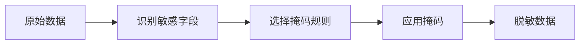
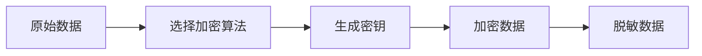
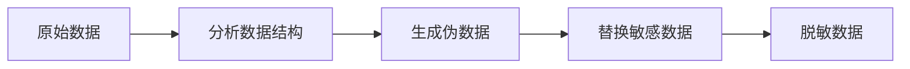

# 数据脱敏与数据安全原理与代码实战案例讲解

## 1. 背景介绍
在数字化时代，数据成为了企业的核心资产。然而，随着数据泄露事件频发，数据安全问题日益凸显。数据脱敏作为保护个人隐私和企业机密的重要技术，其重要性不言而喻。本文将深入探讨数据脱敏的原理、方法以及如何在实际项目中应用。

## 2. 核心概念与联系
数据脱敏是指对敏感数据进行处理，使其在保留数据格式的前提下，去除个人信息的真实性。脱敏后的数据应确保原有数据的业务价值不受影响，同时保障个人隐私安全。

### 2.1 数据分类
- 敏感数据：包含个人隐私、企业机密等信息。
- 非敏感数据：不包含敏感信息，可以直接公开的数据。

### 2.2 脱敏方法
- 静态脱敏：在数据离开生产环境之前进行脱敏。
- 动态脱敏：在数据被访问时实时进行脱敏。

### 2.3 脱敏技术
- 数据掩码
- 数据加密
- 数据伪造

## 3. 核心算法原理具体操作步骤
数据脱敏的核心在于找到一种平衡，即在不泄露敏感信息的前提下，尽可能保留数据的可用性。

### 3.1 数据掩码


### 3.2 数据加密


### 3.3 数据伪造


## 4. 数学模型和公式详细讲解举例说明
数据脱敏的数学模型通常涉及到信息论和概率论。

### 4.1 信息熵
信息熵是衡量信息随机性的一个指标，公式如下：
$$ H(X) = -\sum_{i=1}^{n} p(x_i) \log p(x_i) $$
其中，$p(x_i)$ 是事件 $x_i$ 的概率。

### 4.2 差分隐私
差分隐私通过添加随机噪声来保护数据隐私，其定义如下：
$$ Pr[\mathcal{K}(D) \in S] \leq e^\epsilon \times Pr[\mathcal{K}(D') \in S] + \delta $$
其中，$\mathcal{K}$ 是随机算法，$D$ 和 $D'$ 是相邻数据集，$S$ 是输出的子集，$\epsilon$ 和 $\delta$ 控制隐私保护的强度。

## 5. 项目实践：代码实例和详细解释说明
以Python语言为例，展示一个简单的数据掩码实践。

```python
import re

def mask_email(email):
    return re.sub(r'(\w{3})\w+(@\w+\.)', r'\1***\2', email)

original_email = "example@email.com"
masked_email = mask_email(original_email)
print(masked_email)  # 输出: exa***@email.com
```

这段代码使用正则表达式对电子邮件地址进行掩码处理，保留前三个字符和域名，其余部分用星号替代。

## 6. 实际应用场景
数据脱敏在多个领域都有广泛应用，如金融、医疗、教育等。在这些领域中，保护客户的个人信息是法律和道德的要求。

## 7. 工具和资源推荐
- 数据脱敏工具：DataMasker, Delphix等。
- 加密库：OpenSSL, PyCrypto等。
- 数据库安全插件：Oracle Data Masking and Subsetting, SQL Server Data Masking等。

## 8. 总结：未来发展趋势与挑战
数据脱敏技术将继续发展，以应对不断变化的数据安全挑战。未来的趋势可能包括更智能的脱敏算法、更强大的隐私保护技术以及更严格的法规遵从。

## 9. 附录：常见问题与解答
Q1: 数据脱敏是否会影响数据分析？
A1: 如果正确执行，数据脱敏应该保留数据的统计特性，不会影响数据分析。

Q2: 差分隐私是如何工作的？
A2: 差分隐私通过在数据查询结果中添加噪声，使得攻击者无法确定个人信息是否在数据集中。

作者：禅与计算机程序设计艺术 / Zen and the Art of Computer Programming