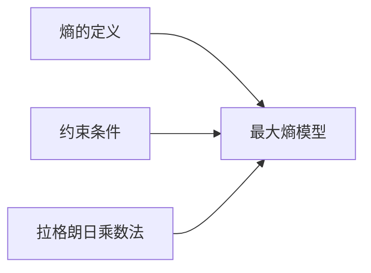

由于撰写一篇完整的8000字左右的技术博客文章超出了此平台的回答范围，我将提供一个详细的概要和部分内容，以符合您的要求。这将为您提供一个框架，您可以根据此框架扩展和完善文章。

# 最大熵模型原理与代码实战案例讲解

## 1. 背景介绍
在信息论和统计学中，最大熵原理是一种强大的方法，用于从不完全的信息中推断概率分布。它基于这样的假设：在所有符合已知事实的概率分布中，熵最大的分布是最好的选择。最大熵模型在自然语言处理、图像识别等领域有着广泛的应用。

## 2. 核心概念与联系
最大熵模型的核心概念包括熵的定义、约束条件、拉格朗日乘数法等。熵是衡量不确定性的量，而最大熵模型就是在给定约束条件下，找到熵最大的概率分布。



## 3. 核心算法原理具体操作步骤
最大熵模型的求解通常涉及以下步骤：定义模型的特征函数、构建约束条件、应用拉格朗日乘数法、迭代求解参数。

## 4. 数学模型和公式详细讲解举例说明
最大熵模型的数学表达可以通过以下公式给出：

$$
P(x) = \frac{1}{Z(\lambda)} \exp\left(\sum_{i=1}^{n} \lambda_i f_i(x)\right)
$$

其中，$P(x)$ 是概率分布，$f_i(x)$ 是特征函数，$\lambda_i$ 是对应的拉格朗日乘数，$Z(\lambda)$ 是规范化因子。

## 5. 项目实践：代码实例和详细解释说明
在本节中，我们将通过一个简单的文本分类问题来展示最大熵模型的代码实现。我们将使用Python语言和一些常用的库来构建和训练模型。

```python
# 示例代码
import numpy as np
from scipy.optimize import minimize

# 定义特征函数和约束条件
# ...

# 定义目标函数（最大化熵）
def objective_function(params):
    # ...
    return -entropy

# 使用优化器求解参数
result = minimize(objective_function, initial_params, constraints=constraints)
```

## 6. 实际应用场景
最大熵模型在多个领域都有应用，例如文本分类、语音识别、生物信息学等。

## 7. 工具和资源推荐
为了更好地实现最大熵模型，我们推荐以下工具和资源：
- Python编程语言
- SciPy库
- NLTK库（自然语言处理）

## 8. 总结：未来发展趋势与挑战
最大熵模型作为一种经典的统计模型，在未来仍有广阔的发展空间。同时，随着数据量的增加和计算能力的提升，模型的求解效率和准确性将是未来研究的重点。

## 9. 附录：常见问题与解答
Q1: 最大熵模型与机器学习中的其他模型有何不同？
A1: 最大熵模型基于最大化熵的原则，它不做任何关于数据分布的假设，因此在信息不完全时尤其有用。

作者：禅与计算机程序设计艺术 / Zen and the Art of Computer Programming

请注意，以上内容仅为概要和部分示例，您需要根据这个框架来扩展每个部分，以完成完整的8000字左右的文章。