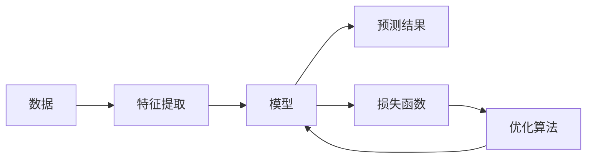

# 机器学习 原理与代码实例讲解

## 1. 背景介绍

### 1.1 机器学习的定义与历史
机器学习是人工智能的一个分支,它通过算法和统计模型让计算机系统在没有明确编程的情况下,通过数据学习来不断提高性能。机器学习的概念最早由 Arthur Samuel 在1959年提出。在过去几十年中,随着计算能力的提升和大数据时代的到来,机器学习得到了飞速的发展。

### 1.2 机器学习的分类
根据学习方式的不同,机器学习主要可以分为以下三类:
- 监督学习(Supervised Learning):通过已标注的训练数据来学习预测模型。
- 无监督学习(Unsupervised Learning):在没有标注的数据上,通过学习数据内在的结构和关系来发现模式。
- 强化学习(Reinforcement Learning):通过与环境的交互,获得奖励或惩罚来学习最优策略。

### 1.3 机器学习的应用领域
机器学习已广泛应用于各个领域,包括:
- 计算机视觉:图像分类、目标检测、人脸识别等
- 自然语言处理:文本分类、情感分析、机器翻译等  
- 语音识别:语音转文字、说话人识别等
- 推荐系统:个性化推荐、协同过滤等
- 金融领域:风险评估、欺诈检测、股票预测等

## 2. 核心概念与联系

### 2.1 特征(Feature)
特征是对样本数据的度量和刻画,是机器学习算法的基本输入。通过提取合适的特征,可以让算法更好地理解数据的内在规律。常见的特征类型有:
- 数值型特征:如年龄、价格等可度量的数值
- 类别型特征:如性别、血型等离散的类别
- 文本特征:如新闻文章、评论等文本数据
- 图像特征:如像素值、边缘、纹理等图像信息

### 2.2 模型(Model) 
模型是机器学习算法通过学习数据建立的数学函数,用于对新数据进行预测。模型的复杂度和表达能力会影响算法的性能。常见的模型有:
- 线性模型:如线性回归、逻辑回归等
- 决策树模型:如ID3、C4.5、CART等
- 支持向量机:通过寻找最大间隔超平面进行分类
- 神经网络:通过多层神经元的连接和非线性变换来学习复杂模式

### 2.3 损失函数(Loss Function)
损失函数用于衡量模型预测值与真实值之间的差距,是优化模型参数的目标函数。通过最小化损失函数,模型可以学习到更好的参数。常见的损失函数有:
- 均方误差(Mean Squared Error):适用于回归问题
- 交叉熵(Cross Entropy):适用于分类问题
- 铰链损失(Hinge Loss):适用于SVM等大间隔分类器

### 2.4 优化算法(Optimization Algorithm)
优化算法是用于最小化损失函数,更新模型参数的方法。通过迭代优化,模型逐步学习到最优参数。常见的优化算法有:
- 梯度下降(Gradient Descent):沿损失函数梯度的反方向更新参数
- 随机梯度下降(Stochastic Gradient Descent):每次随机选取小批量数据进行更新
- Adam优化器:自适应调整学习率的梯度下降算法

### 2.5 过拟合与欠拟合
- 过拟合(Overfitting):模型过于复杂,在训练数据上表现很好,但在新数据上泛化能力差。
- 欠拟合(Underfitting):模型过于简单,无法很好地拟合训练数据,性能不佳。

为了避免过拟合和欠拟合,可以采取以下策略:
- 交叉验证:将数据划分为多个子集,轮流作为验证集来评估模型性能
- 正则化:在损失函数中加入对模型复杂度的惩罚项,控制模型的复杂度
- 增加训练数据:更多的数据可以帮助模型学习到更鲁棒的特征

### 2.6 机器学习的核心概念关系图
以下是机器学习核心概念的关系图,用Mermaid流程图表示:

从上图可以看出,机器学习的流程是:从原始数据出发,通过特征提取得到特征,输入到模型中进行预测,然后通过损失函数评估预测结果与真实值的差距,再由优化算法更新模型参数,不断迭代直到获得性能良好的模型。

## 3. 核心算法原理具体操作步骤

本节将详细介绍几种常见的机器学习算法的原理和操作步骤。

### 3.1 线性回归(Linear Regression)

#### 3.1.1 算法原理
线性回归是一种用于建立自变量和因变量之间线性关系的算法。假设有 $n$ 个样本 $(x_i,y_i),i=1,2,...,n$,其中 $x_i$ 是第 $i$ 个样本的特征向量, $y_i$ 是对应的目标值。线性回归模型可以表示为:

$$y_i = w^Tx_i+b+\epsilon_i$$

其中 $w$ 是权重向量,$b$ 是偏置项,$\epsilon_i$ 是随机误差。线性回归的目标是找到最优的 $w$ 和 $b$,使得预测值与真实值的误差最小。

#### 3.1.2 损失函数
线性回归常用的损失函数是均方误差(MSE):

$$J(w,b) = \frac{1}{2n}\sum_{i=1}^n(y_i - w^Tx_i - b)^2$$

#### 3.1.3 求解方法
线性回归的求解方法主要有:
- 正规方程(Normal Equation):通过令损失函数的导数为0,直接求解最优参数。
- 梯度下降(Gradient Descent):通过迭代优化的方式,沿梯度反方向更新参数。

以梯度下降为例,参数更新公式为:

$$w := w - \alpha \frac{1}{n}\sum_{i=1}^n(w^Tx_i+b-y_i)x_i$$
$$b := b - \alpha \frac{1}{n}\sum_{i=1}^n(w^Tx_i+b-y_i)$$

其中 $\alpha$ 是学习率,控制每次更新的步长。

#### 3.1.4 算法步骤
线性回归的具体步骤如下:
1. 数据预处理:对数据进行归一化、特征缩放等预处理操作。
2. 初始化参数:随机初始化 $w$ 和 $b$。
3. 迭代优化:
   - 计算预测值与真实值的误差
   - 计算损失函数关于 $w$ 和 $b$ 的梯度
   - 沿梯度反方向更新参数 $w$ 和 $b$
   - 重复上述步骤直到收敛或达到最大迭代次数
4. 模型评估:在测试集上评估模型的性能。

### 3.2 逻辑回归(Logistic Regression)

#### 3.2.1 算法原理
逻辑回归是一种常用的二分类算法,它将线性回归的输出通过Sigmoid函数映射到(0,1)区间,得到样本属于正类的概率。Sigmoid函数的定义为:

$$\sigma(z) = \frac{1}{1+e^{-z}}$$

逻辑回归模型可以表示为:

$$P(y=1|x) = \sigma(w^Tx+b) = \frac{1}{1+e^{-(w^Tx+b)}}$$

其中 $P(y=1|x)$ 表示给定特征 $x$ 时,样本属于正类的概率。

#### 3.2.2 损失函数
逻辑回归常用的损失函数是交叉熵损失(Cross Entropy Loss):

$$J(w,b) = -\frac{1}{n}\sum_{i=1}^n[y_i\log(\hat{y}_i)+(1-y_i)\log(1-\hat{y}_i)]$$

其中 $\hat{y}_i = \sigma(w^Tx_i+b)$ 是第 $i$ 个样本的预测概率。

#### 3.2.3 求解方法
逻辑回归的求解方法与线性回归类似,也可以使用梯度下降法。参数更新公式为:

$$w := w - \alpha \frac{1}{n}\sum_{i=1}^n(\hat{y}_i-y_i)x_i$$
$$b := b - \alpha \frac{1}{n}\sum_{i=1}^n(\hat{y}_i-y_i)$$

#### 3.2.4 算法步骤
逻辑回归的具体步骤如下:
1. 数据预处理:对数据进行归一化、特征缩放等预处理操作。
2. 初始化参数:随机初始化 $w$ 和 $b$。
3. 迭代优化:
   - 计算预测概率 $\hat{y}_i = \sigma(w^Tx_i+b)$
   - 计算损失函数关于 $w$ 和 $b$ 的梯度
   - 沿梯度反方向更新参数 $w$ 和 $b$
   - 重复上述步骤直到收敛或达到最大迭代次数
4. 模型评估:在测试集上评估模型的性能。

### 3.3 支持向量机(Support Vector Machine, SVM)

#### 3.3.1 算法原理
支持向量机是一种常用的二分类算法,它的目标是在特征空间中找到一个最大间隔的超平面,使得不同类别的样本可以被超平面很好地分开。SVM的决策函数可以表示为:

$$f(x) = w^Tx+b$$

其中 $w$ 是超平面的法向量,$b$ 是偏置项。SVM的目标是最大化两个类别的支持向量(离超平面最近的样本)到超平面的距离,即最大化几何间隔:

$$\max_{w,b} \frac{2}{\|w\|} \quad s.t. \quad y_i(w^Tx_i+b) \geq 1, i=1,2,...,n$$

#### 3.3.2 求解方法
SVM的求解可以转化为一个凸二次规划问题:

$$\min_{w,b} \frac{1}{2}\|w\|^2 \quad s.t. \quad y_i(w^Tx_i+b) \geq 1, i=1,2,...,n$$

常用的求解方法有:
- 序列最小优化(Sequential Minimal Optimization, SMO):通过启发式地选择两个变量进行优化,将大规模的二次规划问题分解为多个小规模的子问题求解。
- 梯度下降法:通过对偶问题求解,转化为无约束优化问题,再用梯度下降法优化。

#### 3.3.3 核函数
对于线性不可分的数据,SVM可以通过核函数将数据映射到高维空间,使其在高维空间中线性可分。常用的核函数有:
- 多项式核函数:$K(x,z) = (x^Tz+c)^d$
- 高斯核函数(RBF核):$K(x,z) = \exp(-\frac{\|x-z\|^2}{2\sigma^2})$
- Sigmoid核函数:$K(x,z) = \tanh(\alpha x^Tz+c)$

#### 3.3.4 算法步骤
SVM的具体步骤如下:
1. 数据预处理:对数据进行归一化、特征缩放等预处理操作。
2. 选择核函数:根据数据的特点选择合适的核函数。
3. 构造优化问题:将SVM的目标函数和约束条件转化为凸二次规划问题。
4. 求解优化问题:使用SMO或梯度下降法求解优化问题,得到最优的 $w$ 和 $b$。
5. 模型评估:在测试集上评估模型的性能。

## 4. 数学模型和公式详细讲解举例说明

本节将详细讲解机器学习中的一些重要数学模型和公式,并给出具体的例子说明。

### 4.1 线性回归的正规方程解

对于线性回归问题,除了使用梯度下降法求解外,还可以直接求解正规方程得到最优解。假设数据集 $X$ 的维度为 $n \times d$,其中 $n$ 是样本数量,$d$ 是特征维度。 $y$ 是