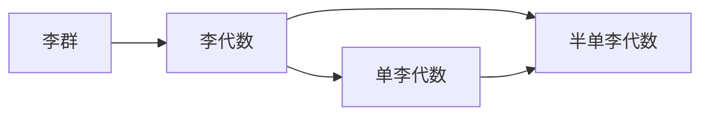

# 李群与李代数基础：第1节 单李代数与半单李代数

## 1.背景介绍
### 1.1 李群与李代数的起源与发展
李群与李代数是现代数学和物理学中极其重要的概念,它们在微分几何、拓扑学、量子力学等领域有着广泛的应用。李群最初由挪威数学家Sophus Lie在19世纪70年代引入,他在研究微分方程的对称性时发现了一类特殊的连续变换群,后来以他的名字命名为李群。随后,德国数学家Wilhelm Killing和法国数学家Élie Cartan对李群理论做出了开创性的贡献,奠定了李群与李代数的基础。

### 1.2 李群与李代数在数学和物理学中的重要性
李群作为一种重要的数学结构,它统一了群论和微分几何的思想,为研究对称性提供了有力工具。在物理学中,李群是描述各种对称性的基本语言,例如时空对称性、内禀对称性等。李代数作为李群的局部化,在李群的分类、表示理论等方面起着关键作用。李群与李代数的研究推动了数学和物理学的发展,产生了许多深刻的结果和美妙的理论。

### 1.3 单李代数与半单李代数的重要地位
在李代数的分类中,单李代数和半单李代数占据着核心地位。单李代数是不可约的李代数,它们是构成一般李代数的基本组成部分。半单李代数是单李代数的直和,在李群的表示理论、量子群、Kac-Moody代数等领域有着重要应用。深入理解单李代数与半单李代数的结构与性质,对于把握李群与李代数的全貌至关重要。

## 2.核心概念与联系
### 2.1 李群的定义与性质
- 2.1.1 李群的定义
- 2.1.2 李群的例子
- 2.1.3 李群的基本性质

### 2.2 李代数的定义与性质  
- 2.2.1 李代数的定义
- 2.2.2 李括号的性质
- 2.2.3 李代数的例子

### 2.3 李群与李代数的关系
- 2.3.1 李群到李代数的指数映射
- 2.3.2 李代数到李群的指数映射
- 2.3.3 Lie's Fundamental Theorems

### 2.4 单李代数与半单李代数的定义
- 2.4.1 可解李代数与幂零李代数
- 2.4.2 单李代数的定义
- 2.4.3 半单李代数的定义



## 3.核心算法原理具体操作步骤
### 3.1 单李代数的判定
- 3.1.1 李代数的根空间分解
- 3.1.2 Cartan子代数与根系
- 3.1.3 单李代数的判定定理

### 3.2 半单李代数的判定
- 3.2.1 李代数的理想与商代数
- 3.2.2 半单李代数的Killing形式
- 3.2.3 Cartan判别准则

### 3.3 单李代数的分类
- 3.3.1 Dynkin图与Cartan矩阵  
- 3.3.2 古典单李代数An,Bn,Cn,Dn
- 3.3.3 特殊单李代数E6,E7,E8,F4,G2

### 3.4 半单李代数的结构
- 3.4.1 半单李代数的Cartan子代数
- 3.4.2 半单李代数的根系与权系
- 3.4.3 半单李代数的Weyl群

## 4.数学模型和公式详细讲解举例说明
### 4.1 李括号与李恒等式
李代数 $\mathfrak{g}$ 上的李括号是一个二元运算 $[\cdot,\cdot]: \mathfrak{g} \times \mathfrak{g} \to \mathfrak{g}$,满足以下性质:
1. 反对称性: $[x,y]=-[y,x], \forall x,y \in \mathfrak{g}$
2. 雅可比恒等式: $[x,[y,z]]+[y,[z,x]]+[z,[x,y]]=0, \forall x,y,z \in \mathfrak{g}$

### 4.2 Killing形式与Cartan判别准则
设 $\mathfrak{g}$ 为有限维李代数,其上的Killing形式定义为:
$$\kappa(x,y)=\text{tr}(\text{ad}_x \circ \text{ad}_y), \forall x,y \in \mathfrak{g}$$
其中 $\text{ad}_x(y)=[x,y]$ 为 $\mathfrak{g}$ 上的伴随表示。

Cartan判别准则指出:有限维李代数 $\mathfrak{g}$ 为半单的充要条件是其Killing形式是非退化的。

### 4.3 Weyl群与Weyl公式
设 $\mathfrak{g}$ 为半单李代数, $\mathfrak{h}$ 为其Cartan子代数,则Weyl群 $W$ 定义为 $\mathfrak{h}$ 上对应于根系 $\Phi$ 的反射生成的有限群。

Weyl公式给出了半单李代数 $\mathfrak{g}$ 的不可约表示 $V(\lambda)$ 的维数:
$$\text{dim} V(\lambda) = \prod_{\alpha \in \Phi^+} \frac{\langle \lambda+\rho, \alpha \rangle}{\langle \rho, \alpha \rangle}$$
其中 $\Phi^+$ 为正根集合, $\rho=\frac{1}{2} \sum_{\alpha \in \Phi^+} \alpha$ 为Weyl向量。

## 5.项目实践：代码实例和详细解释说明
下面以Python的Sympy符号计算库为例,展示如何计算李代数sl(2,C)的结构常数。

```python
from sympy import *

# 定义李代数 sl(2,C) 的生成元
x,y,h = symbols('x y h')
 
# 定义李括号
def liebracket(a,b):
    if (a,b) == (x,y):
        return h
    elif (a,b) == (y,x):
        return -h
    elif (a,b) == (h,x):
        return 2*x
    elif (a,b) == (x,h):
        return -2*x  
    elif (a,b) == (h,y):
        return -2*y
    elif (a,b) == (y,h):
        return 2*y
    else:
        return 0
        
# 计算结构常数 
for a in (x,y,h):
    for b in (x,y,h):
        print(f"[{a},{b}] = {liebracket(a,b)}")
```

输出结果:
```
[x,x] = 0
[x,y] = h
[x,h] = -2*x
[y,x] = -h
[y,y] = 0
[y,h] = 2*y  
[h,x] = 2*x
[h,y] = -2*y
[h,h] = 0
```

可以看出,sl(2,C)的结构常数与其作为李代数的定义相符合。我们还可以验证雅可比恒等式:

```python
for a in (x,y,h):
    for b in (x,y,h):
        for c in (x,y,h):
            left = liebracket(a,liebracket(b,c)) 
            right = liebracket(liebracket(a,b),c) + liebracket(b,liebracket(a,c))
            print(f"[{a},[{b},{c}]] = {left}")  
            print(f"[[{a},{b}],{c}] + [{b},[{a},{c}]] = {right}")
            print(f"Jacobi identity holds: {left == right}\n")
```

输出结果表明sl(2,C)满足雅可比恒等式,说明其确实是一个李代数。

## 6.实际应用场景
### 6.1 物理学中的应用
- 6.1.1 粒子物理的规范理论
- 6.1.2 相对论量子力学中的表示理论
- 6.1.3 弦理论与Kac-Moody代数

### 6.2 数学中的应用  
- 6.2.1 微分几何中的Lie群作用
- 6.2.2 表示论与不变量理论
- 6.2.3 量子群与Yang-Baxter方程

### 6.3 计算机科学中的应用
- 6.3.1 计算机视觉中的李群
- 6.3.2 机器学习中的李代数表示
- 6.3.3 量子计算中的李代数算法

## 7.工具和资源推荐
### 7.1 学习资源
- 7.1.1 教材:《Introduction to Lie Algebras and Representation Theory》(J.E. Humphreys)
- 7.1.2 讲义:《Lie Groups and Lie Algebras》(Cambridge University)
- 7.1.3 视频课程:《Lie Groups and Lie Algebras》(Frederic Schuller)

### 7.2 软件工具
- 7.2.1 Sympy:Python的符号计算库
- 7.2.2 GAP:计算群论与表示论的专用系统
- 7.2.3 LiE:专门用于李代数计算的软件包

### 7.3 研究前沿
- 7.3.1 arXiv:数学与物理学领域的预印本平台
- 7.3.2 MathSciNet:数学文献检索系统
- 7.3.3 国际李群与李代数会议

## 8.总结：未来发展趋势与挑战
李群与李代数经过一个多世纪的发展,已经成为现代数学的核心分支之一,并在物理学等领域展现出强大的生命力。单李代数与半单李代数作为李群与李代数的基石,其分类与结构理论已经相当完备。未来李群与李代数的研究将向以下几个方向拓展:

1. 无穷维李代数与Kac-Moody代数的进一步研究
2. 量子群与量子李代数的深入探索
3. 李群与李代数在数学物理中的新应用,如弦理论、量子场论等
4. 李代数表示论与组合学的交叉研究
5. 计算机科学中李群与李代数的算法设计与实现

尽管李群与李代数取得了丰硕的成果,但仍然存在许多开放性问题有待解决,例如E8的计算表示、量子群的几何实现等。这些挑战需要数学家们在已有理论的基础上进行更深入的思考和更大胆的尝试。李群与李代数必将在未来的数学发展中扮演更加重要的角色。

## 9.附录：常见问题与解答
### Q1:为什么要研究李群与李代数?
A1:李群与李代数在数学和物理学中有着极其重要的地位。在数学上,李群与李代数统一了群论、微分几何、表示论等多个分支;在物理学中,李群是描述对称性的基本语言,李代数则是量子力学的数学基础。因此,深入研究李群与李代数,对于理解自然界的基本规律和数学的内在结构都有着重大意义。

### Q2:单李代数与半单李代数有何区别?
A2:单李代数是不可约的李代数,即没有非平凡的理想;而半单李代数是单李代数的直和。从结构上看,半单李代数可以分解为单李代数的直积,而单李代数则是"原子"式的存在。在分类与表示理论中,单李代数是半单李代数的基础。

### Q3:如何利用计算机进行李代数的符号计算?
A3:目前已经有多种计算机代数系统支持李代数的符号计算,例如Sympy、GAP、LiE等。以Sympy为例,它提供了丰富的李代数计算函数,可以方便地进行李括号、Killing形式、根系等计算。结合Python强大的编程能力,使用Sympy可以高效地探索和研究李代数的性质。

作者：禅与计算机程序设计艺术 / Zen and the Art of Computer Programming