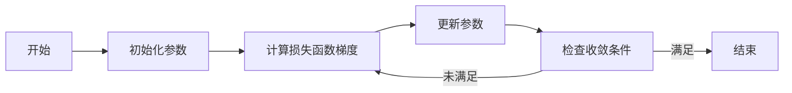

# 梯度下降Gradient Descent原理与代码实例讲解

## 1. 背景介绍

在机器学习和深度学习的世界里，梯度下降（Gradient Descent）是一种基础且极其重要的优化算法。它被广泛应用于模型的训练过程中，用于最小化损失函数，从而找到模型参数的最优解。梯度下降的直观理解是：在多维空间中，沿着损失函数梯度的反方向，逐步调整参数，直至找到损失函数的最小值。

## 2. 核心概念与联系

### 2.1 梯度（Gradient）
梯度是多变量函数在某一点处沿各个自变量增加最快的方向，其大小表示增长速度。

### 2.2 下降（Descent）
下降指的是沿着梯度的反方向，即函数值减小的方向。

### 2.3 学习率（Learning Rate）
学习率决定了在梯度下降过程中每一步移动的距离，过大可能导致超过最小值，过小则会使收敛速度变慢。

### 2.4 损失函数（Loss Function）
损失函数衡量模型预测值与真实值之间的差异，梯度下降的目标是最小化损失函数。

### 2.5 参数更新（Parameter Update）
参数更新是指在每一次迭代中，根据梯度和学习率调整模型参数。

## 3. 核心算法原理具体操作步骤



## 4. 数学模型和公式详细讲解举例说明

梯度下降算法的数学模型可以表示为：

$$
\theta_{t+1} = \theta_t - \eta \cdot \nabla_\theta J(\theta_t)
$$

其中，$\theta$ 表示模型参数，$J(\theta)$ 是损失函数，$\nabla_\theta J(\theta)$ 是损失函数关于参数 $\theta$ 的梯度，$\eta$ 是学习率，$t$ 表示迭代次数。

## 5. 项目实践：代码实例和详细解释说明

以线性回归为例，我们使用梯度下降来优化模型参数：

```python
import numpy as np

# 损失函数
def compute_loss(X, y, theta):
    m = len(y)
    predictions = X.dot(theta)
    loss = (1/2*m) * np.sum(np.square(predictions - y))
    return loss

# 梯度计算
def compute_gradient(X, y, theta):
    m = len(y)
    predictions = X.dot(theta)
    gradient = (1/m) * X.T.dot(predictions - y)
    return gradient

# 梯度下降
def gradient_descent(X, y, theta, learning_rate, iterations):
    loss_history = np.zeros(iterations)
    for i in range(iterations):
        gradient = compute_gradient(X, y, theta)
        theta = theta - learning_rate * gradient
        loss_history[i] = compute_loss(X, y, theta)
    return theta, loss_history

# 示例数据
X = np.array([[1, 1], [1, 2], [1, 3]])
y = np.array([1, 2, 3])
theta = np.array([0, 0])

# 参数设置
learning_rate = 0.01
iterations = 1000

# 执行梯度下降
theta, loss_history = gradient_descent(X, y, theta, learning_rate, iterations)
print("Optimized parameters:", theta)
print("Loss history:", loss_history)
```

## 6. 实际应用场景

梯度下降在机器学习领域有广泛的应用，如线性回归、逻辑回归、神经网络等。

## 7. 工具和资源推荐

- NumPy：进行高效的数值计算。
- Matplotlib：用于绘制损失下降曲线。
- TensorFlow和PyTorch：提供自动梯度计算和优化器。

## 8. 总结：未来发展趋势与挑战

梯度下降作为优化算法的基石，未来的发展趋势在于适应性和并行化。挑战包括如何处理非凸优化问题，以及如何在大数据环境下提高效率。

## 9. 附录：常见问题与解答

Q1: 学习率如何选择？
A1: 通常通过实验来调整，可以使用学习率衰减等技术。

Q2: 如何判断梯度下降是否收敛？
A2: 观察损失函数值的变化，如果变化非常小，则可以认为收敛。

作者：禅与计算机程序设计艺术 / Zen and the Art of Computer Programming