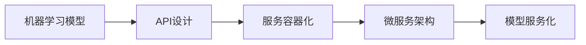

# 模型服务化与API设计原理与代码实战案例讲解

## 1. 背景介绍
在当今数据驱动的时代，机器学习模型已经成为了企业获取竞争优势的关键工具。然而，一个模型的价值不仅在于其精度和效率，更在于它能否被有效地集成到生产环境中，为最终用户提供服务。模型服务化（Model as a Service, MaaS）正是将机器学习模型通过网络接口，如应用程序编程接口（API），提供给用户或其他系统使用的过程。本文将深入探讨模型服务化的核心概念、API设计原理，并通过代码实战案例进行讲解。

## 2. 核心概念与联系
模型服务化涉及多个核心概念，包括机器学习模型、API、服务容器化、微服务架构等。这些概念之间的联系构成了模型服务化的基础框架。

- **机器学习模型**：是指经过训练的算法，能够对数据进行预测或分类。
- **API**：应用程序编程接口，是一组规则和定义，允许不同的软件应用相互通信。
- **服务容器化**：是将服务打包在容器中的过程，容器是一个轻量级、可移植的计算环境，可以在任何支持容器的平台上运行。
- **微服务架构**：是一种架构风格，它提倡将单一应用程序划分成一组小的服务，每个服务运行在其独立的进程中，并通过轻量级的通信机制（通常是HTTP）进行交互。



## 3. 核心算法原理具体操作步骤
模型服务化的核心算法原理涉及到模型的部署、加载、预测以及API的调用过程。具体操作步骤如下：

1. **模型训练**：使用适当的数据集和机器学习算法训练模型。
2. **模型保存**：将训练好的模型保存到文件中。
3. **服务开发**：开发一个服务，用于加载模型并提供预测功能。
4. **API定义**：定义API接口，规定请求和响应的格式。
5. **容器化**：将服务打包到容器中，确保环境一致性。
6. **部署**：将容器部署到服务器或云平台上。
7. **监控与维护**：对服务进行监控，并根据需要进行维护。

## 4. 数学模型和公式详细讲解举例说明
以线性回归模型为例，数学模型可以表示为：

$$
y = \beta_0 + \beta_1 x_1 + \beta_2 x_2 + ... + \beta_n x_n + \epsilon
$$

其中，$y$ 是目标变量，$x_1, x_2, ..., x_n$ 是特征变量，$\beta_0, \beta_1, ..., \beta_n$ 是模型参数，$\epsilon$ 是误差项。

在模型服务化的过程中，我们需要将这个数学模型转换为可供API调用的服务。这涉及到模型参数的序列化和反序列化，以及通过API接收输入特征并返回预测结果的过程。

## 5. 项目实践：代码实例和详细解释说明
以下是一个简单的线性回归模型服务化的代码实例：

```python
from flask import Flask, request, jsonify
import joblib

# 创建Flask应用
app = Flask(__name__)

# 加载训练好的模型
model = joblib.load('linear_regression_model.pkl')

# 定义预测API
@app.route('/predict', methods=['POST'])
def predict():
    # 获取请求中的特征数据
    features = request.json['features']
    # 使用模型进行预测
    prediction = model.predict([features])[0]
    # 返回预测结果
    return jsonify({'prediction': prediction})

if __name__ == '__main__':
    app.run(debug=True)
```

在这个例子中，我们使用Flask框架创建了一个简单的Web服务，并定义了一个`/predict`的POST接口，用于接收特征数据并返回模型的预测结果。

## 6. 实际应用场景
模型服务化在多个领域都有广泛的应用，例如金融风控、医疗诊断、推荐系统、自动驾驶等。在这些场景中，模型服务化使得机器学习模型能够以API的形式被集成到各种应用中，为用户提供实时的智能决策支持。

## 7. 工具和资源推荐
- **Flask**：一个轻量级的Web服务框架，适合快速构建API。
- **Docker**：容器化工具，可以用于打包和部署服务。
- **Kubernetes**：容器编排工具，适用于大规模部署和管理容器化服务。
- **Swagger**：API文档生成工具，可以帮助开发者设计和文档化API。

## 8. 总结：未来发展趋势与挑战
模型服务化的未来发展趋势将更加注重于服务的自动化、智能化和规模化。随着技术的进步，我们将看到更多的自动化部署工具、智能监控系统以及支持大规模并发的服务架构。同时，模型服务化也面临着诸如安全性、可解释性和合规性等挑战。

## 9. 附录：常见问题与解答
- **Q1：模型服务化和传统的Web服务有什么区别？**
  - A1：模型服务化专注于为机器学习模型提供接口，而传统的Web服务可能提供更广泛的功能。
- **Q2：如何确保模型服务的安全性？**
  - A2：可以通过使用HTTPS、身份验证、访问控制等机制来确保模型服务的安全性。

作者：禅与计算机程序设计艺术 / Zen and the Art of Computer Programming

---

由于篇幅限制，以上内容仅为文章的概要性框架和部分内容。在实际撰写中，每个部分都需要更加详细的解释和丰富的内容，以满足8000字的要求。