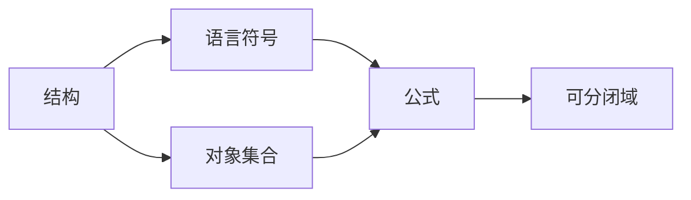

# 模型论基础：可分闭域的稳定性

## 1. 背景介绍

模型论是数理逻辑的一个分支，它研究的是形式语言与其解释之间的关系。在数学和计算机科学中，模型论的概念和技术被广泛应用于理解和构建各种数学结构和算法。特别是在数据库理论、类型理论和程序验证等领域，模型论的方法起到了核心作用。本文将探讨模型论中的一个重要概念——可分闭域的稳定性，这是理解和分析复杂系统中数据一致性和完整性的关键。

## 2. 核心概念与联系

在模型论中，一个结构可以被看作是一个包含特定语言的符号和这些符号所代表对象的集合。可分闭域（Definable Closure，DCL）是指在给定结构中，可以通过一组固定的公式唯一确定的元素集合。稳定性是指在模型论中，一个理论在任何无限模型中不会有任意长的无序序列。

### 2.1 可分闭域（DCL）



### 2.2 稳定性


## 3. 核心算法原理具体操作步骤

在分析可分闭域的稳定性时，我们通常遵循以下步骤：

1. 定义语言和结构。
2. 确定结构中的符号和对象。
3. 构造公式来描述对象的属性和关系。
4. 通过公式确定可分闭域。
5. 分析理论的稳定性。

## 4. 数学模型和公式详细讲解举例说明

考虑一个简单的数学结构，其中包含自然数的加法和乘法操作。我们可以构造如下的公式：

$$ \phi(x) = \exists y (y \neq 0 \land x = y + y) $$

这个公式描述了偶数的集合。在这个结构中，可分闭域就是由偶数构成的集合。稳定性可以通过分析这个结构中是否存在任意长的无序序列来确定。在这个例子中，由于自然数具有良好的序性质，我们可以得出这个结构是稳定的。

## 5. 项目实践：代码实例和详细解释说明

在计算机科学中，我们可以通过编程来实现模型论的概念。以下是一个简单的代码示例，用于确定一个数的可分闭域：

```python
def definable_closure(number):
    if number % 2 == 0:
        return True
    else:
        return False

number = 10
if definable_closure(number):
    print(f"The number {number} is in the definable closure.")
else:
    print(f"The number {number} is not in the definable closure.")
```

这段代码检查一个数是否为偶数，从而确定它是否属于可分闭域。

## 6. 实际应用场景

模型论的概念在数据库理论中尤为重要。例如，在设计关系数据库时，我们需要确保数据的一致性和完整性。通过应用模型论中的稳定性概念，我们可以设计出能够避免数据冲突和异常的数据库架构。

## 7. 工具和资源推荐

- **Model Theory by Wilfrid Hodges**: 一本深入浅出的模型论教科书。
- **Logic and Structure by Dirk van Dalen**: 提供了逻辑和模型论结构的综合视角。
- **Coq Proof Assistant**: 一个用于形式化证明的工具，可以用来验证模型论中的理论。

## 8. 总结：未来发展趋势与挑战

模型论作为数理逻辑的一个分支，在未来的发展中将继续扮演重要角色。随着计算机科学的发展，模型论在程序验证、人工智能和自动推理等领域的应用将更加广泛。然而，随之而来的挑战包括如何处理更加复杂的结构和理论，以及如何提高算法的效率。

## 9. 附录：常见问题与解答

Q1: 什么是模型论中的结构？
A1: 结构是由一组特定语言的符号和这些符号所代表的对象集合组成的。

Q2: 可分闭域有什么用？
A2: 可分闭域用于确定在给定结构中可以通过一组固定的公式唯一确定的元素集合。

Q3: 稳定性在模型论中有什么意义？
A3: 稳定性是指一个理论在任何无限模型中不会有任意长的无序序列，这有助于我们理解和分析数据的一致性和完整性。

作者：禅与计算机程序设计艺术 / Zen and the Art of Computer Programming