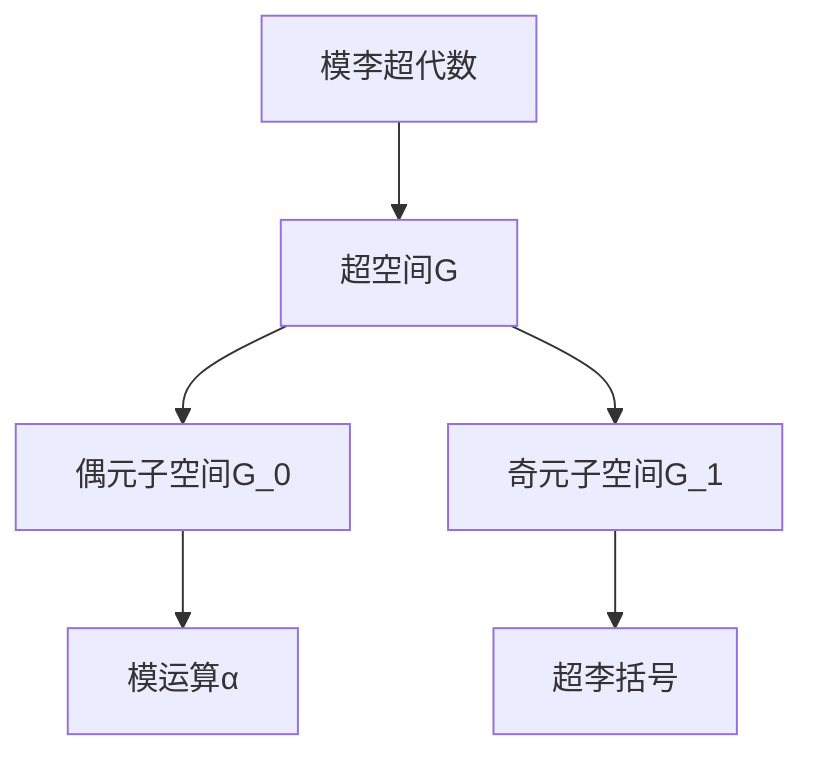

# 模李超代数：单性与导子超代数

## 1.背景介绍

模李超代数(Modular Lie Superalgebras)是一种将模运算和李代数相结合的代数结构,在数学和物理学中扮演着重要角色。它们不仅在数学领域有着广泛的应用,如表示论、量子群论和代数几何等,同时也是研究量子场论、超对称和超引力等物理学前沿理论的重要工具。

模李超代数的概念源于20世纪60年代,当时数学家们试图将费米子和玻色子的统计性质纳入代数结构中。随后,模李超代数理论逐渐发展并在多个领域取得了重大进展。其中,单性(Modularity)和导子超代数(Derivation Superalgebras)是模李超代数研究中的两个关键概念。

### 1.1 单性的重要性

单性是指模李超代数在某些条件下具有周期性或循环对称性。这种性质不仅在数学上具有重要意义,而且与物理学中的一些基本原理密切相关,如量子力学中的周期性边界条件和弦论中的紧致性条件等。研究单性有助于深入理解这些物理现象的数学结构。

### 1.2 导子超代数的作用

导子超代数是模李超代数的一种特殊情况,它描述了模李超代数上的导子(Derivations)的代数结构。导子超代数不仅在代数几何和表示论中有着重要应用,而且与模空间的变形理论密切相关,对于研究量子场论中的对称性破缺等问题也具有重要意义。

## 2.核心概念与联系

### 2.1 模李超代数的定义

模李超代数是一个五元组 $(\mathcal{G}, \mathcal{G}_{\overline{0}}, \mathcal{G}_{\overline{1}}, [\cdot,\cdot], \alpha)$,其中:

- $\mathcal{G}$ 是一个 $\mathbb{Z}_2$-贮体(超空间)上的李代数;
- $\mathcal{G}_{\overline{0}}$ 和 $\mathcal{G}_{\overline{1}}$ 分别是 $\mathcal{G}$ 中的偶元和奇元子空间,满足 $\mathcal{G} = \mathcal{G}_{\overline{0}} \oplus \mathcal{G}_{\overline{1}}$;
- $[\cdot,\cdot]$ 是 $\mathcal{G}$ 上的超李括号(Superbracket),满足超交换关系和超雅可比恒等式;
- $\alpha$ 是 $\mathcal{G}_{\overline{0}}$ 上的一个可结合代数,使得 $\mathcal{G}_{\overline{0}}$ 成为 $\alpha$ 的模空间,并且 $[\mathcal{G}_{\overline{0}}, \mathcal{G}_{\overline{1}}] \subseteq \mathcal{G}_{\overline{1}}$。

模李超代数将模运算和李括号相结合,使其能够同时描述玻色子和费米子的代数结构。



### 2.2 单性的定义

设 $\mathcal{G}$ 是一个模李超代数, $V$ 是 $\mathcal{G}_{\overline{0}}$ 的一个模空间。如果存在一个正整数 $N$,使得对于任意 $x \in \mathcal{G}_{\overline{0}}$ 和 $v \in V$,都有 $x^N \cdot v = 0$,则称 $V$ 是 $\mathcal{G}_{\overline{0}}$ 的一个单模空间,而 $\mathcal{G}$ 被称为单模李超代数。

单性反映了模李超代数在某些条件下的周期性或循环对称性,这种性质在研究物理学中的一些基本原理时扮演着重要角色。

### 2.3 导子超代数的定义

设 $\mathcal{G}$ 是一个模李超代数,则 $\mathcal{G}$ 上的导子(Derivations)集合 $\operatorname{Der}(\mathcal{G})$ 构成一个李超代数,称为 $\mathcal{G}$ 的导子超代数。具体来说,对于任意 $D \in \operatorname{Der}(\mathcal{G})$,我们有:

- $D$ 是 $\mathcal{G}$ 上的线性映射;
- $D$ 满足导子恒等式: $D([x,y]) = [D(x),y] + (-1)^{|x||D|}[x,D(y)]$, 其中 $|x|$ 和 $|D|$ 分别表示 $x$ 和 $D$ 的 $\mathbb{Z}_2$-度数。

导子超代数不仅在代数几何和表示论中有着重要应用,而且与模空间的变形理论密切相关,对于研究量子场论中的对称性破缺等问题也具有重要意义。

## 3.核心算法原理具体操作步骤

### 3.1 单模空间的判定

判断一个模空间 $V$ 是否为模李超代数 $\mathcal{G}$ 的单模空间,可以按照以下步骤进行:

1. 确定 $\mathcal{G}$ 的偶元子空间 $\mathcal{G}_{\overline{0}}$ 及其模运算 $\alpha$;
2. 对于任意 $x \in \mathcal{G}_{\overline{0}}$ 和 $v \in V$,计算 $x \cdot v, x^2 \cdot v, \ldots, x^n \cdot v, \ldots$;
3. 如果存在一个正整数 $N$,使得对于所有 $x \in \mathcal{G}_{\overline{0}}$ 和 $v \in V$,都有 $x^N \cdot v = 0$,则 $V$ 是 $\mathcal{G}_{\overline{0}}$ 的单模空间,从而 $\mathcal{G}$ 是单模李超代数。

### 3.2 导子超代数的构造

对于一个给定的模李超代数 $\mathcal{G}$,构造其导子超代数 $\operatorname{Der}(\mathcal{G})$ 的步骤如下:

1. 确定 $\mathcal{G}$ 的偶元子空间 $\mathcal{G}_{\overline{0}}$ 和奇元子空间 $\mathcal{G}_{\overline{1}}$;
2. 找出所有满足导子恒等式的线性映射 $D: \mathcal{G} \rightarrow \mathcal{G}$,这些映射构成 $\operatorname{Der}(\mathcal{G})$ 的元素;
3. 在 $\operatorname{Der}(\mathcal{G})$ 上引入超李括号 $[\cdot,\cdot]_D$,对于任意 $D_1, D_2 \in \operatorname{Der}(\mathcal{G})$,定义:
   $$
   [D_1, D_2]_D(x) = D_1(D_2(x)) - (-1)^{|D_1||D_2|}D_2(D_1(x));
   $$
4. 验证 $\operatorname{Der}(\mathcal{G})$ 在这个超李括号下构成一个李超代数。

通过上述步骤,我们就可以从一个模李超代数 $\mathcal{G}$ 出发,构造出它的导子超代数 $\operatorname{Der}(\mathcal{G})$。

## 4.数学模型和公式详细讲解举例说明

### 4.1 模李超代数的表示

设 $\mathcal{G}$ 是一个模李超代数,而 $V$ 是 $\mathcal{G}_{\overline{0}}$ 的一个模空间。那么 $V$ 也可以看作是 $\mathcal{G}$ 的一个表示,称为 $\mathcal{G}$ 在 $V$ 上的表示,记作 $\rho: \mathcal{G} \rightarrow \operatorname{gl}(V)$。这里 $\operatorname{gl}(V)$ 表示 $V$ 上所有线性映射的集合,它构成一个李代数,其李括号定义为:

$$
[f,g] = f \circ g - (-1)^{|f||g|}g \circ f, \quad \forall f, g \in \operatorname{gl}(V).
$$

$\rho$ 是一个李超代数同态,即对于任意 $x, y \in \mathcal{G}$,都有:

$$
\rho([x,y]) = [\rho(x), \rho(y)].
$$

模李超代数的表示理论为我们研究它们的结构提供了重要工具。例如,我们可以通过分解模空间 $V$ 来了解模李超代数的不可约表示。

### 4.2 单模空间的例子

考虑模李超代数 $\mathcal{G} = \mathfrak{gl}(1|1)$,它是 $(1|1)$ 阶超矩阵的李超代数。其偶元子空间为:

$$
\mathcal{G}_{\overline{0}} = \left\{\begin{pmatrix}
a & 0 \\
0 & b
\end{pmatrix} \mid a, b \in \mathbb{C}\right\},
$$

而奇元子空间为:

$$
\mathcal{G}_{\overline{1}} = \left\{\begin{pmatrix}
0 & \alpha \\
\beta & 0
\end{pmatrix} \mid \alpha, \beta \in \mathbb{C}\right\}.
$$

我们可以证明,对于任意正整数 $N$,都存在 $x \in \mathcal{G}_{\overline{0}}$ 和 $v \in \mathbb{C}^{1|1}$,使得 $x^N \cdot v \neq 0$。因此,在这个例子中,模李超代数 $\mathfrak{gl}(1|1)$ 没有非平凡的单模空间。

### 4.3 导子超代数的例子

考虑模李超代数 $\mathcal{G} = \mathfrak{osp}(1|2)$,它是奇正交李超代数。我们可以证明,其导子超代数 $\operatorname{Der}(\mathfrak{osp}(1|2))$ 同构于 $\mathfrak{osp}(1|2)$ 本身。

具体来说,对于任意 $X \in \mathfrak{osp}(1|2)$,我们可以定义一个线性映射 $\operatorname{ad}_X: \mathfrak{osp}(1|2) \rightarrow \mathfrak{osp}(1|2)$ 如下:

$$
\operatorname{ad}_X(Y) = [X, Y], \quad \forall Y \in \mathfrak{osp}(1|2).
$$

可以验证,所有这些 $\operatorname{ad}_X$ 都是 $\mathfrak{osp}(1|2)$ 的导子,并且映射 $X \mapsto \operatorname{ad}_X$ 给出了 $\mathfrak{osp}(1|2)$ 到 $\operatorname{Der}(\mathfrak{osp}(1|2))$ 的一个李超代数同构。

## 5.项目实践：代码实例和详细解释说明

在这一部分,我们将通过一个实际的代码示例来演示如何计算模李超代数的单模空间和导子超代数。我们将使用 Python 编程语言和 SageMath 库来实现相关算法。

### 5.1 模李超代数的定义

首先,我们需要定义一个模李超代数的数据结构。在 SageMath 中,我们可以使用 `SuperAlgebra` 类来实现这一点。下面是一个示例代码:

```python
from sage.algebras.lie_algebras.lie_algebra import LieAlgebraFromAssociative
from sage.algebras.lie_algebras.lie_algebra_element import LieAlgebraElement
from sage.algebras.lie_algebras.lie_algebra_element import LieAlgebraElementWrapper
from sage.algebras.lie_algebras.lie_algebra_element import LieAlgebraElementWrapped

class ModularLieSuperalgebra(LieAlgebraFromAssociative):
    def __init__(self, R, names, parity, category=None):
        self._parity = parity
        LieAlgebraFromAssociative.__init__(self, R, names, category)

    def _lie_bracket_(self, x, y):
        return self.bracket(x, y)

    def bracket(self, x, y):
        x_parity = self._parity[x.lm()]
        y_parity = self._parity[y.lm()]
        return LieAlgebraElementWrapped(x * y - (-1)**(x_parity * y_parity) * y * x)

    def even_subalgebra(self):
        return self.submodule(self.even_elements())

    def odd_subalgebra(self):
        return self.submodule(self.odd_elements())

    def even_elements(self):
        return [x for x in self.basis() if self._parity[x.lm()] == 0]

    def odd_elements