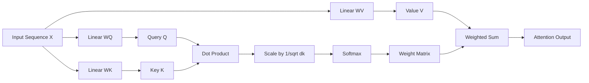

# 注意力机制中的Q、K、V

## 1. 背景介绍

### 1.1 注意力机制的起源与发展

注意力机制(Attention Mechanism)是深度学习领域中一个重要的概念,尤其在自然语言处理(NLP)和计算机视觉(CV)等领域得到了广泛应用。早在2014年,Bahdanau等人在论文《Neural Machine Translation by Jointly Learning to Align and Translate》中首次提出了注意力机制的概念,用于解决传统的编码器-解码器(Encoder-Decoder)模型在处理长序列时存在的问题。

此后,注意力机制迅速成为了学术界和工业界的研究热点。2017年,Google提出了Transformer模型,该模型完全基于注意力机制构建,摒弃了传统的循环神经网络(RNN)和卷积神经网络(CNN),在机器翻译任务上取得了当时最优的效果。Transformer的成功进一步推动了注意力机制的发展,衍生出了一系列基于注意力机制的模型,如BERT、GPT、ViT等,在NLP和CV领域取得了突破性的进展。

### 1.2 注意力机制的核心思想

注意力机制的核心思想是让模型能够自动关注输入序列中的关键信息,赋予不同部分不同的权重,从而更好地捕捉序列间的长距离依赖关系。具体来说,注意力机制通过计算Query(Q)与Key(K)之间的相似度得到权重矩阵,然后用该权重矩阵对Value(V)进行加权求和,得到最终的输出。这种机制使得模型能够在处理当前信息时,有选择性地利用与之相关的上下文信息。

## 2. 核心概念与联系

### 2.1 Query、Key和Value

在注意力机制中,Query(Q)、Key(K)、Value(V)是三个核心概念:

- Query(Q):可以理解为查询向量,用于查询与当前位置最相关的信息。
- Key(K):可以理解为键向量,用于计算与Query的相似度。
- Value(V):可以理解为值向量,存储了实际的信息内容。

通常,Q、K、V都是通过对输入序列进行线性变换得到的:

$$
\begin{aligned}
Q &= W_Q X \\
K &= W_K X \\
V &= W_V X
\end{aligned}
$$

其中,$X$表示输入序列,$W_Q$、$W_K$、$W_V$分别表示对应的权重矩阵。

### 2.2 Q、K、V之间的关系

Q、K、V之间的关系可以用下面的计算过程来表示:

$$
Attention(Q,K,V) = softmax(\frac{QK^T}{\sqrt{d_k}})V
$$

其中,$d_k$表示K的维度,用于对内积结果进行缩放,避免softmax函数的梯度消失问题。

从公式可以看出,注意力机制的计算过程可以分为三步:

1. 计算Q与K的内积,得到相似度矩阵。
2. 对相似度矩阵进行缩放和softmax归一化,得到权重矩阵。
3. 用权重矩阵对V进行加权求和,得到最终的输出。

下图展示了Q、K、V在注意力机制中的计算过程:



## 3. 核心算法原理具体操作步骤

注意力机制的核心算法可以分为以下几个步骤:

### 3.1 计算Q、K、V

首先,需要对输入序列X进行线性变换,得到Q、K、V:

$$
\begin{aligned}
Q &= W_Q X \\
K &= W_K X \\
V &= W_V X
\end{aligned}
$$

其中,$W_Q \in \mathbb{R}^{d_q \times d_x}$,$W_K \in \mathbb{R}^{d_k \times d_x}$,$W_V \in \mathbb{R}^{d_v \times d_x}$分别表示对应的权重矩阵。

### 3.2 计算相似度矩阵

接下来,计算Q与K的内积,得到相似度矩阵:

$$
Similarity = QK^T
$$

其中,$Similarity \in \mathbb{R}^{n \times n}$表示相似度矩阵,$n$表示序列长度。

### 3.3 缩放和归一化

为了避免内积结果过大导致softmax函数的梯度消失,需要对相似度矩阵进行缩放:

$$
Scaled\_Similarity = \frac{Similarity}{\sqrt{d_k}}
$$

然后,对缩放后的相似度矩阵进行softmax归一化,得到权重矩阵:

$$
Weight\_Matrix = softmax(Scaled\_Similarity)
$$

### 3.4 加权求和

最后,用权重矩阵对V进行加权求和,得到最终的输出:

$$
Attention\_Output = Weight\_Matrix \cdot V
$$

其中,$Attention\_Output \in \mathbb{R}^{n \times d_v}$表示注意力机制的输出。

## 4. 数学模型和公式详细讲解举例说明

为了更好地理解注意力机制中Q、K、V的计算过程,下面我们通过一个具体的例子来进行说明。

假设输入序列$X$的维度为$d_x=512$,序列长度为$n=6$,Q、K、V的维度分别为$d_q=d_k=d_v=64$。

### 4.1 计算Q、K、V

首先,我们对输入序列X进行线性变换,得到Q、K、V:

$$
\begin{aligned}
Q &= W_Q X = 
\begin{bmatrix}
q_{11} & q_{12} & \cdots & q_{1n} \\
q_{21} & q_{22} & \cdots & q_{2n} \\
\vdots & \vdots & \ddots & \vdots \\
q_{d_q1} & q_{d_q2} & \cdots & q_{d_qn}
\end{bmatrix} \\
K &= W_K X =
\begin{bmatrix}
k_{11} & k_{12} & \cdots & k_{1n} \\
k_{21} & k_{22} & \cdots & k_{2n} \\
\vdots & \vdots & \ddots & \vdots \\
k_{d_k1} & k_{d_k2} & \cdots & k_{d_kn}
\end{bmatrix} \\
V &= W_V X =
\begin{bmatrix}
v_{11} & v_{12} & \cdots & v_{1n} \\
v_{21} & v_{22} & \cdots & v_{2n} \\
\vdots & \vdots & \ddots & \vdots \\
v_{d_v1} & v_{d_v2} & \cdots & v_{d_vn}
\end{bmatrix}
\end{aligned}
$$

其中,$Q \in \mathbb{R}^{d_q \times n}$,$K \in \mathbb{R}^{d_k \times n}$,$V \in \mathbb{R}^{d_v \times n}$。

### 4.2 计算相似度矩阵

接下来,我们计算Q与K的内积,得到相似度矩阵:

$$
Similarity = QK^T = 
\begin{bmatrix}
s_{11} & s_{12} & \cdots & s_{1n} \\
s_{21} & s_{22} & \cdots & s_{2n} \\
\vdots & \vdots & \ddots & \vdots \\
s_{n1} & s_{n2} & \cdots & s_{nn}
\end{bmatrix}
$$

其中,$s_{ij}$表示第$i$个Query与第$j$个Key的相似度。

### 4.3 缩放和归一化

为了避免内积结果过大,我们对相似度矩阵进行缩放:

$$
Scaled\_Similarity = \frac{Similarity}{\sqrt{d_k}} = 
\begin{bmatrix}
\frac{s_{11}}{\sqrt{64}} & \frac{s_{12}}{\sqrt{64}} & \cdots & \frac{s_{1n}}{\sqrt{64}} \\
\frac{s_{21}}{\sqrt{64}} & \frac{s_{22}}{\sqrt{64}} & \cdots & \frac{s_{2n}}{\sqrt{64}} \\
\vdots & \vdots & \ddots & \vdots \\
\frac{s_{n1}}{\sqrt{64}} & \frac{s_{n2}}{\sqrt{64}} & \cdots & \frac{s_{nn}}{\sqrt{64}}
\end{bmatrix}
$$

然后,对缩放后的相似度矩阵进行softmax归一化,得到权重矩阵:

$$
Weight\_Matrix = softmax(Scaled\_Similarity) = 
\begin{bmatrix}
w_{11} & w_{12} & \cdots & w_{1n} \\
w_{21} & w_{22} & \cdots & w_{2n} \\
\vdots & \vdots & \ddots & \vdots \\
w_{n1} & w_{n2} & \cdots & w_{nn}
\end{bmatrix}
$$

其中,$w_{ij}$表示第$i$个Query对第$j$个Value的注意力权重。

### 4.4 加权求和

最后,我们用权重矩阵对V进行加权求和,得到最终的输出:

$$
Attention\_Output = Weight\_Matrix \cdot V = 
\begin{bmatrix}
o_{11} & o_{12} & \cdots & o_{1d_v} \\
o_{21} & o_{22} & \cdots & o_{2d_v} \\
\vdots & \vdots & \ddots & \vdots \\
o_{n1} & o_{n2} & \cdots & o_{nd_v}
\end{bmatrix}
$$

其中,$o_{ij}$表示第$i$个位置的输出向量的第$j$个元素。

## 5. 项目实践：代码实例和详细解释说明

下面我们用Python代码来实现注意力机制中Q、K、V的计算过程。

```python
import numpy as np

def attention(Q, K, V):
    """
    Attention mechanism.
    
    Args:
        Q: Query matrix with shape (d_q, n)
        K: Key matrix with shape (d_k, n)
        V: Value matrix with shape (d_v, n)
        
    Returns:
        Attention output with shape (n, d_v)
    """
    d_k = K.shape[0]
    
    # Compute similarity matrix
    similarity = np.dot(Q.T, K) / np.sqrt(d_k)
    
    # Compute weight matrix
    weight_matrix = softmax(similarity)
    
    # Compute attention output
    attention_output = np.dot(weight_matrix, V.T)
    
    return attention_output

def softmax(x):
    """
    Softmax function.
    
    Args:
        x: Input matrix
        
    Returns:
        Softmax output
    """
    exp_x = np.exp(x)
    return exp_x / np.sum(exp_x, axis=-1, keepdims=True)

# Example usage
d_x = 512
d_q = d_k = d_v = 64
n = 6

X = np.random.randn(d_x, n)
W_Q = np.random.randn(d_q, d_x)
W_K = np.random.randn(d_k, d_x) 
W_V = np.random.randn(d_v, d_x)

Q = np.dot(W_Q, X)
K = np.dot(W_K, X)
V = np.dot(W_V, X)

attention_output = attention(Q, K, V)
print(attention_output.shape)  # (n, d_v)
```

在上面的代码中,我们首先定义了`attention`函数,用于实现注意力机制的计算过程。函数的输入为Q、K、V矩阵,输出为注意力机制的输出矩阵。

具体步骤如下:

1. 计算相似度矩阵:`similarity = np.dot(Q.T, K) / np.sqrt(d_k)`
2. 对相似度矩阵进行softmax归一化,得到权重矩阵:`weight_matrix = softmax(similarity)`
3. 用权重矩阵对V进行加权求和,得到最终的输出:`attention_output = np.dot(weight_matrix, V.T)`

其中,`softmax`函数用于实现softmax归一化操作。

在示例代码中,我们随机生成了输入序列X以及权重矩阵W_Q、W_K、W_V,然后计算得到Q、K、V矩阵,最后调用`attention`函数得到注意力机制的输出。

## 6. 实际应用场景

注意力机制在自然语言处理和计算机视觉等领域有着广泛的应用,下面列举几个典型的应用场景:

### 6.1 机器翻译

在机器翻译任务中,注意力机制可以