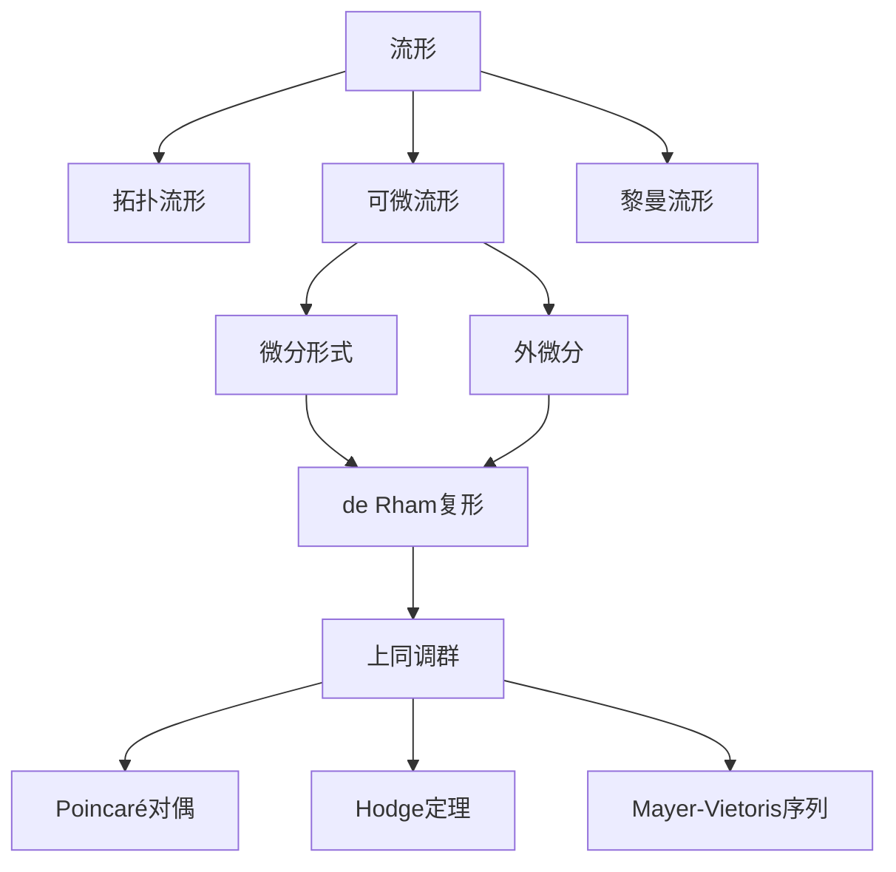

# 流形拓扑学理论与概念的实质：de Rham上同调的几何表示

## 1. 背景介绍
### 1.1 流形拓扑学的发展历程
### 1.2 de Rham上同调的提出与意义
### 1.3 de Rham上同调在流形拓扑学中的地位

## 2. 核心概念与联系
### 2.1 流形的定义与分类
#### 2.1.1 拓扑流形
#### 2.1.2 光滑流形
#### 2.1.3 黎曼流形
### 2.2 微分形式与外微分
#### 2.2.1 微分形式的定义
#### 2.2.2 外微分算子
#### 2.2.3 外代数
### 2.3 de Rham复形与上同调
#### 2.3.1 de Rham复形的构造
#### 2.3.2 上同调群的定义
#### 2.3.3 Poincaré引理

## 3. 核心算法原理具体操作步骤
### 3.1 计算de Rham上同调群的步骤
#### 3.1.1 构造de Rham复形
#### 3.1.2 计算上同调群
#### 3.1.3 同构关系的建立
### 3.2 Mayer-Vietoris序列
#### 3.2.1 Mayer-Vietoris序列的构造
#### 3.2.2 长正合序列
#### 3.2.3 上同调群的计算

## 4. 数学模型和公式详细讲解举例说明
### 4.1 流形上的微分形式
#### 4.1.1 切丛与余切丛
#### 4.1.2 微分形式的坐标表示
#### 4.1.3 外微分的坐标表示
### 4.2 Stokes定理
#### 4.2.1 Stokes定理的陈述
#### 4.2.2 Stokes定理的证明
#### 4.2.3 Stokes定理的应用
### 4.3 Poincaré对偶定理
#### 4.3.1 Poincaré对偶的陈述
#### 4.3.2 Poincaré对偶的证明
#### 4.3.3 Poincaré对偶的应用

## 5. 项目实践：代码实例和详细解释说明
### 5.1 计算流形基本群的Python实现
#### 5.1.1 流形的三角剖分
#### 5.1.2 构造单纯复形
#### 5.1.3 计算基本群
### 5.2 de Rham上同调群的Sage计算
#### 5.2.1 定义流形与微分形式
#### 5.2.2 计算上同调群
#### 5.2.3 同构关系的验证

## 6. 实际应用场景
### 6.1 物理学中的应用
#### 6.1.1 电磁场论
#### 6.1.2 广义相对论
#### 6.1.3 量子场论
### 6.2 计算机图形学中的应用
#### 6.2.1 流形学习
#### 6.2.2 形状分析
#### 6.2.3 三维重建
### 6.3 机器学习中的应用
#### 6.3.1 流形学习
#### 6.3.2 降维算法
#### 6.3.3 拓扑数据分析

## 7. 工具和资源推荐
### 7.1 专业书籍推荐
### 7.2 开源软件工具
### 7.3 在线学习资源

## 8. 总结：未来发展趋势与挑战
### 8.1 流形拓扑学的研究前沿
### 8.2 de Rham上同调的推广与应用
### 8.3 跨学科交叉与融合

## 9. 附录：常见问题与解答
### 9.1 流形与欧氏空间的区别
### 9.2 de Rham上同调与奇异上同调的关系
### 9.3 Hodge定理与Hodge猜想

流形拓扑学是现代数学的一个重要分支,它综合了拓扑学、微分几何以及代数拓扑等多个数学分支的思想和方法,在理论和应用上都有着广泛而深刻的影响。其中,法国数学家Georges de Rham在20世纪30年代提出的de Rham上同调理论,更是流形拓扑学的一个里程碑式的成果。

de Rham上同调理论巧妙地将流形上的微分形式与代数拓扑中的上同调群联系起来,为研究流形的拓扑性质提供了一种全新的视角和强有力的工具。通过引入外微分算子,de Rham构造了一个上链复形,并证明了其上同调群与通常的奇异上同调群是同构的。这一惊人的结果不仅揭示了微分形式的拓扑本质,也为计算流形的拓扑不变量提供了一种高效的方法。

de Rham上同调理论的核心概念包括流形、微分形式、外微分、de Rham复形与上同调群等。其中,流形是一类局部与欧氏空间同胚的拓扑空间,根据附加的结构可分为拓扑流形、可微流形和黎曼流形等。微分形式则是定义在流形上的反对称协变张量场,它们在坐标变换下满足一定的变换律。外微分算子是微分形式上的一个线性算子,它将k次微分形式映射为k+1次微分形式,并满足外代数的运算规则。由外微分算子导出的de Rham复形是一个上链复形,其上同调群刻画了闭形式模与恰当形式之间的商空间,反映了流形的拓扑性质。

在实际计算de Rham上同调群时,通常需要先构造流形上的de Rham复形,然后计算上同调群,并建立与奇异上同调的同构关系。这一过程可以借助于一些重要的定理和技巧,如Poincaré引理、Mayer-Vietoris序列等。此外,Stokes定理揭示了微分形式的积分与边界的关系,是de Rham理论的一个重要组成部分。Poincaré对偶定理则刻画了流形上的上同调与紧支上同调之间的对偶关系,在代数拓扑中有着广泛的应用。

de Rham上同调理论在物理学、计算机图形学、机器学习等领域都有着重要的应用。在物理学中,电磁场可以用微分形式来描述,广义相对论和量子场论也都用到了流形和微分形式的语言。在计算机图形学中,流形学习、形状分析、三维重建等问题都与流形拓扑密切相关。机器学习中的流形学习、降维算法、拓扑数据分析等领域也都借鉴了流形拓扑学的思想和方法。

总的来说,de Rham上同调理论以其深刻的洞见和优雅的构造,成为了现代数学的一颗明珠。它不仅推动了流形拓扑学的发展,也为其他数学分支和应用领域提供了新的思路和方法。随着数学和科学技术的不断进步,de Rham上同调理论必将迎来更加广阔的发展前景,并在跨学科交叉与融合中发挥更加重要的作用。

作者：禅与计算机程序设计艺术 / Zen and the Art of Computer Programming