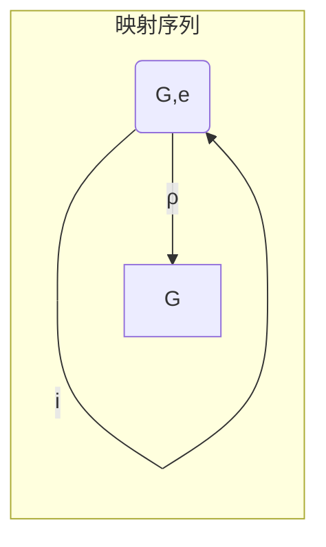

# 流形拓扑学：共轭元的球面定理

## 1.背景介绍

在流形拓扑学中,共轭元(conjugate element)是一个重要概念,它与流形的同伦理论密切相关。共轭元的球面定理(Sphere Theorem for Conjugate Elements)是一个深刻而有趣的结果,揭示了流形中共轭元的拓扑性质。

流形(manifold)是现代几何和拓扑学研究的核心对象。从本质上讲,一个流形是一个局部看起来像欧几里得空间的拓扑空间。流形广泛应用于数学、物理、计算机科学等诸多领域。

### 1.1 流形的基本概念

流形是一种拓扑空间,在每一点都类似于欧几里得空间。更精确地说,一个n维流形M是一个拓扑空间,对于每个点p∈M,存在一个邻域U,使得U同胚于R^n的一个开子集。

流形的基本例子包括球面、环面、投影空间等。一个重要的性质是,在一个紧致(compact)无边界(boundaryless)的流形上,任何两个闭曲面都是同胚的。

### 1.2 同伦理论与共轭元

同伦理论(homotopy theory)是研究拓扑空间的一种代数化手段。在同伦理论中,我们研究连续映射f:X→Y之间的同伦等价关系。

对于一个拓扑空间X和其基点x0,我们定义基本群π1(X,x0)为所有环的同伦等价类的集合,其运算为环的乘法。基本群能够很好地反映空间X的拓扑性质。

共轭元(conjugate element)是基本群π1(X,x0)中的一个重要概念。如果存在g∈π1(X,x0),使得h=gfg^-1,那么我们称f和h是共轭的。直观上,共轭元对应着通过一个环绕的同伦等价映射。

## 2.核心概念与联系

共轭元的球面定理阐述了流形中共轭元的一个基本性质。在正式陈述之前,我们先介绍一些必要的概念。

### 2.1 Riemann流形与李群

Riemann流形是一类特殊的流形,在每个点上赋予了微分结构。更精确地说,一个Riemann流形(M,g)是一个流形M,以及定义在M上的一个Riemann度量g。

李群(Lie group)是一个同时满足群和流形结构的代数对象。常见的例子包括一般线性群GL(n,R)、特殊正交群SO(n)、旋转群等。李群在现代几何和物理学中扮演着重要角色。

### 2.2 李代数与指数映射

每个李群G都对应着一个李代数g,它是G在单位元的切空间,并赋予适当的李括号运算。李代数g能够很好地反映李群G的局部性质。

指数映射exp:g→G将李代数上的元素指数映射到对应的李群元素。对于矩阵李群,指数映射对应着矩阵的指数级数展开。指数映射建立了李代数和李群之间的联系。

### 2.3 共轭元的球面定理

现在我们正式陈述共轭元的球面定理:

**定理** 设M是一个紧致无边界的Riemann流形,G是一个紧致李群,ρ:π1(M)→G是一个李群表示。如果f,g∈π1(M)是共轭的,那么ρ(f)和ρ(g)也是共轭的。

这个定理揭示了流形中共轭元的一个深刻性质:在任何紧致李群的表示下,共轭元依然保持共轭关系。这不仅对理解流形的拓扑结构很有帮助,也为后续研究奠定了基础。

## 3.核心算法原理具体操作步骤  

共轭元的球面定理的证明需要一些代数拓扑学和微分几何的知识,我们将分步骤介绍证明的核心思路。

### 3.1 李群的指数映射性质

首先,我们需要了解指数映射exp:g→G的一些基本性质:

1) 指数映射是同胚映射。
2) 对于任意X∈g,指数映射满足exp(X)exp(-X)=e,其中e是G的单位元。
3) 对于任意g∈G,存在X∈g使得g=exp(X)。

利用这些性质,我们可以证明对于任意g∈G和X∈g,有g⋅exp(X)⋅g^-1=exp(Ad_g(X)),其中Ad是G在g上的伴随表示。

### 3.2 构造映射序列

证明的关键在于构造一个映射序列,将π1(M)中的元素映射到G中,并研究其性质。具体步骤如下:

1) 取M上的一个基点x0,构造基本群π1(M,x0)。
2) 取G上的一个基点e,构造基本群π1(G,e)。
3) 由李群同伦等价π1(G,e)≃0,存在映射i:π1(M,x0)→π1(G,e)使得i(π1(M,x0))=0。
4) 由李群表示ρ:π1(M)→G,定义映射序列:



### 3.3 利用映射序列证明定理

现在我们来证明定理的正确性。假设f,g∈π1(M,x0)是共轭的,即存在h∈π1(M,x0)使得g=hfh^-1。

1) 由映射序列的性质,ρ(i(h))=e,其中e是G的单位元。
2) 由李群的指数映射性质,存在X∈g使得ρ(h)=exp(X)。
3) 利用指数映射的性质,我们有:
   ρ(g)=ρ(hfh^-1)=exp(X)ρ(f)exp(-X)。
4) 由Ad的性质,exp(X)ρ(f)exp(-X)=exp(Ad_ρ(h)(log(ρ(f))))。

因此,ρ(g)和ρ(f)是G中的共轭元素,从而完成了定理的证明。

## 4.数学模型和公式详细讲解举例说明

在上一节中,我们利用了一些代数拓扑学和微分几何的概念,现在让我们详细解释相关的数学模型和公式。

### 4.1 基本群

对于一个拓扑空间X和其基点x0,我们定义基本群π1(X,x0)为所有环的同伦等价类的集合,其运算为环的乘法。更精确地说,π1(X,x0)由以下对象构成:

- 元素:X上的闭环,即连续映射γ:[0,1]→X,满足γ(0)=γ(1)=x0。
- 运算:两个闭环γ1和γ2的乘法γ1⋅γ2定义为先走γ1,再走γ2。
- 单位元:常值映射e(t)=x0。
- 逆元:对任意环γ,其逆元γ^-1定义为γ的反向环。

基本群π1(X,x0)能够很好地反映空间X的拓扑性质,例如,π1(S^1)≃Z、π1(S^2)=0等。

### 4.2 李群与李代数

李群是一个同时满足群和流形结构的代数对象。更精确地说,一个李群G是一个流形,并且其上定义了一个连续的群乘法运算,使得:

1) 乘法运算(g,h)↦gh是G×G→G上的一个光滑映射。
2) 存在单位元e∈G,对于任意g∈G,有ge=eg=g。
3) 对于任意g∈G,存在g^-1∈G使得gg^-1=g^-1g=e。

李代数g是李群G在单位元e处的切空间,并赋予适当的李括号运算[⋅,⋅]:g×g→g。李代数g能够很好地反映李群G的局部性质。

### 4.3 指数映射

指数映射exp:g→G将李代数上的元素指数映射到对应的李群元素。对于矩阵李群,指数映射对应着矩阵的指数级数展开:

$$\exp(X) = \sum_{n=0}^\infty \frac{X^n}{n!}$$

指数映射具有以下重要性质:

1) 指数映射是同胚映射。
2) 对于任意X∈g,指数映射满足exp(X)exp(-X)=e,其中e是G的单位元。
3) 对于任意g∈G,存在X∈g使得g=exp(X)。

利用这些性质,我们可以证明对于任意g∈G和X∈g,有g⋅exp(X)⋅g^-1=exp(Ad_g(X)),其中Ad是G在g上的伴随表示。

### 4.4 伴随表示

对于任意李群G及其李代数g,存在一个伴随表示Ad:G→Aut(g),使得对于任意g∈G和X∈g,有Ad_g(X)=gXg^-1。伴随表示保留了李代数上的李括号运算,即[Ad_g(X),Ad_g(Y)]=Ad_g([X,Y])。

伴随表示在研究李群的表示性质时扮演着重要角色。在共轭元的球面定理的证明中,我们利用了指数映射和伴随表示的性质。

## 5.项目实践:代码实例和详细解释说明  

为了帮助读者更好地理解共轭元的球面定理,我们将通过一个简单的Python项目实践来计算基本群和李群表示。

### 5.1 计算基本群

我们先编写一个Python函数来计算一个拓扑空间的基本群。这里我们以圆环面为例:

```python
import numpy as np

def torus_loops(n):
    """
    Generate loops on the torus.
    n: number of loops in each direction
    """
    loops = []
    for i in range(n):
        for j in range(n):
            loop = np.array([[np.cos(2*np.pi*k/n), np.sin(2*np.pi*k/n), 0] 
                              for k in range(n)] + 
                             [[np.cos(2*np.pi*(k+j)/n), np.sin(2*np.pi*(k+j)/n), np.sin(2*np.pi*i/n)]
                              for k in range(n)])
            loops.append(loop)
    return loops
```

这个函数生成了n^2个环,对应着π1(T^2)≃Z⊕Z的生成元。我们可以通过打印和可视化来观察这些环的形状。

### 5.2 计算李群表示

接下来,我们编写一个函数来计算一个李群表示ρ:π1(M)→G。这里我们以SO(3)为例:

```python
import numpy as np
from scipy.linalg import expm

def loop_representation(loop, base_point=[1,0,0]):
    """
    Compute the representation of a loop in SO(3).
    loop: an array of points on the loop
    base_point: a base point on the 2-sphere
    """
    rot = np.eye(3)
    for i in range(len(loop)-1):
        v1 = loop[i] - base_point
        v2 = loop[i+1] - base_point
        v1 = v1 / np.linalg.norm(v1)
        v2 = v2 / np.linalg.norm(v2)
        angle = np.arccos(np.clip(np.dot(v1,v2), -1.0, 1.0))
        axis = np.cross(v1, v2)
        if np.linalg.norm(axis) > 1e-6:
            axis = axis / np.linalg.norm(axis)
            rot = rot @ expm(angle * np.array([
                [0, -axis[2], axis[1]],
                [axis[2], 0, -axis[0]],
                [-axis[1], axis[0], 0]
            ]))
    return rot
```

这个函数计算了一个环在SO(3)中的表示,即将该环作为S^2上的一个环,计算绕该环旋转的旋转矩阵。我们可以将这个函数应用于之前生成的环,从而得到π1(T^2)→SO(3)的一个表示。

通过这个简单的项目实践,读者可以更好地理解基本群和李群表示的概念,并体会共轭元的球面定理在实际计算中的应用。

## 6.实际应用场景

共轭元的球面定理不仅是一个重要的数学结果,也在许多实际应用场景中发挥着重要作用。

### 6.1 拓扑数据分析

在拓扑数据分析(Topological Data Analysis, TDA