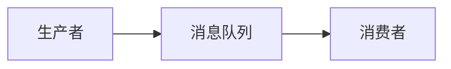

## 1.背景介绍

在分布式系统中，消息队列（Message Queue）是一种常见的数据交换方式。它通过临时存储消息（数据）来实现不同应用之间的数据交换，是异步通信的重要工具。消息队列在现代软件架构中扮演着举足轻重的角色，尤其在微服务架构中，消息队列被广泛应用于服务间的解耦和信息传递。

## 2.核心概念与联系

消息队列的核心概念包括生产者（Producer）、消费者（Consumer）、队列（Queue）和消息（Message）。

- 生产者：负责产生消息，并将消息发送到消息队列中。
- 消费者：从消息队列中取出并处理消息。
- 队列：存储消息的容器，通常是先进先出（FIFO）的数据结构。
- 消息：需要传递的数据，可以是任何形式的数据。

这四者之间的关系可以用下面的 Mermaid 流程图表示：



## 3.核心算法原理具体操作步骤

消息队列的基本工作流程如下：

1. 生产者产生消息并将消息发送到消息队列。
2. 消息队列接收并存储生产者发送的消息。
3. 消费者从消息队列中获取并处理消息。

这是一个简单的消息队列工作流程，但在实际应用中，消息队列可能会有更复杂的工作模式，如发布/订阅模式、请求/回复模式等。

## 4.数学模型和公式详细讲解举例说明

在理论上，消息队列的性能可以通过以下数学模型进行描述：

设 $λ$ 为消息的到达率，$μ$ 为服务率，即消息队列处理消息的速度，$ρ=λ/μ$ 为系统的繁忙程度，$L$ 为系统的平均队长，$W$ 为系统的平均等待时间。那么，我们有以下公式：

- 平均队长 $L=ρ/(1-ρ)$
- 平均等待时间 $W=L/λ$

这个模型可以帮助我们理解消息队列的性能，并对其进行优化。

## 5.项目实践：代码实例和详细解释说明

接下来，我们将通过一个简单的 Python 项目来实践消息队列的使用。我们将使用 RabbitMQ 作为消息队列服务。

首先，我们需要安装 RabbitMQ 和 pika 库：

```bash
pip install pika
```

然后，我们创建一个生产者，用于发送消息：

```python
import pika

connection = pika.BlockingConnection(pika.ConnectionParameters('localhost'))
channel = connection.channel()

channel.queue_declare(queue='hello')

channel.basic_publish(exchange='', routing_key='hello', body='Hello World!')
print(" [x] Sent 'Hello World!'")

connection.close()
```

接着，我们创建一个消费者，用于接收和处理消息：

```python
import pika

connection = pika.BlockingConnection(pika.ConnectionParameters('localhost'))
channel = connection.channel()

channel.queue_declare(queue='hello')

def callback(ch, method, properties, body):
    print(" [x] Received %r" % body)

channel.basic_consume(queue='hello', on_message_callback=callback, auto_ack=True)

print(' [*] Waiting for messages. To exit press CTRL+C')
channel.start_consuming()
```

在这个示例中，生产者和消费者通过 RabbitMQ 进行通信，生产者发送消息，消费者接收并处理消息。

## 6.实际应用场景

消息队列在许多场景中都有应用，例如：

- 异步处理：当处理时间较长的任务时，可以将任务放入消息队列，由后台服务异步处理。
- 解耦：在微服务架构中，各个服务之间可以通过消息队列进行通信，实现解耦。
- 流量削峰：在高并发场景下，可以通过消息队列缓冲突然的流量峰值。

## 7.工具和资源推荐

在实际应用中，有许多优秀的消息队列服务可供选择，如 RabbitMQ、Kafka、ActiveMQ、RocketMQ 等。

## 8.总结：未来发展趋势与挑战

随着微服务架构的普及，消息队列的应用越来越广泛。然而，消息队列也面临着许多挑战，如如何保证消息的可靠传输、如何处理大规模消息的处理等。

## 9.附录：常见问题与解答

Q: 消息队列如何保证消息的可靠传输？
A: 消息队列通常通过消息确认机制来保证消息的可靠传输。当消费者成功处理消息后，会向消息队列发送确认消息，消息队列接收到确认消息后，才会将该消息从队列中删除。

Q: 如何处理大规模消息的处理？
A: 在大规模消息处理场景下，可以通过增加消费者的数量来提高处理能力。此外，一些消息队列服务还提供了分区（Partition）功能，可以将消息分布到不同的队列中，进一步提高处理能力。

作者：禅与计算机程序设计艺术 / Zen and the Art of Computer Programming