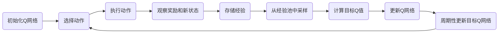

# 深度 Q-learning：在无人仓库中的应用

## 1. 背景介绍

随着电子商务的蓬勃发展，无人仓库的自动化和智能化成为了物流行业的重要发展方向。在这一背景下，深度Q-learning作为一种结合了深度学习和强化学习的算法，为解决无人仓库中的路径规划、货物分拣等问题提供了新的思路。本文将深入探讨深度Q-learning在无人仓库中的应用，包括其核心概念、算法原理、数学模型以及实际项目实践。

## 2. 核心概念与联系

深度Q-learning是一种强化学习算法，它通过结合Q-learning算法和深度神经网络来处理高维状态空间的问题。在无人仓库的应用中，深度Q-learning可以帮助智能体（例如自动化叉车或机器人）学习如何在环境中导航，以最小化货物存取时间和路径长度。

### 2.1 强化学习基础
### 2.2 Q-learning概述
### 2.3 深度学习与Q-learning的结合
### 2.4 状态、动作与奖励在无人仓库的定义

## 3. 核心算法原理具体操作步骤

深度Q-learning算法的核心是通过迭代更新Q值（即动作价值函数），以学习最优策略。以下是算法的具体操作步骤：

### 3.1 初始化Q网络
### 3.2 经验回放机制
### 3.3 目标Q网络的引入
### 3.4 Q值更新公式
### 3.5 策略提取与执行



## 4. 数学模型和公式详细讲解举例说明

深度Q-learning的数学模型基于马尔可夫决策过程（MDP）。我们将通过以下公式和例子来详细讲解这一模型：

### 4.1 马尔可夫决策过程（MDP）
### 4.2 Q-learning的Bellman方程
### 4.3 深度Q网络（DQN）的损失函数
### 4.4 优化算法与梯度下降

$$ Q(s_t, a_t) = Q(s_t, a_t) + \alpha [r_{t+1} + \gamma \max_{a}Q(s_{t+1}, a) - Q(s_t, a_t)] $$

## 5. 项目实践：代码实例和详细解释说明

在本节中，我们将通过一个简化的无人仓库模拟项目来展示深度Q-learning的实际应用。代码将使用Python语言编写，并利用TensorFlow或PyTorch框架来构建深度Q网络。

### 5.1 环境搭建与模拟
### 5.2 智能体设计与网络架构
### 5.3 训练过程与超参数调整
### 5.4 结果分析与性能评估

```python
# 示例代码片段
import numpy as np
import tensorflow as tf

# 环境、智能体和网络初始化代码...

def train_agent():
    # 训练过程代码...
    pass

# 训练智能体并评估结果...
```

## 6. 实际应用场景

深度Q-learning在无人仓库中的应用不仅限于路径规划，还包括货物分拣、库存管理等多个方面。本节将探讨这些应用场景，并分析深度Q-learning在其中的作用。

### 6.1 路径规划优化
### 6.2 货物分拣自动化
### 6.3 库存管理智能化
### 6.4 多智能体协同作业

## 7. 工具和资源推荐

为了帮助读者更好地理解和实践深度Q-learning，本节将推荐一些实用的工具和资源。

### 7.1 开源强化学习框架
### 7.2 深度学习库与API
### 7.3 在线课程与教程
### 7.4 相关论文与书籍

## 8. 总结：未来发展趋势与挑战

深度Q-learning在无人仓库中的应用展现了其强大的潜力，但仍面临着一些挑战和发展趋势。

### 8.1 算法稳定性与收敛性
### 8.2 多智能体学习的复杂性
### 8.3 实时性能与可扩展性
### 8.4 与其他技术的融合前景

## 9. 附录：常见问题与解答

在本节中，我们将回答关于深度Q-learning及其在无人仓库应用中的一些常见问题。

### 9.1 如何选择合适的奖励函数？
### 9.2 如何处理高维状态空间？
### 9.3 如何确保算法的实时响应？
### 9.4 如何评估智能体的性能？

作者：禅与计算机程序设计艺术 / Zen and the Art of Computer Programming