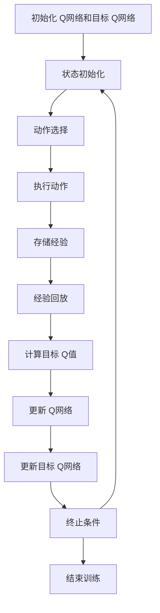

# 深度 Q-learning：学习率与折扣因子选择

## 1.背景介绍

深度 Q-learning 是深度强化学习（Deep Reinforcement Learning, DRL）中的一种重要算法，它结合了 Q-learning 和深度神经网络的优势，能够在复杂的环境中进行有效的决策。Q-learning 是一种无模型的强化学习算法，通过学习状态-动作值函数（Q函数）来指导智能体的行为。深度 Q-learning 则利用深度神经网络来近似 Q函数，从而能够处理高维度的状态空间。

在深度 Q-learning 中，学习率（Learning Rate）和折扣因子（Discount Factor）是两个关键的超参数，它们对算法的性能有着至关重要的影响。学习率决定了每次更新 Q值时的步长，而折扣因子则决定了未来奖励在当前决策中的重要性。本文将深入探讨这两个超参数的选择及其对深度 Q-learning 的影响。

## 2.核心概念与联系

### 2.1 深度 Q-learning 简介

深度 Q-learning 是一种基于 Q-learning 的强化学习算法，它通过深度神经网络来近似 Q函数。Q函数表示在给定状态下采取某一动作的预期累积奖励。深度 Q-learning 的目标是通过不断更新 Q函数，使其能够准确地估计每个状态-动作对的价值。

### 2.2 学习率（Learning Rate）

学习率是指在每次更新 Q值时，新的信息对旧的 Q值的影响程度。学习率的取值范围通常在 0 到 1 之间。较高的学习率意味着新的信息对 Q值的影响较大，更新速度较快；较低的学习率则意味着更新速度较慢，更加稳定。

### 2.3 折扣因子（Discount Factor）

折扣因子是指在计算累积奖励时，未来奖励对当前决策的影响程度。折扣因子的取值范围也在 0 到 1 之间。较高的折扣因子意味着未来奖励的重要性较高，智能体会更加注重长期回报；较低的折扣因子则意味着智能体更加关注短期回报。

### 2.4 学习率与折扣因子的联系

学习率和折扣因子在深度 Q-learning 中共同影响着 Q值的更新过程。学习率决定了每次更新的步长，而折扣因子则决定了未来奖励在当前决策中的权重。合理选择这两个超参数对于算法的收敛速度和稳定性至关重要。

## 3.核心算法原理具体操作步骤

### 3.1 初始化

1. 初始化 Q网络的权重参数 $\theta$。
2. 初始化目标 Q网络的权重参数 $\theta^-$，并使其等于 $\theta$。
3. 初始化经验回放缓冲区（Replay Buffer）。

### 3.2 训练过程

1. **状态初始化**：从环境中获取初始状态 $s_0$。
2. **动作选择**：根据 $\epsilon$-贪婪策略选择动作 $a_t$。
3. **执行动作**：在环境中执行动作 $a_t$，获得下一个状态 $s_{t+1}$ 和奖励 $r_t$。
4. **存储经验**：将 $(s_t, a_t, r_t, s_{t+1})$ 存储到经验回放缓冲区。
5. **经验回放**：从经验回放缓冲区中随机采样一个小批量 $(s_j, a_j, r_j, s_{j+1})$。
6. **计算目标 Q值**：使用目标 Q网络计算目标 Q值 $y_j$：
   $$
   y_j = r_j + \gamma \max_{a'} Q(s_{j+1}, a'; \theta^-)
   $$
7. **更新 Q网络**：最小化损失函数 $L(\theta)$：
   $$
   L(\theta) = \mathbb{E}[(y_j - Q(s_j, a_j; \theta))^2]
   $$
8. **更新目标 Q网络**：每隔固定步数，将 Q网络的权重参数复制到目标 Q网络：
   $$
   \theta^- \leftarrow \theta
   $$

### 3.3 终止条件

当达到预定的训练轮数或环境达到终止状态时，结束训练过程。

以下是深度 Q-learning 的流程图：



## 4.数学模型和公式详细讲解举例说明

### 4.1 Q函数

Q函数 $Q(s, a)$ 表示在状态 $s$ 下采取动作 $a$ 的预期累积奖励。Q函数的更新公式为：
$$
Q(s_t, a_t) \leftarrow Q(s_t, a_t) + \alpha [r_t + \gamma \max_{a'} Q(s_{t+1}, a') - Q(s_t, a_t)]
$$
其中，$\alpha$ 是学习率，$\gamma$ 是折扣因子。

### 4.2 损失函数

在深度 Q-learning 中，使用深度神经网络来近似 Q函数。损失函数 $L(\theta)$ 用于衡量预测 Q值与目标 Q值之间的差异：
$$
L(\theta) = \mathbb{E}[(y_j - Q(s_j, a_j; \theta))^2]
$$
其中，$y_j$ 是目标 Q值，计算公式为：
$$
y_j = r_j + \gamma \max_{a'} Q(s_{j+1}, a'; \theta^-)
$$

### 4.3 例子说明

假设在某个状态 $s_t$ 下，智能体选择了动作 $a_t$，并获得了奖励 $r_t$，进入了下一个状态 $s_{t+1}$。此时，Q值的更新过程如下：

1. 计算当前 Q值：
   $$
   Q(s_t, a_t)
   $$
2. 计算目标 Q值：
   $$
   y_t = r_t + \gamma \max_{a'} Q(s_{t+1}, a')
   $$
3. 更新 Q值：
   $$
   Q(s_t, a_t) \leftarrow Q(s_t, a_t) + \alpha [y_t - Q(s_t, a_t)]
   $$

## 5.项目实践：代码实例和详细解释说明

以下是一个使用深度 Q-learning 进行训练的代码示例：

```python
import numpy as np
import tensorflow as tf
from collections import deque
import random

class DQN:
    def __init__(self, state_size, action_size):
        self.state_size = state_size
        self.action_size = action_size
        self.memory = deque(maxlen=2000)
        self.gamma = 0.95  # 折扣因子
        self.epsilon = 1.0  # 探索率
        self.epsilon_min = 0.01
        self.epsilon_decay = 0.995
        self.learning_rate = 0.001  # 学习率
        self.model = self._build_model()

    def _build_model(self):
        model = tf.keras.Sequential()
        model.add(tf.keras.layers.Dense(24, input_dim=self.state_size, activation='relu'))
        model.add(tf.keras.layers.Dense(24, activation='relu'))
        model.add(tf.keras.layers.Dense(self.action_size, activation='linear'))
        model.compile(loss='mse', optimizer=tf.keras.optimizers.Adam(lr=self.learning_rate))
        return model

    def remember(self, state, action, reward, next_state, done):
        self.memory.append((state, action, reward, next_state, done))

    def act(self, state):
        if np.random.rand() <= self.epsilon:
            return random.randrange(self.action_size)
        act_values = self.model.predict(state)
        return np.argmax(act_values[0])

    def replay(self, batch_size):
        minibatch = random.sample(self.memory, batch_size)
        for state, action, reward, next_state, done in minibatch:
            target = reward
            if not done:
                target = reward + self.gamma * np.amax(self.model.predict(next_state)[0])
            target_f = self.model.predict(state)
            target_f[0][action] = target
            self.model.fit(state, target_f, epochs=1, verbose=0)
        if self.epsilon > self.epsilon_min:
            self.epsilon *= self.epsilon_decay

    def load(self, name):
        self.model.load_weights(name)

    def save(self, name):
        self.model.save_weights(name)

# 环境初始化
env = ...  # 这里需要替换为具体的环境
state_size = env.observation_space.shape[0]
action_size = env.action_space.n
agent = DQN(state_size, action_size)
done = False
batch_size = 32

# 训练过程
for e in range(EPISODES):
    state = env.reset()
    state = np.reshape(state, [1, state_size])
    for time in range(500):
        action = agent.act(state)
        next_state, reward, done, _ = env.step(action)
        reward = reward if not done else -10
        next_state = np.reshape(next_state, [1, state_size])
        agent.remember(state, action, reward, next_state, done)
        state = next_state
        if done:
            print(f"episode: {e}/{EPISODES}, score: {time}, e: {agent.epsilon:.2}")
            break
        if len(agent.memory) > batch_size:
            agent.replay(batch_size)
```

### 代码解释

1. **DQN 类**：定义了深度 Q-learning 的主要结构，包括模型构建、记忆存储、动作选择和经验回放等功能。
2. **模型构建**：使用 Keras 构建了一个简单的三层神经网络，用于近似 Q函数。
3. **记忆存储**：将每次的状态、动作、奖励和下一个状态存储到经验回放缓冲区。
4. **动作选择**：根据 $\epsilon$-贪婪策略选择动作。
5. **经验回放**：从经验回放缓冲区中随机采样，更新 Q网络。
6. **训练过程**：在环境中进行多次训练，逐步优化 Q网络。

## 6.实际应用场景

深度 Q-learning 在许多实际应用中表现出色，以下是一些典型的应用场景：

### 6.1 游戏 AI

深度 Q-learning 在游戏 AI 中得到了广泛应用。例如，DeepMind 的 AlphaGo 使用深度 Q-learning 结合蒙特卡罗树搜索（MCTS）在围棋中击败了人类顶级选手。

### 6.2 机器人控制

在机器人控制中，深度 Q-learning 可以用于学习复杂的控制策略，使机器人能够在动态环境中完成任务。例如，机器人手臂的抓取和放置任务。

### 6.3 自动驾驶

深度 Q-learning 在自动驾驶中也有应用，通过学习驾驶策略，使自动驾驶车辆能够在复杂的交通环境中安全行驶。

### 6.4 金融交易

在金融交易中，深度 Q-learning 可以用于学习交易策略，优化投资组合，最大化收益。

## 7.工具和资源推荐

### 7.1 开源库

- **TensorFlow**：一个广泛使用的深度学习框架，支持深度 Q-learning 的实现。
- **PyTorch**：另一个流行的深度学习框架，具有灵活性和易用性。
- **OpenAI Gym**：一个用于开发和比较强化学习算法的工具包，提供了多种环境。

### 7.2 书籍

- **《深度强化学习》**：详细介绍了深度强化学习的理论和实践。
- **《强化学习：原理与实践》**：一本全面介绍强化学习的经典书籍。

### 7.3 在线课程

- **Coursera 的深度学习课程**：由 Andrew Ng 教授主讲，涵盖了深度学习的基础知识。
- **Udacity 的强化学习纳米学位**：提供了强化学习的深入学习和实践机会。

## 8.总结：未来发展趋势与挑战

### 8.1 未来发展趋势

深度 Q-learning 作为深度强化学习的重要算法，未来有望在更多领域得到应用。随着计算能力的提升和算法的改进，深度 Q-learning 将能够处理更加复杂的环境和任务。

### 8.2 挑战

尽管深度 Q-learning 在许多应用中表现出色，但仍然面临一些挑战：

1. **样本效率**：深度 Q-learning 需要大量的样本进行训练，如何提高样本效率是一个重要问题。
2. **稳定性**：深度 Q-learning 的训练过程可能不稳定，容易陷入局部最优解。
3. **超参数选择**：学习率和折扣因子的选择对算法性能有重要影响，如何自动调整这些超参数是一个研究热点。

## 9.附录：常见问题与解答

### 9.1 学习率和折扣因子的选择

**问题**：如何选择合适的学习率和折扣因子？

**解答**：学习率和折扣因子的选择需要根据具体问题进行调整。一般来说，可以通过网格搜索或随机搜索来找到较优的超参数组合。

### 9.2 经验回放缓冲区的大小

**问题**：经验回放缓冲区的大小对训练有何影响？

**解答**：经验回放缓冲区的大小影响到样本的多样性和训练的稳定性。较大的缓冲区可以提供更多样本，但也需要更多的存储空间和计算资源。

### 9.3 如何处理训练不稳定的问题

**问题**：深度 Q-learning 的训练过程不稳定，如何处理？

**解答**：可以通过使用目标 Q网络、经验回放和双重 Q-learning 等技术来提高训练的稳定性。

---

作者：禅与计算机程序设计艺术 / Zen and the Art of Computer Programming