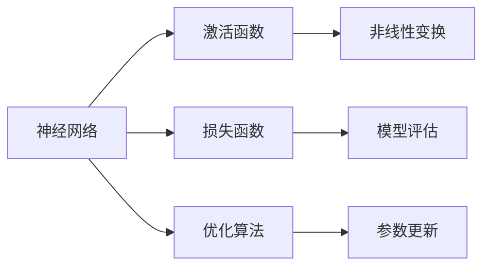
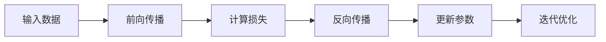

# 深度学习原理与代码实例讲解

## 1. 背景介绍
深度学习，作为机器学习的一个分支，近年来在图像识别、语音识别、自然语言处理等领域取得了显著的成就。它的核心在于通过多层非线性变换对高维数据进行特征抽象和表示学习。深度学习的成功，很大程度上得益于大数据的可用性、计算力的提升以及算法的创新。

## 2. 核心概念与联系
深度学习的核心概念包括神经网络、激活函数、损失函数、优化算法等。这些概念相互联系，共同构成了深度学习的基础框架。



## 3. 核心算法原理具体操作步骤
深度学习的核心算法原理包括前向传播和反向传播。前向传播用于计算预测值，而反向传播则用于根据损失函数计算梯度，并更新网络参数。



## 4. 数学模型和公式详细讲解举例说明
以多层感知机（MLP）为例，其数学模型可以表示为：

$$
h^{(l)} = f(W^{(l)}h^{(l-1)} + b^{(l)})
$$

其中，$h^{(l)}$ 是第 $l$ 层的输出，$W^{(l)}$ 和 $b^{(l)}$ 分别是第 $l$ 层的权重和偏置，$f$ 是激活函数。

## 5. 项目实践：代码实例和详细解释说明
以TensorFlow为例，构建一个简单的MLP模型进行手写数字识别：

```python
import tensorflow as tf

# 定义模型
model = tf.keras.models.Sequential([
    tf.keras.layers.Dense(128, activation='relu'),
    tf.keras.layers.Dense(10, activation='softmax')
])

# 编译模型
model.compile(optimizer='adam',
              loss='sparse_categorical_crossentropy',
              metrics=['accuracy'])

# 训练模型
model.fit(x_train, y_train, epochs=5)

# 评估模型
model.evaluate(x_test, y_test)
```

## 6. 实际应用场景
深度学习已广泛应用于自动驾驶、医疗影像分析、智能推荐系统等领域，极大地推动了人工智能技术的发展和应用。

## 7. 工具和资源推荐
- TensorFlow
- PyTorch
- Keras
- DeepLearning.AI（课程资源）
- arXiv（最新研究论文）

## 8. 总结：未来发展趋势与挑战
深度学习未来的发展趋势包括模型的可解释性、小样本学习、跨模态学习等。同时，算法的泛化能力、数据隐私和安全性等问题也是未来需要面对的挑战。

## 9. 附录：常见问题与解答
Q1: 深度学习和机器学习的区别是什么？
A1: 深度学习是机器学习的一个子集，它使用深层神经网络来学习数据的复杂模式。

Q2: 如何选择合适的激活函数？
A2: 选择激活函数通常基于经验和实验。ReLU函数因其简单高效而广泛使用。

Q3: 如何防止深度学习模型过拟合？
A3: 可以通过数据增强、正则化、Dropout等技术来减轻过拟合。

作者：禅与计算机程序设计艺术 / Zen and the Art of Computer Programming