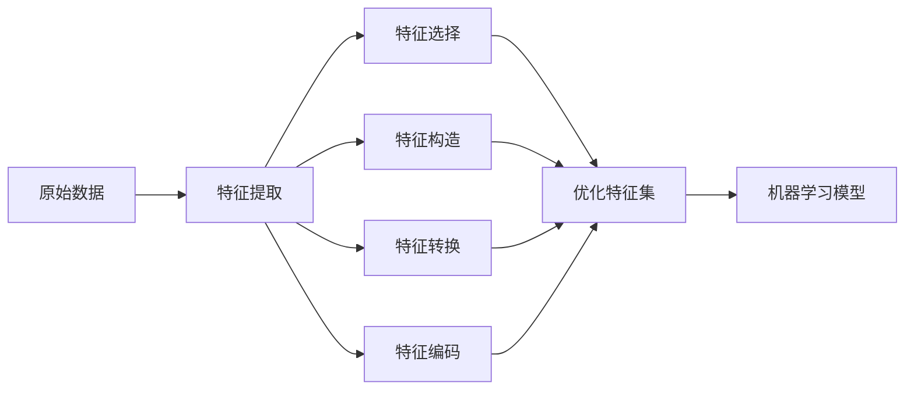

# 特征工程(Feature Engineering)原理与代码实战案例讲解

## 1. 背景介绍
在机器学习领域，数据和算法是构建高效模型的两大基石。然而，即使是最先进的算法，也难以从原始数据中直接学习到有用的信息。这就是特征工程发挥作用的地方。特征工程是一个利用数据领域知识来创建能够使机器学习算法发挥最大效能的特征的过程。它是模型开发中至关重要的一步，直接影响到模型的性能和预测能力。

## 2. 核心概念与联系
特征工程涉及多个核心概念，包括特征提取、特征选择、特征构造、特征转换和特征编码。这些概念相互联系，共同构成了特征工程的整体框架。

- 特征提取：从原始数据中提取信息并形成特征。
- 特征选择：从已有的特征集合中选择最有价值的特征。
- 特征构造：基于现有数据创造新的特征以增强模型的预测能力。
- 特征转换：对特征进行标准化、归一化等操作，以改善模型的性能。
- 特征编码：将非数值特征转换为机器学习算法可用的数值格式。



## 3. 核心算法原理具体操作步骤
特征工程的核心算法原理可以分为以下几个步骤：

1. 数据探索与分析：通过统计分析和可视化方法，了解数据的分布和结构。
2. 数据预处理：包括缺失值处理、异常值处理等。
3. 特征提取：使用各种技术从数据中提取信息。
4. 特征选择：运用统计测试、模型选择等方法筛选特征。
5. 特征构造：结合业务知识和数据分析结果，创造新特征。
6. 特征转换：应用归一化、标准化等技术改善数据的质量。
7. 特征编码：对分类特征进行独热编码、标签编码等。

## 4. 数学模型和公式详细讲解举例说明
在特征选择中，常用的数学模型包括卡方检验、信息增益等。以卡方检验为例，其数学公式为：

$$ \chi^2 = \sum \frac{(O_i - E_i)^2}{E_i} $$

其中，$O_i$ 是观察频数，$E_i$ 是期望频数。通过计算每个特征与目标变量之间的卡方统计量，可以评估特征的重要性。

## 5. 项目实践：代码实例和详细解释说明
以Python语言为例，我们可以使用`pandas`和`scikit-learn`库来进行特征工程的实践。以下是一个简单的特征选择代码示例：

```python
import pandas as pd
from sklearn.feature_selection import chi2
from sklearn.feature_selection import SelectKBest

# 假设df是一个pandas DataFrame，包含特征和目标变量
X = df.drop('target', axis=1)
y = df['target']

# 应用卡方检验选择K个最佳特征
chi2_selector = SelectKBest(chi2, k=5)
X_kbest = chi2_selector.fit_transform(X, y)
```

## 6. 实际应用场景
特征工程在各种机器学习应用中都至关重要，例如信用评分、疾病预测、股票市场分析等。在这些场景中，通过精心设计的特征，模型能够更准确地捕捉到数据中的关键信息。

## 7. 工具和资源推荐
- `pandas`：数据处理和分析工具。
- `scikit-learn`：提供多种特征选择和转换方法的机器学习库。
- `Featuretools`：一个自动化特征工程库。

## 8. 总结：未来发展趋势与挑战
特征工程的未来发展趋势包括自动化特征工程、深度学习在特征学习中的应用等。同时，如何在大数据环境下高效地进行特征工程，以及如何处理高维数据，仍然是领域内的挑战。

## 9. 附录：常见问题与解答
Q1: 特征工程有哪些常见的陷阱？
A1: 过度拟合、忽视特征的业务含义、在特征选择时过度依赖自动化工具等。

Q2: 如何评估特征的重要性？
A2: 可以通过模型的特征重要性评分、统计测试、基于模型的选择方法等进行评估。

作者：禅与计算机程序设计艺术 / Zen and the Art of Computer Programming