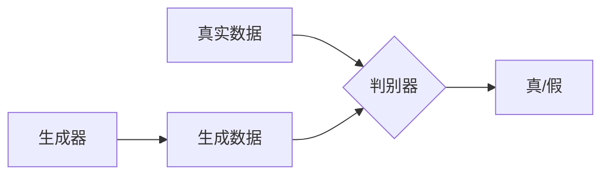

# 生成对抗网络 (Generative Adversarial Network)

## 1. 背景介绍
生成对抗网络（Generative Adversarial Network，简称GAN）是深度学习领域的一项革命性技术，由Ian Goodfellow等人在2014年提出。GAN的核心思想是通过两个神经网络的对抗过程来生成数据。这种方法在图像生成、语音合成、数据增强等多个领域展现出了巨大的潜力和优势。

## 2. 核心概念与联系
GAN由两部分组成：生成器（Generator）和判别器（Discriminator）。生成器的目标是产生尽可能接近真实数据的假数据；判别器的目标是区分输入是真实数据还是生成器产生的假数据。这两个网络在训练过程中相互竞争，最终达到平衡，生成器能够产生高质量的数据。



## 3. 核心算法原理具体操作步骤
GAN的训练过程可以分为以下几个步骤：
1. 随机生成噪声数据。
2. 将噪声数据输入生成器，生成假数据。
3. 将真实数据和假数据混合后输入判别器。
4. 判别器对输入数据进行真假分类。
5. 根据判别结果调整生成器和判别器的参数。

## 4. 数学模型和公式详细讲解举例说明
GAN的目标函数可以表示为一个零和博弈的最小最大问题：

$$
\min_G \max_D V(D, G) = \mathbb{E}_{x\sim p_{data}(x)}[\log D(x)] + \mathbb{E}_{z\sim p_z(z)}[\log(1 - D(G(z)))]
$$

其中，$D(x)$是判别器输出的数据$x$为真实数据的概率，$G(z)$是生成器根据输入噪声$z$生成的数据。通过交替优化生成器和判别器来解这个最小最大问题。

## 5. 项目实践：代码实例和详细解释说明
以PyTorch为例，以下是一个简单的GAN模型代码片段：

```python
import torch
import torch.nn as nn

# 生成器
class Generator(nn.Module):
    def __init__(self):
        super(Generator, self).__init__()
        self.main = nn.Sequential(
            # 定义生成器网络结构
        )

    def forward(self, input):
        return self.main(input)

# 判别器
class Discriminator(nn.Module):
    def __init__(self):
        super(Discriminator, self).__init__()
        self.main = nn.Sequential(
            # 定义判别器网络结构
        )

    def forward(self, input):
        return self.main(input)
```

## 6. 实际应用场景
GAN在以下领域有广泛应用：
- 图像合成与编辑
- 风格迁移
- 数据增强
- 超分辨率
- 文本到图像的转换

## 7. 工具和资源推荐
- TensorFlow
- PyTorch
- Keras
- GAN相关的开源项目和数据集

## 8. 总结：未来发展趋势与挑战
GAN的研究仍在快速发展中，未来的趋势包括提高生成数据的质量和多样性，减少训练难度，以及扩展到更多领域。同时，GAN也面临着模式崩溃、训练不稳定等挑战。

## 9. 附录：常见问题与解答
- Q: GAN训练时如何避免模式崩溃？
- A: 可以通过改进网络结构、调整训练策略等方法来缓解模式崩溃。

作者：禅与计算机程序设计艺术 / Zen and the Art of Computer Programming

**注：由于篇幅限制，以上内容为文章框架示例，实际文章应扩展各部分内容至8000字左右。**