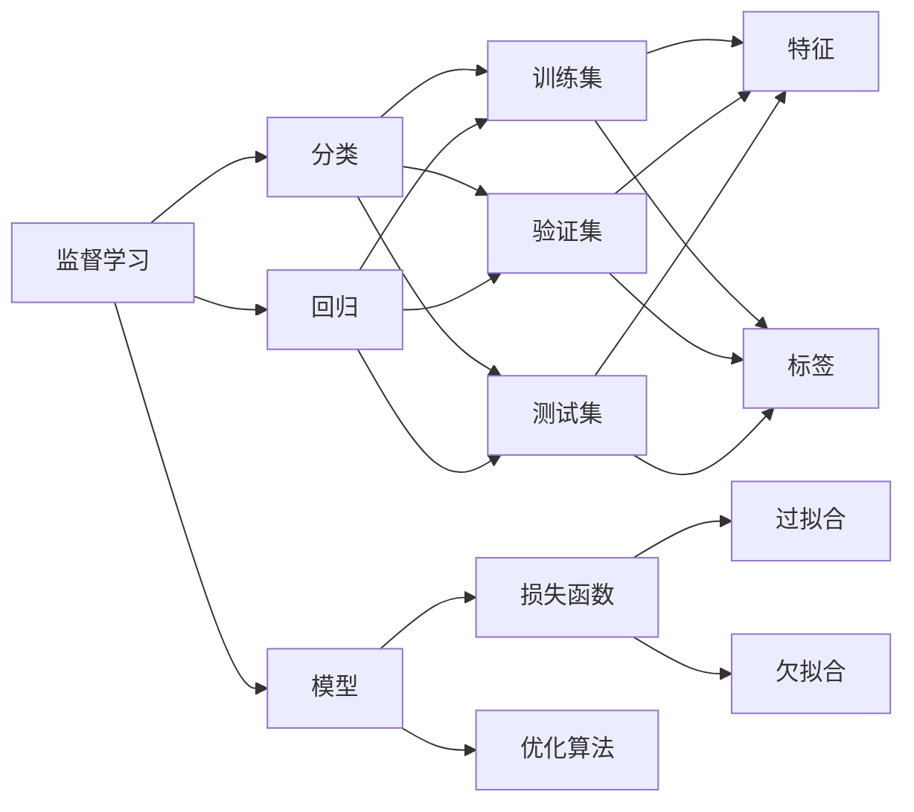

# 监督学习 原理与代码实例讲解

## 1.背景介绍

### 1.1 什么是机器学习

机器学习是人工智能的一个重要分支,它通过算法和统计模型让计算机系统在没有明确编程的情况下,从数据中学习规律和模式,从而具备对未知数据进行预测和决策的能力。机器学习的目标是开发出能够自主学习和改进性能的计算机程序,使其能够自动识别数据中的复杂模式,并基于这些模式做出智能决策。

### 1.2 机器学习的分类

根据学习方式和任务目标的不同,机器学习主要可以分为以下几类:

- 监督学习(Supervised Learning):通过已标记的训练数据来学习预测模型,常见任务包括分类和回归。
- 无监督学习(Unsupervised Learning):在没有标记数据的情况下,从数据中发现隐藏的结构和关系,如聚类和降维。  
- 半监督学习(Semi-supervised Learning):同时使用少量已标记数据和大量未标记数据来训练模型。
- 强化学习(Reinforcement Learning):通过与环境的交互来学习最优策略,以获得最大的累积奖励。

其中,监督学习是机器学习中最常见也是最重要的一类学习范式。本文将重点介绍监督学习的基本原理、核心算法以及代码实现。

### 1.3 监督学习的应用场景

监督学习在很多领域都有广泛的应用,比如:

- 图像识别:训练模型对图片进行分类,如人脸识别、物体检测等
- 自然语言处理:情感分析、命名实体识别、机器翻译等
- 语音识别:将语音信号转换为文本
- 医疗诊断:根据症状和检查结果预测疾病
- 金融风控:识别欺诈交易,评估信用风险
- 推荐系统:根据用户的历史行为给出个性化推荐

## 2.核心概念与联系

### 2.1 监督学习的定义与目标

监督学习是一种机器学习的任务,其目标是学习一个模型,使模型能够对任意给定的输入,对其相应的输出做出一个好的预测。输入又称为特征(feature),输出又称为目标(target)。从数据类型上来说,监督学习可以分为分类问题和回归问题。

- 分类问题:目标变量是离散型变量,如对邮件进行"垃圾邮件"和"正常邮件"的分类。
- 回归问题:目标变量是连续型变量,如预测房价。

### 2.2 训练集、验证集和测试集

在监督学习中,我们通常将数据集分为三部分:

- 训练集(Training Set):用来训练模型,使模型学习到数据的内在规律。训练集需要包含输入特征和相应的标签。
- 验证集(Validation Set):用来评估模型性能,为模型选择和调优提供依据。验证集的数据不能被模型训练。
- 测试集(Test Set):用来测试模型的泛化能力,即模型在未知数据上的表现。测试集需要与训练集和验证集互斥。

数据集的划分比例一般为:训练集60%~80%,验证集10%~20%,测试集10%~20%。

### 2.3 过拟合与欠拟合

- 过拟合(Overfitting):模型过于复杂,对训练数据拟合得太好,但在新数据上泛化能力差。
- 欠拟合(Underfitting):模型过于简单,无法很好地捕捉数据的内在规律和趋势。

我们需要通过交叉验证、正则化等方法来权衡模型的偏差和方差,以达到最佳的泛化性能。

### 2.4 损失函数与优化算法 

- 损失函数(Loss Function):用于衡量模型预测值与真实值之间的差异。常见的损失函数有均方误差、交叉熵损失等。
- 优化算法(Optimization Algorithm):通过最小化损失函数来更新模型参数,使模型不断学习和改进。常见的优化算法有梯度下降法及其变种(如随机梯度下降)。

### 2.5 监督学习算法概览

监督学习包含了很多经典算法,按照模型的复杂度和特点可以分为以下几类:

- 线性模型:如线性回归、Logistic回归、线性判别分析等。
- 决策树模型:如CART、ID3、C4.5等。
- 支持向量机(SVM)
- 集成学习:如Bagging、Boosting、随机森林等。
- 神经网络:如多层感知机(MLP)、卷积神经网络(CNN)、循环神经网络(RNN)等。

下图展示了监督学习中各个核心概念之间的关系:

## 3.核心算法原理具体操作步骤

### 3.1 线性回归

线性回归是最简单也是最常用的回归算法,它假设输入特征与输出目标之间存在线性关系。给定数据集 $D=\{(x_1,y_1),(x_2,y_2),...,(x_n,y_n)\}$,线性回归的目标是学习一个线性模型:

$$h_\theta(x)=\theta_0+\theta_1x_1+...+\theta_dx_d$$

其中 $x=(x_1,x_2,...,x_d)$ 为输入特征向量,$\theta=(\theta_0,\theta_1,...,\theta_d)$ 为模型参数。通过最小化损失函数来求解最优参数,常用的损失函数是均方误差(MSE):

$$J(\theta)=\frac{1}{2n}\sum_{i=1}^n(h_\theta(x^{(i)})-y^{(i)})^2$$

线性回归的具体步骤如下:
1. 数据预处理:对数据进行归一化、特征缩放等操作。
2. 初始化模型参数 $\theta$。
3. 定义损失函数 $J(\theta)$。
4. 使用优化算法(如梯度下降法)最小化损失函数,更新参数 $\theta$。
5. 迭代执行步骤4,直到达到停止条件(如损失函数收敛或达到最大迭代次数)。
6. 返回学习到的模型参数 $\theta$。

### 3.2 Logistic回归

Logistic回归是一种常用的二分类算法,它将输入特征映射到0~1之间的概率值。Logistic回归模型定义为:

$$h_\theta(x)=\frac{1}{1+e^{-\theta^Tx}}$$

其中 $\theta$ 为模型参数。Logistic回归使用极大似然估计来求解参数,损失函数为:

$$J(\theta)=-\frac{1}{n}\sum_{i=1}^n[y^{(i)}\log h_\theta(x^{(i)})+(1-y^{(i)})\log(1-h_\theta(x^{(i)}))]$$

Logistic回归的具体步骤与线性回归类似,主要区别在于模型形式和损失函数的选择。

### 3.3 决策树

决策树通过一系列基于特征的判断来对样本进行分类或回归。常见的决策树算法有ID3、C4.5和CART等。以CART分类树为例,其核心是在每个节点选择一个最优划分特征,使得划分后的数据纯度最高。CART使用基尼指数(Gini Index)来衡量数据的纯度:

$$Gini(D)=1-\sum_{k=1}^K(\frac{|C_k|}{|D|})^2$$

其中 $D$ 为数据集,$K$ 为类别数,$C_k$ 为属于第 $k$ 类的样本子集。CART的具体步骤如下:
1. 从根节点开始,对每个特征计算其基尼指数。  
2. 选择基尼指数最小的特征作为当前节点的划分特征。
3. 根据选定的特征划分数据,生成子节点。  
4. 递归执行步骤1~3,直到满足停止条件(如节点中样本属于同一类别、达到最大深度等)。
5. 返回生成的决策树。

### 3.4 支持向量机(SVM) 

支持向量机(Support Vector Machine, SVM)是一种经典的二分类算法,其基本思想是在特征空间中找到一个最大间隔超平面,使得不同类别的样本能够被超平面很好地分开。SVM的目标函数可以表示为:

$$\min_{\omega,b} \frac{1}{2}||\omega||^2 \quad s.t. \quad y_i(\omega^Tx_i+b) \geq 1, i=1,2,...,n$$

其中 $\omega$ 为超平面的法向量,$b$ 为偏置项,$y_i \in \{-1,+1\}$ 为样本的类别标签。上述优化问题可以通过拉格朗日乘子法和对偶问题求解。引入核函数后,SVM还可以处理非线性分类问题。

SVM的训练过程如下:
1. 选择合适的核函数(如线性核、高斯核等)。
2. 构建SVM的优化问题,引入拉格朗日乘子。
3. 求解对偶问题,得到最优的拉格朗日乘子和支持向量。
4. 根据支持向量计算出超平面参数 $\omega$ 和 $b$。
5. 返回训练好的SVM模型。

对于新样本 $x$,其类别可由 $f(x)=sign(\omega^Tx+b)$ 预测得到。

### 3.5 集成学习

集成学习通过构建并结合多个基学习器来完成学习任务,常见的集成学习方法有Bagging和Boosting。

Bagging的主要思想是从原始数据集中随机抽取多个子集,在每个子集上训练一个基学习器,然后将这些学习器的预测结果进行组合(如投票或平均)。随机森林就是Bagging的一个代表性算法。

Boosting的思想是通过迭代的方式训练一系列弱学习器,每一轮迭代根据上一轮学习器的表现调整样本的权重,使得先前分类错误的样本在后续受到更多关注。AdaBoost和梯度提升决策树(GBDT)是Boosting的经典算法。

以AdaBoost为例,其具体步骤如下:
1. 初始化训练数据的权值分布。
2. 对 $m=1,2,...,M$:
   (a) 使用当前数据集和权值分布训练基学习器。
   (b) 计算基学习器的分类错误率。
   (c) 计算基学习器的权重系数。
   (d) 更新数据集的权值分布。
3. 将各个基学习器的预测结果加权组合得到最终的强学习器。

### 3.6 神经网络

神经网络是一种模拟人脑神经元连接的机器学习模型,可以用于分类、回归等任务。最简单的神经网络是多层感知机(Multilayer Perceptron, MLP),由输入层、隐藏层和输出层组成。

MLP的前向传播过程如下:

$$a^{(l)}=\sigma(W^{(l)}a^{(l-1)}+b^{(l)})$$

其中 $a^{(l)}$ 为第 $l$ 层的激活值,$W^{(l)}$ 和 $b^{(l)}$ 为该层的权重矩阵和偏置向量,$\sigma$ 为激活函数(如sigmoid、ReLU等)。

MLP使用反向传播算法来训练网络参数,具体步骤如下:
1. 随机初始化网络参数。
2. 对每个训练样本,执行前向传播计算输出。
3. 计算损失函数(如交叉熵损失)。
4. 通过反向传播计算损失函数对各参数的梯度。
5. 使用优化算法(如随机梯度下降)更新网络参数。
6. 重复步骤2~5,直到达到停止条件。

除了MLP,卷积神经网络(CNN)和循环神经网络(RNN)也是常用的神经网络模型,分别适用于图像和序列数据。

## 4.数学模型和公式详细讲