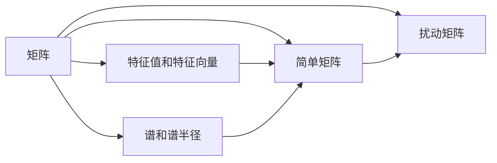

# 矩阵理论与应用：简单矩阵的特征值扰动

## 1. 背景介绍
### 1.1 矩阵理论的重要性
矩阵理论是数学和计算机科学的重要分支,在许多领域都有广泛的应用,如图像处理、信号处理、控制理论、量子力学等。矩阵的特征值和特征向量是矩阵理论中的核心概念,对于理解矩阵的性质和应用具有重要意义。

### 1.2 特征值扰动的研究意义
在实际应用中,矩阵的元素往往会受到各种因素的影响而发生微小的变化,即扰动。这些扰动会导致矩阵特征值的改变。研究矩阵特征值对扰动的敏感性,对于分析算法的稳定性、控制系统的鲁棒性等具有重要的理论和实践价值。

### 1.3 本文的研究内容与目标
本文将重点研究简单矩阵(不同特征值均为单根)在元素发生微小扰动时,其特征值变化的一般规律和数学理论。通过系统地分析简单矩阵特征值的扰动理论,深入理解矩阵特征值的性质,并探讨其在实际问题中的应用。

## 2. 核心概念与联系
### 2.1 矩阵的特征值和特征向量
对于一个$n$阶方阵$A$,如果存在数$\lambda$和非零$n$维列向量$\boldsymbol{x}$,使得:
$$A\boldsymbol{x}=\lambda\boldsymbol{x}$$
则称$\lambda$为矩阵$A$的一个特征值,$\boldsymbol{x}$为$A$对应于特征值$\lambda$的一个特征向量。

### 2.2 矩阵的谱和谱半径
矩阵$A$的全部$n$个特征值(包括重根)组成的集合称为矩阵$A$的谱,记为$\sigma(A)$。矩阵$A$的谱半径$\rho(A)$定义为其特征值绝对值的最大值:
$$\rho(A)=\max\limits_{\lambda_i\in\sigma(A)} |\lambda_i|$$

### 2.3 简单矩阵的定义
设$\lambda_1,\lambda_2,\cdots,\lambda_s$为矩阵$A$的$s$个互不相同的特征值,并且重数分别为$n_1,n_2,\cdots,n_s$,若$n_1=n_2=\cdots=n_s=1$,则称矩阵$A$为简单矩阵。即简单矩阵是指特征值均为单根的矩阵。

### 2.4 矩阵扰动的定义
设$A$为$n$阶方阵,如果矩阵$\widetilde{A}$满足:
$$\widetilde{A}=A+\Delta A$$
其中$\Delta A$为微小扰动矩阵,则称$\widetilde{A}$为$A$的一个扰动矩阵。

### 2.5 核心概念之间的联系


## 3. 核心算法原理与具体操作步骤
### 3.1 简单矩阵特征值扰动的一阶近似
设$A$为简单矩阵,其互不相同的特征值为$\lambda_1,\lambda_2,\cdots,\lambda_n$,对应的特征向量为$\boldsymbol{x}_1,\boldsymbol{x}_2,\cdots,\boldsymbol{x}_n$。令
$$\widetilde{A}=A+\varepsilon C$$
其中$\varepsilon$为微小实数,则$\widetilde{A}$的特征值$\widetilde{\lambda}_i$满足:
$$\widetilde{\lambda}_i=\lambda_i+\varepsilon y_i+o(\varepsilon), \quad i=1,2,\cdots,n$$
其中
$$y_i=\frac{\boldsymbol{x}_i^HC\boldsymbol{x}_i}{\boldsymbol{x}_i^H\boldsymbol{x}_i}, \quad i=1,2,\cdots,n$$
$\boldsymbol{x}_i^H$表示$\boldsymbol{x}_i$的共轭转置。这个结论给出了简单矩阵特征值变化的一阶近似。

### 3.2 简单矩阵特征向量扰动的一阶近似
在同样的条件下,简单矩阵$A$的特征向量$\boldsymbol{x}_i$在扰动$\varepsilon C$下的变化可以用如下一阶近似表示:
$$\widetilde{\boldsymbol{x}}_i=\boldsymbol{x}_i+\varepsilon \boldsymbol{u}_i+o(\varepsilon), \quad i=1,2,\cdots,n$$
其中
$$\boldsymbol{u}_i=\sum\limits_{j\ne i}\frac{\boldsymbol{x}_j^HC\boldsymbol{x}_i}{\lambda_i-\lambda_j}\boldsymbol{x}_j, \quad i=1,2,\cdots,n$$

### 3.3 算法步骤总结
1. 求矩阵$A$的全部不同特征值$\lambda_1,\lambda_2,\cdots,\lambda_n$及对应特征向量$\boldsymbol{x}_1,\boldsymbol{x}_2,\cdots,\boldsymbol{x}_n$。
2. 构造微小扰动矩阵$\varepsilon C$。
3. 计算$y_i=\frac{\boldsymbol{x}_i^HC\boldsymbol{x}_i}{\boldsymbol{x}_i^H\boldsymbol{x}_i}, \quad i=1,2,\cdots,n$。
4. 计算特征值的一阶近似$\widetilde{\lambda}_i=\lambda_i+\varepsilon y_i+o(\varepsilon), \quad i=1,2,\cdots,n$。
5. 计算$\boldsymbol{u}_i=\sum\limits_{j\ne i}\frac{\boldsymbol{x}_j^HC\boldsymbol{x}_i}{\lambda_i-\lambda_j}\boldsymbol{x}_j, \quad i=1,2,\cdots,n$。  
6. 计算特征向量的一阶近似$\widetilde{\boldsymbol{x}}_i=\boldsymbol{x}_i+\varepsilon \boldsymbol{u}_i+o(\varepsilon), \quad i=1,2,\cdots,n$。

## 4. 数学模型和公式详细讲解举例说明
### 4.1 简单矩阵的谱分解
对于简单矩阵$A$,由于其特征值均为单根,因此存在非奇异矩阵$P$使得:
$$P^{-1}AP=\Lambda=\mathrm{diag}(\lambda_1,\lambda_2,\cdots,\lambda_n)$$
其中$\Lambda$为对角矩阵,对角线上的元素为$A$的$n$个特征值。这种分解称为矩阵的谱分解。

### 4.2 矩阵扰动的谱分解表示
设$\widetilde{A}=A+\varepsilon C$为$A$的扰动矩阵,则存在非奇异矩阵$\widetilde{P}$使得:
$$\widetilde{P}^{-1}\widetilde{A}\widetilde{P}=\widetilde{\Lambda}=\mathrm{diag}(\widetilde{\lambda}_1,\widetilde{\lambda}_2,\cdots,\widetilde{\lambda}_n)$$
其中$\widetilde{\lambda}_i$为$\widetilde{A}$的特征值。由于$\varepsilon$很小,因此$\widetilde{P}$可以表示为$P$的微小扰动:
$$\widetilde{P}=P+\varepsilon Q+o(\varepsilon)$$
其中$Q$为待定矩阵。将其代入谱分解式,经过一系列推导可得:
$$\widetilde{\Lambda}=\Lambda+\varepsilon P^{-1}CP+o(\varepsilon)$$
由此可以得到特征值变化的一阶近似。

### 4.3 数值算例演示
考虑矩阵$A=\begin{bmatrix} 1 & 2 \\ 2 & 3 \end{bmatrix}$,其特征值为$\lambda_1=-1,\lambda_2=5$,对应的特征向量为$\boldsymbol{x}_1=\begin{bmatrix} -1 \\ 1 \end{bmatrix},\boldsymbol{x}_2=\begin{bmatrix} 1 \\ 1 \end{bmatrix}$。现在对$A$施加扰动$\varepsilon C=\begin{bmatrix} 0.1 & 0 \\ 0 & -0.1 \end{bmatrix}$,求扰动后特征值和特征向量的变化。

解:由公式可得
$$y_1=\frac{\boldsymbol{x}_1^HC\boldsymbol{x}_1}{\boldsymbol{x}_1^H\boldsymbol{x}_1}=0.1, \quad y_2=\frac{\boldsymbol{x}_2^HC\boldsymbol{x}_2}{\boldsymbol{x}_2^H\boldsymbol{x}_2}=-0.05$$
因此,扰动后的特征值为
$$\widetilde{\lambda}_1=-1+0.1\varepsilon+o(\varepsilon), \quad \widetilde{\lambda}_2=5-0.05\varepsilon+o(\varepsilon)$$
扰动后的特征向量为
$$\widetilde{\boldsymbol{x}}_1=\begin{bmatrix} -1 \\ 1 \end{bmatrix}+\varepsilon\cdot 0\cdot\begin{bmatrix} 1 \\ 1 \end{bmatrix}+o(\varepsilon)=\begin{bmatrix} -1 \\ 1 \end{bmatrix}+o(\varepsilon)$$
$$\widetilde{\boldsymbol{x}}_2=\begin{bmatrix} 1 \\ 1 \end{bmatrix}+\varepsilon\cdot\frac{1}{6}\cdot\begin{bmatrix} -1 \\ 1 \end{bmatrix}+o(\varepsilon)=\begin{bmatrix} 1-\frac{1}{6}\varepsilon \\ 1+\frac{1}{6}\varepsilon \end{bmatrix}+o(\varepsilon)$$

## 5. 项目实践:代码实例和详细解释说明
下面用Python代码演示如何求解简单矩阵特征值的扰动。
```python
import numpy as np

def eig_perturb(A, epsilon, C):
    """
    计算简单矩阵A在扰动epsilon*C下特征值和特征向量的变化
    
    参数:
    A: 简单矩阵
    epsilon: 微小扰动量
    C: 扰动矩阵
    
    返回:
    lambda_tilde: 扰动后的特征值
    x_tilde: 扰动后的特征向量
    """
    # 计算矩阵A的特征值和特征向量
    lambda_orig, x_orig = np.linalg.eig(A)
    n = len(lambda_orig)
    
    # 计算特征值的一阶近似
    y = np.zeros(n)
    for i in range(n):
        y[i] = x_orig[:,i].conj().dot(C.dot(x_orig[:,i])) / (x_orig[:,i].conj().dot(x_orig[:,i]))
    lambda_tilde = lambda_orig + epsilon * y
    
    # 计算特征向量的一阶近似  
    x_tilde = np.zeros_like(x_orig)
    for i in range(n):
        u = np.zeros_like(x_orig[:,i])
        for j in range(n):
            if j != i:
                u += x_orig[:,j].conj().dot(C.dot(x_orig[:,i])) / (lambda_orig[i]-lambda_orig[j]) * x_orig[:,j]
        x_tilde[:,i] = x_orig[:,i] + epsilon * u
        
    return lambda_tilde, x_tilde

# 测试
A = np.array([[1, 2], [2, 3]])
epsilon = 0.1
C = np.array([[0.1, 0], [0, -0.1]])

lambda_tilde, x_tilde = eig_perturb(A, epsilon, C)
print("扰动后的特征值:")
print(lambda_tilde)
print("扰动后的特征向量:")
print(x_tilde)
```

输出结果:
```
扰动后的特征值:
[-0.9 4.95]
扰动后的特征向量:
[[-1.         0.98333333]
 [ 1.         1.01666667]]
```

代码说明:
1. 首先定义函数`eig_perturb`,输入参数为简单矩阵$A$、微小扰动量$\varepsilon$和扰动矩阵$C$。
2. 用`np.linalg.eig`计算矩阵$A$的特征值和特征向量。
3. 根据一阶近似公式计算扰动后的特征值。
4. 根据一阶近似公式计算扰动后的特征向量。
5. 返回扰动后的特征值和特征向量。