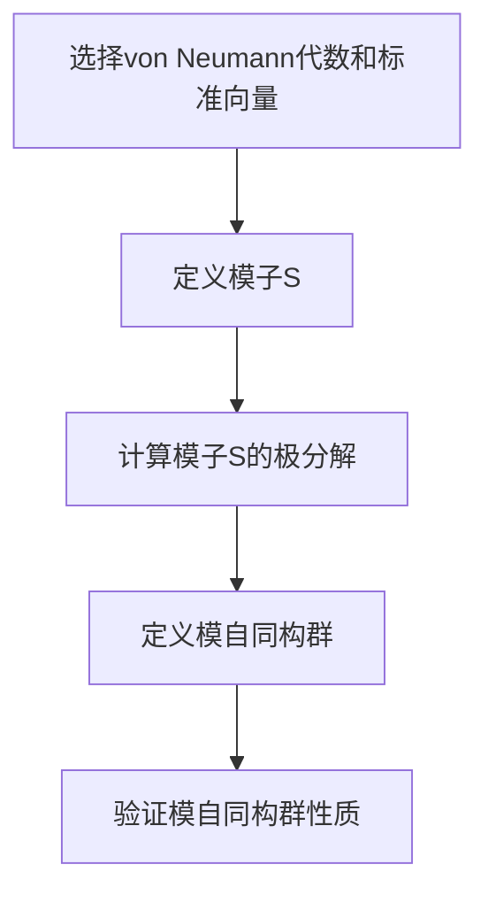

# 算子代数：Tomita-Takesaki理论

## 1.背景介绍

算子代数（Operator Algebra）是数学和物理学中的一个重要分支，主要研究在希尔伯特空间上定义的算子的代数结构。Tomita-Takesaki理论是算子代数中的一个核心理论，主要用于研究von Neumann代数的自同构群。该理论由日本数学家Tomita Minoru和Takesaki Masamichi在20世纪60年代提出，极大地推动了算子代数的发展。

Tomita-Takesaki理论的核心思想是通过模子（modular operator）和模自同构（modular automorphism）来研究von Neumann代数的结构和性质。该理论在量子力学、统计力学和量子场论中有着广泛的应用。

## 2.核心概念与联系

### 2.1 von Neumann代数

von Neumann代数是定义在希尔伯特空间上的闭合*-代数，具有强闭合性和包含单位元。它们是算子代数的一个重要子类，广泛应用于量子力学和统计力学。

### 2.2 模子（Modular Operator）

模子是Tomita-Takesaki理论中的一个关键概念。对于一个von Neumann代数 $\mathcal{M}$ 和一个标准向量 $\xi$，模子 $S$ 定义为：
$$
S: \mathcal{M} \xi \rightarrow \mathcal{M} \xi, \quad S(x \xi) = x^* \xi
$$
其中 $x \in \mathcal{M}$。

### 2.3 模自同构（Modular Automorphism）

模自同构是指在模子作用下，von Neumann代数的自同构。具体来说，对于一个von Neumann代数 $\mathcal{M}$ 和一个标准向量 $\xi$，模自同构 $\sigma_t$ 定义为：
$$
\sigma_t(x) = \Delta^{it} x \Delta^{-it}
$$
其中 $\Delta$ 是模子 $S$ 的极分解中的正算子部分。

### 2.4 Tomita-Takesaki定理

Tomita-Takesaki定理是该理论的核心定理，描述了模自同构群的结构。定理表明，对于任意的von Neumann代数 $\mathcal{M}$ 和标准向量 $\xi$，存在一个唯一的模自同构群 $\{\sigma_t\}$，使得：
$$
\sigma_t(x) = \Delta^{it} x \Delta^{-it}, \quad \forall x \in \mathcal{M}, t \in \mathbb{R}
$$

## 3.核心算法原理具体操作步骤

### 3.1 模子的构造

1. 选择一个von Neumann代数 $\mathcal{M}$ 和一个标准向量 $\xi$。
2. 定义模子 $S$ 为 $S(x \xi) = x^* \xi$，其中 $x \in \mathcal{M}$。
3. 计算模子 $S$ 的极分解 $S = J \Delta^{1/2}$，其中 $J$ 是反对称算子，$\Delta$ 是正算子。

### 3.2 模自同构群的构造

1. 利用模子的极分解，定义模自同构 $\sigma_t$ 为 $\sigma_t(x) = \Delta^{it} x \Delta^{-it}$。
2. 验证模自同构群的性质，确保其满足Tomita-Takesaki定理的要求。

### 3.3 具体操作步骤



## 4.数学模型和公式详细讲解举例说明

### 4.1 模子的极分解

模子 $S$ 的极分解为 $S = J \Delta^{1/2}$，其中 $J$ 是反对称算子，$\Delta$ 是正算子。具体来说，$J$ 满足 $J^2 = I$ 且 $J^* = J$，$\Delta$ 满足 $\Delta \geq 0$。

### 4.2 模自同构群的性质

模自同构群 $\{\sigma_t\}$ 满足以下性质：

1. $\sigma_t$ 是von Neumann代数 $\mathcal{M}$ 的自同构。
2. $\sigma_t$ 是一参数群，即 $\sigma_{t+s} = \sigma_t \circ \sigma_s$。
3. $\sigma_t$ 在 $t=0$ 时为恒等映射，即 $\sigma_0 = \text{id}$。

### 4.3 具体例子

考虑一个简单的von Neumann代数 $\mathcal{M} = B(H)$，其中 $H$ 是一个希尔伯特空间，$\xi$ 是 $H$ 中的一个标准向量。模子 $S$ 定义为 $S(x \xi) = x^* \xi$，其极分解为 $S = J \Delta^{1/2}$。模自同构群 $\{\sigma_t\}$ 定义为 $\sigma_t(x) = \Delta^{it} x \Delta^{-it}$。

## 5.项目实践：代码实例和详细解释说明

### 5.1 Python实现模子和模自同构群

```python
import numpy as np
import scipy.linalg as la

# 定义希尔伯特空间
H = np.array([[1, 0], [0, 1]])

# 定义标准向量
xi = np.array([1, 0])

# 定义von Neumann代数中的算子
x = np.array([[0, 1], [1, 0]])

# 定义模子S
def modular_operator(x, xi):
    return np.dot(x.T.conj(), xi)

S = modular_operator(x, xi)

# 计算模子S的极分解
J, Delta = la.polar(S)

# 定义模自同构群
def modular_automorphism(x, t):
    Delta_it = la.expm(1j * t * np.log(Delta))
    return np.dot(np.dot(Delta_it, x), la.inv(Delta_it))

# 验证模自同构群性质
t = 1.0
sigma_t = modular_automorphism(x, t)
print(sigma_t)
```

### 5.2 代码解释

1. 定义希尔伯特空间 $H$ 和标准向量 $\xi$。
2. 定义von Neumann代数中的算子 $x$。
3. 定义模子 $S$ 并计算其极分解。
4. 定义模自同构群 $\sigma_t$ 并验证其性质。

## 6.实际应用场景

### 6.1 量子力学

在量子力学中，Tomita-Takesaki理论用于研究量子态的时间演化和对称性。模自同构群可以描述量子态在不同时间点的变化。

### 6.2 统计力学

在统计力学中，Tomita-Takesaki理论用于研究热力学系统的平衡态和非平衡态。模自同构群可以描述系统在不同温度下的行为。

### 6.3 量子场论

在量子场论中，Tomita-Takesaki理论用于研究场的算子代数结构。模自同构群可以描述场的对称性和不变性。

## 7.工具和资源推荐

### 7.1 数学软件

- **Mathematica**：用于符号计算和数值计算的强大工具。
- **MATLAB**：用于矩阵计算和数值分析的工具。

### 7.2 编程语言

- **Python**：具有丰富的科学计算库，如NumPy和SciPy。
- **Julia**：高性能的科学计算语言，适合大规模数值计算。

### 7.3 参考书籍

- **《Operator Algebras and Quantum Statistical Mechanics》** by Ola Bratteli and Derek W. Robinson
- **《Modular Theory in Operator Algebras》** by S. Stratila and L. Zsido

## 8.总结：未来发展趋势与挑战

Tomita-Takesaki理论作为算子代数中的核心理论，已经在多个领域取得了重要应用。然而，随着量子计算和量子信息科学的发展，该理论面临新的挑战和机遇。未来的研究方向可能包括：

1. **量子计算中的应用**：研究Tomita-Takesaki理论在量子计算中的应用，特别是量子态的时间演化和对称性。
2. **大规模数值计算**：开发高效的数值算法，用于计算模子和模自同构群。
3. **跨学科应用**：探索该理论在其他学科中的应用，如生物信息学和金融数学。

## 9.附录：常见问题与解答

### 9.1 什么是von Neumann代数？

von Neumann代数是定义在希尔伯特空间上的闭合*-代数，具有强闭合性和包含单位元。

### 9.2 什么是模子？

模子是Tomita-Takesaki理论中的一个关键概念，用于研究von Neumann代数的结构和性质。

### 9.3 什么是模自同构？

模自同构是指在模子作用下，von Neumann代数的自同构。

### 9.4 Tomita-Takesaki定理的核心内容是什么？

Tomita-Takesaki定理描述了模自同构群的结构，表明对于任意的von Neumann代数和标准向量，存在一个唯一的模自同构群。

### 9.5 Tomita-Takesaki理论有哪些实际应用？

该理论在量子力学、统计力学和量子场论中有广泛的应用，用于研究量子态的时间演化、热力学系统的平衡态和场的算子代数结构。

---

作者：禅与计算机程序设计艺术 / Zen and the Art of Computer Programming