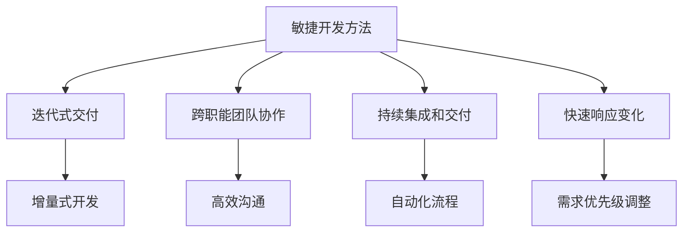
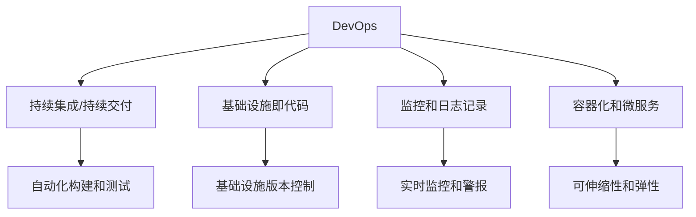
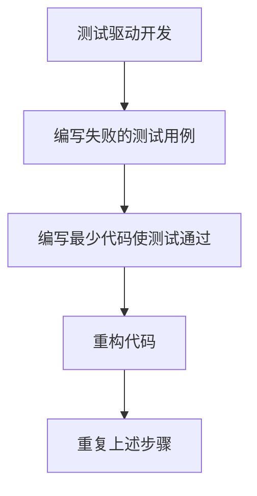
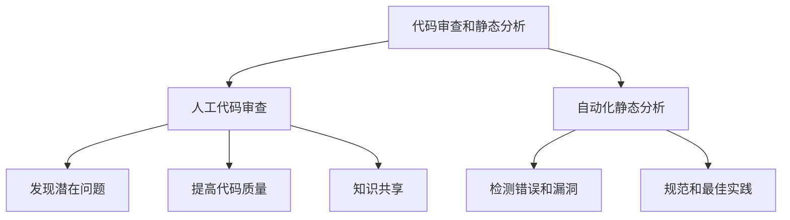
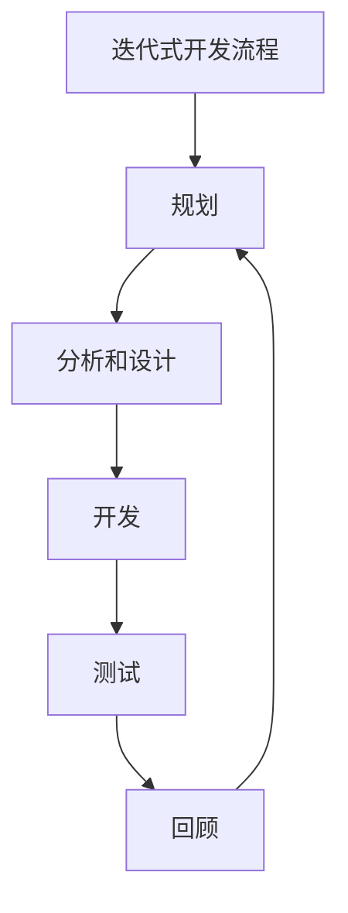
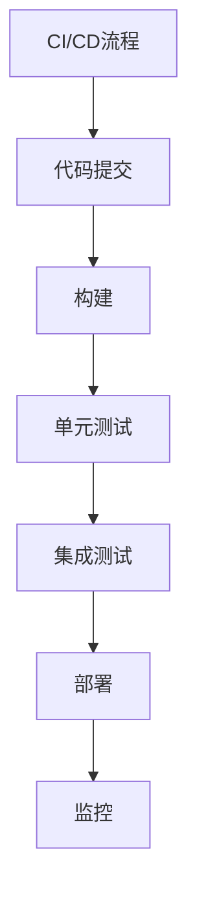
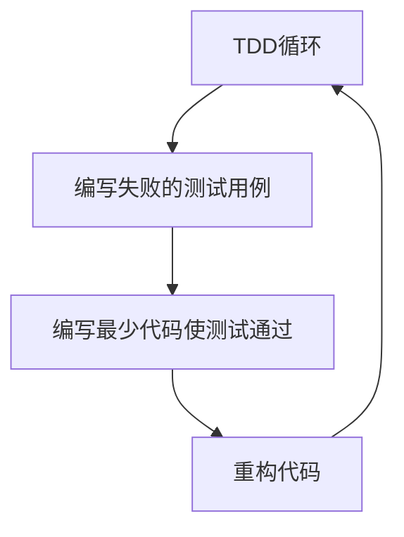
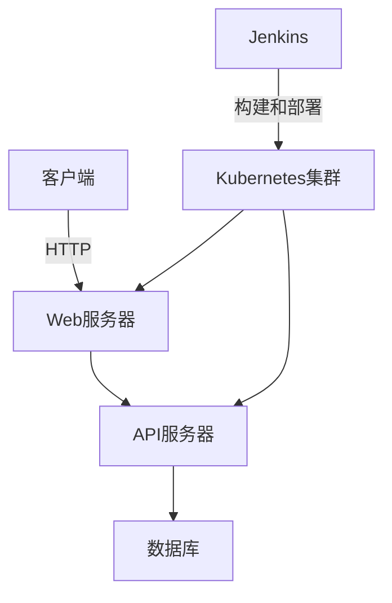

# 组织和指导项目的开发、测试、维护、升级、更新，解决开发中的技术问题

## 1.背景介绍

在当今快节奏的软件开发环境中，有效地组织和指导项目的各个阶段至关重要。无论是初创公司还是大型企业,都需要一个全面的流程来确保项目的顺利交付。本文将探讨如何组织和指导项目的开发、测试、维护、升级和更新,并解决开发过程中可能遇到的技术问题。

### 1.1 项目生命周期概述

一个典型的软件项目生命周期包括以下几个阶段:

1. **需求分析**: 收集和分析客户需求,确定项目目标和范围。
2. **设计**: 根据需求,设计系统架构、数据库模型和用户界面。
3. **开发**: 编写代码,实现设计规范。
4. **测试**: 执行各种测试(单元测试、集成测试、系统测试等),确保质量。
5. **部署**: 将软件部署到生产环境中。
6. **维护**: 解决生产环境中的问题,对系统进行升级和优化。

每个阶段都需要精心组织和指导,以确保项目的成功交付。

### 1.2 项目管理的重要性

有效的项目管理对于确保项目的顺利进行至关重要。它包括:

- 制定明确的目标和里程碑
- 分配资源和任务
- 监控进度并采取纠正措施
- 管理风险和问题
- 与利益相关者沟通协调

良好的项目管理有助于控制成本、提高效率,并确保按时交付高质量的产品。

## 2.核心概念与联系

### 2.1 敏捷开发方法

敏捷开发方法(如Scrum和Kanban)已成为当今软件开发中的主流实践。它们强调:

- 迭代式交付
- 跨职能团队协作
- 持续集成和交付
- 快速响应变化的需求

敏捷方法有助于提高开发效率,缩短上市时间,并提高软件质量。



### 2.2 DevOps实践

DevOps是一种将软件开发(Dev)和运维(Ops)流程无缝集成的理念和实践。它旨在通过自动化和协作来加快软件交付速度,确保高质量和可靠性。

DevOps实践包括:

- 持续集成/持续交付(CI/CD)
- 基础设施即代码(IaC)
- 监控和日志记录
- 容器化和微服务架构



### 2.3 测试驱动开发(TDD)

测试驱动开发(TDD)是一种软件开发实践,它将测试放在开发过程的最前沿。开发人员首先编写失败的测试用例,然后编写最少的代码使测试通过,最后重构代码。

TDD的优势包括:

- 确保代码可测试性
- 促进模块化设计
- 提高代码质量和可维护性
- 减少调试时间



### 2.4 代码审查和静态分析

代码审查和静态分析是确保代码质量的重要实践。

代码审查是由团队成员彼此审查代码,发现潜在问题和改进空间。这有助于:

- 提高代码可读性和可维护性
- 发现潜在的缺陷和安全漏洞
- 分享知识和最佳实践

静态分析工具可以自动扫描代码,检测潜在的错误、漏洞和代码质量问题。常用工具包括SonarQube、PMD和FindBugs。



## 3.核心算法原理具体操作步骤

### 3.1 迭代式开发流程

敏捷开发方法通常采用迭代式开发流程,每个迭代都包含以下步骤:

1. **规划**: 根据产品待办事项(Product Backlog)确定当前迭代的目标和任务。
2. **分析和设计**: 分析需求,设计系统架构和用户界面。
3. **开发**: 编写代码,实现设计规范。
4. **测试**: 执行单元测试、集成测试和系统测试。
5. **回顾**: 评估当前迭代的成果,收集反馈,并规划下一个迭代。



### 3.2 持续集成/持续交付流程

DevOps实践中的持续集成/持续交付(CI/CD)流程通常包括以下步骤:

1. **代码提交**: 开发人员将代码提交到版本控制系统(如Git)。
2. **构建**: 自动化构建系统(如Jenkins)从版本控制系统获取代码,编译并打包应用程序。
3. **单元测试**: 执行自动化单元测试,确保新代码没有引入缺陷。
4. **集成测试**: 在模拟环境中执行集成测试,验证系统各个组件之间的交互。
5. **部署**: 如果所有测试都通过,则将应用程序部署到生产环境中。
6. **监控**: 持续监控应用程序的性能和可用性,并在出现问题时发出警报。



### 3.3 测试驱动开发循环

测试驱动开发(TDD)遵循以下循环:

1. **编写失败的测试用例**: 首先编写一个失败的测试用例,描述期望的行为。
2. **编写最少代码使测试通过**: 编写最少的代码,使新编写的测试用例通过。
3. **重构代码**: 在保持所有测试用例通过的前提下,重构代码以提高其可读性和可维护性。
4. **重复上述步骤**: 对于每个新功能或需求,重复上述步骤。



## 4.数学模型和公式详细讲解举例说明

### 4.1 软件可靠性模型

软件可靠性是指软件在指定的环境和条件下,在一定时间内正确运行的概率。软件可靠性模型可用于预测和评估软件的可靠性。

一种常用的软件可靠性模型是**指数模型**,其公式如下:

$$
R(t) = e^{-\lambda t}
$$

其中:

- $R(t)$ 表示在时间 $t$ 时软件正确运行的概率
- $\lambda$ 是故障率,表示单位时间内发生故障的概率

例如,如果一个软件的故障率 $\lambda = 0.001$ (每小时0.1%的故障概率),那么在 100 小时后,该软件正确运行的概率为:

$$
R(100) = e^{-0.001 \times 100} \approx 0.905
$$

即90.5%的概率正确运行。

### 4.2 队列理论在系统性能优化中的应用

队列理论可用于分析和优化系统性能,特别是在并发请求场景下。常用的指标包括:

- 平均响应时间 $T$
- 平均队列长度 $L$
- 系统利用率 $\rho$

对于 $M/M/1$ 队列模型(泊松过程到达,指数服务时间分布,单个服务器),有以下公式:

$$
T = \frac{1}{\mu - \lambda}
$$

$$
L = \frac{\rho}{1 - \rho}
$$

$$
\rho = \frac{\lambda}{\mu}
$$

其中:

- $\lambda$ 是平均到达率
- $\mu$ 是平均服务率

例如,如果一个Web服务器每秒可以处理 100 个请求($\mu = 100$),而平均到达率为 90 个请求/秒($\lambda = 90$),那么:

- 系统利用率 $\rho = 90/100 = 0.9$
- 平均队列长度 $L = 0.9 / (1 - 0.9) = 9$
- 平均响应时间 $T = 1 / (100 - 90) = 0.01$ 秒

通过分析这些指标,我们可以确定系统瓶颈,并采取相应的优化措施,如增加服务器资源或优化代码性能。

## 5.项目实践:代码实例和详细解释说明

在本节中,我们将通过一个简单的示例项目来演示如何应用前面介绍的概念和实践。

### 5.1 项目概述

我们将构建一个简单的在线购物网站,包括以下功能:

- 用户注册和登录
- 浏览和搜索产品
- 添加产品到购物车
- 结账和支付

### 5.2 技术栈和架构

该项目采用以下技术栈:

- **前端**: React、Redux、React Router
- **后端**: Node.js、Express、MongoDB
- **测试**: Jest、Enzyme、Mocha、Chai
- **DevOps**: Docker、Jenkins、Kubernetes

系统架构如下所示:



### 5.3 迭代式开发

我们将采用敏捷开发方法,分为以下几个迭代:

1. **用户认证**:实现用户注册、登录和会话管理功能。
2. **产品浏览**:实现产品列表、搜索和分类功能。
3. **购物车**:实现添加/删除产品到购物车的功能。
4. **结账和支付**:实现结账和支付流程。
5. **优化和测试**:进行性能优化、负载测试和安全测试。

每个迭代都将遵循"规划 - 开发 - 测试 - 回顾"的循环。

### 5.4 测试驱动开发示例

以下是一个使用测试驱动开发(TDD)实现购物车功能的示例:

1. **编写失败的测试用例**:

```javascript
// cart.test.js
describe('Cart', () => {
  it('should add a product to the cart', () => {
    const cart = new Cart();
    const product = { id: 1, name: 'Product 1', price: 10 };
    cart.addProduct(product);
    expect(cart.getItems()).toContain(product);
  });
});
```

2. **编写最少代码使测试通过**:

```javascript
// cart.js
class Cart {
  constructor() {
    this.items = [];
  }

  addProduct(product) {
    this.items.push(product);
  }

  getItems() {
    return this.items;
  }
}

module.exports = Cart;
```

3. **重构代码**:

```javascript
// cart.js
class Cart {
  constructor() {
    this.items = new Map();
  }

  addProduct(product) {
    const { id } = product;
    const quantity = this.items.get(id) || 0;
    this.items.set(id, quantity + 1);
  }

  getItems() {