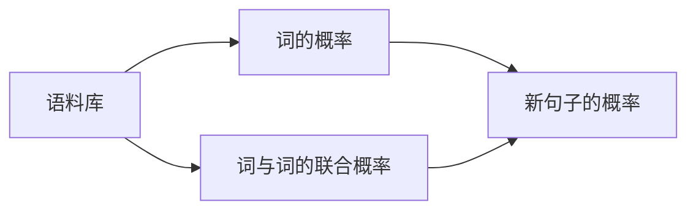

## 1.背景介绍
统计语言模型（Statistical Language Model，SLM）是自然语言处理（Natural Language Processing，NLP）中的一种关键技术。自20世纪80年代以来，统计语言模型的研究和应用已经取得了显著的进步。本文将详细介绍统计语言模型的发展历程，以及其在语音识别、机器翻译、信息检索等领域的应用。

## 2.核心概念与联系
统计语言模型的主要任务是计算一个句子的概率。它的基本思想是：根据已有的语言材料（语料库）统计每个词出现的概率以及每个词与其前后词的联合概率，然后根据这些概率推断新的句子的概率。



## 3.核心算法原理具体操作步骤
统计语言模型的建立主要包括以下步骤：

1. 语料库的准备：选择一个足够大的语料库，包含各种类型的语言材料，如新闻、文学作品、网络文章等。
2. 词的切分：将语料库中的句子切分成单词，统计每个单词的出现次数。
3. 计算词的概率：根据每个词的出现次数和总词数计算每个词的概率。
4. 计算词与词的联合概率：统计每对词的出现次数，计算它们的联合概率。
5. 预测新句子的概率：对于一个新的句子，将其切分成单词，然后根据词的概率和词与词的联合概率计算句子的概率。

## 4.数学模型和公式详细讲解举例说明
统计语言模型的计算主要涉及到以下两个公式：

1. 词的概率：$P(w_i) = \frac{count(w_i)}{N}$，其中$count(w_i)$是词$w_i$在语料库中的出现次数，$N$是总词数。
2. 词与词的联合概率：$P(w_i, w_j) = \frac{count(w_i, w_j)}{N}$，其中$count(w_i, w_j)$是词$w_i$和$w_j$在语料库中同时出现的次数。

例如，对于句子"The cat sat on the mat"，我们可以将其切分成"The", "cat", "sat", "on", "the", "mat"，然后根据词的概率和词与词的联合概率计算句子的概率。

## 5.项目实践：代码实例和详细解释说明
以下是一个简单的统计语言模型的实现：

```python
from collections import Counter

# 语料库
corpus = ["The cat sat on the mat", "The dog sat on the log", "Dogs and cats living together"]
# 切分单词
words = [word for sentence in corpus for word in sentence.split()]
# 计算词的概率
word_prob = {word: count / len(words) for word, count in Counter(words).items()}
# 计算词与词的联合概率
word_pair_prob = {pair: count / len(words) for pair, count in Counter(zip(words[:-1], words[1:])).items()}
```

## 6.实际应用场景
统计语言模型在许多NLP任务中都有应用，例如：

1. 语音识别：统计语言模型可以用来判断识别结果的合理性，选择最可能的识别结果。
2. 机器翻译：统计语言模型可以用来评估翻译结果的流畅度，选择最自然的翻译结果。
3. 信息检索：统计语言模型可以用来评估查询和文档的相关性，提高检索的准确性。

## 7.工具和资源推荐
以下是一些常用的统计语言模型工具和资源：

1. NLTK：一个强大的Python库，提供了丰富的NLP工具，包括统计语言模型。
2. KenLM：一个高效的语言模型库，支持n-gram语言模型。
3. Google Ngram Viewer：一个在线工具，可以查询Google Books语料库中的n-gram频率。

## 8.总结：未来发展趋势与挑战
虽然统计语言模型已经取得了显著的进步，但仍然面临着一些挑战，例如数据稀疏问题、计算复杂性问题等。随着深度学习的发展，神经网络语言模型已经成为了研究的热点，它可以有效地解决数据稀疏问题，提高模型的性能。

## 9.附录：常见问题与解答
1. Q: 什么是n-gram语言模型？
   A: n-gram语言模型是统计语言模型的一种，它假设一个词的出现只与前n-1个词相关，这样可以大大简化模型的计算。

2. Q: 什么是数据稀疏问题？
   A: 数据稀疏问题是指在大规模语料库中，很多词组合可能从未出现过，这使得统计语言模型难以处理未见过的词组合。

3. Q: 什么是神经网络语言模型？
   A: 神经网络语言模型是一种基于神经网络的语言模型，它可以学习词的连续表示，有效地解决数据稀疏问题。

作者：禅与计算机程序设计艺术 / Zen and the Art of Computer Programming