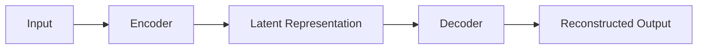

# 自动编码器 (Autoencoder)

## 1. 背景介绍
### 1.1 什么是自动编码器
自动编码器（Autoencoder）是一种无监督学习的神经网络模型，它旨在学习数据的高效表示。自动编码器由两部分组成：编码器（Encoder）和解码器（Decoder）。编码器将输入数据映射到低维表示（编码），解码器则将低维表示重构为原始输入。通过最小化输入和重构输出之间的差异，自动编码器学习捕捉数据的关键特征。

### 1.2 自动编码器的发展历程
自动编码器的概念最早由 Hinton 和 Zemel 在 1994 年提出。随后，自动编码器在深度学习领域得到广泛应用，特别是在数据降维、特征学习和生成模型等方面取得了显著成果。近年来，随着深度学习的快速发展，各种变体的自动编码器不断涌现，如变分自动编码器（VAE）、去噪自动编码器（DAE）等，进一步扩展了自动编码器的应用范围。

### 1.3 自动编码器的应用领域
自动编码器在许多领域都有广泛应用，包括：
- 数据降维与可视化：自动编码器可以将高维数据压缩到低维空间，便于可视化和分析。
- 特征学习：自动编码器学习数据的高级特征表示，可用于后续的监督学习任务。
- 图像去噪与修复：通过训练自动编码器重构干净图像，可以实现图像去噪和修复。
- 异常检测：自动编码器可以学习正常数据的表示，对于异常数据，重构误差会较大，从而实现异常检测。
- 生成模型：自动编码器的变体，如变分自动编码器，可以生成与训练数据相似的新样本。

## 2. 核心概念与联系
### 2.1 编码器（Encoder）
编码器是自动编码器的第一部分，其目的是将输入数据 $x$ 映射到低维表示 $z$（编码）。编码器通常由多层神经网络组成，每层使用非线性激活函数（如 ReLU）。编码器可以表示为：

$$z = f(x) = \sigma(Wx + b)$$

其中，$W$ 是权重矩阵，$b$ 是偏置向量，$\sigma$ 是非线性激活函数。

### 2.2 解码器（Decoder）
解码器是自动编码器的第二部分，其目的是将低维表示 $z$ 重构为原始输入 $\hat{x}$。解码器也由多层神经网络组成，与编码器的结构相反。解码器可以表示为：

$$\hat{x} = g(z) = \sigma'(W'z + b')$$

其中，$W'$ 是权重矩阵，$b'$ 是偏置向量，$\sigma'$ 是非线性激活函数。

### 2.3 重构误差（Reconstruction Error）
自动编码器的训练目标是最小化输入 $x$ 和重构输出 $\hat{x}$ 之间的差异，即重构误差。常用的重构误差度量包括均方误差（MSE）和交叉熵损失。对于均方误差，损失函数定义为：

$$L(x, \hat{x}) = \frac{1}{n} \sum_{i=1}^n (x_i - \hat{x}_i)^2$$

其中，$n$ 是输入特征的维度。

### 2.4 自动编码器与其他概念的联系
- 主成分分析（PCA）：自动编码器可以看作是非线性的主成分分析，学习数据的非线性低维表示。
- 降维：自动编码器通过将数据映射到低维空间实现降维，类似于其他降维方法如 PCA 和 t-SNE。
- 特征学习：自动编码器学习数据的高级特征表示，可用于后续的监督学习任务，如分类和回归。
- 生成模型：变分自动编码器（VAE）是一种生成模型，可以生成与训练数据相似的新样本。



## 3. 核心算法原理具体操作步骤
### 3.1 数据准备
- 收集和清洗数据，确保数据质量。
- 对数据进行预处理，如归一化、标准化等。
- 将数据划分为训练集和验证集。

### 3.2 构建自动编码器模型
- 确定编码器和解码器的层数和每层的神经元数量。
- 选择适当的激活函数，如 ReLU、Sigmoid 等。
- 定义重构误差的损失函数，如均方误差或交叉熵损失。
- 选择优化算法，如 Adam、SGD 等。

### 3.3 训练自动编码器
- 将训练数据输入自动编码器，计算重构误差。
- 使用反向传播算法计算梯度，更新模型参数。
- 在每个 epoch 结束时，在验证集上评估模型性能。
- 根据验证集性能调整超参数，如学习率、批量大小等。
- 重复训练过程，直到模型性能满足要求或达到预定的 epoch 数。

### 3.4 模型评估与应用
- 在测试集上评估训练好的自动编码器性能。
- 使用训练好的编码器对新数据进行编码，获得低维表示。
- 将低维表示用于可视化、特征学习、异常检测等下游任务。
- 如果是变分自动编码器，还可以使用解码器生成新样本。

## 4. 数学模型和公式详细讲解举例说明
### 4.1 编码器数学模型
编码器将输入数据 $x \in \mathbb{R}^n$ 映射到低维表示 $z \in \mathbb{R}^d$，其中 $d < n$。编码器可以表示为：

$$z = f(x) = \sigma(W_1x + b_1)$$

其中，$W_1 \in \mathbb{R}^{d \times n}$ 是权重矩阵，$b_1 \in \mathbb{R}^d$ 是偏置向量，$\sigma$ 是非线性激活函数，如 ReLU：

$$\sigma(x) = \max(0, x)$$

举例说明：假设输入数据 $x = [1, 2, 3]^T$，编码器的权重矩阵 $W_1 = \begin{bmatrix} 0.1 & 0.2 & 0.3 \\ 0.4 & 0.5 & 0.6 \end{bmatrix}$，偏置向量 $b_1 = [0.1, 0.2]^T$。则编码后的低维表示为：

$$z = \max(0, W_1x + b_1) = \max(0, \begin{bmatrix} 0.1 & 0.2 & 0.3 \\ 0.4 & 0.5 & 0.6 \end{bmatrix} \begin{bmatrix} 1 \\ 2 \\ 3 \end{bmatrix} + \begin{bmatrix} 0.1 \\ 0.2 \end{bmatrix}) = \begin{bmatrix} 1.4 \\ 2.3 \end{bmatrix}$$

### 4.2 解码器数学模型
解码器将低维表示 $z \in \mathbb{R}^d$ 重构为原始输入 $\hat{x} \in \mathbb{R}^n$。解码器可以表示为：

$$\hat{x} = g(z) = \sigma'(W_2z + b_2)$$

其中，$W_2 \in \mathbb{R}^{n \times d}$ 是权重矩阵，$b_2 \in \mathbb{R}^n$ 是偏置向量，$\sigma'$ 是非线性激活函数，如 Sigmoid：

$$\sigma'(x) = \frac{1}{1 + e^{-x}}$$

举例说明：假设低维表示 $z = [1.4, 2.3]^T$，解码器的权重矩阵 $W_2 = \begin{bmatrix} 0.7 & 0.8 \\ 0.9 & 1.0 \\ 1.1 & 1.2 \end{bmatrix}$，偏置向量 $b_2 = [0.1, 0.2, 0.3]^T$。则重构输出为：

$$\hat{x} = \sigma'(W_2z + b_2) = \frac{1}{1 + e^{-(W_2z + b_2)}} = \frac{1}{1 + e^{-(\begin{bmatrix} 0.7 & 0.8 \\ 0.9 & 1.0 \\ 1.1 & 1.2 \end{bmatrix} \begin{bmatrix} 1.4 \\ 2.3 \end{bmatrix} + \begin{bmatrix} 0.1 \\ 0.2 \\ 0.3 \end{bmatrix})}} = \begin{bmatrix} 0.95 \\ 0.98 \\ 0.99 \end{bmatrix}$$

### 4.3 重构误差数学模型
自动编码器的训练目标是最小化重构误差，即输入 $x$ 和重构输出 $\hat{x}$ 之间的差异。常用的重构误差度量包括均方误差（MSE）和交叉熵损失。对于均方误差，损失函数定义为：

$$L(x, \hat{x}) = \frac{1}{n} \sum_{i=1}^n (x_i - \hat{x}_i)^2$$

其中，$n$ 是输入特征的维度。

举例说明：假设输入数据 $x = [1, 2, 3]^T$，重构输出 $\hat{x} = [0.95, 1.98, 2.99]^T$，则均方误差为：

$$L(x, \hat{x}) = \frac{1}{3} ((1 - 0.95)^2 + (2 - 1.98)^2 + (3 - 2.99)^2) = 0.0003$$

## 5. 项目实践：代码实例和详细解释说明
下面是使用 Python 和 TensorFlow 实现简单自动编码器的代码示例：

```python
import tensorflow as tf
from tensorflow import keras

# 构建编码器
encoder_inputs = keras.Input(shape=(784,))
x = keras.layers.Dense(128, activation='relu')(encoder_inputs)
x = keras.layers.Dense(64, activation='relu')(x)
encoder_outputs = keras.layers.Dense(32, activation='relu')(x)

# 构建解码器
decoder_inputs = keras.layers.Dense(64, activation='relu')(encoder_outputs)
x = keras.layers.Dense(128, activation='relu')(decoder_inputs)
decoder_outputs = keras.layers.Dense(784, activation='sigmoid')(x)

# 构建自动编码器
autoencoder = keras.Model(inputs=encoder_inputs, outputs=decoder_outputs)

# 编译模型
autoencoder.compile(optimizer='adam', loss='binary_crossentropy')

# 准备数据
(x_train, _), (x_test, _) = keras.datasets.mnist.load_data()
x_train = x_train.astype('float32') / 255.
x_test = x_test.astype('float32') / 255.
x_train = x_train.reshape((len(x_train), 784))
x_test = x_test.reshape((len(x_test), 784))

# 训练模型
autoencoder.fit(x_train, x_train,
                epochs=50,
                batch_size=256,
                validation_data=(x_test, x_test))
```

代码解释：
1. 导入必要的库，包括 TensorFlow 和 Keras。
2. 构建编码器，使用 Keras 的函数式 API。编码器包含三个全连接层，分别有 128、64 和 32 个神经元，激活函数为 ReLU。
3. 构建解码器，也使用 Keras 的函数式 API。解码器包含三个全连接层，分别有 64、128 和 784 个神经元，最后一层使用 Sigmoid 激活函数。
4. 将编码器和解码器组合成自动编码器模型。
5. 编译模型，指定优化器为 Adam，损失函数为二元交叉熵。
6. 准备 MNIST 数据集，对像素值进行归一化，并将图像展平为一维向量。
7. 训练模型，指定训练轮数（epochs）、批量大小（batch_size）和验证数据。

## 6. 实际应用场景
自动编码器在许多实际应用场景中发挥着重要作用，包括：

### 6.1 数据降维与可视化
自动编码器可以将高维数据压缩到低维空间，便于可视化和分析。例如，在医学影像领域，自动编码器可以将高维医学图像压缩到二维或三维空间，方便医生进行诊断和分析。

### 6.2 图像去噪与修复
通过训练自动编码器重构干净图像，可以实现图像去噪和修复。这在图像处理领域有广泛应