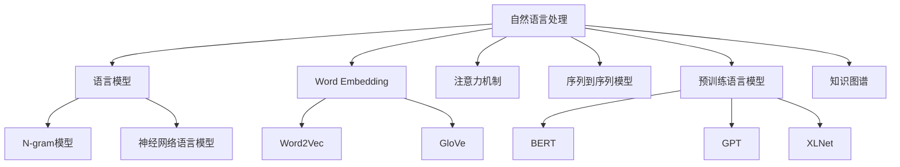

# 自然语言处理(Natural Language Processing) - 原理与代码实例讲解

## 1.背景介绍

### 1.1 什么是自然语言处理?

自然语言处理(Natural Language Processing, NLP)是人工智能领域的一个重要分支,旨在使计算机能够理解、处理和生成人类自然语言。它涉及多个领域,包括计算机科学、语言学、认知科学等。NLP的目标是开发能够像人类一样理解和生成自然语言的系统。

### 1.2 自然语言处理的重要性

随着信息时代的到来,海量的文本数据被产生,对这些数据进行有效处理和分析成为了一个迫切需求。NLP技术可以帮助我们自动化地从大量非结构化的文本数据中提取有价值的信息,从而为各行各业带来巨大的价值。

此外,NLP技术还可以应用于智能助手、机器翻译、问答系统、文本摘要等多个领域,极大地提高了人机交互的效率和质量。

### 1.3 自然语言处理的挑战

尽管取得了长足的进步,但自然语言处理仍然面临着诸多挑战:

- 语言的复杂性和多样性
- 语义歧义和上下文依赖
- 需要大量的标注数据
- 缺乏通用的解决方案

## 2.核心概念与联系

### 2.1 自然语言处理的主要任务

自然语言处理包括以下几个主要任务:

1. **词法分析(Tokenization)**: 将文本分割成词元(token)序列。
2. **词性标注(Part-of-Speech Tagging)**: 为每个词元赋予相应的词性标记。
3. **命名实体识别(Named Entity Recognition, NER)**: 识别出文本中的人名、地名、组织机构名等命名实体。
4. **依存分析(Dependency Parsing)**: 确定句子中词与词之间的依存关系。
5. **句法分析(Syntactic Parsing)**: 分析句子的语法结构。
6. **词义消歧(Word Sense Disambiguation, WSD)**: 确定一个词在给定上下文中的确切含义。
7. **指代消解(Coreference Resolution)**: 确定文本中的代词、名词短语所指代的实体。
8. **情感分析(Sentiment Analysis)**: 判断一段文本所表达的情感倾向(正面、负面或中性)。
9. **文本摘要(Text Summarization)**: 自动生成一段文本的摘要。
10. **机器翻译(Machine Translation)**: 将一种自然语言翻译成另一种自然语言。
11. **对话系统(Dialogue System)**: 构建能够与人自然对话的系统。

这些任务相互关联,共同构建了自然语言处理的核心。

### 2.2 自然语言处理中的核心概念

#### 2.2.1 语言模型(Language Model)

语言模型是自然语言处理中的一个核心概念,它用于估计一个句子或者一段文本的概率。语言模型广泛应用于机器翻译、语音识别、文本生成等任务中。常见的语言模型包括N-gram模型、神经网络语言模型等。

#### 2.2.2 Word Embedding

Word Embedding是将单词映射到连续的向量空间中的技术,使得语义相似的单词在向量空间中彼此靠近。常见的Word Embedding技术包括Word2Vec、GloVe等。Word Embedding是深度学习在自然语言处理领域取得突破性进展的重要基础。

#### 2.2.3 注意力机制(Attention Mechanism)

注意力机制是深度学习中的一种重要技术,它允许模型在处理序列数据时,对不同位置的输入数据赋予不同的权重,从而更好地捕捉长距离依赖关系。注意力机制在机器翻译、阅读理解等任务中发挥了关键作用。

#### 2.2.4 序列到序列模型(Sequence-to-Sequence Model)

序列到序列模型是一种通用的框架,可以将一个序列(如一段文本)映射到另一个序列(如另一种语言的翻译文本)。它广泛应用于机器翻译、文本摘要、对话系统等任务中。

#### 2.2.5 预训练语言模型(Pre-trained Language Model)

预训练语言模型是近年来自然语言处理领域的一个重大突破。通过在大规模无标注语料库上进行预训练,可以获得通用的语言表示,然后将这些表示迁移到下游任务中,极大地提高了模型的性能。著名的预训练语言模型包括BERT、GPT、XLNet等。

#### 2.2.6 知识图谱(Knowledge Graph)

知识图谱是一种结构化的知识表示形式,它将实体及其关系以图的形式表示出来。知识图谱在问答系统、关系抽取等任务中发挥着重要作用。

这些概念相互关联、相辅相成,共同推动着自然语言处理技术的发展。

## 3.核心算法原理具体操作步骤

### 3.1 Word Embedding

Word Embedding是将单词映射到连续的向量空间中的技术,使得语义相似的单词在向量空间中彼此靠近。常见的Word Embedding技术包括Word2Vec和GloVe。

#### 3.1.1 Word2Vec

Word2Vec是一种基于浅层神经网络的Word Embedding技术,包括两种模型:连续词袋模型(CBOW)和Skip-Gram模型。

**CBOW模型**的目标是根据上下文词预测目标词,具体步骤如下:

1. 对于给定的目标词$w_t$及其上下文词$w_{t-c},...,w_{t-1},w_{t+1},...,w_{t+c}$,将它们对应的词向量相加得到上下文向量$v_c$。
2. 将上下文向量$v_c$输入到一个单层神经网络中,得到输出向量$y$。
3. 使用softmax函数计算$y$对应的概率分布$\hat{y}$。
4. 将$\hat{y}$与one-hot编码的目标词$w_t$进行比较,计算交叉熵损失。
5. 使用反向传播算法更新模型参数,最小化损失函数。

**Skip-Gram模型**的目标是根据目标词预测上下文词,步骤与CBOW类似,只是输入和输出的顺序相反。

#### 3.1.2 GloVe

GloVe(Global Vectors for Word Representation)是另一种基于词共现统计信息的Word Embedding技术。它的核心思想是,如果两个单词在语料库中经常共现,则它们的词向量应该更加相似。

GloVe的具体步骤如下:

1. 构建词共现矩阵$X$,其中$X_{ij}$表示单词$i$和单词$j$在语料库中共现的次数。
2. 定义一个损失函数,衡量词向量与共现统计信息之间的差异。
3. 使用梯度下降法最小化损失函数,得到最终的词向量表示。

### 3.2 注意力机制(Attention Mechanism)

注意力机制是深度学习中的一种重要技术,它允许模型在处理序列数据时,对不同位置的输入数据赋予不同的权重,从而更好地捕捉长距离依赖关系。

#### 3.2.1 加性注意力(Additive Attention)

加性注意力是最早提出的注意力机制之一,其计算步骤如下:

1. 计算查询向量$q$与每个键向量$k_i$的相似性得分$e_i$:

$$e_i = \text{score}(q, k_i) = q^T W_v k_i$$

其中$W_v$是一个可学习的权重矩阵。

2. 对相似性得分进行softmax归一化,得到注意力权重$\alpha_i$:

$$\alpha_i = \frac{\exp(e_i)}{\sum_j \exp(e_j)}$$

3. 将注意力权重与值向量$v_i$相乘,再求和,得到加权后的上下文向量$c$:

$$c = \sum_i \alpha_i v_i$$

4. 将上下文向量$c$与查询向量$q$进行融合,得到最终的注意力输出。

#### 3.2.2 点积注意力(Dot-Product Attention)

点积注意力是一种计算更加高效的注意力机制,它直接计算查询向量$q$与键向量$k_i$的点积作为相似性得分:

$$e_i = q^T k_i$$

其余步骤与加性注意力相同。

#### 3.2.3 多头注意力(Multi-Head Attention)

多头注意力是将多个注意力机制的输出进行拼接,以捕捉不同的子空间表示。具体步骤如下:

1. 将查询向量$q$、键向量$k$和值向量$v$分别线性映射为$h$个子空间:

$$\begin{aligned}
q_i &= W_q^i q \\
k_i &= W_k^i k \\
v_i &= W_v^i v
\end{aligned}$$

2. 对每个子空间,分别计算注意力输出$o_i$。
3. 将所有子空间的注意力输出拼接起来,得到最终的多头注意力输出$o$:

$$o = \text{Concat}(o_1, o_2, ..., o_h)$$

多头注意力能够从不同的子空间获取信息,提高了模型的表示能力。

### 3.3 BERT

BERT(Bidirectional Encoder Representations from Transformers)是一种基于Transformer的预训练语言模型,在自然语言处理任务中取得了卓越的成绩。

#### 3.3.1 BERT的预训练任务

BERT采用了两种预训练任务:

1. **掩码语言模型(Masked Language Model, MLM)**: 随机将输入序列中的一些词替换为特殊的[MASK]标记,然后让模型基于上下文预测被掩码的词。
2. **下一句预测(Next Sentence Prediction, NSP)**: 给定两个句子A和B,模型需要预测B是否为A的下一句。

这两个预训练任务使得BERT能够同时捕捉词级和句级的语义信息。

#### 3.3.2 BERT的模型架构

BERT的模型架构基于Transformer,包括多层编码器模块。每个编码器模块由多头自注意力(Multi-Head Self-Attention)和前馈神经网络(Feed-Forward Neural Network)组成。

在预训练阶段,BERT在大规模无标注语料库上进行训练,学习通用的语言表示。在下游任务中,BERT的输出可以作为特征输入到任务特定的模型中,或者通过微调BERT模型来完成任务。

### 3.4 GPT

GPT(Generative Pre-trained Transformer)是另一种基于Transformer的预训练语言模型,它采用了自回归(Auto-Regressive)的语言模型训练方式。

#### 3.4.1 GPT的预训练任务

GPT的预训练任务是基于给定的上文,预测下一个词的概率分布。具体来说,对于一个长度为$n$的文本序列$x_1, x_2, ..., x_n$,GPT需要最大化如下条件概率:

$$\prod_{i=1}^n P(x_i | x_1, x_2, ..., x_{i-1})$$

这种自回归的训练方式使得GPT擅长于生成任务,如机器翻译、文本生成等。

#### 3.4.2 GPT的模型架构

GPT的模型架构与BERT类似,都是基于Transformer的编码器-解码器结构。不同之处在于,GPT在训练时只使用了编码器部分,并采用了因果(Causal)自注意力机制,即每个位置的词只能关注它前面的词。

GPT的后续版本GPT-2和GPT-3通过增加模型规模和训练数据量,进一步提高了生成质量。

## 4.数学模型和公式详细讲解举例说明

### 4.1 N-gram语言模型

N-gram语言模型是基于马尔可夫假设的概率语言模型,它将一个句子或文本序列$S$的概率表示为连乘形式:

$$P(S) = P(w_1, w_2,