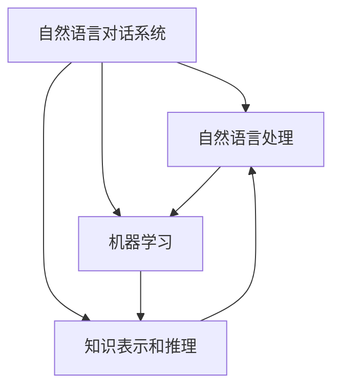

# 自然语言对话系统(Conversational AI)原理与代码实战案例讲解

## 1.背景介绍

### 1.1 什么是自然语言对话系统？

自然语言对话系统(Conversational AI)是一种人工智能技术,旨在使计算机能够像人类一样进行自然语言交互。它允许用户使用自然语言(如说话或文字)与计算机系统进行交流,系统则能够理解并做出相应响应。

随着人工智能和自然语言处理(NLP)技术的不断进步,自然语言对话系统正在越来越多地应用于各个领域,如客户服务、个人助理、教育、医疗保健等。它们为人机交互提供了一种全新的方式,使得与计算机系统的交互变得更加自然和人性化。

### 1.2 自然语言对话系统的重要性

自然语言对话系统的发展对于提高人机交互效率、改善用户体验以及推动人工智能技术发展具有重要意义:

1. **提高人机交互效率**:传统的人机交互方式(如键盘输入、鼠标点击等)往往效率较低,而自然语言对话系统则能够让用户以更加自然的方式与计算机系统进行交互,从而显著提高交互效率。

2. **改善用户体验**:自然语言对话系统为用户提供了一种更加人性化的交互方式,使得与计算机系统的交互变得更加自然和友好,从而大大改善了用户体验。

3. **推动人工智能技术发展**:自然语言对话系统的研究和应用推动了自然语言处理、机器学习、知识表示等多个人工智能技术领域的发展,为人工智能技术的进步做出了重要贡献。

### 1.3 自然语言对话系统的挑战

尽管自然语言对话系统具有巨大的潜力和应用价值,但它们也面临着一些重大挑战:

1. **语言理解和生成**:准确理解自然语言输入并生成自然且相关的响应是自然语言对话系统面临的一个主要挑战。这需要处理语言的复杂性和歧义性。

2. **上下文理解**:对话往往需要上下文理解,包括对话历史、用户意图、背景知识等,这对自然语言对话系统来说是一个巨大的挑战。

3. **知识库构建**:自然语言对话系统需要大量的结构化和非结构化知识作为支撑,构建高质量的知识库是一项艰巨的任务。

4. **个性化和情感处理**:为了提供更加自然和人性化的交互体验,自然语言对话系统需要具备个性化和情感处理能力,这是一个极具挑战性的领域。

5. **安全性和可解释性**:确保自然语言对话系统的安全性和可解释性也是一个重要的挑战,尤其是在一些关键应用领域(如医疗、金融等)。

## 2.核心概念与联系

### 2.1 自然语言处理(NLP)

自然语言处理(Natural Language Processing, NLP)是人工智能的一个重要分支,旨在使计算机能够理解和生成人类语言。它是自然语言对话系统的核心技术基础。NLP主要包括以下几个关键任务:

1. **语言理解**:将自然语言输入(如文本或语音)转换为计算机可以理解的形式,如语义表示、知识表示等。

2. **语言生成**:根据计算机内部表示生成自然语言输出(如文本或语音)。

3. **语音识别**:将语音信号转换为文本。

4. **语音合成**:将文本转换为语音输出。

5. **机器翻译**:在不同自然语言之间进行翻译。

NLP技术在自然语言对话系统中扮演着至关重要的角色,它们为自然语言输入的理解和响应生成提供了技术支持。

### 2.2 机器学习

机器学习是人工智能的另一个核心技术,它使计算机系统能够从数据中自动学习和改进,而不需要显式编程。在自然语言对话系统中,机器学习技术被广泛应用于以下几个方面:

1. **语言模型**:通过学习大量语料,构建能够预测下一个单词或序列的语言模型。

2. **意图识别和槽填充**:从自然语言输入中识别用户的意图和相关信息。

3. **对话管理**:根据对话历史和上下文,决定系统的下一步响应。

4. **响应生成**:生成自然且相关的语言响应。

5. **知识库构建**:从非结构化数据中自动提取和构建知识库。

机器学习技术为自然语言对话系统提供了强大的学习和适应能力,使其能够从大量数据中自动获取知识和模式,从而提高系统的性能和智能水平。

### 2.3 知识表示和推理

自然语言对话系统需要具备一定的知识库和推理能力,以便能够理解上下文,进行推理和决策。知识表示和推理是实现这一目标的关键技术:

1. **知识表示**:将结构化和非结构化知识以计算机可理解的形式进行表示,如本体、知识图谱、语义网络等。

2. **推理**:基于知识库和规则,进行逻辑推理和决策,以生成相关响应或执行相应操作。

知识表示和推理技术为自然语言对话系统提供了背景知识和推理能力,使其能够更好地理解上下文,做出合理的决策和响应。

### 2.4 核心概念之间的联系

自然语言对话系统是一个复杂的系统,需要多种技术的紧密结合和协同工作。上述核心概念之间的联系如下:

1. 自然语言处理(NLP)为自然语言对话系统提供了语言理解和生成的基础能力。

2. 机器学习技术赋予了自然语言对话系统从数据中自动学习和改进的能力,提高了系统的智能水平。

3. 知识表示和推理为自然语言对话系统提供了背景知识和推理能力,使其能够更好地理解上下文并做出合理决策。

4. NLP、机器学习和知识表示与推理相互依赖、相互促进,共同构建了自然语言对话系统的核心技术基础。

## 3.核心算法原理具体操作步骤

### 3.1 自然语言处理核心算法

自然语言处理(NLP)是自然语言对话系统的核心技术基础,其中涉及多种算法和模型。以下是一些常见的NLP核心算法及其具体操作步骤:

#### 3.1.1 序列标注算法

序列标注算法旨在为输入序列(如自然语言文本)中的每个元素(如单词或字符)分配一个标签,常用于命名实体识别、词性标注等任务。常见的序列标注算法包括隐马尔可夫模型(HMM)、条件随机场(CRF)等。

**HMM算法步骤**:

1. 定义观测序列和隐藏状态序列
2. 计算初始概率、转移概率和发射概率
3. 使用前向算法计算观测序列的概率
4. 使用维特比算法求解最可能的隐藏状态序列

**CRF算法步骤**:

1. 定义特征函数
2. 计算特征函数的权重
3. 使用前向-后向算法计算边际概率
4. 使用维特比算法求解最可能的标签序列

#### 3.1.2 神经网络语言模型

神经网络语言模型利用神经网络来建模语言的概率分布,常用于语言生成、机器翻译等任务。常见的神经网络语言模型包括循环神经网络(RNN)、长短期记忆网络(LSTM)、transformer等。

**RNN语言模型步骤**:

1. 将输入序列(如单词或字符)转换为向量表示
2. 使用RNN(如LSTM)对输入序列进行编码
3. 使用softmax层预测下一个单词或字符的概率分布

**Transformer语言模型步骤**:

1. 将输入序列转换为向量表示并添加位置编码
2. 使用多头自注意力机制捕获输入序列中元素之间的依赖关系
3. 使用前馈神经网络进一步处理注意力输出
4. 使用softmax层预测下一个单词或字符的概率分布

#### 3.1.3 词嵌入算法

词嵌入算法旨在将单词映射到低维连续向量空间,使得语义相似的单词在向量空间中彼此靠近。常见的词嵌入算法包括Word2Vec、GloVe等。

**Word2Vec(CBOW)算法步骤**:

1. 定义输入和输出层
2. 对于每个上下文窗口,将上下文单词的向量相加作为输入
3. 使用softmax层预测目标单词
4. 使用负采样或层序softmax优化目标函数

**GloVe算法步骤**:

1. 构建单词-上下文矩阵
2. 定义目标函数,使得单词向量与上下文向量的点积近似于单词-上下文矩阵中的对应值
3. 使用梯度下降优化目标函数,获得单词向量和上下文向量

### 3.2 机器学习核心算法

机器学习算法在自然语言对话系统中扮演着重要角色,用于意图识别、对话管理、响应生成等任务。以下是一些常见的机器学习核心算法及其具体操作步骤:

#### 3.2.1 支持向量机(SVM)

支持向量机是一种有监督的机器学习算法,常用于分类和回归任务。在自然语言对话系统中,SVM可用于意图识别、情感分析等任务。

**SVM分类算法步骤**:

1. 将输入数据(如文本)转换为特征向量
2. 选择合适的核函数(如线性核、高斯核等)
3. 使用训练数据训练SVM模型,求解支持向量和分类超平面
4. 对新的输入数据进行分类

#### 3.2.2 递归神经网络(RNN)

递归神经网络是一种深度学习模型,能够处理序列数据,常用于自然语言处理任务。在自然语言对话系统中,RNN可用于意图识别、槽填充、响应生成等任务。

**RNN序列标注算法步骤**:

1. 将输入序列(如自然语言文本)转换为向量表示
2. 使用RNN(如LSTM或GRU)对输入序列进行编码
3. 使用softmax层预测每个时间步的标签
4. 使用交叉熵损失函数进行训练

#### 3.2.3 强化学习算法

强化学习是一种基于奖励信号的机器学习范式,常用于决策和控制任务。在自然语言对话系统中,强化学习可用于对话管理,即根据对话历史和上下文选择最优响应。

**深度Q网络(DQN)算法步骤**:

1. 定义状态空间(如对话历史)和动作空间(如可能的响应)
2. 使用深度神经网络近似Q函数,预测每个状态-动作对的预期回报
3. 使用经验回放和目标网络稳定训练过程
4. 根据Q函数选择最优动作(响应)

### 3.3 知识表示和推理算法

知识表示和推理是自然语言对话系统的另一个重要组成部分,用于构建和利用背景知识。以下是一些常见的知识表示和推理算法及其具体操作步骤:

#### 3.3.1 本体构建算法

本体是一种知识表示形式,用于定义概念、属性和概念之间的关系。在自然语言对话系统中,本体可用于表示背景知识,支持上下文理解和推理。

**本体构建算法步骤**:

1. 从非结构化数据(如文本、网页等)中提取概念、实例和关系
2. 使用现有的本体或规则进行初步构建
3. 使用机器学习算法(如聚类、分类等)进一步完善本体
4. 人工审核和优化本体

#### 3.3.2 知识图谱构建算法

知识图谱是一