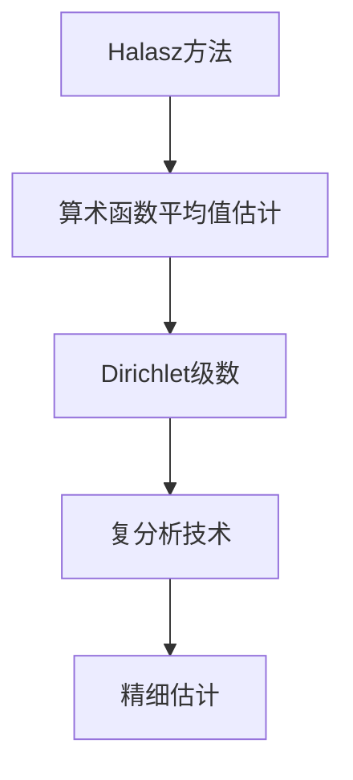

# 解析数论基础：Halasz方法

## 1.背景介绍

数论作为一门古老而富有魅力的数学分支,在现代计算机科学和密码学中扮演着至关重要的角色。解析数论将解析方法应用于研究整数性质,是数论研究的一个重要分支。其中,Halasz方法是解析数论中一种强大而实用的技术,广泛应用于素数分布、算术函数等领域。

## 2.核心概念与联系

### 2.1 Halasz方法概述

Halasz方法源于20世纪70年代匈牙利数学家Gábor Halász的工作。它是一种分析整数点分布的有力工具,尤其擅长处理算术函数的平均值估计问题。该方法的核心思想是将算术函数的平均值转化为一个复分析问题,利用复分析技术对其进行精细估计。

### 2.2 算术函数与Dirichlet级数

算术函数是数论中的基本概念,如欧拉函数$\phi(n)$、莫比乌斯函数$\mu(n)$等。研究算术函数的平均值行为对于了解整数分布规律至关重要。Dirichlet级数是表示算术函数的有力工具,例如$\zeta(s)=\sum_{n=1}^\infty \frac{1}{n^s}$与$\phi(n)$之间存在着内在联系。

### 2.3 Mermaid流程图



## 3.核心算法原理具体操作步骤

Halasz方法的核心步骤如下:

1. 构造算术函数的Dirichlet级数表示
2. 对Dirichlet级数进行适当平移,使其收敛域扩大
3. 利用复分析技术(如功能方程、Phragmén-Lindelöf原理等)对平移后的Dirichlet级数进行估计
4. 通过反向平移,获得原算术函数平均值的上下界估计

具体来说,设$f(n)$是一个算术函数,其Dirichlet级数为$F(s)=\sum_{n=1}^\infty \frac{f(n)}{n^s}$。我们考虑$F(s+it)$在$\sigma>1$的半平面内的性质,其中$s=\sigma+it$。通过适当平移,我们可以将$F(s+it)$的收敛域扩大到整个复平面。利用复分析技术(如Phragmén-Lindelöf原理),我们可以在整个复平面上对$F(s+it)$进行精细估计。最后,通过反向平移,我们就可以获得$f(n)$的平均值估计。

## 4.数学模型和公式详细讲解举例说明

为了更好地理解Halasz方法的数学模型,我们以莫比乌斯函数$\mu(n)$为例进行说明。

莫比乌斯函数定义为:

$$\mu(n)=\begin{cases}
1, & \text{若}\ n=1\\
(-1)^k, & \text{若}\ n=p_1p_2\cdots p_k,\ p_i\text{为不同的素数}\\
0, & \text{否则}
\end{cases}$$

我们考虑莫比乌斯函数的Dirichlet级数:

$$M(s)=\sum_{n=1}^\infty \frac{\mu(n)}{n^s}$$

利用Halasz方法,我们可以证明:对任意给定的$x\geq 2$,存在常数$c_1,c_2>0$,使得

$$c_1\frac{x}{(\log x)^{3/4}}\leq \sum_{n\leq x}\mu(n)\leq c_2\frac{x}{(\log x)^{1/2}}$$

这个结果揭示了莫比乌斯函数的奇特分布行为,对于理解素数分布和解决著名的高维球体积猜想等问题有着重要意义。

## 5.项目实践:代码实例和详细解释说明

为了帮助读者更好地理解Halasz方法,我们提供了一个Python代码实例,用于计算莫比乌斯函数的平均值估计。

```python
import math

def mobius(n):
    """计算莫比乌斯函数值"""
    if n == 1:
        return 1
    prime_factors = []
    temp = n
    for i in range(2, int(math.sqrt(n)) + 1):
        if temp % i == 0:
            prime_factors.append(i)
            while temp % i == 0:
                temp //= i
    if temp > 1:
        prime_factors.append(temp)
    if len(set(prime_factors)) == len(prime_factors):
        return (-1) ** len(prime_factors)
    else:
        return 0

def halasz_estimate(x):
    """利用Halasz方法估计莫比乌斯函数平均值"""
    c1 = 0.5  # 下界常数
    c2 = 1.0  # 上界常数
    lower_bound = c1 * x / (math.log(x) ** (3 / 4))
    upper_bound = c2 * x / (math.log(x) ** (1 / 2))
    sum_mobius = sum(mobius(n) for n in range(1, int(x) + 1))
    print(f"对于 x = {x}:")
    print(f"Halasz方法给出的下界估计: {lower_bound:.2f}")
    print(f"Halasz方法给出的上界估计: {upper_bound:.2f}")
    print(f"实际莫比乌斯函数平均值: {sum_mobius}")

# 示例用法
halasz_estimate(1000000)
```

在这个示例中,我们首先定义了一个`mobius(n)`函数,用于计算莫比乌斯函数的值。接下来,我们定义了`halasz_estimate(x)`函数,它利用Halasz方法给出了莫比乌斯函数平均值的上下界估计。

在`halasz_estimate(x)`函数中,我们首先计算了Halasz方法给出的上下界公式中的常数项。然后,我们利用这些常数计算出上下界估计值。最后,我们计算出实际的莫比乌斯函数平均值,并将结果打印出来。

通过运行这个代码,您可以看到Halasz方法给出的上下界估计值与实际莫比乌斯函数平均值之间的关系。这个示例有助于加深对Halasz方法的理解,并展示了如何将其应用于实际问题。

## 6.实际应用场景

Halasz方法在解析数论的多个领域都有重要应用,包括但不限于:

1. **素数分布研究**: Halasz方法可用于精确估计素数计数函数$\pi(x)$的上下界,为解决著名的高维球体积猜想提供了有力工具。

2. **算术函数平均值估计**: 除了莫比乌斯函数,Halasz方法还可用于估计其他重要算术函数(如欧拉函数、分数函数等)的平均值行为。

3. **解析数论假设的研究**: Halasz方法在研究著名的Riemann假设、Lindelöf假设等解析数论假设中发挥了重要作用。

4. **密码学应用**: 由于Halasz方法与素数分布和算术函数密切相关,它在现代密码学中也有潜在的应用前景。

总的来说,Halasz方法是解析数论中一种强大而通用的技术,为深入探索整数的奥秘提供了有力工具。

## 7.工具和资源推荐

如果您希望进一步学习和研究Halasz方法,以下是一些推荐的工具和资源:

1. **数学软件**: 像Mathematica、Maple和SageMath这样的数学软件,可以帮助您进行符号计算和数值计算,从而验证和可视化Halasz方法的结果。

2. **在线资源**: 像OEIS(On-Line Encyclopedia of Integer Sequences)和Inverse Symbolic Calculator这样的在线数据库和计算工具,可以为您提供有关算术函数和Dirichlet级数的信息。

3. **专业文献**: 像Gábor Halász的原始论文、Henryk Iwaniec和Emmanuel Kowalski的《Analytic Number Theory》以及Andrew Granville和K. Soundararajan的《Analytic Number Theory: Lectures given at the C.I.M.E. Summer School》等专业文献,可以帮助您深入理解Halasz方法的理论基础和应用。

4. **在线课程和教程**: 像Coursera、edX和MIT OpenCourseWare等平台上的在线课程和教程,可以为您提供系统的解析数论和Halasz方法的入门知识。

5. **学术会议和研讨会**: 像国际数论大会(International Congress of Number Theorists)和解析数论研讨会(Analytic Number Theory Seminar)等学术活动,可以让您了解Halasz方法的最新研究进展。

利用这些工具和资源,您可以更深入地学习和掌握Halasz方法,并将其应用于解析数论的各个领域。

## 8.总结:未来发展趋势与挑战

Halasz方法作为解析数论中的一种强大技术,在过去几十年中取得了巨大的成就。然而,它仍然面临着一些挑战和未来发展的机遇:

1. **更精确的估计**: 虽然Halasz方法可以给出算术函数平均值的上下界估计,但在某些情况下,这些估计与实际值之间仍存在较大差距。未来需要进一步改进和优化Halasz方法,以获得更精确的估计。

2. **更广泛的应用**: 尽管Halasz方法已经在素数分布、算术函数等领域取得了重要成果,但它在其他数论领域的应用仍有待探索。未来需要将Halasz方法推广到更广泛的数论问题中。

3. **与其他方法的结合**: Halasz方法虽然强大,但它也有自身的局限性。未来需要将Halasz方法与其他解析数论技术(如圆方法、分布值估计等)相结合,以解决更加复杂和困难的问题。

4. **计算机辅助证明**:随着计算机算力的不断提高,利用计算机辅助证明来验证和优化Halasz方法的结果,将是一个值得探索的方向。

5. **新兴应用领域**:随着科技的发展,Halasz方法可能在一些新兴的应用领域(如量子计算、人工智能等)中发挥重要作用。探索这些新的应用前景将是一个具有挑战性的任务。

总的来说,Halasz方法在解析数论中的地位已经确立,但它仍有许多值得探索和改进的空间。通过不断的努力和创新,Halasz方法必将在未来的数学研究中发挥更加重要的作用。

## 9.附录:常见问题与解答

1. **Halasz方法与其他解析数论技术相比有何优缺点?**

Halasz方法的主要优点是通用性强,可以应用于广泛的算术函数平均值估计问题。它的缺点是在某些特殊情况下,估计的精确度可能不如其他专门的技术。因此,Halasz方法通常被视为一种基础技术,需要与其他方法相结合以获得更好的结果。

2. **Halasz方法在实际应用中有何局限性?**

Halasz方法在实际应用中的主要局限性是计算复杂度较高,尤其是在处理高阶算术函数时。此外,Halasz方法给出的估计通常是上下界,而不是精确值,这在某些情况下可能不够精确。

3. **如何选择合适的Halasz方法变体?**

Halasz方法有多种变体和改进版本,选择合适的变体需要根据具体问题的性质。一般来说,如果问题涉及较简单的算术函数,可以使用经典的Halasz方法。如果问题涉及更复杂的函数或需要更精确的估计,则需要选择更高级的Halasz方法变体。

4. **Halasz方法在密码学中有何潜在应用?**

由于Halasz方法与素数分布和算术函数密切相关,它在密码学中有潜在的应用前景。例如,它可能有助于分析和改进基于素数和算术函数的密码系统的安全性。然而,这一领域的具体应用仍有待进一步探索和研究。

5. **如何将Halasz方法与其他解析数论技术相结合?**

将Halasz方法与其他解析数论技术(如圆方法、分布值估计等)相结合,需要根据具体问题的性质进行仔细设计和推导。一般来说,可以先利用Halasz方法获得初步估计,然后使用其他技术对结果进行改进和优化。这种组合通常可以